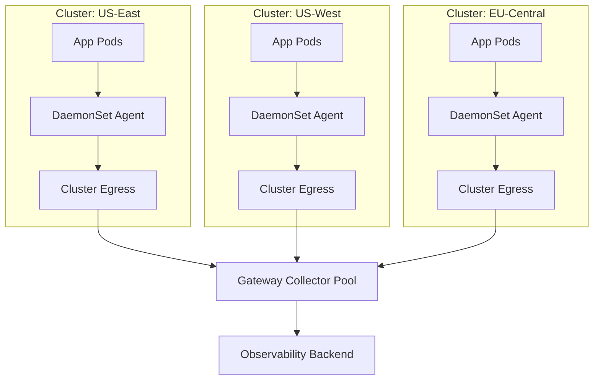

# How to Set Up Multi-Cluster Observability with Collector Gateway Mode

Author: [nawazdhandala](https://www.github.com/nawazdhandala)

Tags: OpenTelemetry, Multi-Cluster, Kubernetes, Gateway, Collector, Observability, Distributed Systems

Description: Learn how to build a multi-cluster observability architecture using the OpenTelemetry Collector in gateway mode to aggregate telemetry from multiple Kubernetes clusters into a single backend.

---

Running a single Kubernetes cluster is complicated enough. When your infrastructure spans multiple clusters - maybe you've got separate clusters for staging and production, or clusters in different regions for latency, or separate clusters per team for isolation - observability becomes a real challenge. Each cluster generates its own traces, metrics, and logs. Without a unified approach, you end up with siloed data and no way to correlate a request that crosses cluster boundaries.

The OpenTelemetry Collector's gateway mode solves this by acting as a centralized aggregation point that receives telemetry from agents running in every cluster. Each cluster ships its data to the gateway, which enriches it with cluster identity, processes it uniformly, and exports it to your observability backend.

Let's build this architecture step by step.

## Architecture Overview

The multi-cluster observability pattern has three layers: local agents inside each cluster, a centralized gateway that aggregates data, and your observability backend.



Each cluster runs DaemonSet agents that collect local telemetry and forward it to the gateway. The gateway runs as a highly available Deployment (either in a dedicated management cluster or as an external service) and handles processing, sampling, and export.

## Why Gateway Mode?

You might wonder why you can't just have each cluster export directly to the backend. You can, but a gateway gives you several advantages:

**Unified processing**: Tail sampling, rate limiting, and metric aggregation need to happen in one place. If each cluster does its own sampling independently, you'll lose cross-cluster traces.

**Single control point**: When you need to change export destinations, adjust sampling rules, or add new processors, you update one gateway config instead of touching every cluster.

**Cost control**: The gateway can aggregate and downsample metrics before they hit your backend, keeping storage costs predictable.

**Cross-cluster correlation**: The gateway can add consistent cluster identification attributes, making it trivial to query traces that span clusters.

**Backend isolation**: Your clusters don't need direct network access to your observability backend. They only need to reach the gateway.

## Setting Up the Local Agents

Each Kubernetes cluster needs a DaemonSet collector that acts as a local agent. This agent collects telemetry from application pods, enriches it with Kubernetes metadata, adds a cluster identifier, and forwards everything to the gateway.

```yaml
# local-agent.yaml
# DaemonSet collector running inside each Kubernetes cluster
apiVersion: opentelemetry.io/v1beta1
kind: OpenTelemetryCollector
metadata:
  name: otel-agent
  namespace: observability
spec:
  mode: daemonset
  tolerations:
    - operator: Exists
  resources:
    requests:
      cpu: 100m
      memory: 256Mi
    limits:
      cpu: 500m
      memory: 512Mi
  env:
    - name: K8S_NODE_NAME
      valueFrom:
        fieldRef:
          fieldPath: spec.nodeName
    # Set the cluster name - this should be unique per cluster
    - name: K8S_CLUSTER_NAME
      value: "us-east-production"
  config:
    receivers:
      otlp:
        protocols:
          grpc:
            endpoint: 0.0.0.0:4317
          http:
            endpoint: 0.0.0.0:4318
      hostmetrics:
        collection_interval: 30s
        scrapers:
          cpu:
          memory:
          disk:
          network:

    processors:
      memory_limiter:
        check_interval: 5s
        limit_mib: 400
        spike_limit_mib: 100
      batch:
        send_batch_size: 1024
        timeout: 5s
      # Add Kubernetes metadata
      k8sattributes:
        auth_type: serviceAccount
        passthrough: false
        extract:
          metadata:
            - k8s.pod.name
            - k8s.namespace.name
            - k8s.node.name
            - k8s.deployment.name
        pod_association:
          - sources:
              - from: resource_attribute
                name: k8s.pod.ip
          - sources:
              - from: connection
      # Stamp every piece of telemetry with the cluster name
      resource:
        attributes:
          - key: k8s.cluster.name
            value: "${env:K8S_CLUSTER_NAME}"
            action: upsert
          - key: deployment.environment
            value: "production"
            action: upsert

    exporters:
      otlp:
        # Send to the central gateway
        # This endpoint should be reachable from inside the cluster
        endpoint: "gateway.observability.example.com:4317"
        tls:
          insecure: false
          # Use a CA cert if the gateway uses internal TLS
          ca_file: /etc/ssl/certs/gateway-ca.crt
        # Retry and queue settings for resilience
        retry_on_failure:
          enabled: true
          initial_interval: 5s
          max_interval: 30s
          max_elapsed_time: 300s
        sending_queue:
          enabled: true
          num_consumers: 10
          queue_size: 5000

    service:
      pipelines:
        traces:
          receivers: [otlp]
          processors: [memory_limiter, k8sattributes, resource, batch]
          exporters: [otlp]
        metrics:
          receivers: [otlp, hostmetrics]
          processors: [memory_limiter, k8sattributes, resource, batch]
          exporters: [otlp]
        logs:
          receivers: [otlp]
          processors: [memory_limiter, k8sattributes, resource, batch]
          exporters: [otlp]
```

A few critical things to notice. The `resource` processor stamps `k8s.cluster.name` on every signal. This is what lets you filter and group by cluster in your backend. The exporter has retry and queue settings that provide resilience when the gateway is temporarily unreachable.

You'd deploy this same configuration in every cluster, changing only the `K8S_CLUSTER_NAME` environment variable and the gateway endpoint if it differs per region.

## Setting Up the Gateway

The gateway is where the real work happens. It receives data from all clusters, applies cross-cluster processing, and exports to your backend.

```yaml
# gateway.yaml
# Central gateway collector that aggregates telemetry from all clusters
apiVersion: opentelemetry.io/v1beta1
kind: OpenTelemetryCollector
metadata:
  name: otel-gateway
  namespace: observability
spec:
  mode: deployment
  replicas: 3
  autoscaler:
    minReplicas: 3
    maxReplicas: 20
    targetCPUUtilization: 60
    targetMemoryUtilization: 70
  resources:
    requests:
      cpu: 1
      memory: 2Gi
    limits:
      cpu: 4
      memory: 8Gi
  config:
    receivers:
      otlp:
        protocols:
          grpc:
            endpoint: 0.0.0.0:4317
            # Set a larger max message size for big batches
            max_recv_msg_size_mib: 16
          http:
            endpoint: 0.0.0.0:4318

    processors:
      memory_limiter:
        check_interval: 5s
        limit_mib: 6144
        spike_limit_mib: 1024
      batch:
        send_batch_size: 4096
        timeout: 10s
      # Tail sampling across all clusters
      tail_sampling:
        decision_wait: 30s
        num_traces: 200000
        expected_new_traces_per_sec: 5000
        policies:
          # Keep all error traces regardless of cluster
          - name: errors
            type: status_code
            status_code:
              status_codes: [ERROR]
          # Keep slow traces
          - name: high-latency
            type: latency
            latency:
              threshold_ms: 3000
          # Keep traces that cross cluster boundaries
          - name: cross-cluster
            type: string_attribute
            string_attribute:
              key: k8s.cluster.name
              values: ["us-east-production", "us-west-production", "eu-central-production"]
              enabled_regex_matching: false
              invert_match: false
          # Sample a percentage of routine traces
          - name: baseline
            type: probabilistic
            probabilistic:
              sampling_percentage: 5
      # Filter out noisy internal metrics if needed
      filter/metrics:
        metrics:
          exclude:
            match_type: regexp
            metric_names:
              # Drop metrics from internal system namespaces
              - "k8s\\.pod\\..*"
            resource_attributes:
              - key: k8s.namespace.name
                value: "kube-system"

    exporters:
      otlp/traces:
        endpoint: "traces-backend.example.com:4317"
        tls:
          insecure: false
      otlp/metrics:
        endpoint: "metrics-backend.example.com:4317"
        tls:
          insecure: false
      otlp/logs:
        endpoint: "logs-backend.example.com:4317"
        tls:
          insecure: false

    extensions:
      health_check:
        endpoint: 0.0.0.0:13133
      pprof:
        endpoint: 0.0.0.0:1777

    service:
      extensions: [health_check, pprof]
      pipelines:
        traces:
          receivers: [otlp]
          processors: [memory_limiter, tail_sampling, batch]
          exporters: [otlp/traces]
        metrics:
          receivers: [otlp]
          processors: [memory_limiter, filter/metrics, batch]
          exporters: [otlp/metrics]
        logs:
          receivers: [otlp]
          processors: [memory_limiter, batch]
          exporters: [otlp/logs]
```

The gateway starts with 3 replicas and can scale up to 20. It has generous memory limits because tail sampling holds trace data in memory until the decision wait period expires.

## Exposing the Gateway

The gateway needs to be reachable from all your clusters. How you expose it depends on your network topology.

### Option 1: Load Balancer Service

If your clusters can reach each other over a shared network or the internet:

```yaml
# gateway-service.yaml
# Exposes the gateway via a load balancer for cross-cluster access
apiVersion: v1
kind: Service
metadata:
  name: otel-gateway
  namespace: observability
  annotations:
    # Adjust annotations for your cloud provider
    service.beta.kubernetes.io/aws-load-balancer-type: "nlb"
    service.beta.kubernetes.io/aws-load-balancer-scheme: "internal"
spec:
  type: LoadBalancer
  selector:
    app.kubernetes.io/name: otel-gateway-collector
  ports:
    - name: otlp-grpc
      port: 4317
      targetPort: 4317
      protocol: TCP
    - name: otlp-http
      port: 4318
      targetPort: 4318
      protocol: TCP
    - name: health
      port: 13133
      targetPort: 13133
      protocol: TCP
```

### Option 2: DNS-Based with VPC Peering

For multi-region setups with VPC peering, use a DNS name that resolves to the gateway's internal load balancer IP in each region:

```bash
# Create a Route53 private hosted zone record (AWS example)
aws route53 change-resource-record-sets \
  --hosted-zone-id Z1234567890 \
  --change-batch '{
    "Changes": [{
      "Action": "UPSERT",
      "ResourceRecordSet": {
        "Name": "gateway.observability.example.com",
        "Type": "A",
        "AliasTarget": {
          "HostedZoneId": "Z0987654321",
          "DNSName": "internal-otel-gw-1234.us-east-1.elb.amazonaws.com",
          "EvaluateTargetHealth": true
        }
      }
    }]
  }'
```

## Handling Tail Sampling Across Clusters

Tail sampling is one of the trickiest parts of multi-cluster observability. For it to work correctly, all spans belonging to the same trace must arrive at the same gateway pod. Otherwise, different pods might make different sampling decisions for the same trace.

There are two ways to handle this:

### Using a Load Balancer with Trace ID Affinity

Some load balancers support consistent hashing based on request headers. You can configure them to route all spans with the same trace ID to the same backend pod. This is the cleanest solution but requires load balancer support.

### Using the Load Balancing Exporter

The OpenTelemetry Collector has a `loadbalancing` exporter that distributes traces across gateway pods using trace-ID-based consistent hashing.

```yaml
# In your local agent config, replace the otlp exporter with:
exporters:
  loadbalancing:
    routing_key: "traceID"
    protocol:
      otlp:
        tls:
          insecure: false
    resolver:
      dns:
        # Use a headless service that returns all gateway pod IPs
        hostname: otel-gateway-headless.observability.svc.cluster.local
        port: 4317
```

For cross-cluster scenarios, the DNS resolver needs to return the IPs of gateway pods, which means you'll need a headless service on the gateway side:

```yaml
# gateway-headless-service.yaml
# Headless service that returns individual pod IPs for load balancing
apiVersion: v1
kind: Service
metadata:
  name: otel-gateway-headless
  namespace: observability
spec:
  type: ClusterIP
  clusterIP: None
  selector:
    app.kubernetes.io/name: otel-gateway-collector
  ports:
    - name: otlp-grpc
      port: 4317
      targetPort: 4317
```

## Security Between Clusters

Data flowing between clusters should always be encrypted. Here's how to set up mutual TLS (mTLS) between agents and the gateway.

```yaml
# Agent exporter with mTLS
exporters:
  otlp:
    endpoint: "gateway.observability.example.com:4317"
    tls:
      # Client certificate for authentication
      cert_file: /etc/otel/certs/client.crt
      key_file: /etc/otel/certs/client.key
      # CA certificate to verify the gateway's identity
      ca_file: /etc/otel/certs/ca.crt
```

```yaml
# Gateway receiver with mTLS
receivers:
  otlp:
    protocols:
      grpc:
        endpoint: 0.0.0.0:4317
        tls:
          # Gateway's server certificate
          cert_file: /etc/otel/certs/server.crt
          key_file: /etc/otel/certs/server.key
          # CA certificate to verify client (agent) certificates
          client_ca_file: /etc/otel/certs/ca.crt
```

Store the certificates in Kubernetes Secrets and mount them into the collector pods. Use cert-manager to automate certificate rotation.

## Monitoring the Gateway Itself

A gateway processing telemetry from multiple clusters is a critical piece of infrastructure. You need to monitor it. The collector exposes internal metrics that tell you about queue depths, dropped data, and processing latency.

```yaml
# Gateway service telemetry configuration
service:
  telemetry:
    metrics:
      address: 0.0.0.0:8888
      level: detailed
    logs:
      level: info
```

Key internal metrics to watch:

- `otelcol_exporter_queue_size` - How full the export queue is. If it's consistently near capacity, the backend can't keep up.
- `otelcol_receiver_refused_spans` - Spans that were rejected. Usually means the gateway is overloaded.
- `otelcol_processor_dropped_spans` - Spans dropped by processors (like memory_limiter).
- `otelcol_exporter_send_failed_spans` - Export failures. Could indicate backend issues.

## Production Checklist

Before going live with multi-cluster observability, run through this checklist:

1. **Cluster identification**: Every cluster stamps `k8s.cluster.name` on all telemetry
2. **Network connectivity**: Agents can reach the gateway endpoint from every cluster
3. **TLS encryption**: All cross-cluster traffic is encrypted (mTLS preferred)
4. **Retry and queuing**: Agent exporters have retry and queue settings for resilience
5. **Memory limits**: Both agents and gateway have appropriate memory_limiter settings
6. **Autoscaling**: Gateway has HPA configured with appropriate thresholds
7. **Health checks**: Gateway health endpoint is monitored
8. **Tail sampling**: Trace ID affinity is configured if using tail sampling
9. **Testing**: Send test traces that cross cluster boundaries and verify they appear complete in your backend

## Wrapping Up

Multi-cluster observability doesn't have to be painful. The OpenTelemetry Collector's gateway mode provides a clean architecture for aggregating telemetry from any number of clusters into a single observability backend. The key ingredients are local agents that stamp cluster identity, a resilient gateway with appropriate processing, and secure connectivity between them.

Start with two clusters and get the pattern working. Once you've validated the approach, adding more clusters is just a matter of deploying the same agent configuration with a different cluster name. The gateway scales horizontally to handle the additional load.
