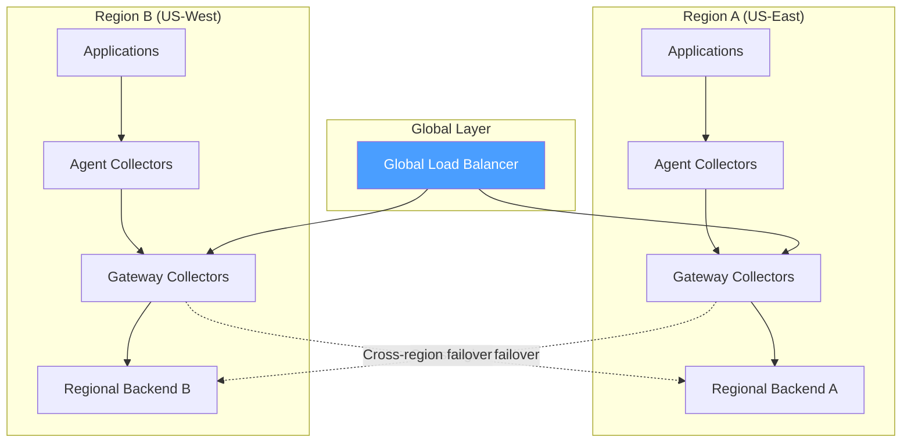
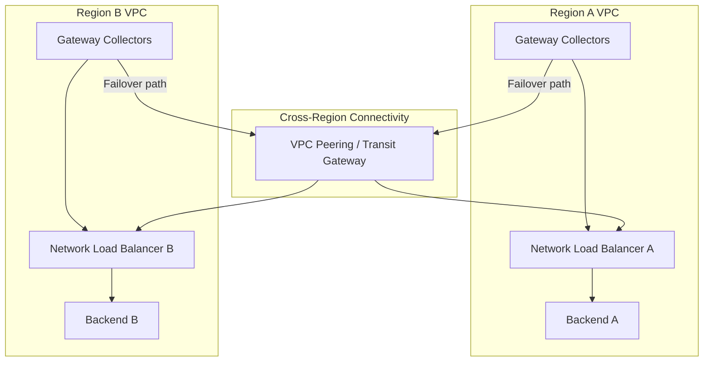
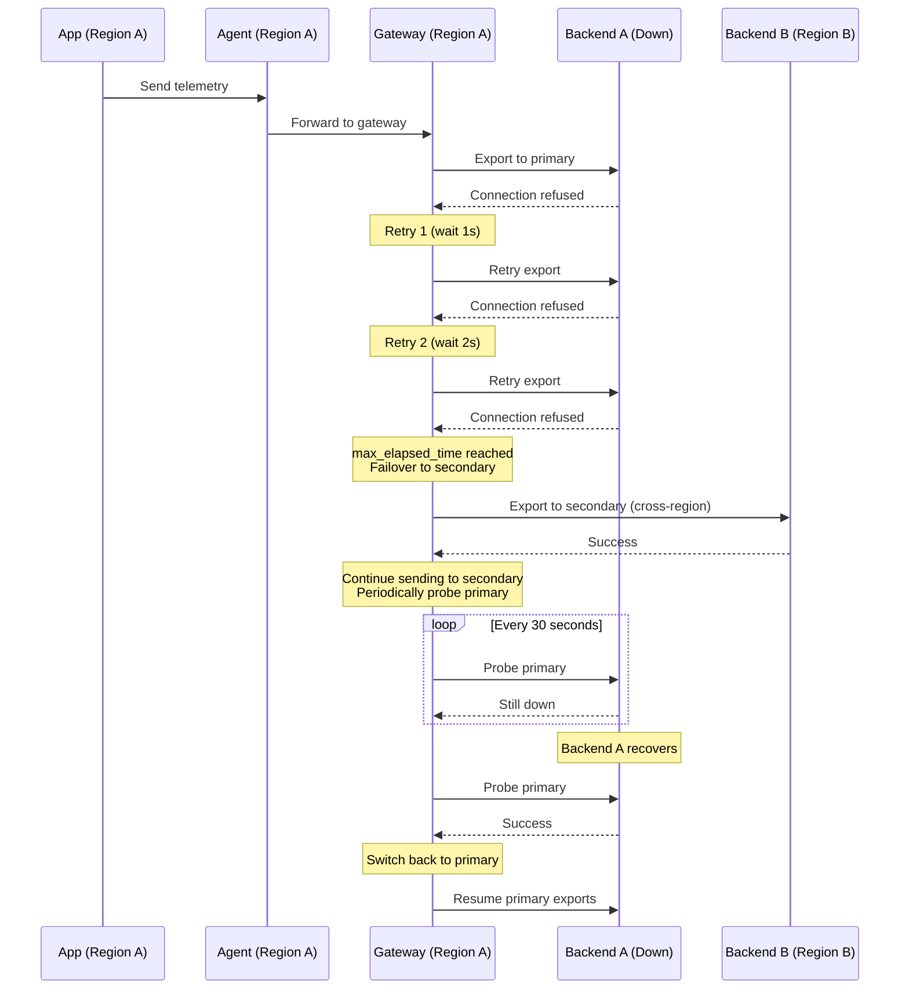

# How to Set Up Multi-Region Failover for OpenTelemetry Collection

Author: [nawazdhandala](https://www.github.com/nawazdhandala)

Tags: OpenTelemetry, Multi-Region, Failover, Disaster Recovery, High Availability

Description: Build a multi-region OpenTelemetry collection pipeline with automatic failover between regions, cross-region replication, and disaster recovery capabilities.

---

Running your OpenTelemetry pipeline in a single region means a regional outage takes down your entire observability stack. That is exactly when you need observability the most. Multi-region failover gives you continued telemetry collection even when an entire region goes dark.

This guide walks through building a multi-region OpenTelemetry collection pipeline, from the network architecture to the collector configurations to the failover automation.

## Multi-Region Architecture

The architecture has three main components: regional collector clusters that handle local telemetry, cross-region forwarding for redundancy, and a global routing layer that directs traffic based on health.



In normal operation, each region handles its own telemetry locally. When a region's backend goes down, the local gateway collectors fail over to the other region's backend. The global load balancer handles the case where an entire region (including collectors) goes down by routing traffic to the surviving region.

## Regional Collector Configuration

Each region runs a full agent-gateway collector stack. The gateway is configured with both a primary (local) and secondary (remote) exporter:

```yaml
# region-a-gateway-config.yaml
# Gateway collector for Region A (US-East)
receivers:
  otlp:
    protocols:
      grpc:
        endpoint: 0.0.0.0:4317
      http:
        endpoint: 0.0.0.0:4318

processors:
  memory_limiter:
    check_interval: 1s
    limit_mib: 3072
    spike_limit_mib: 768

  batch:
    send_batch_size: 2048
    timeout: 10s

  # Tag all telemetry with its source region
  # This is critical for debugging cross-region routing
  resource:
    attributes:
      - key: deployment.region
        value: us-east-1
        action: upsert
      - key: collector.region
        value: us-east-1
        action: upsert

exporters:
  # Primary exporter: local regional backend
  otlp/primary:
    endpoint: backend-us-east.observability.internal:4317
    tls:
      insecure: false
      ca_file: /etc/ssl/certs/internal-ca.crt
    timeout: 10s
    retry_on_failure:
      enabled: true
      initial_interval: 1s
      max_interval: 15s
      # Short max_elapsed_time because we want to fail over quickly
      max_elapsed_time: 60s
    sending_queue:
      enabled: true
      queue_size: 3000
      num_consumers: 10
      storage: file_storage

  # Secondary exporter: remote regional backend
  otlp/secondary:
    endpoint: backend-us-west.observability.internal:4317
    tls:
      insecure: false
      ca_file: /etc/ssl/certs/internal-ca.crt
    # Longer timeout for cross-region traffic
    timeout: 30s
    retry_on_failure:
      enabled: true
      initial_interval: 5s
      max_interval: 60s
      max_elapsed_time: 300s
    sending_queue:
      enabled: true
      queue_size: 5000
      num_consumers: 5
      storage: file_storage

  # Kafka DLQ as the last resort
  kafka/dlq:
    brokers:
      - kafka-us-east-1.internal:9092
      - kafka-us-east-2.internal:9092
    topic: otel-dlq-region-a
    encoding: otlp_proto
    producer:
      compression: snappy
      required_acks: -1

extensions:
  file_storage:
    directory: /var/lib/otel/queue
    max_file_size_mib: 8192

  health_check:
    endpoint: 0.0.0.0:13133

service:
  extensions: [file_storage, health_check]
  pipelines:
    traces:
      receivers: [otlp]
      processors: [memory_limiter, resource, batch]
      # Fan out to primary, secondary, and DLQ
      # Each exporter handles its own retry independently
      exporters: [otlp/primary, otlp/secondary, kafka/dlq]
    metrics:
      receivers: [otlp]
      processors: [memory_limiter, resource, batch]
      exporters: [otlp/primary, otlp/secondary, kafka/dlq]
    logs:
      receivers: [otlp]
      processors: [memory_limiter, resource, batch]
      exporters: [otlp/primary, otlp/secondary, kafka/dlq]
```

Wait, sending to all three destinations simultaneously means triple the bandwidth and storage. In most cases, you want primary-first with failover. Here is a smarter approach using the failover connector:

```yaml
# Ordered failover: try primary first, then secondary, then DLQ
connectors:
  failover/traces:
    priority_levels:
      - [otlp/primary]
      - [otlp/secondary]
      - [kafka/dlq]
    # Wait 30 seconds before trying the next level
    retry_gap: 30s
    retry_interval: 15s
    max_retries: 3

service:
  pipelines:
    traces/in:
      receivers: [otlp]
      processors: [memory_limiter, resource, batch]
      exporters: [failover/traces]
    traces/primary:
      receivers: [failover/traces]
      exporters: [otlp/primary]
    traces/secondary:
      receivers: [failover/traces]
      exporters: [otlp/secondary]
    traces/dlq:
      receivers: [failover/traces]
      exporters: [kafka/dlq]
```

## Global Load Balancer Configuration

For external traffic and applications that need to reach collectors across regions, set up a global load balancer with health-check-based routing.

Using AWS Route 53 as an example:

```json
{
  "Comment": "Global OTLP endpoint with failover routing",
  "Changes": [
    {
      "Action": "UPSERT",
      "ResourceRecordSet": {
        "Name": "otlp.observability.example.com",
        "Type": "A",
        "SetIdentifier": "us-east-1-primary",
        "Failover": "PRIMARY",
        "HealthCheckId": "health-check-us-east",
        "AliasTarget": {
          "HostedZoneId": "Z1234567890",
          "DNSName": "otel-gateway-us-east.elb.amazonaws.com",
          "EvaluateTargetHealth": true
        }
      }
    },
    {
      "Action": "UPSERT",
      "ResourceRecordSet": {
        "Name": "otlp.observability.example.com",
        "Type": "A",
        "SetIdentifier": "us-west-2-secondary",
        "Failover": "SECONDARY",
        "HealthCheckId": "health-check-us-west",
        "AliasTarget": {
          "HostedZoneId": "Z0987654321",
          "DNSName": "otel-gateway-us-west.elb.amazonaws.com",
          "EvaluateTargetHealth": true
        }
      }
    }
  ]
}
```

The health check should probe the collector's health endpoint:

```json
{
  "Type": "HTTPS",
  "ResourcePath": "/health",
  "Port": 13133,
  "RequestInterval": 10,
  "FailureThreshold": 3,
  "Regions": ["us-east-1", "us-west-2", "eu-west-1"]
}
```

## Cross-Region Network Architecture

Cross-region traffic needs secure, reliable connectivity. Here is the network layout:



Key networking considerations:

- Use VPC peering or AWS Transit Gateway for cross-region connectivity
- Enable TLS on all cross-region traffic
- Monitor cross-region latency and set exporter timeouts accordingly
- Budget for cross-region data transfer costs

## Failover Sequence

Here is what happens when Region A's backend goes down:



## Handling Data During Region Failover

When traffic fails over to another region, the receiving backend gets data from both regions. You need to handle this at the backend level to avoid confusion.

The resource attributes we added earlier (`deployment.region` and `collector.region`) help here. They let you:

- Filter dashboards by source region
- Track which data came through the failover path
- Identify data that might have higher latency due to cross-region transit

```promql
# Track data volume by source region to detect failover
sum by (deployment_region) (
  rate(otelcol_receiver_accepted_spans[5m])
)

# Monitor cross-region export latency
histogram_quantile(0.99,
  rate(otelcol_exporter_send_latency_bucket{exporter="otlp/secondary"}[5m])
)
```

## Kubernetes Multi-Cluster Setup

If you run Kubernetes in multiple regions, here is the deployment structure for each region:

```yaml
# region-a-deployment.yaml
apiVersion: apps/v1
kind: Deployment
metadata:
  name: otel-gateway
  namespace: observability
  labels:
    app: otel-gateway
    region: us-east-1
spec:
  replicas: 3
  selector:
    matchLabels:
      app: otel-gateway
  template:
    metadata:
      labels:
        app: otel-gateway
        region: us-east-1
    spec:
      # Spread across availability zones within the region
      topologySpreadConstraints:
        - maxSkew: 1
          topologyKey: topology.kubernetes.io/zone
          whenUnsatisfiable: DoNotSchedule
          labelSelector:
            matchLabels:
              app: otel-gateway
      terminationGracePeriodSeconds: 120
      containers:
        - name: collector
          image: otel/opentelemetry-collector-contrib:0.96.0
          args: ["--config=/etc/otel/config.yaml"]
          env:
            - name: REGION
              value: us-east-1
            - name: PRIMARY_BACKEND
              value: backend-us-east.observability.internal:4317
            - name: SECONDARY_BACKEND
              value: backend-us-west.observability.internal:4317
          ports:
            - containerPort: 4317
              name: otlp-grpc
            - containerPort: 13133
              name: health
          resources:
            requests:
              cpu: "2"
              memory: 4Gi
            limits:
              cpu: "4"
              memory: 8Gi
          livenessProbe:
            httpGet:
              path: /
              port: 13133
            initialDelaySeconds: 15
            periodSeconds: 10
          readinessProbe:
            httpGet:
              path: /
              port: 13133
            initialDelaySeconds: 5
            periodSeconds: 5
          volumeMounts:
            - name: config
              mountPath: /etc/otel
            - name: queue
              mountPath: /var/lib/otel/queue
            - name: tls
              mountPath: /etc/ssl/certs
      volumes:
        - name: config
          configMap:
            name: otel-gateway-config
        - name: queue
          emptyDir:
            sizeLimit: 10Gi
        - name: tls
          secret:
            secretName: internal-tls
---
# Pod Disruption Budget ensures availability during updates
apiVersion: policy/v1
kind: PodDisruptionBudget
metadata:
  name: otel-gateway-pdb
  namespace: observability
spec:
  minAvailable: 2
  selector:
    matchLabels:
      app: otel-gateway
```

## Automated Failover Testing

Run regular failover tests to make sure your multi-region setup actually works when you need it:

```bash
#!/bin/bash
# failover-test.sh
# Automated test that simulates a regional backend failure
# and verifies data continues flowing to the secondary region

REGION_A_BACKEND="backend-us-east.observability.internal"
REGION_B_BACKEND="backend-us-west.observability.internal"
COLLECTOR_METRICS="otel-gateway.observability.svc:8888"

echo "=== Multi-Region Failover Test ==="
echo "$(date): Starting failover test"

# Step 1: Verify baseline -- both regions healthy
echo "Step 1: Checking baseline health..."
SENT_A=$(curl -s "$COLLECTOR_METRICS/metrics" | grep 'otelcol_exporter_sent_spans{.*primary' | awk '{print $2}')
echo "Primary export rate: $SENT_A"

# Step 2: Simulate Region A backend failure
echo "Step 2: Simulating backend failure in Region A..."
# Block traffic to the primary backend using a network policy
kubectl apply -f - <<EOF
apiVersion: networking.k8s.io/v1
kind: NetworkPolicy
metadata:
  name: block-primary-backend
  namespace: observability
spec:
  podSelector:
    matchLabels:
      app: otel-gateway
  policyTypes:
    - Egress
  egress:
    - to:
        - ipBlock:
            cidr: 0.0.0.0/0
            except:
              - 10.0.0.0/8
EOF

# Step 3: Wait for failover to occur
echo "Step 3: Waiting 90 seconds for failover..."
sleep 90

# Step 4: Verify data is flowing to secondary
echo "Step 4: Checking secondary export rate..."
SENT_B=$(curl -s "$COLLECTOR_METRICS/metrics" | grep 'otelcol_exporter_sent_spans{.*secondary' | awk '{print $2}')
echo "Secondary export rate: $SENT_B"

if [ "$SENT_B" -gt 0 ]; then
    echo "PASS: Data is flowing to secondary backend"
else
    echo "FAIL: No data reaching secondary backend"
fi

# Step 5: Restore connectivity
echo "Step 5: Restoring primary backend connectivity..."
kubectl delete networkpolicy block-primary-backend -n observability

# Step 6: Wait for recovery
echo "Step 6: Waiting 60 seconds for recovery..."
sleep 60

# Step 7: Verify return to primary
echo "Step 7: Checking primary export rate..."
SENT_A_AFTER=$(curl -s "$COLLECTOR_METRICS/metrics" | grep 'otelcol_exporter_sent_spans{.*primary' | awk '{print $2}')
echo "Primary export rate after recovery: $SENT_A_AFTER"

echo "=== Failover test complete ==="
```

## Cost Considerations

Multi-region failover has real costs. Here is what to budget for:

- **Cross-region data transfer**: AWS charges $0.02/GB for cross-region traffic. A pipeline doing 1 TB/day in failover mode costs about $20/day in data transfer alone.
- **Redundant backends**: Running backends in two regions doubles your backend infrastructure cost.
- **Kafka clusters**: If using Kafka for cross-region DLQ, you need clusters in each region.
- **Storage**: Persistent queues and DLQ storage in each region.

To reduce costs, consider sending only critical telemetry (errors and high-latency traces) through the cross-region path during failover, and buffering the rest locally:

```yaml
processors:
  # During failover, only forward critical data cross-region
  filter/critical_only:
    traces:
      span:
        - 'status.code == STATUS_CODE_ERROR'
        - 'duration > 5000000000'  # 5 seconds in nanoseconds
```

## Wrapping Up

Multi-region failover for OpenTelemetry is the most robust setup you can build, but it comes with significant complexity and cost. Start with a single region and solid local failover (persistent queues, multi-backend export). Add cross-region failover when your availability requirements demand it. The key components are regional collector stacks with cross-region export paths, global DNS-based routing for complete region failures, resource attributes for tracking data provenance, and regular automated testing to make sure failover actually works when you need it.
