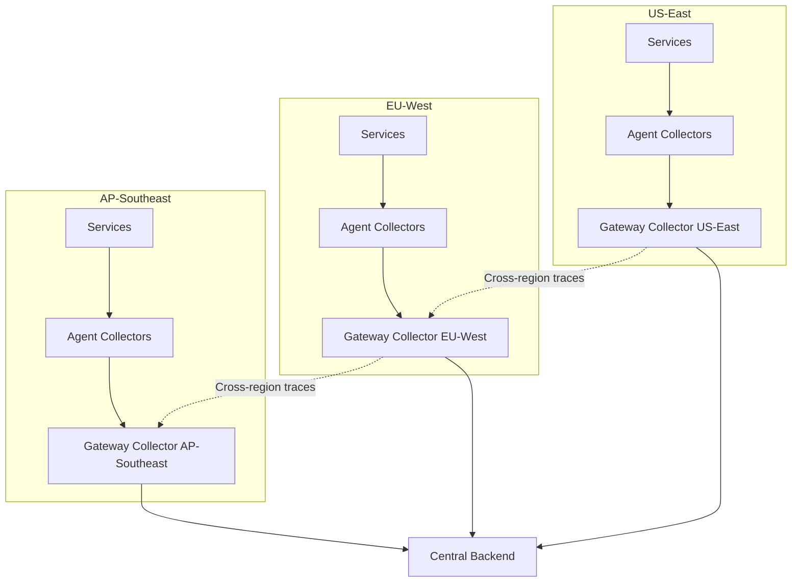

# How to Configure Multi-Region OpenTelemetry Collector Deployments

Author: [nawazdhandala](https://www.github.com/nawazdhandala)

Tags: OpenTelemetry, Multi-Region, Collector, Deployment, High Availability, Global Infrastructure

Description: Learn how to deploy and configure OpenTelemetry Collectors across multiple geographic regions for high availability and low latency telemetry collection.

---

When your application runs across multiple geographic regions, your telemetry infrastructure needs to follow. Services in Europe should not send spans across the Atlantic to a collector in the US. The latency adds up, the bandwidth costs are real, and a network partition between regions means you lose telemetry data exactly when you need it most. A multi-region collector deployment puts collection infrastructure close to your application workloads, processes data locally, and then routes it to the appropriate backends.

This post covers the architecture, configuration, and operational considerations for running OpenTelemetry Collectors across multiple regions.

## Multi-Region Architecture

The architecture follows a simple principle: collect locally, process locally, export globally (or regionally, depending on your requirements):



Each region has its own collector fleet. Services in each region only communicate with their local collectors. The gateway collectors in each region handle processing and export to the central backend.

## Regional Collector Configuration

Each region's gateway collector has a similar base configuration but with region-specific settings:

```yaml
# us-east-gateway-config.yaml
# Gateway collector for the US-East region.
# Processes telemetry locally and exports to the central backend.
receivers:
  otlp:
    protocols:
      grpc:
        endpoint: 0.0.0.0:4317
      http:
        endpoint: 0.0.0.0:4318

processors:
  memory_limiter:
    check_interval: 1s
    limit_mib: 4096
    spike_limit_mib: 1024

  # Add region metadata to all telemetry
  resource:
    attributes:
      - key: cloud.region
        value: "us-east-1"
        action: upsert
      - key: deployment.region
        value: "us-east"
        action: upsert
      - key: collector.region
        value: "us-east"
        action: insert

  # Regional sampling: adjust per-region based on traffic volume
  tail_sampling:
    decision_wait: 30s
    num_traces: 100000
    policies:
      - name: errors-always
        type: status_code
        status_code:
          status_codes: [ERROR]
      - name: probabilistic
        type: probabilistic
        probabilistic:
          sampling_percentage: 10

  batch:
    timeout: 5s
    send_batch_size: 1024

exporters:
  otlphttp:
    endpoint: https://oneuptime.com/otlp
    # Use compression for cross-region export
    compression: gzip
    retry_on_failure:
      enabled: true
      max_elapsed_time: 300s
    sending_queue:
      enabled: true
      num_consumers: 20
      queue_size: 20000
      storage: file_storage

extensions:
  health_check:
    endpoint: 0.0.0.0:13133
  file_storage:
    directory: /var/otel/queue
    timeout: 10s

service:
  extensions: [health_check, file_storage]
  pipelines:
    traces:
      receivers: [otlp]
      processors: [memory_limiter, resource, tail_sampling, batch]
      exporters: [otlphttp]
    metrics:
      receivers: [otlp]
      processors: [memory_limiter, resource, batch]
      exporters: [otlphttp]
```

## Kubernetes Multi-Cluster Deployment

For Kubernetes-based deployments, use a consistent deployment pattern across all regions:

```yaml
# Helm values for regional collector deployment.
# Apply this template with region-specific values per cluster.
# helm install otel-gateway ./otel-chart -f values-us-east.yaml
replicaCount: 3

image:
  repository: otel/opentelemetry-collector-contrib
  tag: "0.96.0"

resources:
  requests:
    cpu: "1"
    memory: 4Gi
  limits:
    cpu: "2"
    memory: 8Gi

# Region-specific values
region: us-east-1
backendEndpoint: https://oneuptime.com/otlp

# Autoscaling
autoscaling:
  enabled: true
  minReplicas: 3
  maxReplicas: 15
  targetCPUUtilization: 70

# Persistent queue for reliability
persistence:
  enabled: true
  storageClass: gp3
  size: 50Gi
```

Create a script that deploys to all regions:

```bash
#!/bin/bash
# deploy-all-regions.sh
# Deploys the collector to all regional Kubernetes clusters.
# Uses kubectl context switching to target each cluster.

REGIONS=("us-east" "eu-west" "ap-southeast")
CHART_PATH="./charts/otel-gateway"

for region in "${REGIONS[@]}"; do
  echo "Deploying to $region..."

  # Switch kubectl context to the regional cluster
  kubectl config use-context "cluster-$region"

  # Deploy with region-specific values
  helm upgrade --install otel-gateway "$CHART_PATH" \
    -f "values-$region.yaml" \
    --namespace observability \
    --create-namespace \
    --wait --timeout 5m

  echo "Deployed to $region successfully"
done

echo "All regions deployed"
```

## Cross-Region Trace Correlation

When a request crosses region boundaries (for example, a US user's request is routed to a European service for GDPR processing), the trace context propagates naturally through HTTP headers. But the spans end up in different regional collectors. Your backend needs to reassemble these cross-region traces.

To help with this, tag each span with its originating region:

```yaml
# Processor that tags spans with the collector's region.
# This helps the backend identify cross-region traces.
processors:
  resource:
    attributes:
      - key: telemetry.source.region
        value: "${REGION}"
        action: insert
```

If your backend supports it, configure cross-region fan-out so that cross-region traces are replicated to all involved regions:

```yaml
# Cross-region trace routing.
# When a trace involves spans from multiple regions, send a copy
# to each region's backend for local querying.
connectors:
  routing:
    table:
      - statement: route() where attributes["upstream.region"] != "${REGION}"
        pipelines: [traces/cross-region]
      - statement: route()
        pipelines: [traces/local]

exporters:
  otlphttp/local:
    endpoint: https://oneuptime.com/otlp

  otlphttp/cross-region:
    endpoint: https://oneuptime.com/otlp
    headers:
      X-Cross-Region: "true"
```

## Regional Failover

If a regional collector fleet goes down, you need a failover strategy. The simplest approach is to configure applications with a primary and secondary collector endpoint:

```yaml
# Application configuration with regional failover.
# If the primary regional collector is unavailable, fall back
# to the nearest neighboring region.
apiVersion: v1
kind: ConfigMap
metadata:
  name: otel-config-us-east
data:
  OTEL_EXPORTER_OTLP_ENDPOINT: "http://otel-gateway.observability.svc:4318"
  # Failover endpoint in the nearest region
  OTEL_EXPORTER_OTLP_FALLBACK_ENDPOINT: "http://otel-gateway-eu-west.observability.svc:4318"
```

Since most SDKs do not support native failover, implement it at the collector level using the failover exporter:

```yaml
# Collector with failover export configuration.
# If the primary backend is unreachable, data is sent to the secondary.
exporters:
  otlphttp/primary:
    endpoint: https://oneuptime.com/otlp
    retry_on_failure:
      enabled: true
      max_elapsed_time: 30s

  otlphttp/secondary:
    endpoint: https://backup-backend.yourdomain.com/otlp
    retry_on_failure:
      enabled: true
      max_elapsed_time: 60s

service:
  pipelines:
    traces:
      receivers: [otlp]
      processors: [memory_limiter, resource, batch]
      # Primary exporter with failover
      exporters: [otlphttp/primary, otlphttp/secondary]
```

## Monitoring the Multi-Region Fleet

Monitor collector health across all regions from a central dashboard:

```yaml
# Each regional collector exposes its own Prometheus metrics.
# Scrape these from a central Prometheus instance.
# Use federation or remote write to centralize the data.
scrape_configs:
  - job_name: otel-collectors-us-east
    static_configs:
      - targets: ["otel-gateway-us-east.observability.svc:8888"]
        labels:
          region: us-east

  - job_name: otel-collectors-eu-west
    static_configs:
      - targets: ["otel-gateway-eu-west.observability.svc:8888"]
        labels:
          region: eu-west

  - job_name: otel-collectors-ap-southeast
    static_configs:
      - targets: ["otel-gateway-ap-southeast.observability.svc:8888"]
        labels:
          region: ap-southeast
```

Key metrics to compare across regions:

```
# Per-region throughput
sum by (region) (rate(otelcol_receiver_accepted_spans[5m]))

# Per-region export failures
sum by (region) (rate(otelcol_exporter_send_failed_spans[5m]))

# Per-region queue depth
sum by (region) (otelcol_exporter_queue_size)

# Per-region memory usage
sum by (region) (otelcol_process_memory_rss)
```

## Cost Optimization

Multi-region deployments multiply infrastructure costs. Optimize by:

1. **Aggressive regional sampling.** Sample more in high-traffic regions and less in low-traffic regions.

2. **Regional compression.** Always use gzip compression for cross-region exports to reduce bandwidth costs.

3. **Local pre-aggregation.** For metrics, aggregate at the regional collector before exporting to reduce the volume of data crossing region boundaries.

```yaml
# Regional pre-aggregation for metrics to reduce cross-region bandwidth.
processors:
  metricstransform:
    transforms:
      # Aggregate per-pod metrics into per-service metrics
      # before sending cross-region
      - include: http.server.request.duration
        action: combine
        aggregation_type: histogram
        label_set:
          - service.name
          - http.request.method
          - http.response.status_code
```

## Conclusion

Multi-region collector deployments keep telemetry collection local to your application workloads, reducing latency and improving reliability. Each region gets its own collector fleet with region-specific configuration for sampling, processing, and export. Cross-region traces are handled through standard context propagation, with regional tagging to help the backend reassemble the full picture. Failover, monitoring, and cost optimization complete the picture. The result is a telemetry infrastructure that scales with your global footprint and continues working even when individual regions experience problems.
