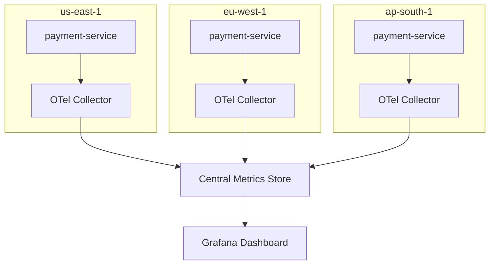

# How to Create a Multi-Region Service Comparison Dashboard from OpenTelemetry Distributed Metrics

Author: [nawazdhandala](https://www.github.com/nawazdhandala)

Tags: OpenTelemetry, Multi-Region, Distributed Systems, Metrics, Dashboard

Description: Compare service performance across multiple regions using OpenTelemetry distributed metrics in a unified dashboard.

Running services across multiple regions introduces a class of problems that single-region deployments never face. Latency varies by geography, deployments roll out at different times, and infrastructure specs may differ between cloud regions. A service might be healthy in us-east-1 but degraded in eu-west-1, and without a side-by-side comparison dashboard, you will not notice until users complain.

OpenTelemetry makes cross-region comparison straightforward because the resource attributes and semantic conventions give you a consistent schema regardless of where the telemetry originates. This post shows how to set up region-aware instrumentation, configure collectors in each region, and build a dashboard that highlights regional differences.

## Adding Region Context to Telemetry

The foundation is making sure every metric, trace, and log carries region information. Set this at the resource level so it propagates automatically to all signals.

```python
# resource_config.py - Set region as a resource attribute
import os
from opentelemetry.sdk.resources import Resource

def get_service_resource():
    return Resource.create({
        "service.name": "payment-service",
        "service.version": os.getenv("APP_VERSION", "unknown"),
        "deployment.environment": os.getenv("ENVIRONMENT", "production"),
        # Region should come from infrastructure metadata
        "cloud.region": os.getenv("CLOUD_REGION", "us-east-1"),
        "cloud.provider": os.getenv("CLOUD_PROVIDER", "aws"),
        "cloud.availability_zone": os.getenv("CLOUD_AZ", "us-east-1a"),
    })
```

For Kubernetes deployments, inject the region as an environment variable from the node labels or a ConfigMap.

```yaml
# k8s-deployment.yaml - Inject region into the pod
apiVersion: apps/v1
kind: Deployment
metadata:
  name: payment-service
spec:
  template:
    spec:
      containers:
        - name: payment-service
          env:
            # Pull region from a ConfigMap that is region-specific
            - name: CLOUD_REGION
              valueFrom:
                configMapKeyRef:
                  name: cluster-metadata
                  key: region
            - name: OTEL_EXPORTER_OTLP_ENDPOINT
              value: "http://otel-collector:4317"
            # Set the resource attributes via env var as a fallback
            - name: OTEL_RESOURCE_ATTRIBUTES
              value: "cloud.region=$(CLOUD_REGION),service.name=payment-service"
```

## Regional Collector Architecture

Each region runs its own OpenTelemetry Collector that adds region-specific labels and forwards data to a central metrics store. This pattern avoids cross-region traffic for the data path while still giving you a unified view.



Each regional collector configuration is nearly identical, differing only in the region label.

```yaml
# otel-collector-regional.yaml
receivers:
  otlp:
    protocols:
      grpc:
        endpoint: 0.0.0.0:4317

processors:
  batch:
    timeout: 10s

  # Ensure region is always present even if the app does not set it
  resource:
    attributes:
      - key: cloud.region
        value: "${REGION}"
        action: upsert

  # Add cross-region latency measurement
  # by recording collector receive-to-export time
  attributes:
    actions:
      - key: collector.region
        value: "${REGION}"
        action: upsert

exporters:
  prometheusremotewrite:
    endpoint: https://central-prometheus.example.com/api/v1/write
    headers:
      Authorization: "Bearer ${METRICS_WRITE_TOKEN}"
    # Add region as an external label
    external_labels:
      region: "${REGION}"

service:
  pipelines:
    metrics:
      receivers: [otlp]
      processors: [resource, batch]
      exporters: [prometheusremotewrite]
```

## Key Application Metrics to Instrument

For cross-region comparison, focus on metrics that reveal regional differences.

```python
from opentelemetry import metrics

meter = metrics.get_meter("payment-service")

# Request latency histogram - the most important comparison metric
request_duration = meter.create_histogram(
    name="http.server.request.duration",
    description="Server request duration",
    unit="s",
)

# Dependency latency - measures calls to external services
dependency_duration = meter.create_histogram(
    name="dependency.duration",
    description="Duration of calls to external dependencies",
    unit="s",
)

# Error counter segmented by type
error_counter = meter.create_counter(
    name="http.server.errors",
    description="Server error count",
)

def handle_request(request):
    # Record with attributes that enable regional comparison
    labels = {
        "http.method": request.method,
        "http.route": request.route,
        "http.status_code": str(response.status_code),
    }
    request_duration.record(elapsed_time, labels)
```

## Dashboard Queries for Regional Comparison

The dashboard queries use the `region` label to break down metrics side by side.

```promql
# Request latency p99 by region - the primary comparison panel
histogram_quantile(0.99,
  sum(rate(http_server_request_duration_bucket[5m])) by (le, region)
)

# Error rate by region
sum(rate(http_server_errors_total[5m])) by (region)
/
sum(rate(http_server_request_duration_count[5m])) by (region)

# Request throughput by region
sum(rate(http_server_request_duration_count[5m])) by (region)

# Dependency latency comparison - are third-party APIs slower in some regions?
histogram_quantile(0.95,
  sum(rate(dependency_duration_bucket[5m])) by (le, region, dependency_name)
)

# Detect regional anomalies - regions deviating from global average
# Subtract each region's p50 from the global p50
histogram_quantile(0.50, sum(rate(http_server_request_duration_bucket[5m])) by (le, region))
-
ignoring(region)
histogram_quantile(0.50, sum(rate(http_server_request_duration_bucket[5m])) by (le))
```

## Dashboard Layout

Organize the dashboard so regional differences are immediately visible.

**Row 1 - Health Overview**: One stat panel per region showing current availability (green/yellow/red). Next to it, a table ranking regions by p99 latency so you can instantly see which region is the outlier.

**Row 2 - Latency Comparison**: A time series chart with one line per region for p50, p95, and p99 request duration. Use Grafana's "Shared crosshair" mode so hovering over one chart highlights the same timestamp across all panels.

**Row 3 - Throughput and Errors**: Stacked bar chart showing requests per second per region (to understand traffic distribution), alongside an error rate chart per region.

**Row 4 - Dependency Health**: Heatmap of dependency call latency by region and dependency name. This quickly reveals if a third-party service is slow in a specific geography.

**Row 5 - Deployment Tracking**: A panel showing the currently deployed version per region. During rolling deployments across regions, this helps you correlate performance changes with version rollouts.

## Alerting on Regional Drift

Beyond the dashboard, set up alerts that fire when one region drifts too far from the others. A useful approach is to alert when a region's p99 latency exceeds 2x the median across all regions for more than 5 minutes. This catches regional degradation without requiring you to set a static threshold that may not account for baseline differences between regions.
