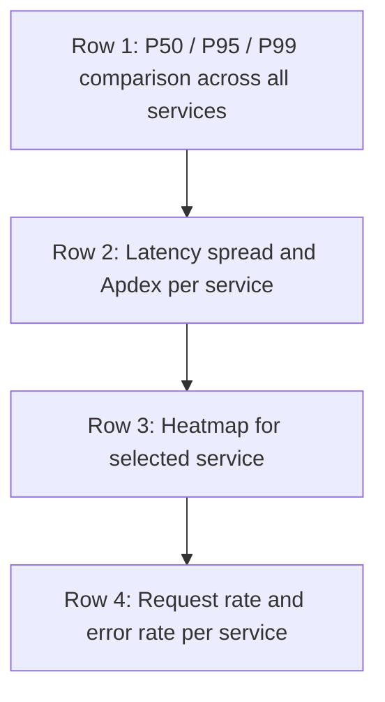

# How to Create a Multi-Service Latency Comparison Dashboard from OpenTelemetry Histograms

Author: [nawazdhandala](https://www.github.com/nawazdhandala)

Tags: OpenTelemetry, Latency, Histograms, Grafana

Description: Build a multi-service latency comparison dashboard using OpenTelemetry histogram metrics to spot outliers quickly.

When you run multiple services behind an API gateway or load balancer, knowing the average latency across all of them is not particularly useful. What you need is a side-by-side comparison - which service is slow, how their latency distributions differ, and whether a specific percentile is drifting upward. OpenTelemetry histograms capture the full distribution of request durations, and with the right dashboard, you can compare latency profiles across dozens of services at a glance.

## OpenTelemetry Histogram Basics

OpenTelemetry SDKs can emit metrics as histograms, which record values in configurable buckets. For HTTP server duration, the default metric is `http.server.request.duration` (following the latest semantic conventions). Each observation is placed into a bucket, and you get counters for each bucket boundary plus a sum and count.

The default bucket boundaries for duration histograms are:

```
0, 0.005, 0.01, 0.025, 0.05, 0.075, 0.1, 0.25, 0.5, 0.75, 1.0, 2.5, 5.0, 7.5, 10.0
```

These are in seconds and cover most HTTP request latency ranges. You can customize them if your services have different latency profiles.

## Collector Configuration

The collector needs to receive these histogram metrics and forward them to a backend that supports histogram queries. Prometheus is the most common choice.

```yaml
# otel-collector-config.yaml
receivers:
  otlp:
    protocols:
      grpc:
        endpoint: "0.0.0.0:4317"
      http:
        endpoint: "0.0.0.0:4318"

processors:
  # Batch metrics to reduce export overhead
  batch:
    send_batch_size: 1000
    timeout: 10s

  # Add service.name as a resource attribute if not already present
  resource:
    attributes:
      - key: service.name
        action: upsert
        from_attribute: service.name

exporters:
  prometheusremotewrite:
    endpoint: "http://prometheus:9090/api/v1/write"

service:
  pipelines:
    metrics:
      receivers: [otlp]
      processors: [batch, resource]
      exporters: [prometheusremotewrite]
```

## Latency Comparison Queries

The core technique is using `histogram_quantile()` with a `by (service_name)` clause to get per-service percentiles.

**P50 Latency Comparison** - Median latency across all services on one chart:

```promql
# Median request duration per service
histogram_quantile(0.50,
  sum by (le, service_name) (
    rate(http_server_request_duration_seconds_bucket[5m])
  )
)
```

**P95 Latency Comparison** - The tail latency that affects user experience:

```promql
# 95th percentile request duration per service
histogram_quantile(0.95,
  sum by (le, service_name) (
    rate(http_server_request_duration_seconds_bucket[5m])
  )
)
```

**P99 Latency Comparison** - Worst-case performance:

```promql
# 99th percentile request duration per service
histogram_quantile(0.99,
  sum by (le, service_name) (
    rate(http_server_request_duration_seconds_bucket[5m])
  )
)
```

## Advanced Panels

Beyond basic percentile comparisons, a few additional views make the dashboard significantly more useful.

**Latency Distribution Heatmap** - Shows how request durations are distributed over time for a selected service:

```promql
# Heatmap of request duration distribution
sum by (le) (
  rate(http_server_request_duration_seconds_bucket{service_name="$service"}[5m])
)
```

In Grafana, use the "Heatmap" visualization type and set the format to "Time series buckets."

**Latency Spread (P99 minus P50)** - A high spread means inconsistent performance:

```promql
# Gap between P99 and P50 per service
# Large values indicate high latency variance
histogram_quantile(0.99,
  sum by (le, service_name) (rate(http_server_request_duration_seconds_bucket[5m]))
)
-
histogram_quantile(0.50,
  sum by (le, service_name) (rate(http_server_request_duration_seconds_bucket[5m]))
)
```

**Apdex Score** - A standardized satisfaction metric based on a target latency threshold. Assuming a target of 250ms:

```promql
# Apdex score with T=0.25s (250ms)
# Satisfied: < 0.25s, Tolerating: < 1.0s (4T), Frustrated: >= 1.0s
(
  sum by (service_name) (rate(http_server_request_duration_seconds_bucket{le="0.25"}[5m]))
  +
  sum by (service_name) (rate(http_server_request_duration_seconds_bucket{le="1.0"}[5m]))
)
/
(2 * sum by (service_name) (rate(http_server_request_duration_seconds_count[5m])))
```

## Dashboard Variables

Use Grafana template variables to make the dashboard interactive:

```
# Variable: service_name
# Query: label_values(http_server_request_duration_seconds_count, service_name)
# Multi-value: enabled
# Include All option: enabled
```

This lets users select specific services or view all services simultaneously.

## Layout Recommendations



The first row is the most important - it immediately shows which services are outliers. A service with a P95 that is 10x higher than others stands out visually and tells you where to focus your investigation. Combine this with the spread metric to distinguish between services that are consistently slow versus those that have occasional spikes.
