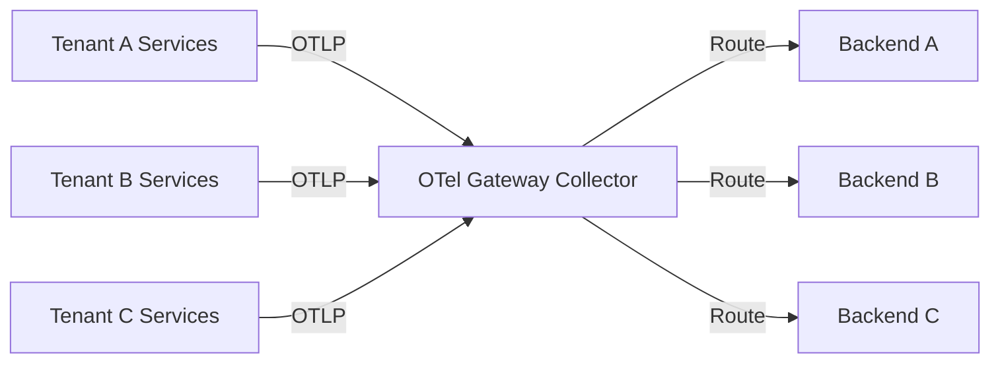
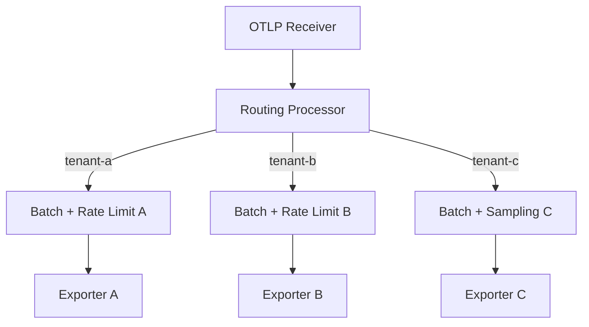

# How to Implement Multi-Tenant Observability Pipelines with Routing

Author: [nawazdhandala](https://www.github.com/nawazdhandala)

Tags: OpenTelemetry, Multi-Tenancy, Observability, Collector, Routing, Pipelines

Description: Learn how to build multi-tenant observability pipelines using OpenTelemetry Collector routing processors to isolate and direct telemetry data per tenant.

---

When you run a platform that serves multiple tenants, observability becomes a routing problem. Each tenant expects their telemetry data to land in the right place, stay isolated from other tenants, and meet whatever compliance or retention rules apply to them. The OpenTelemetry Collector gives you the building blocks to solve this cleanly.

This guide walks through implementing multi-tenant observability pipelines using the OpenTelemetry Collector's routing capabilities. We will cover the architecture, configuration patterns, and practical examples you need to get this working in production.

## Why Multi-Tenant Routing Matters

In a shared infrastructure setup, all your services emit traces, metrics, and logs into the same collection layer. Without routing, everything goes to the same backend. That creates several problems:

- **Data isolation violations**: Tenant A can see Tenant B's data.
- **Cost attribution is impossible**: You cannot tell which tenant generates how much telemetry.
- **Retention policies differ**: Some tenants need 30-day retention, others need 90.
- **Backend flexibility**: Different tenants may use different observability backends entirely.

The routing processor in the OpenTelemetry Collector solves these problems by inspecting telemetry attributes and directing data to the correct exporter pipeline.

## Architecture Overview

The general architecture involves a collector gateway that sits between your application collectors (agents) and your backends. The gateway inspects incoming telemetry, identifies the tenant, and routes it to the appropriate exporter.



The key insight is that tenant identification happens through resource attributes. Your application-level collectors stamp each piece of telemetry with a `tenant.id` attribute before forwarding it to the gateway.

## Setting Up Tenant Identification at the Agent Level

Before routing can work, every piece of telemetry needs a tenant identifier. The simplest way to do this is through the resource processor on the agent collector running alongside each tenant's workload.

This agent configuration adds a `tenant.id` resource attribute to all telemetry passing through the collector. You would deploy one of these per tenant or per tenant namespace.

```yaml
# Agent collector config - deployed per tenant
receivers:
  otlp:
    protocols:
      grpc:
        endpoint: 0.0.0.0:4317

processors:
  # Stamp every signal with the tenant identifier
  resource:
    attributes:
      - key: tenant.id
        value: "tenant-a"
        action: upsert

exporters:
  otlp:
    # Forward to the central gateway collector
    endpoint: otel-gateway.observability.svc:4317
    tls:
      insecure: false

service:
  pipelines:
    traces:
      receivers: [otlp]
      processors: [resource]
      exporters: [otlp]
    metrics:
      receivers: [otlp]
      processors: [resource]
      exporters: [otlp]
    logs:
      receivers: [otlp]
      processors: [resource]
      exporters: [otlp]
```

In Kubernetes, you can use environment variables to inject the tenant ID dynamically instead of hardcoding it. Pull it from a namespace label or a pod annotation.

## Configuring the Routing Processor on the Gateway

The routing processor is the core piece. It evaluates a routing condition based on resource attributes and sends data to the matching sub-pipeline. You need to install the `routingprocessor` component in your collector distribution (it ships with the OpenTelemetry Collector Contrib).

This gateway configuration defines three tenant-specific exporters and uses the routing processor to direct telemetry based on the `tenant.id` resource attribute.

```yaml
# Gateway collector config - central routing layer
receivers:
  otlp:
    protocols:
      grpc:
        endpoint: 0.0.0.0:4317

processors:
  # Route based on the tenant.id resource attribute
  routing:
    from_attribute: tenant.id
    attribute_source: resource
    # Default route for unrecognized tenants
    default_exporters: [otlp/default]
    table:
      # Each entry maps a tenant ID to one or more exporters
      - value: "tenant-a"
        exporters: [otlp/tenant-a]
      - value: "tenant-b"
        exporters: [otlp/tenant-b]
      - value: "tenant-c"
        exporters: [otlp/tenant-c]

exporters:
  # Tenant A ships data to their dedicated backend
  otlp/tenant-a:
    endpoint: tenant-a-backend.example.com:4317
    headers:
      Authorization: "Bearer ${TENANT_A_TOKEN}"

  # Tenant B uses a different backend entirely
  otlp/tenant-b:
    endpoint: tenant-b-backend.example.com:4317
    headers:
      Authorization: "Bearer ${TENANT_B_TOKEN}"

  # Tenant C goes to a shared backend with tenant-specific headers
  otlp/tenant-c:
    endpoint: shared-backend.example.com:4317
    headers:
      X-Scope-OrgID: "tenant-c"

  # Fallback for unknown tenants
  otlp/default:
    endpoint: default-backend.example.com:4317

service:
  pipelines:
    traces:
      receivers: [otlp]
      processors: [routing]
      exporters: [otlp/tenant-a, otlp/tenant-b, otlp/tenant-c, otlp/default]
    metrics:
      receivers: [otlp]
      processors: [routing]
      exporters: [otlp/tenant-a, otlp/tenant-b, otlp/tenant-c, otlp/default]
    logs:
      receivers: [otlp]
      processors: [routing]
      exporters: [otlp/tenant-a, otlp/tenant-b, otlp/tenant-c, otlp/default]
```

Note that you must list all possible exporters in the pipeline's `exporters` field. The routing processor selects which ones actually receive data at runtime. Exporters not matched by any route simply receive nothing.

## Using OTTL-Based Routing for Complex Conditions

Sometimes a simple attribute match is not enough. You might need to route based on combinations of attributes, or apply regex patterns. The routing processor supports OTTL (OpenTelemetry Transformation Language) statements for this.

This configuration uses OTTL expressions to implement more sophisticated routing logic, such as routing by environment or matching multiple attribute conditions.

```yaml
processors:
  routing:
    # Use OTTL context for richer routing logic
    default_exporters: [otlp/default]
    table:
      # Route production traffic for tenant-a to a premium backend
      - statement: 'resource.attributes["tenant.id"] == "tenant-a" and resource.attributes["deployment.environment"] == "production"'
        exporters: [otlp/tenant-a-prod]

      # Route all staging traffic to a shared staging backend
      - statement: 'resource.attributes["deployment.environment"] == "staging"'
        exporters: [otlp/staging-shared]

      # Catch-all for tenant-a non-production
      - statement: 'resource.attributes["tenant.id"] == "tenant-a"'
        exporters: [otlp/tenant-a-dev]
```

The OTTL statements are evaluated in order. The first match wins. This lets you build priority-based routing where more specific rules take precedence over general ones.

## Adding Per-Tenant Rate Limiting and Sampling

Tenants do not all generate the same volume of telemetry. A noisy tenant can overwhelm your pipeline if you are not careful. You can add per-tenant processing by splitting your pipeline into tenant-specific sub-pipelines using connectors.



To implement per-tenant processing, you use the routing connector instead of the routing processor. The connector forwards data to different pipelines, each with its own set of processors.

This configuration uses the routing connector to fan out to separate pipelines where each tenant gets independent batch sizing and memory limits.

```yaml
connectors:
  # The routing connector sends data to sub-pipelines
  routing:
    from_attribute: tenant.id
    attribute_source: resource
    default_pipelines: [traces/default]
    table:
      - value: "tenant-a"
        pipelines: [traces/tenant-a]
      - value: "tenant-b"
        pipelines: [traces/tenant-b]

processors:
  # Tenant A gets generous batch sizes (high volume tenant)
  batch/tenant-a:
    send_batch_size: 10000
    timeout: 5s

  # Tenant B gets smaller batches (low volume tenant)
  batch/tenant-b:
    send_batch_size: 1000
    timeout: 10s

  # Tail sampling for tenant A to control costs
  tail_sampling/tenant-a:
    policies:
      - name: error-policy
        type: status_code
        status_code: {status_codes: [ERROR]}
      - name: slow-traces
        type: latency
        latency: {threshold_ms: 1000}

service:
  pipelines:
    traces:
      receivers: [otlp]
      exporters: [routing]
    traces/tenant-a:
      receivers: [routing]
      processors: [tail_sampling/tenant-a, batch/tenant-a]
      exporters: [otlp/tenant-a]
    traces/tenant-b:
      receivers: [routing]
      processors: [batch/tenant-b]
      exporters: [otlp/tenant-b]
```

## Handling Tenant Onboarding and Dynamic Configuration

A production multi-tenant system needs to handle new tenants without redeploying the gateway. There are a few approaches:

1. **Configuration management**: Use a tool like Helm or Kustomize to template the routing table and redeploy with rolling updates when tenants change.
2. **OpAMP protocol**: The OpenTelemetry OpAMP protocol allows remote configuration management. Your control plane can push updated routing tables to the gateway.
3. **Header-based routing**: Instead of resource attributes, route based on OTLP request headers. Tenants set their own `X-Tenant-ID` header, and the `routing` processor inspects it using `attribute_source: context`.

For header-based routing, the configuration looks like this. The tenant ID comes from the gRPC metadata rather than the telemetry attributes themselves.

```yaml
processors:
  routing:
    # Read tenant ID from gRPC metadata / HTTP headers
    from_attribute: X-Tenant-ID
    attribute_source: context
    default_exporters: [otlp/default]
    table:
      - value: "tenant-a"
        exporters: [otlp/tenant-a]
      - value: "tenant-b"
        exporters: [otlp/tenant-b]
```

## Monitoring the Pipeline Itself

A multi-tenant routing pipeline is only as reliable as your ability to observe it. The collector exposes internal metrics that you should track.

Key metrics to watch:

- `otelcol_processor_routing_items_routed`: How many items each route handled.
- `otelcol_exporter_sent_spans`: Confirms data is reaching backends.
- `otelcol_exporter_send_failed_spans`: Detects export failures per tenant.
- `otelcol_processor_dropped_spans`: Catch data loss early.

Add the Prometheus exporter to your gateway's service configuration so you can scrape these metrics and alert on them.

```yaml
# Expose internal collector metrics for monitoring
service:
  telemetry:
    metrics:
      address: 0.0.0.0:8888
      level: detailed
```

## Conclusion

Multi-tenant observability with OpenTelemetry comes down to three things: stamping telemetry with a tenant identifier, routing based on that identifier at the gateway layer, and applying per-tenant processing policies. The routing processor and routing connector in the OpenTelemetry Collector Contrib give you the tools to build this cleanly.

Start simple with attribute-based routing and a static routing table. As your tenant count grows, layer in OTTL-based routing for complex conditions and the routing connector for per-tenant processing pipelines. The architecture scales well because each component has a single, clear responsibility.
