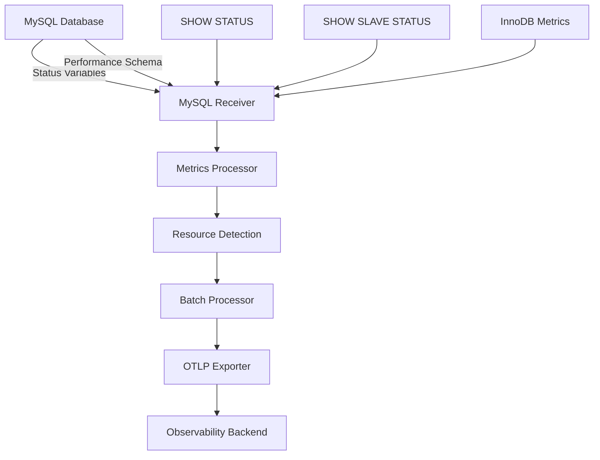

# How to Configure the MySQL Receiver in the OpenTelemetry Collector

Author: [nawazdhandala](https://www.github.com/nawazdhandala)

Tags: OpenTelemetry, Collector, MySQL, Database Monitoring, Metrics, Performance

Description: Complete guide to configuring the MySQL receiver in OpenTelemetry Collector for database performance monitoring with practical YAML examples and optimization strategies.

The MySQL receiver enables the OpenTelemetry Collector to collect performance metrics directly from MySQL and MariaDB databases. This receiver provides critical insights into database operations, query performance, buffer pool efficiency, and replication health, helping you maintain optimal database performance and reliability.

## Understanding MySQL Monitoring

MySQL monitoring is essential for identifying performance bottlenecks, optimizing resource usage, and preventing downtime. The MySQL receiver collects metrics by querying MySQL's performance schema and status variables, providing real-time visibility into database operations without requiring external tools or log parsing.

Key metrics include query execution rates, connection usage, buffer pool hit ratios, InnoDB statistics, and replication lag. These metrics help you understand database behavior under load and make informed decisions about scaling, query optimization, and configuration tuning.



## Basic Configuration

The simplest configuration requires database connection details:

```yaml
receivers:
  # MySQL receiver with basic connection
  mysql:
    # Database connection endpoint
    endpoint: localhost:3306

    # Database credentials
    username: monitoring_user
    password: ${env:MYSQL_PASSWORD}

    # Database name (optional, for schema-specific metrics)
    database: mysql

    # Collection interval (default: 10s)
    collection_interval: 10s

    # Transport protocol (default: tcp)
    transport: tcp

processors:
  # Batch metrics for efficiency
  batch:
    timeout: 10s
    send_batch_size: 100

exporters:
  # Export to stdout for testing
  logging:
    loglevel: info

service:
  pipelines:
    metrics:
      receivers: [mysql]
      processors: [batch]
      exporters: [logging]
```

This configuration connects to a local MySQL instance and collects default metrics every 10 seconds. The password is securely read from an environment variable.

## Key MySQL Metrics

The receiver collects comprehensive metrics organized by functional area:

### Connection Metrics

- `mysql.connections`: Current number of open connections
- `mysql.connection.errors`: Connection errors by type
- `mysql.threads.connected`: Number of currently connected threads
- `mysql.threads.running`: Number of threads executing queries
- `mysql.connection.max`: Maximum allowed connections

### Query Performance

- `mysql.queries`: Total queries executed
- `mysql.statements`: Statement execution counts by type
- `mysql.slow_queries`: Number of slow queries
- `mysql.table_locks.immediate`: Table locks acquired immediately
- `mysql.table_locks.waited`: Table locks that had to wait

### Buffer Pool Metrics

- `mysql.buffer_pool.pages`: Buffer pool page statistics
- `mysql.buffer_pool.data_pages`: Number of data pages
- `mysql.buffer_pool.operations`: Buffer pool read/write operations
- `mysql.buffer_pool.page_flushes`: Pages flushed from buffer pool
- `mysql.buffer_pool.size`: Total buffer pool size

### InnoDB Metrics

- `mysql.innodb.data_reads`: Number of data reads
- `mysql.innodb.data_writes`: Number of data writes
- `mysql.innodb.row_locks`: Row lock statistics
- `mysql.innodb.row_operations`: Row-level operations
- `mysql.innodb.log_operations`: Log write operations

### Replication Metrics

- `mysql.replica.time_behind_source`: Seconds behind source server
- `mysql.replica.sql_delay`: SQL thread delay
- `mysql.replica.lag`: Replication lag in seconds

## Advanced Configuration

For production environments, configure comprehensive monitoring with security:

```yaml
receivers:
  mysql:
    endpoint: mysql-primary.example.com:3306
    username: otel_monitor
    password: ${env:MYSQL_MONITORING_PASSWORD}
    database: information_schema

    # Collection interval
    collection_interval: 30s

    # TLS configuration for secure connection
    tls:
      insecure: false
      insecure_skip_verify: false
      ca_file: /etc/otel/certs/mysql-ca.pem
      cert_file: /etc/otel/certs/client-cert.pem
      key_file: /etc/otel/certs/client-key.pem

    # Metric configuration
    metrics:
      # Connection metrics
      mysql.connections:
        enabled: true
      mysql.connection.errors:
        enabled: true
      mysql.threads.connected:
        enabled: true
      mysql.threads.running:
        enabled: true

      # Query metrics
      mysql.queries:
        enabled: true
      mysql.statements:
        enabled: true
      mysql.slow_queries:
        enabled: true

      # Buffer pool metrics
      mysql.buffer_pool.pages:
        enabled: true
      mysql.buffer_pool.operations:
        enabled: true
      mysql.buffer_pool.data_pages:
        enabled: true

      # InnoDB metrics
      mysql.innodb.data_reads:
        enabled: true
      mysql.innodb.data_writes:
        enabled: true
      mysql.innodb.row_locks:
        enabled: true
      mysql.innodb.row_operations:
        enabled: true

      # Replication metrics
      mysql.replica.time_behind_source:
        enabled: true
```

## Creating a Monitoring User

Create a dedicated monitoring user with minimal required privileges:

```sql
-- Create monitoring user with restricted access
CREATE USER 'otel_monitor'@'%' IDENTIFIED BY 'secure_password_here';

-- Grant necessary privileges for metrics collection
GRANT SELECT ON performance_schema.* TO 'otel_monitor'@'%';
GRANT SELECT ON information_schema.* TO 'otel_monitor'@'%';

-- Grant PROCESS privilege to view connection statistics
GRANT PROCESS ON *.* TO 'otel_monitor'@'%';

-- Grant REPLICATION CLIENT to collect replication metrics
GRANT REPLICATION CLIENT ON *.* TO 'otel_monitor'@'%';

-- Apply changes
FLUSH PRIVILEGES;

-- Verify privileges
SHOW GRANTS FOR 'otel_monitor'@'%';
```

For enhanced security, restrict the monitoring user to specific hosts:

```sql
-- Create user for specific collector host
CREATE USER 'otel_monitor'@'collector.example.com' IDENTIFIED BY 'secure_password';

-- Grant same privileges as above
GRANT SELECT ON performance_schema.* TO 'otel_monitor'@'collector.example.com';
GRANT SELECT ON information_schema.* TO 'otel_monitor'@'collector.example.com';
GRANT PROCESS ON *.* TO 'otel_monitor'@'collector.example.com';
GRANT REPLICATION CLIENT ON *.* TO 'otel_monitor'@'collector.example.com';

FLUSH PRIVILEGES;
```

## Monitoring Replication

For MySQL replication topologies, monitor both source and replica servers:

```yaml
receivers:
  # Source server monitoring
  mysql/source:
    endpoint: mysql-source.example.com:3306
    username: otel_monitor
    password: ${env:MYSQL_PASSWORD}
    collection_interval: 30s

    # Enable replication source metrics
    metrics:
      mysql.connections:
        enabled: true
      mysql.threads.connected:
        enabled: true
      mysql.buffer_pool.operations:
        enabled: true
      mysql.innodb.row_operations:
        enabled: true

    # Add resource attributes
    resource_attributes:
      mysql.role:
        enabled: true
        value: source

  # Replica server monitoring
  mysql/replica:
    endpoint: mysql-replica.example.com:3306
    username: otel_monitor
    password: ${env:MYSQL_PASSWORD}
    collection_interval: 30s

    # Enable replication lag metrics
    metrics:
      mysql.replica.time_behind_source:
        enabled: true
      mysql.replica.sql_delay:
        enabled: true
      mysql.threads.running:
        enabled: true

    resource_attributes:
      mysql.role:
        enabled: true
        value: replica

processors:
  # Add cluster information
  resource:
    attributes:
      - key: mysql.cluster
        value: production-cluster
        action: insert
      - key: datacenter
        value: us-east-1
        action: insert

  batch:
    timeout: 30s

exporters:
  otlp:
    endpoint: https://observability.example.com:4317

service:
  pipelines:
    metrics:
      receivers: [mysql/source, mysql/replica]
      processors: [resource, batch]
      exporters: [otlp]
```

## Custom Query Metrics

Collect application-specific metrics using custom queries:

```yaml
receivers:
  mysql:
    endpoint: localhost:3306
    username: otel_monitor
    password: ${env:MYSQL_PASSWORD}

    # Custom SQL queries for application metrics
    statements:
      # Monitor table sizes
      - query: |
          SELECT
            table_schema,
            table_name,
            table_rows,
            data_length,
            index_length,
            (data_length + index_length) as total_size
          FROM information_schema.tables
          WHERE table_schema NOT IN ('information_schema', 'mysql', 'performance_schema', 'sys')
          AND table_type = 'BASE TABLE'
        metrics:
          - metric_name: mysql.table.rows
            value_column: table_rows
            data_type: gauge
            attribute_columns:
              - table_schema
              - table_name
          - metric_name: mysql.table.size.data
            value_column: data_length
            data_type: gauge
          - metric_name: mysql.table.size.index
            value_column: index_length
            data_type: gauge
          - metric_name: mysql.table.size.total
            value_column: total_size
            data_type: gauge

      # Monitor InnoDB buffer pool hit ratio
      - query: |
          SELECT
            (1 - (Innodb_buffer_pool_reads / Innodb_buffer_pool_read_requests)) * 100
            AS buffer_pool_hit_ratio
          FROM
            (SELECT variable_value AS Innodb_buffer_pool_reads
             FROM performance_schema.global_status
             WHERE variable_name = 'Innodb_buffer_pool_reads') AS reads,
            (SELECT variable_value AS Innodb_buffer_pool_read_requests
             FROM performance_schema.global_status
             WHERE variable_name = 'Innodb_buffer_pool_read_requests') AS requests
        metrics:
          - metric_name: mysql.buffer_pool.hit_ratio
            value_column: buffer_pool_hit_ratio
            data_type: gauge

      # Monitor long-running queries
      - query: |
          SELECT
            COUNT(*) as long_queries
          FROM information_schema.processlist
          WHERE command != 'Sleep'
          AND time > 60
        metrics:
          - metric_name: mysql.queries.long_running
            value_column: long_queries
            data_type: gauge
```

## Production Configuration

Here's a complete production-ready configuration:

```yaml
receivers:
  mysql:
    endpoint: mysql.prod.example.com:3306
    transport: tcp
    username: otel_monitoring
    password: ${env:MYSQL_MONITORING_PASSWORD}
    database: information_schema

    # Production collection interval
    collection_interval: 30s

    # TLS configuration
    tls:
      insecure: false
      insecure_skip_verify: false
      ca_file: /etc/otel/certs/mysql-ca.crt
      cert_file: /etc/otel/certs/client.crt
      key_file: /etc/otel/certs/client.key
      min_version: "1.2"

    # Enable comprehensive metrics
    metrics:
      mysql.connections:
        enabled: true
      mysql.connection.errors:
        enabled: true
      mysql.threads.connected:
        enabled: true
      mysql.threads.running:
        enabled: true
      mysql.queries:
        enabled: true
      mysql.statements:
        enabled: true
      mysql.slow_queries:
        enabled: true
      mysql.table_locks.immediate:
        enabled: true
      mysql.table_locks.waited:
        enabled: true
      mysql.buffer_pool.pages:
        enabled: true
      mysql.buffer_pool.operations:
        enabled: true
      mysql.buffer_pool.data_pages:
        enabled: true
      mysql.innodb.data_reads:
        enabled: true
      mysql.innodb.data_writes:
        enabled: true
      mysql.innodb.row_locks:
        enabled: true
      mysql.innodb.row_operations:
        enabled: true
      mysql.replica.time_behind_source:
        enabled: true

processors:
  # Memory limiter
  memory_limiter:
    check_interval: 1s
    limit_mib: 512
    spike_limit_mib: 128

  # Resource detection
  resourcedetection:
    detectors: [env, system]
    timeout: 5s

  # Add custom attributes
  resource:
    attributes:
      - key: deployment.environment
        value: production
        action: insert
      - key: mysql.cluster.name
        value: prod-mysql-cluster
        action: insert
      - key: mysql.cluster.region
        value: us-east-1
        action: insert

  # Filter out test databases
  filter/exclude_test:
    metrics:
      exclude:
        match_type: regexp
        resource_attributes:
          - key: mysql.database.name
            value: "test_.*"

  # Transform metric names
  metricstransform:
    transforms:
      - include: mysql.threads.connected
        action: update
        new_name: mysql.connections.active

  # Batch processing
  batch:
    timeout: 30s
    send_batch_size: 500

exporters:
  # Primary export to observability platform
  otlp:
    endpoint: https://observability.example.com:4317
    headers:
      api-key: ${env:OBSERVABILITY_API_KEY}
    compression: gzip
    sending_queue:
      enabled: true
      num_consumers: 10
      queue_size: 1000
    retry_on_failure:
      enabled: true
      initial_interval: 5s
      max_interval: 30s

  # Local Prometheus endpoint
  prometheus:
    endpoint: "0.0.0.0:8889"
    namespace: mysql
    const_labels:
      cluster: production
      region: us-east-1

service:
  pipelines:
    metrics:
      receivers: [mysql]
      processors:
        - memory_limiter
        - resourcedetection
        - resource
        - filter/exclude_test
        - metricstransform
        - batch
      exporters: [otlp, prometheus]

  # Collector telemetry
  telemetry:
    logs:
      level: info
    metrics:
      address: :8888
```

## Monitoring MySQL in Kubernetes

Deploy the collector as a sidecar to monitor MySQL in Kubernetes:

```yaml
apiVersion: v1
kind: ConfigMap
metadata:
  name: otel-collector-config
  namespace: databases
data:
  config.yaml: |
    receivers:
      mysql:
        endpoint: localhost:3306
        username: otel_monitor
        password: ${env:MYSQL_PASSWORD}
        collection_interval: 30s

    processors:
      resource:
        attributes:
          - key: k8s.cluster.name
            value: prod-cluster
            action: insert
          - key: k8s.namespace.name
            value: databases
            action: insert

      batch:
        timeout: 30s

    exporters:
      otlp:
        endpoint: otel-gateway.monitoring.svc.cluster.local:4317

    service:
      pipelines:
        metrics:
          receivers: [mysql]
          processors: [resource, batch]
          exporters: [otlp]

---
apiVersion: apps/v1
kind: Deployment
metadata:
  name: mysql-with-monitoring
  namespace: databases
spec:
  replicas: 1
  selector:
    matchLabels:
      app: mysql
  template:
    metadata:
      labels:
        app: mysql
    spec:
      containers:
        # MySQL container
        - name: mysql
          image: mysql:8.0
          ports:
            - containerPort: 3306
          env:
            - name: MYSQL_ROOT_PASSWORD
              valueFrom:
                secretKeyRef:
                  name: mysql-secret
                  key: root-password

        # OpenTelemetry Collector sidecar
        - name: otel-collector
          image: otel/opentelemetry-collector-contrib:latest
          command: ["--config=/conf/config.yaml"]
          env:
            - name: MYSQL_PASSWORD
              valueFrom:
                secretKeyRef:
                  name: mysql-secret
                  key: monitoring-password
          volumeMounts:
            - name: otel-config
              mountPath: /conf

      volumes:
        - name: otel-config
          configMap:
            name: otel-collector-config
```

## Alerting Strategies

Set up alerts for common MySQL issues:

### High Connection Usage

Alert when connection pool is near capacity:

```yaml
# Prometheus alert rule
- alert: MySQLHighConnectionUsage
  expr: |
    (mysql.threads.connected / mysql.connection.max) > 0.8
  for: 5m
  labels:
    severity: warning
  annotations:
    summary: "MySQL connection usage high on {{ $labels.instance }}"
    description: "Connection pool is {{ $value | humanizePercentage }} full"
```

### Low Buffer Pool Hit Ratio

Alert on poor buffer pool efficiency:

```yaml
- alert: MySQLLowBufferPoolHitRatio
  expr: mysql.buffer_pool.hit_ratio < 90
  for: 15m
  labels:
    severity: warning
  annotations:
    summary: "MySQL buffer pool hit ratio low"
    description: "Buffer pool hit ratio is {{ $value }}%"
```

### Replication Lag

Alert on excessive replication delay:

```yaml
- alert: MySQLReplicationLag
  expr: mysql.replica.time_behind_source > 60
  for: 5m
  labels:
    severity: critical
  annotations:
    summary: "MySQL replication lag on {{ $labels.instance }}"
    description: "Replication is {{ $value }} seconds behind source"
```

### Slow Queries

Alert on increasing slow query rate:

```yaml
- alert: MySQLHighSlowQueryRate
  expr: rate(mysql.slow_queries[5m]) > 10
  for: 10m
  labels:
    severity: warning
  annotations:
    summary: "High slow query rate on {{ $labels.instance }}"
    description: "Slow queries: {{ $value }} per second"
```

### Table Lock Waits

Alert on high table lock contention:

```yaml
- alert: MySQLTableLockContention
  expr: |
    rate(mysql.table_locks.waited[5m]) /
    rate(mysql.table_locks.immediate[5m]) > 0.1
  for: 10m
  labels:
    severity: warning
  annotations:
    summary: "High table lock contention"
```

## Troubleshooting

### Connection Issues

If the receiver cannot connect:

1. Verify MySQL is listening on the configured endpoint
2. Check firewall rules allow traffic from collector
3. Validate credentials and user privileges
4. Review TLS configuration if using encrypted connections

### Missing Metrics

If expected metrics are not appearing:

1. Ensure monitoring user has required privileges (PROCESS, REPLICATION CLIENT)
2. Verify performance_schema is enabled: `SHOW VARIABLES LIKE 'performance_schema'`
3. Check metric enable/disable configuration
4. Review collector logs for permission errors

### High MySQL Load

If monitoring causes performance issues:

1. Increase collection_interval to reduce query frequency
2. Disable expensive custom queries
3. Ensure indexes exist on queried columns
4. Review slow query log for monitoring queries

## Integration with OneUptime

Configure the collector to send MySQL metrics to OneUptime:

```yaml
exporters:
  otlp:
    endpoint: https://opentelemetry-collector.oneuptime.com:4317
    headers:
      x-oneuptime-token: ${env:ONEUPTIME_API_KEY}
    compression: gzip

service:
  pipelines:
    metrics:
      receivers: [mysql]
      processors: [batch]
      exporters: [otlp]
```

OneUptime automatically creates MySQL dashboards with query performance analytics, replication monitoring, and intelligent alerting. For monitoring other databases, see our guides on [PostgreSQL receiver](https://oneuptime.com/blog/post/2026-02-06-postgresql-receiver-opentelemetry-collector/view) and [MongoDB receiver](https://oneuptime.com/blog/post/2026-02-06-mongodb-receiver-opentelemetry-collector/view).

## Conclusion

The MySQL receiver provides comprehensive database monitoring through the OpenTelemetry Collector. By collecting metrics on connections, queries, buffer pool efficiency, and replication, you gain complete visibility into MySQL performance and health.

Start with basic configuration to establish baseline metrics, then add custom queries, replication monitoring, and advanced filtering as your needs evolve. Use the collected metrics to optimize queries, tune configuration parameters, and maintain healthy MySQL operations.

For monitoring MySQL in containerized environments, combine this receiver with the [Docker Stats receiver](https://oneuptime.com/blog/post/2026-02-06-docker-stats-receiver-opentelemetry-collector/view) for complete infrastructure visibility.
