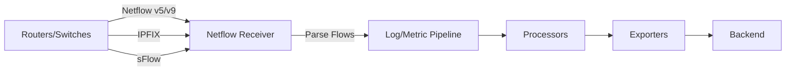

# How to Configure the Netflow Receiver in the OpenTelemetry Collector

Author: [nawazdhandala](https://www.github.com/nawazdhandala)

Tags: OpenTelemetry, Collector, Netflow, Network Monitoring, IPFIX, sFlow

Description: Learn how to configure the Netflow Receiver in the OpenTelemetry Collector to collect and analyze network flow data from routers and switches.

---

The Netflow Receiver collects network flow data from routers, switches, and other network devices that export flow information. It supports Netflow v5, v9, IPFIX, and sFlow protocols, converting network flow records into OpenTelemetry logs and metrics for traffic analysis, security monitoring, and capacity planning.

For more on network observability, see our guide on [network monitoring with OpenTelemetry](https://oneuptime.com/blog/post/network-monitoring-opentelemetry/view).

## What is the Netflow Receiver?

The Netflow Receiver listens for network flow data exported by network devices and converts flow records into OpenTelemetry telemetry. Flow data provides detailed information about network traffic, including source/destination IPs, ports, protocols, packet counts, and byte volumes.



Key capabilities:
- Collect Netflow v5, v9, and IPFIX flows
- Support sFlow sampling
- Extract traffic patterns and volumes
- Identify top talkers and applications
- Detect anomalies and security threats

## Basic Configuration

Start with a simple configuration to receive Netflow v5 data.

```yaml
receivers:
  netflow:
    # UDP endpoint to listen for flow data
    endpoint: 0.0.0.0:2055

    # Protocol version (netflow5, netflow9, ipfix, sflow)
    protocol: netflow5

exporters:
  debug:
    verbosity: detailed

service:
  pipelines:
    logs:
      receivers: [netflow]
      exporters: [debug]
```

Configure your router or switch to export Netflow to the collector's IP address and port 2055.

## Protocol Support

Configure the receiver for different flow protocols.

### Netflow v5

Netflow v5 is the most widely supported legacy version.

```yaml
receivers:
  netflow/v5:
    endpoint: 0.0.0.0:2055
    protocol: netflow5

    # Optional: Specify network address translation
    # Maps private IPs to public IPs if needed
```

**Netflow v5 Fields:**
- Source/destination IP and port
- Protocol (TCP, UDP, ICMP)
- Packet and byte counts
- Input/output interface indices
- Next hop IP
- TCP flags

### Netflow v9

Netflow v9 uses templates for flexible field definitions.

```yaml
receivers:
  netflow/v9:
    endpoint: 0.0.0.0:2055
    protocol: netflow9

    # Template cache timeout
    template_cache_ttl: 1h
```

**Netflow v9 Advantages:**
- Extensible template system
- Support for IPv6
- Variable-length fields
- Custom fields

### IPFIX

IPFIX is the IETF standard based on Netflow v9.

```yaml
receivers:
  netflow/ipfix:
    endpoint: 0.0.0.0:4739  # Standard IPFIX port
    protocol: ipfix

    # Template cache for IPFIX templates
    template_cache_ttl: 1h
```

IPFIX provides the same features as Netflow v9 with standardized field definitions.

### sFlow

sFlow uses packet sampling for high-speed networks.

```yaml
receivers:
  netflow/sflow:
    endpoint: 0.0.0.0:6343  # Standard sFlow port
    protocol: sflow

    # sFlow samples packets rather than flows
```

**sFlow Characteristics:**
- Packet-based sampling
- Lower CPU overhead on network devices
- Includes Layer 2 information
- Counter samples for interface statistics

## Multi-Protocol Configuration

Receive multiple flow protocols simultaneously.

```yaml
receivers:
  # Netflow v5 on port 2055
  netflow/v5:
    endpoint: 0.0.0.0:2055
    protocol: netflow5

  # Netflow v9 on port 9996
  netflow/v9:
    endpoint: 0.0.0.0:9996
    protocol: netflow9

  # IPFIX on standard port
  netflow/ipfix:
    endpoint: 0.0.0.0:4739
    protocol: ipfix

  # sFlow on standard port
  netflow/sflow:
    endpoint: 0.0.0.0:6343
    protocol: sflow

processors:
  # Tag flows by protocol
  transform/protocol:
    log_statements:
      - context: log
        statements:
          - set(attributes["flow.protocol"], "netflow5") where resource.attributes["receiver"] == "netflow/v5"
          - set(attributes["flow.protocol"], "netflow9") where resource.attributes["receiver"] == "netflow/v9"
          - set(attributes["flow.protocol"], "ipfix") where resource.attributes["receiver"] == "netflow/ipfix"
          - set(attributes["flow.protocol"], "sflow") where resource.attributes["receiver"] == "netflow/sflow"

exporters:
  otlp:
    endpoint: ${env:OTEL_EXPORTER_OTLP_ENDPOINT}

service:
  pipelines:
    logs:
      receivers: [netflow/v5, netflow/v9, netflow/ipfix, netflow/sflow]
      processors: [transform/protocol]
      exporters: [otlp]
```

## Flow Data Processing

Extract and enrich flow data.

### Basic Flow Attributes

```yaml
receivers:
  netflow:
    endpoint: 0.0.0.0:2055
    protocol: netflow9

processors:
  # Extract flow attributes
  transform/flows:
    log_statements:
      - context: log
        statements:
          # Network layer
          - set(attributes["net.src.ip"], body["src_addr"]) where body["src_addr"] != nil
          - set(attributes["net.dst.ip"], body["dst_addr"]) where body["dst_addr"] != nil
          - set(attributes["net.protocol"], body["protocol"]) where body["protocol"] != nil

          # Transport layer
          - set(attributes["net.src.port"], body["src_port"]) where body["src_port"] != nil
          - set(attributes["net.dst.port"], body["dst_port"]) where body["dst_port"] != nil

          # Counters
          - set(attributes["net.bytes"], body["in_bytes"]) where body["in_bytes"] != nil
          - set(attributes["net.packets"], body["in_pkts"]) where body["in_pkts"] != nil

          # Device info
          - set(attributes["net.device.ip"], body["exporter_addr"]) where body["exporter_addr"] != nil

exporters:
  otlp:
    endpoint: ${env:OTEL_EXPORTER_OTLP_ENDPOINT}

service:
  pipelines:
    logs:
      receivers: [netflow]
      processors: [transform/flows]
      exporters: [otlp]
```

### Protocol Classification

```yaml
processors:
  transform/protocol_classification:
    log_statements:
      - context: log
        statements:
          # Classify by protocol number
          - set(attributes["net.protocol.name"], "ICMP") where attributes["net.protocol"] == 1
          - set(attributes["net.protocol.name"], "TCP") where attributes["net.protocol"] == 6
          - set(attributes["net.protocol.name"], "UDP") where attributes["net.protocol"] == 17
          - set(attributes["net.protocol.name"], "GRE") where attributes["net.protocol"] == 47
          - set(attributes["net.protocol.name"], "ESP") where attributes["net.protocol"] == 50
          - set(attributes["net.protocol.name"], "AH") where attributes["net.protocol"] == 51

          # Classify common applications by port
          - set(attributes["net.application"], "HTTP") where attributes["net.dst.port"] == 80 or attributes["net.dst.port"] == 8080
          - set(attributes["net.application"], "HTTPS") where attributes["net.dst.port"] == 443
          - set(attributes["net.application"], "DNS") where attributes["net.dst.port"] == 53
          - set(attributes["net.application"], "SSH") where attributes["net.dst.port"] == 22
          - set(attributes["net.application"], "FTP") where attributes["net.dst.port"] == 21
          - set(attributes["net.application"], "SMTP") where attributes["net.dst.port"] == 25 or attributes["net.dst.port"] == 587
          - set(attributes["net.application"], "MySQL") where attributes["net.dst.port"] == 3306
          - set(attributes["net.application"], "PostgreSQL") where attributes["net.dst.port"] == 5432
          - set(attributes["net.application"], "Redis") where attributes["net.dst.port"] == 6379

service:
  pipelines:
    logs:
      receivers: [netflow]
      processors: [transform/flows, transform/protocol_classification]
      exporters: [otlp]
```

### Direction Classification

```yaml
processors:
  transform/direction:
    log_statements:
      - context: log
        statements:
          # Internal networks (adjust for your network)
          - set(attributes["net.src.internal"], true) where IsMatch(attributes["net.src.ip"], "^10\\.") or IsMatch(attributes["net.src.ip"], "^192\\.168\\.") or IsMatch(attributes["net.src.ip"], "^172\\.(1[6-9]|2[0-9]|3[01])\\.")
          - set(attributes["net.src.internal"], false) where attributes["net.src.internal"] == nil

          - set(attributes["net.dst.internal"], true) where IsMatch(attributes["net.dst.ip"], "^10\\.") or IsMatch(attributes["net.dst.ip"], "^192\\.168\\.") or IsMatch(attributes["net.dst.ip"], "^172\\.(1[6-9]|2[0-9]|3[01])\\.")
          - set(attributes["net.dst.internal"], false) where attributes["net.dst.internal"] == nil

          # Classify direction
          - set(attributes["net.direction"], "internal") where attributes["net.src.internal"] == true and attributes["net.dst.internal"] == true
          - set(attributes["net.direction"], "outbound") where attributes["net.src.internal"] == true and attributes["net.dst.internal"] == false
          - set(attributes["net.direction"], "inbound") where attributes["net.src.internal"] == false and attributes["net.dst.internal"] == true
          - set(attributes["net.direction"], "external") where attributes["net.src.internal"] == false and attributes["net.dst.internal"] == false

service:
  pipelines:
    logs:
      receivers: [netflow]
      processors: [transform/flows, transform/direction]
      exporters: [otlp]
```

## Metrics Generation

Convert flow data to metrics for analysis.

### Traffic Volume Metrics

```yaml
receivers:
  netflow:
    endpoint: 0.0.0.0:2055
    protocol: netflow9

processors:
  # Convert flows to metrics
  transform/metrics:
    log_statements:
      - context: log
        statements:
          # Extract byte count as metric value
          - set(attributes["metric.bytes"], body["in_bytes"]) where body["in_bytes"] != nil
          - set(attributes["metric.packets"], body["in_pkts"]) where body["in_pkts"] != nil

  # Aggregate by source IP
  groupbyattrs:
    keys:
      - net.src.ip
      - net.dst.ip
      - net.protocol.name

exporters:
  otlp:
    endpoint: ${env:OTEL_EXPORTER_OTLP_ENDPOINT}

  # Prometheus for metrics
  prometheus:
    endpoint: 0.0.0.0:9090
    namespace: netflow

service:
  pipelines:
    logs:
      receivers: [netflow]
      processors: [transform/flows, transform/metrics, groupbyattrs]
      exporters: [otlp, prometheus]
```

### Top Talkers

```yaml
processors:
  # Identify top talkers
  transform/top_talkers:
    log_statements:
      - context: log
        statements:
          # Create composite key for talker pair
          - set(attributes["talker.pair"], Concat([attributes["net.src.ip"], "->", attributes["net.dst.ip"]], "")) where attributes["net.src.ip"] != nil and attributes["net.dst.ip"] != nil

          # Track bytes
          - set(attributes["talker.bytes"], attributes["net.bytes"]) where attributes["net.bytes"] != nil

  # Group by talker pair
  groupbyattrs:
    keys:
      - talker.pair
      - net.protocol.name

service:
  pipelines:
    logs:
      receivers: [netflow]
      processors: [transform/flows, transform/top_talkers, groupbyattrs]
      exporters: [otlp]
```

## Security Monitoring

Use flow data to detect security threats.

### Port Scan Detection

```yaml
processors:
  # Detect potential port scans
  filter/port_scans:
    logs:
      log_record:
        # TCP SYN packets without ACK (potential scan)
        - attributes["net.protocol"] == 6 and attributes["tcp.flags.syn"] == true and attributes["tcp.flags.ack"] == false

  transform/port_scans:
    log_statements:
      - context: log
        statements:
          - set(attributes["security.event"], "potential_port_scan")
          - set(attributes["security.scanner.ip"], attributes["net.src.ip"])
          - set(attributes["security.target.ip"], attributes["net.dst.ip"])
          - set(attributes["security.target.port"], attributes["net.dst.port"])
          - set(severity_text, "WARN")

service:
  pipelines:
    logs/security:
      receivers: [netflow]
      processors: [transform/flows, filter/port_scans, transform/port_scans]
      exporters: [otlp]
```

### DDoS Detection

```yaml
processors:
  # Detect potential DDoS attacks
  transform/ddos:
    log_statements:
      - context: log
        statements:
          # Flag high packet rate flows
          - set(attributes["security.high_packet_rate"], true) where attributes["net.packets"] != nil and attributes["net.packets"] > 10000

          # Flag suspicious protocols
          - set(attributes["security.suspicious_protocol"], true) where attributes["net.protocol"] == 1 and attributes["net.packets"] > 1000  # ICMP flood

  filter/ddos:
    logs:
      log_record:
        - attributes["security.high_packet_rate"] == true or attributes["security.suspicious_protocol"] == true

  transform/ddos_alert:
    log_statements:
      - context: log
        statements:
          - set(attributes["security.event"], "potential_ddos")
          - set(attributes["security.target.ip"], attributes["net.dst.ip"])
          - set(severity_text, "ERROR")

service:
  pipelines:
    logs/security:
      receivers: [netflow]
      processors: [transform/flows, transform/ddos, filter/ddos, transform/ddos_alert]
      exporters: [otlp]
```

### Anomaly Detection

```yaml
processors:
  # Detect anomalous traffic patterns
  transform/anomalies:
    log_statements:
      - context: log
        statements:
          # Flag unusually large flows
          - set(attributes["anomaly.large_flow"], true) where attributes["net.bytes"] != nil and attributes["net.bytes"] > 100000000  # 100MB

          # Flag unusual port usage
          - set(attributes["anomaly.high_port"], true) where attributes["net.dst.port"] != nil and attributes["net.dst.port"] > 49152  # Ephemeral ports

          # Flag non-standard protocols
          - set(attributes["anomaly.uncommon_protocol"], true) where attributes["net.protocol"] != 1 and attributes["net.protocol"] != 6 and attributes["net.protocol"] != 17

  filter/anomalies:
    logs:
      log_record:
        - attributes["anomaly.large_flow"] == true or attributes["anomaly.high_port"] == true or attributes["anomaly.uncommon_protocol"] == true

service:
  pipelines:
    logs/anomalies:
      receivers: [netflow]
      processors: [transform/flows, transform/anomalies, filter/anomalies]
      exporters: [otlp]
```

## GeoIP Enrichment

Enrich flow data with geographic information.

```yaml
processors:
  # Enrich with GeoIP data (requires GeoIP database)
  transform/geoip:
    log_statements:
      - context: log
        statements:
          # Placeholder for GeoIP lookup
          # In practice, use external GeoIP service or database

          # Example: Set country for known IP ranges
          - set(attributes["net.src.country"], "US") where IsMatch(attributes["net.src.ip"], "^8\\.8\\.8\\.")
          - set(attributes["net.dst.country"], "US") where IsMatch(attributes["net.dst.ip"], "^8\\.8\\.8\\.")

          # Flag international traffic
          - set(attributes["net.international"], true) where attributes["net.src.country"] != attributes["net.dst.country"]

service:
  pipelines:
    logs:
      receivers: [netflow]
      processors: [transform/flows, transform/geoip]
      exporters: [otlp]
```

## Resource Attributes

Add contextual information to flow data.

```yaml
receivers:
  netflow:
    endpoint: 0.0.0.0:2055
    protocol: netflow9

processors:
  # Add resource attributes
  resource/netflow:
    attributes:
      - key: source
        value: netflow
        action: upsert
      - key: network.name
        value: ${env:NETWORK_NAME}
        action: upsert
      - key: datacenter
        value: ${env:DATACENTER}
        action: upsert
      - key: collector.name
        value: ${env:HOSTNAME}
        action: upsert

exporters:
  otlp:
    endpoint: ${env:OTEL_EXPORTER_OTLP_ENDPOINT}

service:
  pipelines:
    logs:
      receivers: [netflow]
      processors: [resource/netflow, transform/flows]
      exporters: [otlp]
```

## Complete Production Example

Full configuration for comprehensive network monitoring.

```yaml
receivers:
  # Netflow v9 from routers
  netflow/v9:
    endpoint: 0.0.0.0:2055
    protocol: netflow9
    template_cache_ttl: 1h

  # IPFIX from switches
  netflow/ipfix:
    endpoint: 0.0.0.0:4739
    protocol: ipfix
    template_cache_ttl: 1h

  # sFlow for high-speed sampling
  netflow/sflow:
    endpoint: 0.0.0.0:6343
    protocol: sflow

processors:
  # Extract flow attributes
  transform/flows:
    log_statements:
      - context: log
        statements:
          # Network layer
          - set(attributes["net.src.ip"], body["src_addr"]) where body["src_addr"] != nil
          - set(attributes["net.dst.ip"], body["dst_addr"]) where body["dst_addr"] != nil
          - set(attributes["net.protocol"], body["protocol"]) where body["protocol"] != nil

          # Transport layer
          - set(attributes["net.src.port"], body["src_port"]) where body["src_port"] != nil
          - set(attributes["net.dst.port"], body["dst_port"]) where body["dst_port"] != nil

          # Counters
          - set(attributes["net.bytes"], body["in_bytes"]) where body["in_bytes"] != nil
          - set(attributes["net.packets"], body["in_pkts"]) where body["in_pkts"] != nil

          # Device
          - set(attributes["net.device.ip"], body["exporter_addr"]) where body["exporter_addr"] != nil

  # Classify protocols
  transform/classify:
    log_statements:
      - context: log
        statements:
          # Protocol names
          - set(attributes["net.protocol.name"], "TCP") where attributes["net.protocol"] == 6
          - set(attributes["net.protocol.name"], "UDP") where attributes["net.protocol"] == 17
          - set(attributes["net.protocol.name"], "ICMP") where attributes["net.protocol"] == 1

          # Applications
          - set(attributes["net.application"], "HTTPS") where attributes["net.dst.port"] == 443
          - set(attributes["net.application"], "HTTP") where attributes["net.dst.port"] == 80
          - set(attributes["net.application"], "DNS") where attributes["net.dst.port"] == 53
          - set(attributes["net.application"], "SSH") where attributes["net.dst.port"] == 22

          # Direction
          - set(attributes["net.src.internal"], true) where IsMatch(attributes["net.src.ip"], "^10\\.")
          - set(attributes["net.dst.internal"], true) where IsMatch(attributes["net.dst.ip"], "^10\\.")
          - set(attributes["net.direction"], "internal") where attributes["net.src.internal"] == true and attributes["net.dst.internal"] == true
          - set(attributes["net.direction"], "outbound") where attributes["net.src.internal"] == true and attributes["net.dst.internal"] != true
          - set(attributes["net.direction"], "inbound") where attributes["net.src.internal"] != true and attributes["net.dst.internal"] == true

  # Security detection
  transform/security:
    log_statements:
      - context: log
        statements:
          # Flag high packet rate
          - set(attributes["security.high_rate"], true) where attributes["net.packets"] != nil and attributes["net.packets"] > 10000

          # Flag large flows
          - set(attributes["security.large_flow"], true) where attributes["net.bytes"] != nil and attributes["net.bytes"] > 100000000

  # Add resource attributes
  resource/netflow:
    attributes:
      - key: source
        value: netflow
        action: upsert
      - key: network.name
        value: ${env:NETWORK_NAME}
        action: upsert
      - key: datacenter
        value: ${env:DATACENTER}
        action: upsert

  # Batch processing
  batch:
    timeout: 10s
    send_batch_size: 1000

exporters:
  # Send to OTLP backend
  otlp:
    endpoint: ${env:OTEL_EXPORTER_OTLP_ENDPOINT}
    headers:
      authorization: Bearer ${env:OTEL_AUTH_TOKEN}
    compression: gzip

  # Prometheus metrics
  prometheus:
    endpoint: 0.0.0.0:9090
    namespace: netflow
    const_labels:
      datacenter: ${env:DATACENTER}

extensions:
  health_check:
    endpoint: 0.0.0.0:13133

service:
  extensions: [health_check]

  pipelines:
    # Main flow pipeline
    logs:
      receivers: [netflow/v9, netflow/ipfix, netflow/sflow]
      processors:
        - transform/flows
        - transform/classify
        - transform/security
        - resource/netflow
        - batch
      exporters: [otlp, prometheus]

  telemetry:
    logs:
      level: info
      encoding: json
    metrics:
      address: 0.0.0.0:8888
```

## Router Configuration Examples

Configure network devices to export flow data.

### Cisco Router (Netflow v9)

```
! Enable Netflow on interface
interface GigabitEthernet0/0
 ip flow ingress
 ip flow egress

! Configure Netflow export
ip flow-export version 9
ip flow-export destination 192.168.1.100 2055
ip flow-export source GigabitEthernet0/0
```

### Juniper Router (IPFIX)

```
set forwarding-options sampling instance netflow-instance
set forwarding-options sampling instance netflow-instance input rate 100
set forwarding-options sampling instance netflow-instance family inet output flow-server 192.168.1.100 port 4739
set forwarding-options sampling instance netflow-instance family inet output flow-server 192.168.1.100 version-ipfix template ipfix-template
```

## Summary

| Feature | Configuration |
|---------|--------------|
| **Protocols** | Netflow v5/v9, IPFIX, sFlow |
| **Processing** | Protocol classification, direction analysis |
| **Security** | Port scan, DDoS, anomaly detection |
| **Metrics** | Traffic volume, top talkers, application usage |
| **Enrichment** | GeoIP, internal/external classification |
| **Use Cases** | Traffic analysis, capacity planning, security monitoring |

The Netflow Receiver enables comprehensive network traffic analysis by collecting flow data from routers and switches. By processing network flows, you can identify traffic patterns, detect security threats, perform capacity planning, and troubleshoot network issues. Combined with transform processors and security filters, you can build powerful network monitoring and security solutions.

For more on network monitoring, see our guides on [SNMP receiver](https://oneuptime.com/blog/post/2026-02-06-snmp-receiver-opentelemetry-collector/view) and [network metrics](https://oneuptime.com/blog/post/network-metrics-opentelemetry/view).
