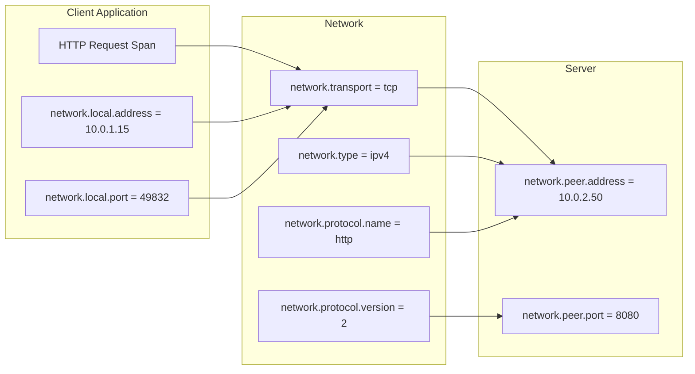
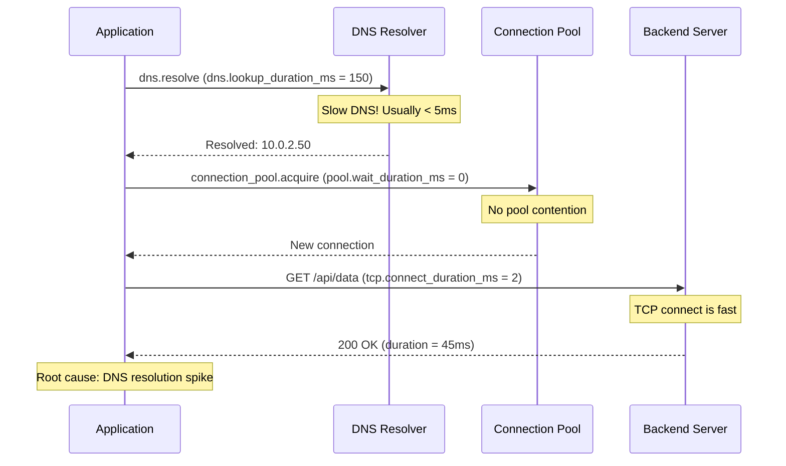

# How to Use Network Semantic Conventions for Connection Tracing

Author: [nawazdhandala](https://www.github.com/nawazdhandala)

Tags: OpenTelemetry, Networking, Semantic Conventions, Observability, Tracing, TCP, DNS, Connection Pooling

Description: Learn how to use OpenTelemetry network semantic conventions to trace TCP connections, DNS resolution, and network-level issues across distributed systems.

---

## Introduction

When a distributed system slows down, the network is often the first suspect. But diagnosing network issues from application-level telemetry alone is difficult. You see high latency on an HTTP span, but you cannot tell whether the time was spent in DNS resolution, TCP handshake, TLS negotiation, or waiting for an available connection from the pool.

OpenTelemetry's network semantic conventions solve this by defining standard attributes for network-level details. These attributes let you attach connection metadata to your spans, enabling you to trace issues from the application layer down to the transport layer.

This guide covers the network semantic convention attributes, shows you how to capture them in your code, and demonstrates how to use them for diagnosing real-world network problems.

## Network Semantic Convention Attributes

The network semantic conventions are organized into several groups that cover different aspects of network communication.

### General Network Attributes

These attributes describe the network transport and protocol.

| Attribute | Type | Description |
|-----------|------|-------------|
| `network.transport` | string | The transport protocol (tcp, udp, pipe, unix) |
| `network.type` | string | The network layer protocol (ipv4, ipv6) |
| `network.protocol.name` | string | The application protocol (http, amqp, mqtt) |
| `network.protocol.version` | string | The protocol version (1.1, 2, 3) |

### Peer and Local Connection Attributes

These attributes identify the endpoints of a network connection.

| Attribute | Type | Description |
|-----------|------|-------------|
| `network.peer.address` | string | Peer address (IP or hostname) |
| `network.peer.port` | int | Peer port number |
| `network.local.address` | string | Local address |
| `network.local.port` | int | Local port number |

### Connection State Attributes

| Attribute | Type | Description |
|-----------|------|-------------|
| `network.connection.type` | string | The internet connection type (wifi, wired, cell) |
| `network.connection.subtype` | string | The connection subtype (lte, 5g) |
| `network.carrier.name` | string | The carrier name (for mobile) |



## Capturing Network Attributes in HTTP Clients

Most HTTP client libraries in the OpenTelemetry instrumentation ecosystem capture basic network attributes automatically. However, understanding how to add them manually helps when you need more detail or are working with custom clients.

This Python example wraps a socket connection to capture network-level details and attach them to the current span. It records the local and peer addresses, the transport protocol, and measures the connection time:

```python
# Capturing network-level attributes during an HTTP request.
# This wrapper records the local and peer socket addresses,
# transport protocol, and connection timing on the current span.
import socket
import time
from opentelemetry import trace

tracer = trace.get_tracer("network-demo")

def make_request_with_network_attrs(host, port, path):
    with tracer.start_as_current_span(
        f"GET {path}",
        kind=trace.SpanKind.CLIENT,
    ) as span:
        # Set the network protocol attributes
        span.set_attribute("network.transport", "tcp")
        span.set_attribute("network.protocol.name", "http")
        span.set_attribute("network.protocol.version", "1.1")

        # Record DNS resolution time
        dns_start = time.monotonic()
        addr_info = socket.getaddrinfo(host, port, socket.AF_UNSPEC,
                                        socket.SOCK_STREAM)
        dns_duration = time.monotonic() - dns_start
        span.set_attribute("dns.lookup_duration_ms",
                          round(dns_duration * 1000, 2))

        # Use the first resolved address
        family, socktype, proto, canonname, sockaddr = addr_info[0]
        resolved_ip = sockaddr[0]

        # Set the network type based on address family
        if family == socket.AF_INET:
            span.set_attribute("network.type", "ipv4")
        elif family == socket.AF_INET6:
            span.set_attribute("network.type", "ipv6")

        # Set peer attributes
        span.set_attribute("network.peer.address", resolved_ip)
        span.set_attribute("network.peer.port", port)

        # Create the TCP connection and record timing
        sock = socket.socket(family, socktype, proto)
        connect_start = time.monotonic()
        sock.connect(sockaddr)
        connect_duration = time.monotonic() - connect_start
        span.set_attribute("tcp.connect_duration_ms",
                          round(connect_duration * 1000, 2))

        # Record local address after connection
        local_addr = sock.getsockname()
        span.set_attribute("network.local.address", local_addr[0])
        span.set_attribute("network.local.port", local_addr[1])

        # Send the request
        request = f"GET {path} HTTP/1.1\r\nHost: {host}\r\n\r\n"
        sock.sendall(request.encode())

        # Read the response
        response = sock.recv(4096)
        sock.close()

        return response
```

This level of detail is not needed for every request. But when you are debugging a connection issue, having DNS resolution time and TCP connection time as separate measurements on the span makes the difference between a quick diagnosis and hours of guessing.

## Tracing Connection Pool Behavior

Connection pools are a critical part of network performance, and they are often a source of latency that is hard to diagnose. By adding network attributes to connection pool operations, you can see how long requests wait for available connections.

The following Python class wraps a connection pool and records network-related metrics on each acquisition. It tracks pool utilization, wait time, and whether a new connection was created or an existing one was reused:

```python
# Connection pool wrapper that records network attributes.
# Each connection acquisition creates a child span with
# pool utilization and connection reuse information.
import queue
import time
from opentelemetry import trace

tracer = trace.get_tracer("connection-pool")

class InstrumentedConnectionPool:
    def __init__(self, host, port, max_connections=10):
        self.host = host
        self.port = port
        self.max_connections = max_connections
        self._pool = queue.Queue(maxsize=max_connections)
        self._active_count = 0

    def acquire(self, timeout=30):
        with tracer.start_as_current_span(
            "connection_pool.acquire",
            kind=trace.SpanKind.INTERNAL,
        ) as span:
            span.set_attribute("network.peer.address", self.host)
            span.set_attribute("network.peer.port", self.port)
            span.set_attribute("network.transport", "tcp")
            span.set_attribute("pool.max_connections", self.max_connections)
            span.set_attribute("pool.active_connections", self._active_count)

            wait_start = time.monotonic()

            try:
                # Try to get an existing connection
                conn = self._pool.get_nowait()
                wait_duration = time.monotonic() - wait_start
                span.set_attribute("pool.wait_duration_ms",
                                  round(wait_duration * 1000, 2))
                span.set_attribute("pool.connection_reused", True)

            except queue.Empty:
                if self._active_count < self.max_connections:
                    # Create a new connection
                    conn = self._create_connection(span)
                    span.set_attribute("pool.connection_reused", False)
                else:
                    # Wait for a connection to be returned
                    span.add_event("pool.waiting",
                                  attributes={"pool.active_connections":
                                              self._active_count})
                    conn = self._pool.get(timeout=timeout)
                    wait_duration = time.monotonic() - wait_start
                    span.set_attribute("pool.wait_duration_ms",
                                      round(wait_duration * 1000, 2))
                    span.set_attribute("pool.connection_reused", True)

            self._active_count += 1
            span.set_attribute("pool.active_after_acquire",
                              self._active_count)
            return conn

    def _create_connection(self, span):
        """Create a new TCP connection with timing."""
        import socket
        connect_start = time.monotonic()
        sock = socket.create_connection(
            (self.host, self.port), timeout=10
        )
        connect_duration = time.monotonic() - connect_start
        span.set_attribute("tcp.connect_duration_ms",
                          round(connect_duration * 1000, 2))

        local_addr = sock.getsockname()
        span.set_attribute("network.local.address", local_addr[0])
        span.set_attribute("network.local.port", local_addr[1])

        return sock
```

When requests queue up waiting for connections, the `pool.wait_duration_ms` attribute will show the delay. This tells you whether latency is caused by the network itself or by pool exhaustion.

## DNS Resolution Tracing

DNS resolution is a common source of intermittent latency. By creating dedicated spans for DNS lookups, you can track resolution time and identify slow or failing DNS servers.

This utility function creates a child span for DNS resolution and records the results, including all resolved addresses and the address family. It helps you catch DNS issues that would otherwise be invisible in your traces:

```python
# DNS resolution with full tracing.
# A dedicated span captures resolution time, all resolved
# addresses, and the selected address family.
import socket
import time
from opentelemetry import trace

tracer = trace.get_tracer("dns-resolver")

def traced_dns_resolve(hostname, port=443):
    with tracer.start_as_current_span(
        "dns.resolve",
        kind=trace.SpanKind.INTERNAL,
    ) as span:
        span.set_attribute("dns.hostname", hostname)
        span.set_attribute("network.peer.port", port)

        start = time.monotonic()
        try:
            results = socket.getaddrinfo(
                hostname, port,
                socket.AF_UNSPEC, socket.SOCK_STREAM
            )
            duration = time.monotonic() - start

            span.set_attribute("dns.lookup_duration_ms",
                              round(duration * 1000, 2))
            span.set_attribute("dns.result_count", len(results))

            # Record all resolved addresses
            addresses = [r[4][0] for r in results]
            unique_addresses = list(set(addresses))
            span.set_attribute("dns.resolved_addresses",
                              unique_addresses)

            # Determine if IPv4 or IPv6
            families = set(r[0] for r in results)
            if socket.AF_INET in families:
                span.set_attribute("network.type", "ipv4")
            if socket.AF_INET6 in families:
                span.set_attribute("dns.has_ipv6", True)

            return results

        except socket.gaierror as e:
            duration = time.monotonic() - start
            span.set_attribute("dns.lookup_duration_ms",
                              round(duration * 1000, 2))
            span.record_exception(e)
            span.set_status(trace.StatusCode.ERROR,
                          f"DNS resolution failed: {str(e)}")
            raise
```

## Debugging Network Issues with Traces

Let's look at how network semantic conventions help during an actual incident. Suppose you see high P99 latency on an API endpoint. The trace shows a slow HTTP client span, but why is it slow?



With network attributes on your spans, you can immediately see that DNS resolution took 150ms instead of the usual 5ms. Without these attributes, you would only see a slow HTTP span and would have to guess where the time went.

You can build alerts based on these attributes too. If `dns.lookup_duration_ms` exceeds a threshold, or if `pool.wait_duration_ms` indicates pool exhaustion, you get notified before the problem affects users at scale.

## Best Practices

Always set `network.transport` and `network.protocol.name` on client spans. These two attributes provide the minimum network context needed for basic troubleshooting.

Record `network.peer.address` and `network.peer.port` on every outbound connection span. When a service talks to multiple backends, these attributes let you filter traces by destination.

Create separate child spans for DNS resolution and TCP connection when you need to diagnose latency breakdowns. In normal operations, the overhead is negligible, but the diagnostic value during incidents is high.

Track connection pool metrics as span attributes. Pool exhaustion is one of the most common causes of latency in microservices, and it is invisible without explicit instrumentation.

Use the Collector's `resourcedetection` processor to add host-level network information. This provides context that individual applications cannot easily discover about their own network environment.

## Conclusion

Network semantic conventions extend your observability from the application layer down to the transport layer. By capturing DNS resolution time, TCP connection details, pool behavior, and peer addresses as standardized span attributes, you eliminate the guesswork from network troubleshooting. When the next latency spike hits, you will be able to pinpoint whether the problem is DNS, connection pooling, the network itself, or the remote server, all from your trace data.
