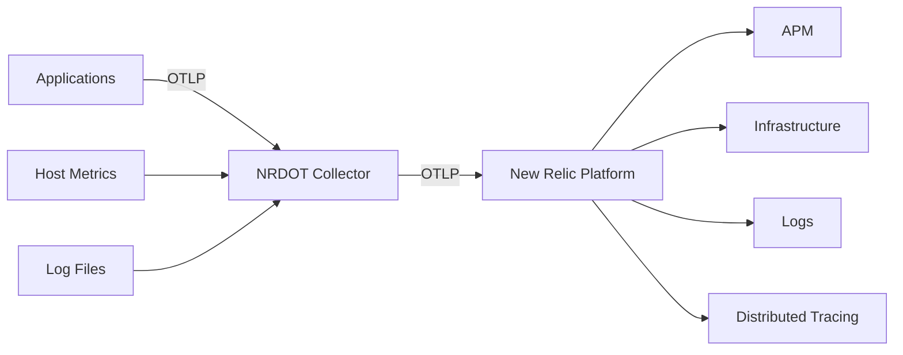

# How to Use New Relic Distribution (NRDOT) of OpenTelemetry Collector

Author: [nawazdhandala](https://www.github.com/nawazdhandala)

Tags: OpenTelemetry, New Relic, NRDOT, Observability, Monitoring, APM

Description: Practical guide to setting up the New Relic Distribution of OpenTelemetry Collector with configuration examples for all signal types.

---

New Relic has been one of the strongest advocates for OpenTelemetry in the observability space. Their distribution of the OpenTelemetry Collector, called NRDOT (New Relic Distribution of OpenTelemetry), is designed to make it easy to send telemetry data to New Relic's platform using the standard OTel pipeline.

New Relic also accepts OTLP data natively on their endpoints, so you can use the upstream collector too. But NRDOT adds pre-configured defaults, host monitoring recipes, and New Relic-specific optimizations that reduce the setup work. Let's walk through how it works.

## What NRDOT Includes

NRDOT bundles the upstream OTel Collector with these additions:

- Pre-configured OTLP exporter pointed at New Relic endpoints
- Host metrics collection with New Relic-compatible attribute mapping
- Supervised mode that pulls configuration from New Relic's control plane
- Opinionated defaults for batching, retry, and memory limits



## Installing NRDOT

### Linux Installation

New Relic provides an installer script:

```bash
# Download and install NRDOT on Linux
# This sets up the collector as a systemd service
curl -Ls https://download.newrelic.com/install/newrelic-cli/scripts/install.sh | bash

# Or download the collector package directly
curl -L -o nrdot-collector.deb \
  https://download.newrelic.com/otel/nrdot-collector/releases/latest/nrdot-collector_amd64.deb
sudo dpkg -i nrdot-collector.deb
```

### Docker

Run NRDOT in a container:

```bash
# Run NRDOT with New Relic license key
docker run -d \
  --name nrdot-collector \
  -e NEW_RELIC_LICENSE_KEY=your-license-key \
  -e NEW_RELIC_OTLP_ENDPOINT=https://otlp.nr-data.net \
  -p 4317:4317 \
  -p 4318:4318 \
  -v ./nrdot-config.yaml:/etc/otelcol/config.yaml \
  newrelic/nrdot-collector:latest \
  --config /etc/otelcol/config.yaml
```

### Kubernetes with Helm

Deploy on Kubernetes:

```bash
# Add the New Relic Helm repository
helm repo add newrelic https://helm-charts.newrelic.com
helm repo update

# Install NRDOT on your cluster
helm install nrdot-collector newrelic/nrdot-collector \
  --namespace monitoring \
  --create-namespace \
  --set licenseKey=your-license-key \
  --set cluster=my-cluster-name
```

## Basic Configuration

Here is a configuration that sends traces, metrics, and logs to New Relic:

```yaml
# NRDOT Collector configuration
# All signal types routed to New Relic via OTLP

receivers:
  # Accept OTLP from instrumented applications
  otlp:
    protocols:
      grpc:
        endpoint: 0.0.0.0:4317
      http:
        endpoint: 0.0.0.0:4318

processors:
  # Batch telemetry for efficient export
  batch:
    timeout: 5s
    send_batch_size: 1000

  # Limit memory usage
  memory_limiter:
    check_interval: 1s
    limit_mib: 400
    spike_limit_mib: 100

  # Add environment metadata to all telemetry
  resource:
    attributes:
      - key: deployment.environment
        value: production
        action: upsert
      - key: service.instance.id
        from_attribute: host.name
        action: upsert

  # Detect host and cloud provider resources
  resourcedetection:
    detectors: [system, env, ec2, gcp, azure, docker]
    override: false

exporters:
  # Send data to New Relic using OTLP
  # New Relic accepts OTLP natively on their endpoints
  otlphttp/newrelic:
    endpoint: https://otlp.nr-data.net
    headers:
      # New Relic uses the license key as the API key header
      api-key: "${NEW_RELIC_LICENSE_KEY}"

service:
  pipelines:
    traces:
      receivers: [otlp]
      processors: [memory_limiter, resourcedetection, resource, batch]
      exporters: [otlphttp/newrelic]
    metrics:
      receivers: [otlp]
      processors: [memory_limiter, resourcedetection, resource, batch]
      exporters: [otlphttp/newrelic]
    logs:
      receivers: [otlp]
      processors: [memory_limiter, resourcedetection, resource, batch]
      exporters: [otlphttp/newrelic]
```

## Host Monitoring Configuration

NRDOT can replace the New Relic Infrastructure Agent for host monitoring. Here is the config for that:

```yaml
receivers:
  # Collect host-level metrics
  hostmetrics:
    collection_interval: 15s
    scrapers:
      cpu:
        metrics:
          system.cpu.utilization:
            enabled: true
      memory:
        metrics:
          system.memory.utilization:
            enabled: true
      disk:
      filesystem:
      network:
      load:
      paging:
      processes:

  # Collect process-level metrics
  hostmetrics/process:
    collection_interval: 15s
    scrapers:
      process:
        include:
          match_type: regexp
          names: [".*"]
        metrics:
          process.cpu.utilization:
            enabled: true
          process.memory.utilization:
            enabled: true

processors:
  batch:
    timeout: 10s

  # Map host metrics to New Relic's expected format
  resourcedetection:
    detectors: [system, env]
    system:
      hostname_sources: ["os"]
      resource_attributes:
        host.id:
          enabled: true
        host.name:
          enabled: true
        os.type:
          enabled: true

  # Cumulative-to-delta conversion for certain metrics
  # New Relic prefers delta temporality for some metric types
  cumulativetodelta:
    include:
      metrics:
        - system.cpu.time
        - system.disk.io
        - system.disk.operations
        - system.network.io
        - system.network.packets

exporters:
  otlphttp/newrelic:
    endpoint: https://otlp.nr-data.net
    headers:
      api-key: "${NEW_RELIC_LICENSE_KEY}"

service:
  pipelines:
    metrics:
      receivers: [hostmetrics, hostmetrics/process]
      processors: [resourcedetection, cumulativetodelta, batch]
      exporters: [otlphttp/newrelic]
```

## Log Collection with NRDOT

Collect application logs and send them to New Relic:

```yaml
receivers:
  # Read application log files
  filelog:
    include:
      - /var/log/apps/*.log
      - /var/log/syslog
    operators:
      # Parse JSON-formatted logs
      - type: json_parser
        if: 'body matches "^\\{"'
        timestamp:
          parse_from: attributes.timestamp
          layout: "%Y-%m-%dT%H:%M:%S.%LZ"
        severity:
          parse_from: attributes.level
      # For non-JSON logs, just capture the whole line
      - type: regex_parser
        if: 'not (body matches "^\\{")'
        regex: "^(?P<timestamp>[\\d-]+T[\\d:.]+Z?)\\s+(?P<level>\\w+)\\s+(?P<message>.*)"
        timestamp:
          parse_from: attributes.timestamp
          layout: "%Y-%m-%dT%H:%M:%S.%LZ"

  # Also accept logs via OTLP from instrumented apps
  otlp:
    protocols:
      grpc:
        endpoint: 0.0.0.0:4317

processors:
  batch:
    timeout: 5s

  # Add resource attributes New Relic needs for log correlation
  resource:
    attributes:
      - key: service.name
        value: "my-application"
        action: upsert

exporters:
  otlphttp/newrelic:
    endpoint: https://otlp.nr-data.net
    headers:
      api-key: "${NEW_RELIC_LICENSE_KEY}"

service:
  pipelines:
    logs:
      receivers: [filelog, otlp]
      processors: [resource, batch]
      exporters: [otlphttp/newrelic]
```

## Kubernetes Full Stack Configuration

Here is a comprehensive Kubernetes setup with NRDOT:

```yaml
# nrdot-k8s-config.yaml
apiVersion: v1
kind: ConfigMap
metadata:
  name: nrdot-config
  namespace: monitoring
data:
  config.yaml: |
    receivers:
      otlp:
        protocols:
          grpc:
            endpoint: 0.0.0.0:4317
          http:
            endpoint: 0.0.0.0:4318

      kubeletstats:
        collection_interval: 30s
        auth_type: serviceAccount
        endpoint: "https://${env:NODE_NAME}:10250"
        insecure_skip_verify: true
        metric_groups:
          - node
          - pod
          - container

      # Collect Kubernetes events
      k8s_events:
        auth_type: serviceAccount

    processors:
      batch:
        timeout: 10s
        send_batch_size: 2048

      memory_limiter:
        check_interval: 5s
        limit_mib: 400
        spike_limit_mib: 100

      k8sattributes:
        auth_type: serviceAccount
        extract:
          metadata:
            - k8s.pod.name
            - k8s.namespace.name
            - k8s.deployment.name
            - k8s.node.name
            - k8s.pod.start_time
          labels:
            - tag_name: app
              key: app
              from: pod

      resourcedetection:
        detectors: [env, system]

      # Add cluster name for multi-cluster setups
      resource/cluster:
        attributes:
          - key: k8s.cluster.name
            value: "${env:CLUSTER_NAME}"
            action: upsert

    exporters:
      otlphttp/newrelic:
        endpoint: https://otlp.nr-data.net
        headers:
          api-key: "${env:NEW_RELIC_LICENSE_KEY}"

    service:
      pipelines:
        traces:
          receivers: [otlp]
          processors: [memory_limiter, k8sattributes, resourcedetection, resource/cluster, batch]
          exporters: [otlphttp/newrelic]
        metrics:
          receivers: [otlp, kubeletstats]
          processors: [memory_limiter, k8sattributes, resourcedetection, resource/cluster, batch]
          exporters: [otlphttp/newrelic]
        logs:
          receivers: [otlp, k8s_events]
          processors: [memory_limiter, k8sattributes, resourcedetection, resource/cluster, batch]
          exporters: [otlphttp/newrelic]
```

## New Relic Endpoint Regions

New Relic has different endpoints for US and EU regions:

```yaml
# US datacenter
exporters:
  otlphttp/newrelic-us:
    endpoint: https://otlp.nr-data.net
    headers:
      api-key: "${NEW_RELIC_LICENSE_KEY}"

# EU datacenter
# Use this if your New Relic account is in the EU region
exporters:
  otlphttp/newrelic-eu:
    endpoint: https://otlp.eu01.nr-data.net
    headers:
      api-key: "${NEW_RELIC_LICENSE_KEY}"
```

## Dual Export: New Relic and Another Backend

Send data to New Relic and another backend simultaneously:

```yaml
exporters:
  # Primary: New Relic
  otlphttp/newrelic:
    endpoint: https://otlp.nr-data.net
    headers:
      api-key: "${NEW_RELIC_LICENSE_KEY}"

  # Secondary: OneUptime
  otlphttp/oneuptime:
    endpoint: https://otlp.oneuptime.com
    headers:
      x-oneuptime-token: "${ONEUPTIME_TOKEN}"

service:
  pipelines:
    traces:
      receivers: [otlp]
      processors: [batch]
      exporters: [otlphttp/newrelic, otlphttp/oneuptime]
    metrics:
      receivers: [otlp]
      processors: [batch]
      exporters: [otlphttp/newrelic, otlphttp/oneuptime]
```

## NRDOT vs Upstream Collector

Since New Relic accepts standard OTLP, you can use the upstream collector just as easily. Here is how they compare:

| Feature | NRDOT | Upstream Collector |
|---------|-------|-------------------|
| Pre-configured NR endpoints | Yes | Manual |
| Host monitoring recipes | Included | Manual setup |
| Supervised mode | Yes | No |
| Config pulled from NR | Yes (supervised) | No |
| New Relic support | Yes | Community |
| Non-NR exporters | Full contrib set | Full contrib set |
| Delta temporality conversion | Pre-configured | Manual |

## When to Use NRDOT

Choose NRDOT when:

- New Relic is your primary observability platform
- You want pre-configured host monitoring that maps to New Relic's Infrastructure UI
- You want supervised mode where New Relic manages the config remotely
- You need New Relic support for the collector

Since New Relic accepts OTLP natively, using the upstream collector is also a perfectly valid approach. You just need to configure the OTLP exporter with the right endpoint and API key header. NRDOT mainly saves you from that manual configuration and adds the supervised mode feature.
