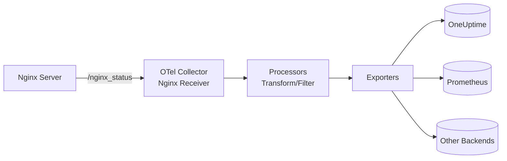

# How to Configure the Nginx Receiver in the OpenTelemetry Collector

Author: [nawazdhandala](https://www.github.com/nawazdhandala)

Tags: OpenTelemetry, Collector, Nginx, Web Server, Observability, Metrics, Monitoring

Description: Complete guide to configuring the Nginx receiver in OpenTelemetry Collector with practical YAML examples, authentication setup, and production best practices.

---

Nginx is one of the most widely deployed web servers and reverse proxies, handling millions of requests per second across the internet. Monitoring Nginx performance is critical for maintaining fast, reliable web services. The OpenTelemetry Collector's Nginx receiver provides standardized metric collection from Nginx instances, enabling centralized observability.

This guide provides practical configuration examples for the Nginx receiver, from initial setup through production deployment with authentication, multiple instances, and integration with observability backends.

## Understanding the Nginx Receiver

The Nginx receiver collects metrics from the Nginx `stub_status` module or the more advanced Nginx Plus API. It scrapes metrics at regular intervals and converts them into OpenTelemetry metrics that flow through your Collector pipeline.

Key metrics collected include:

- Active connections
- Total accepted and handled connections
- Total requests processed
- Reading, writing, and waiting connection states
- Request rate and connection rate
- Upstream server health (Nginx Plus)

These metrics help you understand load patterns, identify bottlenecks, detect anomalies, and optimize performance.

## Prerequisites: Enable Nginx Status Module

Before configuring the receiver, you must enable Nginx's status endpoint. For Nginx Open Source, enable `stub_status`:

Edit your Nginx configuration (typically `/etc/nginx/nginx.conf` or a site config):

```nginx
# Add a status endpoint in the server block
server {
    listen 80;
    server_name localhost;

    # Status endpoint for monitoring
    # Restrict access to localhost or monitoring networks
    location /nginx_status {
        stub_status on;
        # Security: Only allow access from localhost
        allow 127.0.0.1;
        # Or allow from your monitoring network
        # allow 10.0.0.0/8;
        deny all;
    }

    # Your regular application locations
    location / {
        root /usr/share/nginx/html;
        index index.html;
    }
}
```

Reload Nginx to apply changes:

```bash
# Test configuration syntax
nginx -t

# Reload if syntax is valid
nginx -s reload
```

Verify the status endpoint works:

```bash
curl http://localhost/nginx_status
```

Expected output:

```
Active connections: 2
server accepts handled requests
 123 123 456
Reading: 0 Writing: 1 Waiting: 1
```

## Data Flow Architecture

The following diagram illustrates how metrics flow from Nginx through the Collector:



The receiver polls the status endpoint, parses the response, and emits OpenTelemetry metrics that can be processed and routed to any backend.

## Basic Configuration

Here's a minimal configuration to monitor a local Nginx instance:

```yaml
# receivers: Define how telemetry enters the Collector
receivers:
  # Nginx receiver scrapes metrics from stub_status endpoint
  nginx:
    # URL of the Nginx status endpoint
    endpoint: http://localhost/nginx_status
    # How often to scrape metrics
    collection_interval: 30s

# exporters: Define where telemetry is sent
exporters:
  # Export to OneUptime using OTLP over HTTP
  otlphttp:
    endpoint: https://oneuptime.com/otlp
    headers:
      x-oneuptime-token: ${ONEUPTIME_TOKEN}

# service: Wire receivers and exporters into pipelines
service:
  pipelines:
    # Metrics pipeline for Nginx data
    metrics:
      receivers: [nginx]
      exporters: [otlphttp]
```

This basic setup scrapes the local Nginx status endpoint every 30 seconds and exports metrics to OneUptime.

## Production Configuration with Authentication

Production deployments often require authentication and advanced processing. Here's a comprehensive configuration:

```yaml
receivers:
  # Nginx receiver with full production settings
  nginx:
    # Production Nginx endpoint
    # Could be localhost if Collector runs on same host
    # Or remote endpoint if centralized monitoring
    endpoint: http://nginx-prod.example.com:8080/nginx_status

    # Collection interval - balance freshness vs load
    # 10-30s for high-traffic sites
    # 60s for lower-traffic sites
    collection_interval: 10s

    # HTTP client configuration
    # Authentication if status endpoint is protected
    # Basic auth example:
    # auth:
    #   authenticator: basicauth
    # Or use custom headers
    headers:
      X-Custom-Auth: ${NGINX_MONITORING_TOKEN}

    # Timeout for HTTP requests
    timeout: 10s

    # TLS configuration if using HTTPS
    tls:
      insecure_skip_verify: false
      ca_file: /etc/ssl/certs/ca-bundle.crt
      cert_file: /etc/ssl/certs/client.crt
      key_file: /etc/ssl/private/client.key

# processors: Transform and enrich metrics
processors:
  # Add resource attributes to identify the source
  resource:
    attributes:
      - key: service.name
        value: nginx-production
        action: upsert
      - key: deployment.environment
        value: production
        action: upsert
      - key: host.name
        value: ${HOSTNAME}
        action: upsert
      - key: nginx.instance
        value: frontend-01
        action: upsert

  # Batch metrics to reduce network calls
  batch:
    timeout: 10s
    send_batch_size: 512

  # Memory limiter to prevent OOM
  memory_limiter:
    check_interval: 5s
    limit_mib: 256

  # Filter metrics if needed
  # Example: Only keep certain metrics
  # filter:
  #   metrics:
  #     include:
  #       match_type: strict
  #       metric_names:
  #         - nginx.connections_active
  #         - nginx.requests

exporters:
  # Export to OneUptime with retry logic
  otlphttp:
    endpoint: https://oneuptime.com/otlp
    headers:
      x-oneuptime-token: ${ONEUPTIME_TOKEN}
    timeout: 30s
    # Retry configuration for reliability
    retry_on_failure:
      enabled: true
      initial_interval: 5s
      max_interval: 30s
      max_elapsed_time: 300s
    # Queue settings to buffer during backend outages
    sending_queue:
      enabled: true
      num_consumers: 10
      queue_size: 1000

service:
  pipelines:
    metrics:
      receivers: [nginx]
      processors: [memory_limiter, resource, batch]
      exporters: [otlphttp]
```

This production configuration includes resource tagging, batching, memory protection, and reliable export with retry logic.

## Monitoring Multiple Nginx Instances

To monitor multiple Nginx servers from a single Collector, define multiple receiver instances:

```yaml
receivers:
  # Frontend Nginx cluster
  nginx/frontend-01:
    endpoint: http://10.0.1.10/nginx_status
    collection_interval: 10s

  nginx/frontend-02:
    endpoint: http://10.0.1.11/nginx_status
    collection_interval: 10s

  nginx/frontend-03:
    endpoint: http://10.0.1.12/nginx_status
    collection_interval: 10s

  # API gateway Nginx
  nginx/api-gateway:
    endpoint: http://10.0.2.10:8080/nginx_status
    collection_interval: 5s  # More frequent for critical services

  # Staging environment
  nginx/staging:
    endpoint: http://staging-nginx.example.com/nginx_status
    collection_interval: 60s  # Less frequent for non-production

processors:
  # Tag frontend servers
  resource/frontend-01:
    attributes:
      - key: nginx.instance
        value: frontend-01
        action: upsert
      - key: nginx.role
        value: frontend
        action: upsert

  resource/frontend-02:
    attributes:
      - key: nginx.instance
        value: frontend-02
        action: upsert
      - key: nginx.role
        value: frontend
        action: upsert

  resource/frontend-03:
    attributes:
      - key: nginx.instance
        value: frontend-03
        action: upsert
      - key: nginx.role
        value: frontend
        action: upsert

  # Tag API gateway
  resource/api-gateway:
    attributes:
      - key: nginx.instance
        value: api-gateway
        action: upsert
      - key: nginx.role
        value: api
        action: upsert

  # Tag staging
  resource/staging:
    attributes:
      - key: nginx.instance
        value: staging
        action: upsert
      - key: deployment.environment
        value: staging
        action: upsert

  batch:
    timeout: 10s

exporters:
  otlphttp:
    endpoint: https://oneuptime.com/otlp
    headers:
      x-oneuptime-token: ${ONEUPTIME_TOKEN}

service:
  pipelines:
    # Combine all Nginx instances in one pipeline
    metrics:
      receivers:
        - nginx/frontend-01
        - nginx/frontend-02
        - nginx/frontend-03
        - nginx/api-gateway
        - nginx/staging
      processors: [batch]
      exporters: [otlphttp]

    # Or separate pipelines for granular control
    metrics/frontend-01:
      receivers: [nginx/frontend-01]
      processors: [resource/frontend-01, batch]
      exporters: [otlphttp]

    metrics/frontend-02:
      receivers: [nginx/frontend-02]
      processors: [resource/frontend-02, batch]
      exporters: [otlphttp]

    # ... repeat for other instances
```

This approach allows different collection intervals and tagging strategies per instance.

## Key Metrics Explained

The Nginx receiver exposes these critical metrics:

**nginx.connections_active**
- Current number of active client connections
- High values indicate heavy load or slow processing
- Alert when consistently above 80% of worker_connections

**nginx.connections_accepted**
- Total connections accepted since Nginx started
- Calculate connection rate as derivative
- Sudden drops may indicate network issues

**nginx.connections_handled**
- Total connections successfully handled
- Should match accepted connections
- Difference indicates resource exhaustion

**nginx.requests**
- Total HTTP requests processed
- Calculate request rate as derivative
- Primary metric for traffic patterns

**nginx.connections_reading**
- Connections currently reading request headers
- High values may indicate slow clients

**nginx.connections_writing**
- Connections currently writing responses
- High values may indicate slow clients or large responses

**nginx.connections_waiting**
- Idle keepalive connections
- High values with low active connections is normal
- Optimize keepalive_timeout based on this metric

## Deployment Patterns

### Pattern 1: Agent per Host

Run a Collector instance on each Nginx host:

```yaml
receivers:
  nginx:
    endpoint: http://localhost/nginx_status
    collection_interval: 10s

processors:
  resource:
    attributes:
      - key: host.name
        value: ${HOSTNAME}
        action: upsert
```

**Pros**: No network latency, survives network issues
**Cons**: More deployments to manage

### Pattern 2: Centralized Collector

One Collector monitors all Nginx instances remotely:

```yaml
receivers:
  nginx/server-01:
    endpoint: http://server-01.example.com/nginx_status
  nginx/server-02:
    endpoint: http://server-02.example.com/nginx_status
  # ... more instances
```

**Pros**: Single configuration point, easier management
**Cons**: Network dependency, potential single point of failure

### Pattern 3: Hybrid Tier

Local agents collect and forward to regional collectors:

```yaml
# Local agent config
receivers:
  nginx:
    endpoint: http://localhost/nginx_status

exporters:
  otlp:
    endpoint: regional-collector.example.com:4317

# Regional collector config
receivers:
  otlp:
    protocols:
      grpc:

exporters:
  otlphttp:
    endpoint: https://oneuptime.com/otlp
```

**Pros**: Resilient, scalable, reduces backend load
**Cons**: Most complex to set up

## Securing the Status Endpoint

Never expose Nginx status publicly. Use IP allowlisting:

```nginx
location /nginx_status {
    stub_status on;
    # Only allow from monitoring network
    allow 10.0.0.0/8;
    allow 172.16.0.0/12;
    deny all;
}
```

Or add authentication:

```nginx
location /nginx_status {
    stub_status on;
    auth_basic "Monitoring";
    auth_basic_user_file /etc/nginx/.htpasswd;
}
```

Then configure the receiver with credentials:

```yaml
receivers:
  nginx:
    endpoint: http://nginx.example.com/nginx_status
    headers:
      Authorization: "Basic ${BASIC_AUTH_TOKEN}"
```

Generate the token:

```bash
echo -n "username:password" | base64
```

## Troubleshooting Common Issues

**Connection Refused**

Verify Nginx is running and status endpoint is accessible:

```bash
# Check Nginx is running
systemctl status nginx

# Test status endpoint
curl http://localhost/nginx_status
```

**Empty Metrics**

Check Collector logs for errors:

```bash
# If running as service
journalctl -u otel-collector -f

# If running in Docker
docker logs -f otel-collector
```

**High Cardinality**

If monitoring many Nginx instances, avoid high-cardinality labels. Use dimensions that aggregate well:

```yaml
processors:
  resource:
    attributes:
      # Good: Low cardinality
      - key: nginx.role
        value: frontend
      # Bad: High cardinality (unique per pod in Kubernetes)
      # - key: pod.name
      #   value: ${POD_NAME}
```

**Authentication Failures**

Verify credentials and endpoint accessibility:

```bash
# Test with curl using same credentials
curl -H "Authorization: Basic YOUR_TOKEN" http://nginx.example.com/nginx_status
```

## Advanced Configuration: Nginx Plus

If you're using Nginx Plus, you can collect more detailed metrics from the API:

```yaml
receivers:
  nginx:
    # Nginx Plus API endpoint (not stub_status)
    endpoint: http://nginx-plus.example.com:8080/api/9/nginx
    collection_interval: 10s
```

Nginx Plus provides:

- Per-upstream server metrics
- Cache statistics
- Health check status
- Detailed zone statistics
- SSL/TLS metrics
- Stream (TCP/UDP) metrics

These require Nginx Plus with the API enabled:

```nginx
server {
    listen 8080;
    location /api {
        api write=on;
        allow 10.0.0.0/8;
        deny all;
    }
}
```

## Integration with OneUptime

Once metrics flow to OneUptime, you can:

1. **Create dashboards** showing connection rates, request rates, and active connections across all Nginx instances
2. **Set up alerts** for high connection counts, connection acceptance failures, or sudden traffic drops
3. **Correlate with application traces** to see how Nginx performance affects end-user experience
4. **Track trends** to plan capacity and optimize configuration
5. **Compare environments** (production vs staging) to validate changes

The OpenTelemetry standard means you can switch backends without reconfiguring Nginx or the Collector.

## Best Practices

**Choose the right collection interval**:
- 5-10s for high-traffic production servers
- 30-60s for medium traffic
- 120s+ for development/staging

**Use resource attributes** to add context:
```yaml
processors:
  resource:
    attributes:
      - key: service.name
        value: nginx
      - key: deployment.environment
        value: production
      - key: nginx.role
        value: frontend
```

**Monitor the Collector itself** using internal metrics:
```yaml
service:
  telemetry:
    metrics:
      readers:
        - periodic:
            exporter:
              otlp:
                endpoint: https://oneuptime.com/otlp
```

**Use batching** to reduce network overhead:
```yaml
processors:
  batch:
    timeout: 10s
    send_batch_size: 1024
```

**Protect credentials** with environment variables:
```bash
export ONEUPTIME_TOKEN="your-token-here"
export NGINX_MONITORING_TOKEN="monitoring-token"
```

## Related Resources

For more on OpenTelemetry Collector:

- [OpenTelemetry Collector: What It Is, When You Need It, and When You Don't](https://oneuptime.com/blog/post/2025-09-18-what-is-opentelemetry-collector-and-why-use-one/view)
- [How to collect internal metrics from OpenTelemetry Collector](https://oneuptime.com/blog/post/2025-01-22-how-to-collect-opentelemetry-collector-internal-metrics/view)

For monitoring other infrastructure:
- [How to Configure the Elasticsearch Receiver in the OpenTelemetry Collector](https://oneuptime.com/blog/post/2026-02-06-elasticsearch-receiver-opentelemetry-collector/view)
- [How to Configure the Apache Receiver in the OpenTelemetry Collector](https://oneuptime.com/blog/post/2026-02-06-apache-receiver-opentelemetry-collector/view)

## Final Thoughts

The Nginx receiver provides standardized monitoring for one of the internet's most critical pieces of infrastructure. Start with basic configuration on a single instance, add authentication and TLS for security, and scale to multiple instances as needed.

OpenTelemetry's vendor neutrality means your Nginx metrics integrate seamlessly with application traces and logs, giving you complete observability. Configure once, export anywhere.

Need a backend for your OpenTelemetry metrics? OneUptime provides native OTLP support with powerful dashboards, alerting, and correlation without vendor lock-in.
