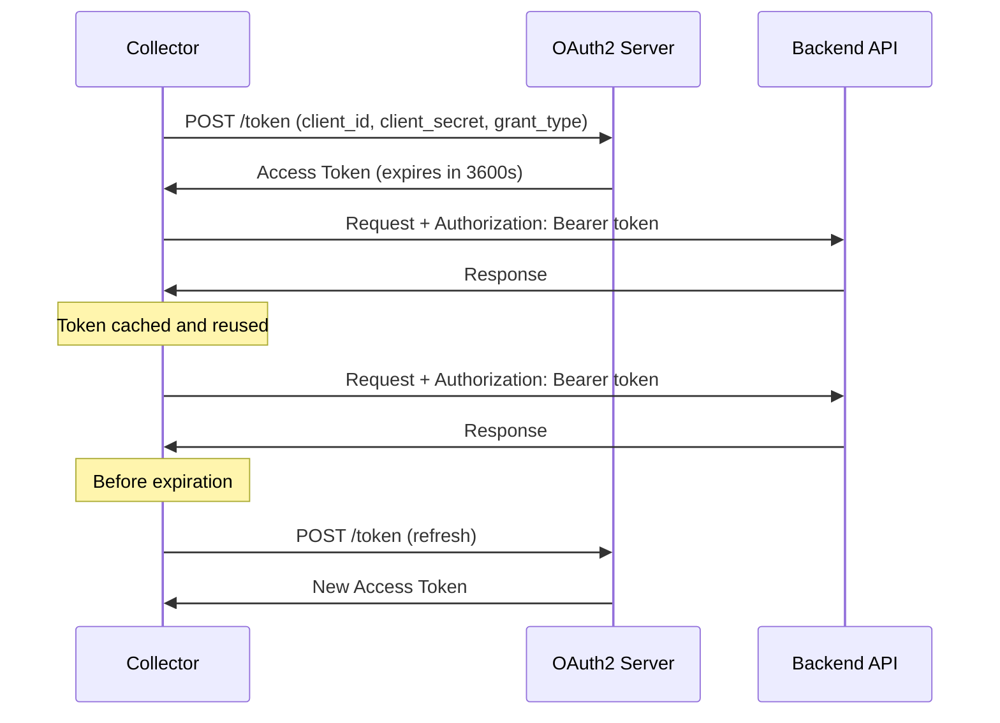

# How to Configure OAuth2 Client Auth Extension in the OpenTelemetry Collector

Author: [nawazdhandala](https://www.github.com/nawazdhandala)

Tags: OpenTelemetry, Collector, Extensions, Authentication, OAuth2, Security, API

Description: Learn how to configure OAuth2 client credentials authentication in the OpenTelemetry Collector to automatically obtain and refresh access tokens for secure backend communication.

The OAuth2 Client Auth extension in the OpenTelemetry Collector implements the OAuth 2.0 Client Credentials grant flow, enabling collectors to automatically obtain and manage access tokens for authenticating with backends. This provides a robust, standardized approach to machine-to-machine authentication without requiring manual token management.

## Understanding OAuth2 Client Credentials Flow

The OAuth 2.0 Client Credentials grant (defined in RFC 6749) is designed for server-to-server authentication where a client application needs to access protected resources on its own behalf, not on behalf of a user. The flow works as follows:

1. The collector authenticates to an authorization server using client credentials (client ID and secret)
2. The authorization server validates the credentials and returns an access token
3. The collector uses this access token to authenticate requests to backend APIs
4. When the token expires, the collector automatically requests a new token

This automated token lifecycle management eliminates the need for manual token rotation and ensures that exporters always use valid credentials.

## Why Use OAuth2 Client Authentication?

OAuth2 client authentication provides several advantages for telemetry pipelines:

**Automated Token Management**: The extension handles token acquisition, caching, and automatic renewal before expiration, eliminating manual token management overhead.

**Short-Lived Credentials**: Access tokens have limited lifetimes (typically minutes to hours), reducing the impact of token compromise compared to long-lived credentials.

**Scope-Based Access Control**: OAuth2 scopes enable fine-grained permissions, allowing different collectors to have different access levels to backend resources.

**Industry Standard**: OAuth2 is widely adopted across cloud platforms, SaaS applications, and enterprise systems, ensuring compatibility with numerous backends.

**Secure Secret Storage**: Client credentials can be stored in secure vaults or secret management systems, with the collector retrieving them at runtime.

## Architecture Overview

The OAuth2 client auth extension manages the token lifecycle and provides tokens to exporters:



The extension automatically refreshes tokens before they expire, ensuring uninterrupted communication with backends.

## Basic Configuration

Here's a simple OAuth2 client credentials configuration:

```yaml
# Define the OAuth2 client auth extension
extensions:
  # oauth2client extension configuration
  oauth2client:
    # OAuth2 token endpoint URL
    token_url: "https://auth.example.com/oauth/token"

    # Client credentials
    client_id: "your-client-id"
    client_secret: "your-client-secret"

    # Optional: Requested scopes
    scopes:
      - "telemetry.write"
      - "metrics.write"

# Configure receivers
receivers:
  otlp:
    protocols:
      http:
        endpoint: 0.0.0.0:4318

# Processors
processors:
  batch:
    timeout: 10s
    send_batch_size: 1024

# Exporters with OAuth2 authentication
exporters:
  otlphttp:
    endpoint: https://api.backend.com/v1/traces
    # Reference the OAuth2 auth extension
    auth:
      authenticator: oauth2client

# Service configuration
service:
  # Include the extension in the service
  extensions: [oauth2client]

  pipelines:
    traces:
      receivers: [otlp]
      processors: [batch]
      exporters: [otlphttp]
```

The extension automatically obtains an access token and injects it into the Authorization header of requests made by the OTLP HTTP exporter.

## Using Environment Variables for Credentials

For production environments, store client credentials in environment variables:

```yaml
extensions:
  oauth2client:
    # OAuth2 token endpoint
    token_url: "https://auth.example.com/oauth/token"

    # Client credentials from environment variables
    client_id: "${env:OAUTH2_CLIENT_ID}"
    client_secret: "${env:OAUTH2_CLIENT_SECRET}"

    # Requested scopes
    scopes:
      - "telemetry:write"
      - "metrics:read"

    # Optional: Custom timeout for token requests
    timeout: 10s

receivers:
  otlp:
    protocols:
      http:
        endpoint: 0.0.0.0:4318

processors:
  batch:
    timeout: 10s

  # Add metadata to telemetry
  resource:
    attributes:
      - key: collector.auth_type
        value: oauth2
        action: upsert

exporters:
  # Primary backend with OAuth2
  otlphttp/primary:
    endpoint: https://api.primary.com/v1/traces
    auth:
      authenticator: oauth2client

  # Secondary backend with OAuth2
  otlphttp/secondary:
    endpoint: https://api.secondary.com/v1/traces
    auth:
      authenticator: oauth2client

service:
  extensions: [oauth2client]

  pipelines:
    traces:
      receivers: [otlp]
      processors: [resource, batch]
      exporters: [otlphttp/primary, otlphttp/secondary]
```

Start the collector with credentials provided via environment variables:

```bash
export OAUTH2_CLIENT_ID="collector-client-12345"
export OAUTH2_CLIENT_SECRET="super-secret-value"
./otelcol --config=config.yaml
```

## Advanced Configuration Options

The OAuth2 client extension supports various advanced options:

```yaml
extensions:
  oauth2client:
    # OAuth2 token endpoint
    token_url: "https://auth.example.com/oauth/token"

    # Client credentials
    client_id: "${env:OAUTH2_CLIENT_ID}"
    client_secret: "${env:OAUTH2_CLIENT_SECRET}"

    # Requested scopes (space-separated in token request)
    scopes:
      - "telemetry:write"
      - "traces:send"
      - "metrics:send"

    # Optional: Additional parameters sent in token request
    endpoint_params:
      resource: "https://api.backend.com"
      audience: "backend-api"

    # Optional: Timeout for token requests (default: 5s)
    timeout: 10s

    # Optional: TLS configuration for token endpoint
    tls:
      insecure: false
      ca_file: /etc/otel/certs/auth-ca.crt
      cert_file: /etc/otel/certs/client.crt
      key_file: /etc/otel/certs/client.key

receivers:
  otlp:
    protocols:
      http:
        endpoint: 0.0.0.0:4318

processors:
  batch:
    timeout: 10s
    send_batch_size: 2048

  # Memory limiter
  memory_limiter:
    check_interval: 1s
    limit_mib: 512

exporters:
  otlphttp:
    endpoint: https://api.backend.com/v1/traces
    auth:
      authenticator: oauth2client
    # Additional HTTP configuration
    compression: gzip
    retry_on_failure:
      enabled: true
      initial_interval: 5s
      max_interval: 30s

service:
  extensions: [oauth2client]

  pipelines:
    traces:
      receivers: [otlp]
      processors: [memory_limiter, batch]
      exporters: [otlphttp]
```

## Multiple OAuth2 Configurations

Configure multiple OAuth2 client auth extensions for different backends or authorization servers:

```yaml
extensions:
  # OAuth2 for production backend
  oauth2client/prod:
    token_url: "https://auth.prod.example.com/oauth/token"
    client_id: "${env:PROD_CLIENT_ID}"
    client_secret: "${env:PROD_CLIENT_SECRET}"
    scopes:
      - "telemetry:write:prod"

  # OAuth2 for staging backend
  oauth2client/staging:
    token_url: "https://auth.staging.example.com/oauth/token"
    client_id: "${env:STAGING_CLIENT_ID}"
    client_secret: "${env:STAGING_CLIENT_SECRET}"
    scopes:
      - "telemetry:write:staging"

  # OAuth2 for third-party analytics
  oauth2client/analytics:
    token_url: "https://auth.analytics-vendor.com/oauth/token"
    client_id: "${env:ANALYTICS_CLIENT_ID}"
    client_secret: "${env:ANALYTICS_CLIENT_SECRET}"
    scopes:
      - "ingest"

receivers:
  otlp:
    protocols:
      http:
        endpoint: 0.0.0.0:4318

processors:
  batch:
    timeout: 10s

  # Route based on environment attribute
  routing:
    from_attribute: deployment.environment
    table:
      - value: production
        exporters: [otlphttp/prod]
      - value: staging
        exporters: [otlphttp/staging]

exporters:
  # Production backend
  otlphttp/prod:
    endpoint: https://api.prod.example.com/v1/traces
    auth:
      authenticator: oauth2client/prod

  # Staging backend
  otlphttp/staging:
    endpoint: https://api.staging.example.com/v1/traces
    auth:
      authenticator: oauth2client/staging

  # Analytics backend
  otlphttp/analytics:
    endpoint: https://api.analytics-vendor.com/v1/traces
    auth:
      authenticator: oauth2client/analytics

service:
  extensions: [oauth2client/prod, oauth2client/staging, oauth2client/analytics]

  pipelines:
    traces:
      receivers: [otlp]
      processors: [routing]
      # Routing processor handles exporter selection

    metrics:
      receivers: [otlp]
      processors: [batch]
      # Send metrics to all backends
      exporters: [otlphttp/prod, otlphttp/analytics]
```

## Integration with Azure Active Directory

Azure AD supports OAuth2 client credentials for service-to-service authentication:

```yaml
extensions:
  oauth2client:
    # Azure AD token endpoint
    # Replace TENANT_ID with your Azure AD tenant ID
    token_url: "https://login.microsoftonline.com/TENANT_ID/oauth2/v2.0/token"

    # Application (client) ID from Azure AD app registration
    client_id: "${env:AZURE_CLIENT_ID}"

    # Client secret from Azure AD app registration
    client_secret: "${env:AZURE_CLIENT_SECRET}"

    # Scope format for Azure AD
    # Replace RESOURCE with the application ID URI of the target resource
    scopes:
      - "https://RESOURCE/.default"

    # Additional parameters for Azure AD
    endpoint_params:
      # Optionally specify resource
      resource: "https://api.example.com"

receivers:
  otlp:
    protocols:
      http:
        endpoint: 0.0.0.0:4318

processors:
  batch:
    timeout: 10s

  resource:
    attributes:
      - key: cloud.provider
        value: azure
        action: upsert

exporters:
  otlphttp:
    endpoint: https://azure-backend.example.com/v1/traces
    auth:
      authenticator: oauth2client

service:
  extensions: [oauth2client]

  pipelines:
    traces:
      receivers: [otlp]
      processors: [resource, batch]
      exporters: [otlphttp]
```

## Integration with Google Cloud

Configure OAuth2 for Google Cloud APIs:

```yaml
extensions:
  oauth2client:
    # Google OAuth2 token endpoint
    token_url: "https://oauth2.googleapis.com/token"

    # Service account client ID
    client_id: "${env:GOOGLE_CLIENT_ID}"

    # Service account client secret
    client_secret: "${env:GOOGLE_CLIENT_SECRET}"

    # Google Cloud API scopes
    scopes:
      - "https://www.googleapis.com/auth/cloud-platform"
      - "https://www.googleapis.com/auth/monitoring.write"

receivers:
  otlp:
    protocols:
      http:
        endpoint: 0.0.0.0:4318

processors:
  batch:
    timeout: 10s

  resource:
    attributes:
      - key: cloud.provider
        value: gcp
        action: upsert

exporters:
  # Google Cloud Trace exporter
  googlecloud:
    # Project ID can be specified or auto-detected
    project: "your-gcp-project-id"
    # Use OAuth2 client auth
    auth:
      authenticator: oauth2client

service:
  extensions: [oauth2client]

  pipelines:
    traces:
      receivers: [otlp]
      processors: [resource, batch]
      exporters: [googlecloud]
```

Note that for Google Cloud, you may want to use workload identity or service account key files instead of OAuth2 client credentials, depending on your deployment environment.

## Integration with Custom Authorization Servers

For custom or self-hosted authorization servers:

```yaml
extensions:
  oauth2client:
    # Custom authorization server token endpoint
    token_url: "https://auth.mycompany.com/oauth2/token"

    # Client credentials
    client_id: "${env:OAUTH2_CLIENT_ID}"
    client_secret: "${env:OAUTH2_CLIENT_SECRET}"

    # Custom scopes defined by your authorization server
    scopes:
      - "otel:traces:write"
      - "otel:metrics:write"
      - "otel:logs:write"

    # Custom parameters required by your auth server
    endpoint_params:
      grant_type: "client_credentials"
      audience: "otel-backend-api"
      realm: "production"

    # Custom TLS configuration if using private CA
    tls:
      ca_file: /etc/otel/certs/custom-ca.crt
      insecure: false

    # Timeout for token requests
    timeout: 15s

receivers:
  otlp:
    protocols:
      http:
        endpoint: 0.0.0.0:4318

processors:
  batch:
    timeout: 10s

exporters:
  otlphttp:
    endpoint: https://api.mycompany.com/v1/traces
    auth:
      authenticator: oauth2client

service:
  extensions: [oauth2client]

  pipelines:
    traces:
      receivers: [otlp]
      processors: [batch]
      exporters: [otlphttp]
```

## Kubernetes Deployment with Secrets

Deploy the collector in Kubernetes using Secrets for OAuth2 credentials:

```yaml
# Kubernetes Secret for OAuth2 credentials
apiVersion: v1
kind: Secret
metadata:
  name: otel-oauth2-creds
  namespace: observability
type: Opaque
stringData:
  client-id: "collector-client-id"
  client-secret: "collector-client-secret"
---
# ConfigMap for collector configuration
apiVersion: v1
kind: ConfigMap
metadata:
  name: otel-collector-config
  namespace: observability
data:
  config.yaml: |
    extensions:
      oauth2client:
        token_url: "https://auth.example.com/oauth/token"
        client_id: "${env:OAUTH2_CLIENT_ID}"
        client_secret: "${env:OAUTH2_CLIENT_SECRET}"
        scopes:
          - "telemetry:write"

    receivers:
      otlp:
        protocols:
          http:
            endpoint: 0.0.0.0:4318

    processors:
      batch:
        timeout: 10s

    exporters:
      otlphttp:
        endpoint: https://api.backend.com/v1/traces
        auth:
          authenticator: oauth2client

    service:
      extensions: [oauth2client]
      pipelines:
        traces:
          receivers: [otlp]
          processors: [batch]
          exporters: [otlphttp]
---
# Deployment
apiVersion: apps/v1
kind: Deployment
metadata:
  name: otel-collector
  namespace: observability
spec:
  replicas: 3
  selector:
    matchLabels:
      app: otel-collector
  template:
    metadata:
      labels:
        app: otel-collector
    spec:
      containers:
      - name: otel-collector
        image: otel/opentelemetry-collector-contrib:latest
        env:
        # Inject OAuth2 credentials from secret
        - name: OAUTH2_CLIENT_ID
          valueFrom:
            secretKeyRef:
              name: otel-oauth2-creds
              key: client-id
        - name: OAUTH2_CLIENT_SECRET
          valueFrom:
            secretKeyRef:
              name: otel-oauth2-creds
              key: client-secret
        volumeMounts:
        - name: config
          mountPath: /etc/otel
          readOnly: true
        args:
        - --config=/etc/otel/config.yaml
        ports:
        - containerPort: 4318
          name: otlp-http
      volumes:
      - name: config
        configMap:
          name: otel-collector-config
```

## Production Configuration

Here's a comprehensive production configuration with OAuth2 client authentication:

```yaml
extensions:
  # OAuth2 client authentication
  oauth2client:
    token_url: "https://auth.production.example.com/oauth/token"
    client_id: "${file:/var/secrets/client-id}"
    client_secret: "${file:/var/secrets/client-secret}"

    scopes:
      - "telemetry:write"
      - "traces:send"
      - "metrics:send"
      - "logs:send"

    endpoint_params:
      audience: "otel-backend-api"

    timeout: 15s

    tls:
      ca_file: /etc/otel/certs/auth-ca.crt
      insecure: false

  # Health check endpoint
  health_check:
    endpoint: 0.0.0.0:13133

  # Performance profiling
  pprof:
    endpoint: localhost:1777

  # zPages for debugging
  zpages:
    endpoint: localhost:55679

receivers:
  otlp:
    protocols:
      grpc:
        endpoint: 0.0.0.0:4317
        tls:
          cert_file: /etc/otel/certs/server.crt
          key_file: /etc/otel/certs/server.key
      http:
        endpoint: 0.0.0.0:4318
        tls:
          cert_file: /etc/otel/certs/server.crt
          key_file: /etc/otel/certs/server.key

processors:
  # Prevent memory issues
  memory_limiter:
    check_interval: 1s
    limit_mib: 2048
    spike_limit_mib: 512

  # Batch for efficiency
  batch:
    timeout: 10s
    send_batch_size: 2048

  # Add metadata
  resource:
    attributes:
      - key: collector.version
        value: "1.0.0"
        action: upsert
      - key: deployment.environment
        value: production
        action: upsert
      - key: auth.method
        value: oauth2
        action: upsert

  # Remove sensitive data
  attributes:
    actions:
      - key: password
        action: delete
      - key: secret
        action: delete
      - key: token
        action: delete

exporters:
  # Primary backend with OAuth2
  otlphttp/backend:
    endpoint: https://api.backend.com/v1/traces
    auth:
      authenticator: oauth2client
    tls:
      insecure: false
      ca_file: /etc/otel/certs/backend-ca.crt
    compression: gzip
    retry_on_failure:
      enabled: true
      initial_interval: 5s
      max_interval: 30s
      max_elapsed_time: 300s
    sending_queue:
      enabled: true
      num_consumers: 10
      queue_size: 5000
    timeout: 30s

  # Logging for troubleshooting
  logging:
    loglevel: info
    sampling_initial: 5
    sampling_thereafter: 200

service:
  extensions: [oauth2client, health_check, pprof, zpages]

  pipelines:
    traces:
      receivers: [otlp]
      processors: [memory_limiter, attributes, resource, batch]
      exporters: [otlphttp/backend, logging]

    metrics:
      receivers: [otlp]
      processors: [memory_limiter, resource, batch]
      exporters: [otlphttp/backend]

    logs:
      receivers: [otlp]
      processors: [memory_limiter, attributes, resource, batch]
      exporters: [otlphttp/backend]
```

## Token Lifecycle Management

The OAuth2 client extension automatically manages the token lifecycle:

**Token Acquisition**: When the collector starts, the extension immediately requests an access token from the authorization server.

**Token Caching**: The token is cached in memory and reused for all requests until it expires.

**Automatic Renewal**: Before the token expires (typically with a 5-minute buffer), the extension automatically requests a new token.

**Retry Logic**: If token acquisition fails, the extension retries with exponential backoff to handle temporary authorization server outages.

**Error Handling**: If the extension cannot obtain a valid token, exporters will fail to send data until a token is successfully acquired.

## Troubleshooting

**Token Acquisition Failures**: Check that the token URL is correct and accessible from the collector. Verify client credentials are valid and have the necessary permissions.

**Scope Errors**: Ensure the requested scopes are valid for your authorization server and that the client is authorized to request those scopes.

**Token Expiration**: Monitor collector logs for token renewal messages. Frequent renewals may indicate short token lifetimes or clock synchronization issues.

**Network Errors**: Verify network connectivity to the authorization server. Check firewall rules and DNS resolution.

**TLS Issues**: If the authorization server uses a custom CA, ensure the ca_file parameter points to the correct certificate.

## Security Best Practices

Store client secrets in secure secret management systems like HashiCorp Vault, AWS Secrets Manager, or Kubernetes Secrets. Never commit secrets to version control.

Use strong, randomly generated client secrets with sufficient entropy to prevent brute-force attacks.

Implement the principle of least privilege by requesting only the minimum scopes necessary for collector operations.

Monitor for authentication failures which could indicate credential compromise, misconfiguration, or authorization server issues.

Rotate client credentials regularly to minimize the impact of potential secret exposure.

Use HTTPS for all communications with authorization servers to prevent credential interception.

## Related Resources

For more information about OpenTelemetry Collector authentication, check out these related posts:

- [How to Configure Bearer Token Auth Extension in the OpenTelemetry Collector](https://oneuptime.com/blog/post/2026-02-06-bearer-token-auth-extension-opentelemetry-collector/view)
- [How to Configure Basic Auth Extension in the OpenTelemetry Collector](https://oneuptime.com/blog/post/2026-02-06-basic-auth-extension-opentelemetry-collector/view)
- [How to Configure OIDC Auth Extension in the OpenTelemetry Collector](https://oneuptime.com/blog/post/2026-02-06-oidc-auth-extension-opentelemetry-collector/view)

The OAuth2 Client Auth extension provides automated, standards-based authentication for OpenTelemetry Collector deployments. By handling token acquisition, caching, and renewal automatically, it eliminates manual token management while ensuring secure, authenticated communication with backend services.
