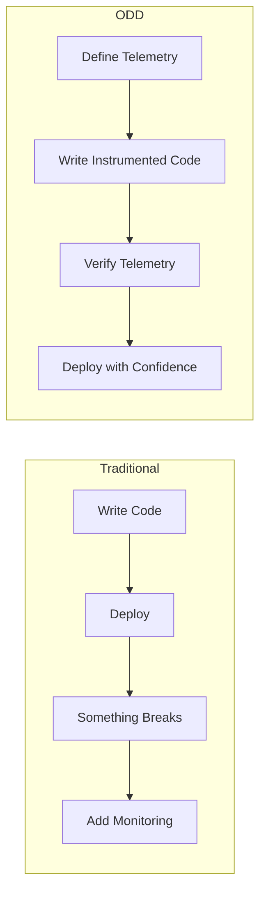
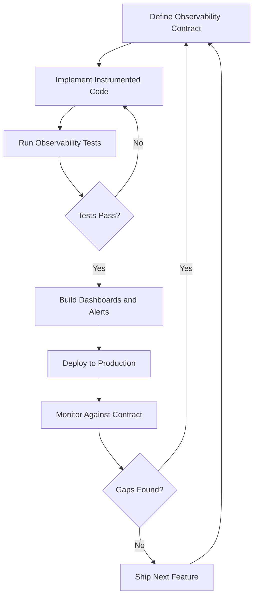

# How to Implement Observability-Driven Development with OpenTelemetry

Author: [nawazdhandala](https://www.github.com/nawazdhandala)

Tags: OpenTelemetry, Observability, Development Practices, Tracing, Metrics, Software Engineering

Description: Learn how to adopt observability-driven development using OpenTelemetry to build systems that are observable by design from the very first line of code.

---

Most teams bolt observability onto their applications after they are built. They ship features first, then scramble to add logging and monitoring when something breaks in production. Observability-driven development flips this on its head. You design your telemetry alongside your code, treating traces, metrics, and logs as first-class outputs of your software. OpenTelemetry makes this practical by giving you a vendor-neutral, standardized way to instrument everything from the start.

## What Is Observability-Driven Development?

Observability-driven development (ODD) means you think about how your code will be observed before you think about how it will be implemented. Similar to how test-driven development starts with writing tests first, ODD starts with defining what telemetry your code should produce.

The core idea is simple: if you cannot observe a behavior, you cannot verify it works correctly in production. By defining your observability requirements upfront, you end up with systems that are easier to debug, monitor, and maintain.

Here is how the workflow compares to traditional development:



## Step 1: Define Your Observability Contract

Before writing any business logic, define what telemetry your feature should produce. Think of this as an observability contract that documents how the feature will be visible to operators.

Create a simple specification document for each feature:

```yaml
# observability-spec/order-processing.yaml
# This spec defines what telemetry the order processing feature must produce

feature: order-processing
spans:
  - name: "process-order"
    kind: INTERNAL
    attributes:
      - key: order.id
        type: string
        required: true
      - key: order.total
        type: double
        required: true
      - key: order.item_count
        type: int
        required: true
    events:
      - name: "payment.authorized"
      - name: "inventory.reserved"
    status:
      error_conditions:
        - "payment failure"
        - "inventory shortage"

metrics:
  - name: "orders.processed"
    type: counter
    description: "Total number of orders processed"
    attributes: [order.status]
  - name: "order.processing.duration"
    type: histogram
    description: "Time taken to process an order"
    unit: "ms"
```

This specification becomes the contract between your development team and your operations team. Developers know what to instrument, and operators know what signals to expect.

## Step 2: Write Telemetry-First Code

With your observability contract defined, write the instrumentation alongside the business logic. Here is how you would implement the order processing feature:

```python
# order_service.py
from opentelemetry import trace, metrics
from opentelemetry.trace import StatusCode

# Get a tracer and meter for this module
tracer = trace.get_tracer("order-service", "1.0.0")
meter = metrics.get_meter("order-service", "1.0.0")

# Define metrics upfront based on the observability contract
orders_processed = meter.create_counter(
    name="orders.processed",
    description="Total number of orders processed",
    unit="1",
)

processing_duration = meter.create_histogram(
    name="order.processing.duration",
    description="Time taken to process an order",
    unit="ms",
)


class OrderProcessor:
    def process_order(self, order):
        # Create a span that matches our observability contract
        with tracer.start_as_current_span(
            "process-order",
            attributes={
                "order.id": order.id,
                "order.total": order.total,
                "order.item_count": len(order.items),
            },
        ) as span:
            try:
                # Each step is observable through span events
                self._authorize_payment(order, span)
                self._reserve_inventory(order, span)
                self._finalize_order(order, span)

                # Record success metric
                orders_processed.add(1, {"order.status": "success"})

            except PaymentError as e:
                # Set span status and record the error
                span.set_status(StatusCode.ERROR, str(e))
                span.record_exception(e)
                orders_processed.add(1, {"order.status": "payment_failed"})
                raise

            except InventoryError as e:
                span.set_status(StatusCode.ERROR, str(e))
                span.record_exception(e)
                orders_processed.add(1, {"order.status": "inventory_failed"})
                raise

    def _authorize_payment(self, order, span):
        # Add an event when payment is authorized
        # This maps directly to the observability contract
        result = self.payment_gateway.authorize(order)
        span.add_event("payment.authorized", {
            "payment.method": result.method,
            "payment.transaction_id": result.transaction_id,
        })

    def _reserve_inventory(self, order, span):
        # Add an event when inventory is reserved
        self.inventory_service.reserve(order.items)
        span.add_event("inventory.reserved", {
            "inventory.warehouse": "primary",
        })
```

Notice how every piece of instrumentation maps back to the observability contract we defined earlier. The span name, attributes, events, and error handling all match the specification.

## Step 3: Write Observability Tests

Just as you write unit tests for business logic, write tests that verify your telemetry is correct. These tests ensure your observability contract is fulfilled:

```python
# test_order_observability.py
import unittest
from unittest.mock import MagicMock
from opentelemetry.sdk.trace import TracerProvider
from opentelemetry.sdk.trace.export import SimpleSpanProcessor
from opentelemetry.sdk.trace.export.in_memory import InMemorySpanExporter

# Set up an in-memory exporter to capture spans for testing
exporter = InMemorySpanExporter()
provider = TracerProvider()
provider.add_span_processor(SimpleSpanProcessor(exporter))
trace.set_tracer_provider(provider)


class TestOrderObservability(unittest.TestCase):
    def setUp(self):
        # Clear spans before each test
        exporter.clear()
        self.processor = OrderProcessor()
        # Mock external dependencies
        self.processor.payment_gateway = MagicMock()
        self.processor.inventory_service = MagicMock()

    def test_process_order_creates_span_with_required_attributes(self):
        """Verify the observability contract for successful order processing."""
        order = create_test_order(id="ORD-123", total=99.99, items=3)

        self.processor.process_order(order)

        # Get the finished spans
        spans = exporter.get_finished_spans()
        self.assertEqual(len(spans), 1)

        span = spans[0]
        # Verify span name matches contract
        self.assertEqual(span.name, "process-order")

        # Verify all required attributes from the contract are present
        attrs = dict(span.attributes)
        self.assertEqual(attrs["order.id"], "ORD-123")
        self.assertAlmostEqual(attrs["order.total"], 99.99)
        self.assertEqual(attrs["order.item_count"], 3)

    def test_process_order_records_payment_event(self):
        """Verify payment.authorized event is recorded."""
        order = create_test_order()
        self.processor.process_order(order)

        spans = exporter.get_finished_spans()
        events = spans[0].events

        # Find the payment event
        payment_events = [e for e in events if e.name == "payment.authorized"]
        self.assertEqual(len(payment_events), 1)

    def test_failed_payment_sets_error_status(self):
        """Verify error handling matches the observability contract."""
        self.processor.payment_gateway.authorize.side_effect = PaymentError("declined")
        order = create_test_order()

        with self.assertRaises(PaymentError):
            self.processor.process_order(order)

        spans = exporter.get_finished_spans()
        self.assertEqual(spans[0].status.status_code, StatusCode.ERROR)
```

These tests do not test business logic. They test that the telemetry your code produces matches the observability contract. If someone accidentally removes an attribute or changes a span name, these tests catch it before it reaches production.

## Step 4: Build Observability Dashboards from the Contract

Since you defined your telemetry upfront, you can build your dashboards and alerts before the feature ships. Use the observability contract to create monitoring artifacts:

```yaml
# alerts/order-processing-alerts.yaml
# Alerts derived from the observability contract

alerts:
  - name: high-order-failure-rate
    # Query the counter metric defined in our contract
    query: |
      sum(rate(orders_processed{order_status="payment_failed"}[5m]))
      /
      sum(rate(orders_processed[5m]))
    threshold: 0.05
    description: "Order failure rate exceeds 5%"

  - name: slow-order-processing
    # Query the histogram metric from our contract
    query: |
      histogram_quantile(0.95,
        rate(order_processing_duration_bucket[5m])
      )
    threshold: 5000
    description: "95th percentile order processing time exceeds 5 seconds"
```

When the feature goes live, your monitoring is already in place. No more scrambling to build dashboards after an incident.

## Step 5: Validate in Pre-Production

Before deploying to production, validate that your instrumentation works end-to-end. Run your application against a local OpenTelemetry Collector and verify the output:

```python
# integration_test_observability.py
# Run this against a real collector to validate end-to-end telemetry

import requests
import time


def test_order_telemetry_reaches_backend():
    """Submit an order and verify the trace appears in the backend."""
    # Submit a test order through the API
    response = requests.post(
        "http://localhost:8080/api/orders",
        json={"items": [{"sku": "TEST-001", "quantity": 1}]},
    )
    assert response.status_code == 201
    order_id = response.json()["order_id"]

    # Give the collector time to process and export
    time.sleep(5)

    # Query the trace backend for the expected span
    traces = requests.get(
        "http://localhost:16686/api/traces",
        params={"service": "order-service", "operation": "process-order"},
    )

    # Find our specific trace by the order.id attribute
    found = False
    for trace_data in traces.json()["data"]:
        for span in trace_data["spans"]:
            tags = {t["key"]: t["value"] for t in span["tags"]}
            if tags.get("order.id") == order_id:
                found = True
                # Verify all contract attributes are present
                assert "order.total" in tags
                assert "order.item_count" in tags
                break

    assert found, f"Trace for order {order_id} not found in backend"
```

## The ODD Feedback Loop

The power of observability-driven development comes from the tight feedback loop it creates:



Each iteration improves your understanding of what needs to be observed. Over time, your system becomes deeply observable because observability was never an afterthought.

## Practical Tips for Adopting ODD

Start small. You do not need to apply ODD to every piece of code immediately. Pick one critical workflow, define its observability contract, and instrument it properly. Then expand from there.

Use OpenTelemetry semantic conventions as the foundation for your observability contracts. They provide a shared vocabulary that works across languages, frameworks, and backends.

Make observability part of code review. When reviewing a pull request, check that the telemetry matches the contract and that new functionality includes appropriate instrumentation.

Keep your observability contracts version-controlled alongside your code. They are living documents that evolve as your system evolves.

## Wrapping Up

Observability-driven development with OpenTelemetry shifts instrumentation from an afterthought to a design principle. By defining what telemetry your code should produce before writing the implementation, you build systems that are observable by default. The combination of observability contracts, telemetry-first coding, and observability tests creates a workflow where production visibility is guaranteed, not hoped for. Start with one feature, prove the value, and let the practice spread through your team naturally.
