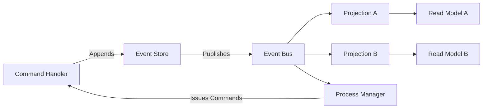

# How to Add Observability to Event-Sourced Systems Using OpenTelemetry

Author: [nawazdhandala](https://www.github.com/nawazdhandala)

Tags: OpenTelemetry, Event Sourcing, Observability, Distributed Tracing, Metrics, CQRS, Microservices

Description: A practical guide to instrumenting event-sourced systems with OpenTelemetry for tracing event flows, projections, and replays across your architecture.

---

Event sourcing changes everything about how you think about observability. Instead of looking at the current state of your database, you're working with an append-only log of events that represent every state change that ever happened. That's powerful for auditing and debugging business logic, but it creates unique challenges for operational monitoring.

Traditional request-response tracing doesn't capture the full picture in an event-sourced system. Events might be processed minutes or hours after they were created. Projections rebuild read models asynchronously. Event replays can re-process thousands of historical events. OpenTelemetry is flexible enough to handle all of these scenarios, but you need to think carefully about how to model them.

## The Structure of an Event-Sourced System

Before diving into instrumentation, let's establish the components we need to observe.



The main components are:

- **Command handlers** that validate and process commands, appending new events to the event store
- **Event store** that persists events in an append-only fashion
- **Event bus** that distributes events to subscribers
- **Projections** that consume events and build read models
- **Process managers** (or sagas) that react to events and issue new commands

Each of these components needs different instrumentation.

## Tracing Command Processing

When a command comes in, it triggers validation, domain logic, and event creation. This is the most straightforward part to trace because it looks like a normal synchronous operation.

```python
# command_handler.py - Tracing command handling with event generation
from opentelemetry import trace
from opentelemetry.trace import SpanKind, StatusCode
import uuid
import time

tracer = trace.get_tracer("eventsourcing.commands")


class OrderCommandHandler:
    def __init__(self, event_store):
        self.event_store = event_store

    def handle_create_order(self, command):
        """Handle a CreateOrder command, producing OrderCreated events."""
        # Create a span that covers the entire command handling process
        with tracer.start_as_current_span(
            "command.handle.CreateOrder",
            kind=SpanKind.INTERNAL,
            attributes={
                "es.command.type": "CreateOrder",
                "es.aggregate.type": "Order",
                "es.aggregate.id": command["order_id"],
            }
        ) as span:
            # Validate the command
            with tracer.start_as_current_span("command.validate") as validate_span:
                self._validate(command)
                validate_span.set_attribute("es.validation.passed", True)

            # Load the aggregate's event history to rebuild current state
            with tracer.start_as_current_span(
                "es.aggregate.load",
                attributes={
                    "es.aggregate.id": command["order_id"],
                    "es.aggregate.type": "Order",
                }
            ) as load_span:
                events = self.event_store.load_events(command["order_id"])
                load_span.set_attribute("es.events.loaded_count", len(events))

            # Apply domain logic and generate new events
            new_events = [
                {
                    "event_id": str(uuid.uuid4()),
                    "event_type": "OrderCreated",
                    "aggregate_id": command["order_id"],
                    "timestamp": time.time(),
                    "data": {
                        "customer_id": command["customer_id"],
                        "items": command["items"],
                        "total": command["total"],
                    },
                    # Store the trace context so downstream consumers can link back
                    "trace_context": get_current_trace_context(),
                }
            ]

            # Persist events to the event store
            with tracer.start_as_current_span(
                "es.events.append",
                attributes={
                    "es.events.count": len(new_events),
                    "es.events.types": ",".join(e["event_type"] for e in new_events),
                }
            ) as append_span:
                self.event_store.append(command["order_id"], new_events)

            span.set_attribute("es.events.produced", len(new_events))
            span.set_status(StatusCode.OK)

    def _validate(self, command):
        # Validation logic here
        pass


def get_current_trace_context():
    """Capture the current trace context for embedding in events."""
    from opentelemetry.propagate import inject
    carrier = {}
    inject(carrier)
    return carrier
```

The important detail here is storing the trace context inside the event itself. Since events are persisted and processed asynchronously, you need a way for the consumer to link back to the original trace.

## Tracing Event Publication and Consumption

When events leave the event store and travel through the event bus, you need to maintain the trace context chain. This is similar to how you'd instrument any message-based system, but with event sourcing-specific attributes.

```python
# event_publisher.py - Publishing events with trace context propagation
from opentelemetry import trace
from opentelemetry.trace import SpanKind
from opentelemetry.propagate import inject, extract

tracer = trace.get_tracer("eventsourcing.publisher")


def publish_event(event, message_broker):
    """Publish a domain event to the event bus with trace context."""
    # Extract the trace context that was stored when the event was created
    stored_context = event.get("trace_context", {})
    parent_context = extract(stored_context)

    # Create a PRODUCER span linked to the original command trace
    with tracer.start_as_current_span(
        f"es.event.publish.{event['event_type']}",
        context=parent_context,
        kind=SpanKind.PRODUCER,
        attributes={
            "es.event.type": event["event_type"],
            "es.event.id": event["event_id"],
            "es.aggregate.id": event["aggregate_id"],
            "messaging.system": "rabbitmq",
            "messaging.operation": "publish",
        }
    ):
        # Inject updated trace context into message headers
        headers = {}
        inject(headers)

        message_broker.publish(
            exchange="domain.events",
            routing_key=event["event_type"],
            body=event,
            headers=headers,
        )
```

On the consumer side, each projection or process manager extracts the context and creates its own spans.

```python
# event_consumer.py - Consuming events in a projection with tracing
from opentelemetry import trace
from opentelemetry.trace import SpanKind
from opentelemetry.propagate import extract

tracer = trace.get_tracer("eventsourcing.projection")


class OrderSummaryProjection:
    """Builds a read model of order summaries from events."""

    def handle_event(self, event, message_headers):
        """Process an incoming event and update the read model."""
        # Restore the trace context from message headers
        parent_context = extract(message_headers)

        with tracer.start_as_current_span(
            f"es.projection.handle.{event['event_type']}",
            context=parent_context,
            kind=SpanKind.CONSUMER,
            attributes={
                "es.event.type": event["event_type"],
                "es.event.id": event["event_id"],
                "es.aggregate.id": event["aggregate_id"],
                "es.projection.name": "OrderSummary",
                "messaging.operation": "process",
            }
        ) as span:
            # Route to the appropriate handler method
            handler = self._get_handler(event["event_type"])
            if handler:
                with tracer.start_as_current_span(
                    "es.projection.apply",
                    attributes={
                        "es.projection.name": "OrderSummary",
                        "es.event.type": event["event_type"],
                    }
                ):
                    handler(event["data"])
                span.set_attribute("es.projection.applied", True)
            else:
                span.set_attribute("es.projection.applied", False)
                span.set_attribute("es.projection.skip_reason", "no_handler")

    def _get_handler(self, event_type):
        handlers = {
            "OrderCreated": self._on_order_created,
            "OrderShipped": self._on_order_shipped,
            "OrderCancelled": self._on_order_cancelled,
        }
        return handlers.get(event_type)

    def _on_order_created(self, data):
        # Insert into read model database
        pass

    def _on_order_shipped(self, data):
        # Update order status in read model
        pass

    def _on_order_cancelled(self, data):
        # Mark order as cancelled in read model
        pass
```

## Tracing Event Replays

Event replays are a fundamental feature of event-sourced systems. You might replay events to rebuild a corrupted read model, migrate to a new projection schema, or debug a production issue. Replays need their own tracing strategy because they process potentially thousands of events in bulk.

You don't want replay traces mixed in with production traces, and you don't want to link back to the original trace contexts (which may be expired or irrelevant during a replay).

```python
# event_replay.py - Tracing an event replay operation
from opentelemetry import trace
from opentelemetry.trace import SpanKind, StatusCode
import time

tracer = trace.get_tracer("eventsourcing.replay")


def replay_events(event_store, projection, aggregate_type, from_position=0):
    """Replay historical events through a projection with tracing."""
    # Create a new root span for the replay operation
    # We intentionally do NOT link to original trace contexts
    with tracer.start_as_current_span(
        "es.replay",
        kind=SpanKind.INTERNAL,
        attributes={
            "es.replay.projection": projection.__class__.__name__,
            "es.replay.aggregate_type": aggregate_type,
            "es.replay.from_position": from_position,
            "es.replay.is_replay": True,  # Important flag for filtering
        }
    ) as replay_span:
        events_processed = 0
        errors = 0
        start_time = time.time()

        # Stream events from the event store
        for event in event_store.stream_all(aggregate_type, from_position):
            events_processed += 1

            # Create a span for each batch of events, not each individual event
            # Tracing every single event in a replay of 100k events would be too noisy
            if events_processed % 1000 == 0:
                with tracer.start_as_current_span(
                    "es.replay.batch",
                    attributes={
                        "es.replay.events_processed": events_processed,
                        "es.replay.elapsed_seconds": time.time() - start_time,
                    }
                ):
                    pass  # Batch checkpoint span

            try:
                # Apply the event to the projection without message headers
                # (no trace context propagation during replay)
                projection.apply_event(event)
            except Exception as e:
                errors += 1
                # Record the error but continue processing
                replay_span.add_event(
                    "es.replay.event_error",
                    attributes={
                        "es.event.id": event["event_id"],
                        "es.event.type": event["event_type"],
                        "error.message": str(e),
                    }
                )

        # Record final statistics on the replay span
        replay_span.set_attribute("es.replay.total_events", events_processed)
        replay_span.set_attribute("es.replay.errors", errors)
        replay_span.set_attribute("es.replay.duration_seconds", time.time() - start_time)
        replay_span.set_attribute(
            "es.replay.throughput_eps",
            events_processed / max(time.time() - start_time, 0.001)
        )

        if errors > 0:
            replay_span.set_status(StatusCode.ERROR, f"{errors} events failed")
        else:
            replay_span.set_status(StatusCode.OK)
```

## Custom Metrics for Event-Sourced Systems

Traces are great for understanding individual event flows, but you also need aggregate metrics to monitor the health of your event-sourced system overall.

```python
# es_metrics.py - Custom metrics for event sourcing health
from opentelemetry import metrics

meter = metrics.get_meter("eventsourcing.metrics")

# Track how many events are produced per type
events_produced = meter.create_counter(
    name="es.events.produced",
    description="Number of domain events produced",
    unit="events",
)

# Track event processing lag (time between event creation and projection handling)
projection_lag = meter.create_histogram(
    name="es.projection.lag",
    description="Time between event creation and projection processing",
    unit="ms",
)

# Track projection position (how far behind the projection is)
projection_position = meter.create_up_down_counter(
    name="es.projection.position",
    description="Current position of each projection in the event stream",
    unit="events",
)

# Track event store size
event_store_size = meter.create_observable_gauge(
    name="es.eventstore.size",
    description="Total number of events in the event store",
    unit="events",
    callbacks=[lambda: get_event_store_count()],
)


def record_event_produced(event_type, aggregate_type):
    """Record that a new event was produced."""
    events_produced.add(1, {
        "es.event.type": event_type,
        "es.aggregate.type": aggregate_type,
    })


def record_projection_lag(projection_name, lag_ms):
    """Record the lag between event creation and projection processing."""
    projection_lag.record(lag_ms, {
        "es.projection.name": projection_name,
    })


def get_event_store_count():
    # Query your event store for the total count
    return 0
```

## Connecting the Trace Across Time

One of the trickiest aspects of event-sourced systems is that the command and the projection might run minutes apart. The trace technically spans that entire duration. In practice, you have a few options for how to handle this:

**Option 1: Single long trace.** Store the trace context in the event, and have the projection link back to it. This produces a trace that might span minutes. It works, but your trace backend needs to handle long-lived traces well.

**Option 2: Linked traces.** Create a new trace for each projection processing, but add a span link to the original command trace. This keeps traces short and self-contained while maintaining the connection.

```python
# Using span links to connect related but separate traces
from opentelemetry import trace
from opentelemetry.trace import Link

tracer = trace.get_tracer("eventsourcing.projection")


def handle_event_with_link(event, message_headers):
    """Process event in a new trace, linked to the original command trace."""
    # Extract the original trace context
    original_context = extract(message_headers)
    original_span_context = trace.get_current_span(original_context).get_span_context()

    # Create a link to the original trace instead of making it the parent
    link = Link(original_span_context, attributes={
        "link.relationship": "caused_by",
        "es.event.type": event["event_type"],
    })

    # Start a new trace with the link
    with tracer.start_as_current_span(
        f"es.projection.process.{event['event_type']}",
        links=[link],
        kind=trace.SpanKind.CONSUMER,
        attributes={
            "es.projection.name": "OrderSummary",
            "es.event.id": event["event_id"],
        }
    ) as span:
        # Process the event in this new trace context
        pass
```

Option 2 is usually the better choice for production systems. Your traces stay manageable in size, your trace backend doesn't need to hold open traces for long periods, and you still have the causal link when you need to investigate an issue.

## Wrapping Up

Event-sourced systems have observability needs that go beyond standard request-response tracing. You need to trace command handling, event publication, asynchronous projection processing, and bulk event replays. OpenTelemetry's flexible span model, context propagation, and span links give you all the tools to build complete visibility into your event-sourced architecture. The key decisions are how to propagate context through your events and whether to use parent-child relationships or span links for async processing. Start with the approach that feels simpler for your system, and evolve it as your observability needs grow.
