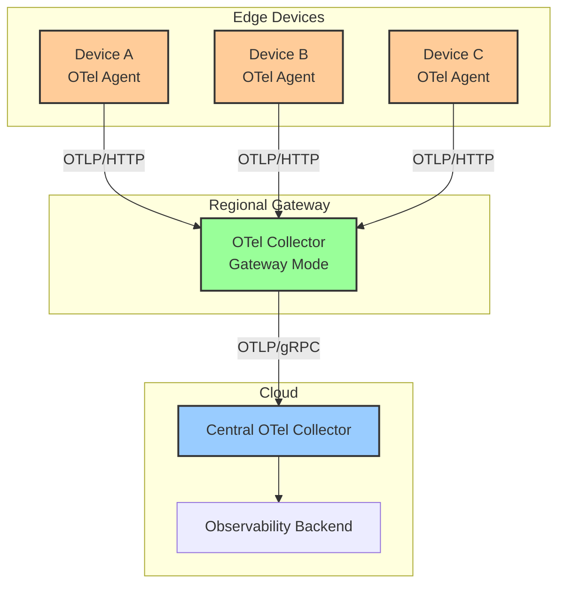

# How to Set Up Observability for IoT Edge Devices Using OpenTelemetry

Author: [nawazdhandala](https://www.github.com/nawazdhandala)

Tags: OpenTelemetry, IoT, Edge Computing, Observability, Embedded Systems, Collector, Telemetry

Description: Learn how to set up observability for IoT edge devices using OpenTelemetry to monitor device health, trace data pipelines, and manage fleets at scale.

---

IoT edge devices operate in a fundamentally different environment than cloud services. They run on constrained hardware with limited CPU, memory, and storage. They connect over unreliable networks that drop packets and go offline for hours. They are deployed in locations where you cannot SSH in to check what went wrong. And yet, you still need to know when a device is misbehaving, what firmware version it is running, how its sensors are performing, and whether its data pipeline is delivering telemetry to the cloud.

OpenTelemetry was designed primarily for cloud-native applications, but its architecture is flexible enough to work at the edge. This guide covers how to deploy lightweight OpenTelemetry components on edge devices, buffer telemetry during network outages, and aggregate device data through a collector hierarchy that scales to thousands of devices.

## The Edge Observability Architecture

Edge observability requires a tiered architecture. You cannot run a full OpenTelemetry Collector on a device with 256MB of RAM and a single ARM core. Instead, you deploy a minimal agent on each device that forwards telemetry to a regional collector, which then exports to your central observability backend:



The three tiers serve distinct purposes. The edge agent is as small as possible, collecting device metrics and forwarding them with minimal processing. The regional gateway handles batching, filtering, and enrichment for a group of nearby devices. The central collector receives data from all regions and exports to your observability backend.

## Building a Lightweight Edge Agent

On resource-constrained devices, you need an agent that consumes minimal CPU and memory. The OpenTelemetry Collector has a builder tool (`ocb`) that lets you compile a custom binary containing only the components you need:

```yaml
# edge-agent-builder.yaml
# Build configuration for a minimal edge collector

dist:
  name: otel-edge-agent
  description: Minimal OTel agent for IoT edge devices
  output_path: ./build/edge-agent
  # Target ARM architecture for typical IoT hardware
  otelcol_version: 0.96.0

receivers:
  # Host metrics for device health monitoring
  - gomod: go.opentelemetry.io/collector/receiver/otlpreceiver v0.96.0
  - gomod: github.com/open-telemetry/opentelemetry-collector-contrib/receiver/hostmetricsreceiver v0.96.0

processors:
  - gomod: go.opentelemetry.io/collector/processor/batchprocessor v0.96.0
  - gomod: go.opentelemetry.io/collector/processor/memorylimiterprocessor v0.96.0

exporters:
  - gomod: go.opentelemetry.io/collector/exporter/otlphttpexporter v0.96.0

extensions:
  - gomod: github.com/open-telemetry/opentelemetry-collector-contrib/extension/filestorage v0.96.0
```

Build the agent for your target architecture:

```bash
# Install the OpenTelemetry Collector builder
go install go.opentelemetry.io/collector/cmd/builder@v0.96.0

# Build for ARM (common IoT architecture like Raspberry Pi)
GOOS=linux GOARCH=arm GOARM=7 builder --config=edge-agent-builder.yaml

# Build for ARM64 (newer IoT gateways and industrial devices)
GOOS=linux GOARCH=arm64 builder --config=edge-agent-builder.yaml

# The resulting binary is typically 30-50MB, much smaller than the full contrib collector
ls -lh ./build/edge-agent/otel-edge-agent
```

The custom build strips out hundreds of components you do not need on an edge device (Kafka receivers, Prometheus exporters, cloud-specific processors), resulting in a binary that uses significantly less memory at runtime.

## Configuring the Edge Agent

The edge agent configuration focuses on collecting device health metrics and forwarding application telemetry with minimal resource consumption:

```yaml
# edge-agent-config.yaml
# Configuration for IoT edge device agent

receivers:
  # Collect host metrics for device health monitoring
  hostmetrics:
    collection_interval: 60s
    scrapers:
      # CPU usage on the edge device
      cpu:
        metrics:
          system.cpu.utilization:
            enabled: true
      # Memory usage (critical on constrained devices)
      memory:
        metrics:
          system.memory.utilization:
            enabled: true
      # Disk usage for devices with local storage
      disk:
        metrics:
          system.disk.io:
            enabled: true
      # Network metrics for connectivity monitoring
      network:
        metrics:
          system.network.io:
            enabled: true

  # Receive application telemetry from device software
  otlp:
    protocols:
      http:
        # Listen on localhost only since this runs on the device
        endpoint: 127.0.0.1:4318

processors:
  # Strict memory limit for constrained devices
  memory_limiter:
    check_interval: 5s
    # Adjust based on device capabilities
    limit_mib: 64
    spike_limit_mib: 16

  # Batch telemetry to reduce network overhead
  batch:
    # Longer timeout to accumulate more data per batch
    timeout: 30s
    send_batch_size: 100

  # Add device identity as resource attributes
  resource:
    attributes:
      - key: device.id
        value: "${DEVICE_ID}"
        action: upsert
      - key: device.type
        value: "${DEVICE_TYPE}"
        action: upsert
      - key: device.firmware_version
        value: "${FIRMWARE_VERSION}"
        action: upsert
      - key: device.location
        value: "${DEVICE_LOCATION}"
        action: upsert
      - key: deployment.environment
        value: "production"
        action: upsert

exporters:
  otlphttp:
    # Send to the regional gateway, not directly to the cloud
    endpoint: https://gateway.region-east.internal:4318
    # Use gzip compression to minimize bandwidth usage
    compression: gzip
    # Retry configuration for unreliable networks
    retry_on_failure:
      enabled: true
      initial_interval: 10s
      max_interval: 300s
      max_elapsed_time: 3600s

extensions:
  # File-based storage for buffering during network outages
  file_storage:
    directory: /var/otel/buffer
    timeout: 5s
    compaction:
      on_start: true
      # Keep buffer size reasonable for limited disk space
      directory: /var/otel/buffer/compacted
      max_transaction_size: 65536

service:
  extensions: [file_storage]

  pipelines:
    metrics:
      receivers: [hostmetrics, otlp]
      processors: [memory_limiter, resource, batch]
      exporters: [otlphttp]

    traces:
      receivers: [otlp]
      processors: [memory_limiter, resource, batch]
      exporters: [otlphttp]

    logs:
      receivers: [otlp]
      processors: [memory_limiter, resource, batch]
      exporters: [otlphttp]
```

Several design decisions here are specific to edge deployments. The `collection_interval` is set to 60 seconds instead of the typical 10 seconds to reduce CPU usage. The batch timeout is 30 seconds to accumulate more data per network request, reducing the number of HTTP connections over potentially expensive cellular links. The `file_storage` extension provides persistent buffering so telemetry survives device restarts and network outages.

## Handling Network Outages with Local Buffering

Edge devices regularly lose network connectivity. The exporter's retry configuration handles transient failures, but for extended outages you need persistent local buffering:

```yaml
# Exporter with file-backed sending queue
exporters:
  otlphttp:
    endpoint: https://gateway.region-east.internal:4318
    compression: gzip
    sending_queue:
      enabled: true
      # Use file storage instead of in-memory queue
      storage: file_storage
      # Maximum number of batches to buffer
      # Each batch is roughly 10-50KB, so 1000 batches is 10-50MB
      queue_size: 1000
    retry_on_failure:
      enabled: true
      initial_interval: 30s
      max_interval: 600s
      max_elapsed_time: 86400s
```

With this configuration, when the network goes down, the exporter writes unsent batches to disk. When connectivity returns, it drains the buffer in order, so you get the telemetry with a delay but without gaps. The `max_elapsed_time` of 86400 seconds (24 hours) means the agent will keep retrying for a full day before giving up on a batch.

## Instrumenting Edge Application Code

The software running on the edge device needs lightweight instrumentation. Here is an example for a Python-based sensor data pipeline:

```python
# sensor_pipeline.py
# Instrument an IoT sensor data collection pipeline

from opentelemetry import trace, metrics
from opentelemetry.sdk.trace import TracerProvider
from opentelemetry.sdk.trace.export import BatchSpanProcessor
from opentelemetry.exporter.otlp.proto.http.trace_exporter import OTLPSpanExporter
from opentelemetry.sdk.metrics import MeterProvider
from opentelemetry.sdk.metrics.export import PeriodicExportingMetricReader
from opentelemetry.exporter.otlp.proto.http.metric_exporter import OTLPMetricExporter

# Configure with resource-conscious settings
trace_provider = TracerProvider()
trace_provider.add_span_processor(
    BatchSpanProcessor(
        OTLPSpanExporter(endpoint="http://127.0.0.1:4318/v1/traces"),
        # Small batch size to limit memory usage
        max_queue_size=256,
        max_export_batch_size=32,
        # Export every 30 seconds to reduce overhead
        schedule_delay_millis=30000,
    )
)
trace.set_tracer_provider(trace_provider)

meter_provider = MeterProvider(
    metric_readers=[
        PeriodicExportingMetricReader(
            OTLPMetricExporter(endpoint="http://127.0.0.1:4318/v1/metrics"),
            export_interval_millis=60000,
        )
    ]
)
metrics.set_meter_provider(meter_provider)

tracer = trace.get_tracer("sensor-pipeline", "1.0.0")
meter = metrics.get_meter("sensor-pipeline", "1.0.0")

# Sensor reading metrics
sensor_reading = meter.create_histogram(
    name="sensor.reading",
    description="Sensor measurement values",
    unit="1",
)

sensor_errors = meter.create_counter(
    name="sensor.errors",
    description="Sensor read errors by type",
)

def collect_sensor_data(sensor_id: str, sensor_type: str):
    """Read data from a sensor and record telemetry."""

    with tracer.start_as_current_span("sensor_read") as span:
        span.set_attribute("sensor.id", sensor_id)
        span.set_attribute("sensor.type", sensor_type)

        try:
            # Read the sensor hardware
            reading = hardware.read_sensor(sensor_id)

            span.set_attribute("sensor.value", reading.value)
            span.set_attribute("sensor.unit", reading.unit)
            span.set_attribute("sensor.quality", reading.quality_score)

            # Record the reading as a metric for time-series analysis
            sensor_reading.record(reading.value, {
                "sensor.id": sensor_id,
                "sensor.type": sensor_type,
            })

            # Validate the reading against expected ranges
            if not is_within_range(reading, sensor_type):
                span.add_event("reading_out_of_range", {
                    "expected_min": get_range_min(sensor_type),
                    "expected_max": get_range_max(sensor_type),
                    "actual_value": reading.value,
                })

            return reading

        except SensorTimeoutError:
            sensor_errors.add(1, {
                "sensor.id": sensor_id,
                "error_type": "timeout",
            })
            span.set_status(trace.StatusCode.ERROR, "Sensor read timeout")
            raise

        except SensorHardwareError as e:
            sensor_errors.add(1, {
                "sensor.id": sensor_id,
                "error_type": "hardware",
            })
            span.set_status(trace.StatusCode.ERROR, "Sensor hardware error")
            raise
```

Notice the conservative batch settings in the SDK configuration. A `max_queue_size` of 256 and `max_export_batch_size` of 32 keep memory usage low on the device. The 30-second export interval reduces CPU wake-ups, which matters for battery-powered devices.

## Configuring the Regional Gateway

The regional gateway sits between edge devices and the cloud. It handles aggregation, enrichment, and filtering for a group of devices:

```yaml
# regional-gateway-config.yaml
# Regional collector that aggregates telemetry from edge devices

receivers:
  otlp:
    protocols:
      http:
        endpoint: 0.0.0.0:4318
        tls:
          cert_file: /etc/otel/tls/gateway.crt
          key_file: /etc/otel/tls/gateway.key

processors:
  memory_limiter:
    check_interval: 1s
    limit_mib: 2048
    spike_limit_mib: 512

  # Enrich device telemetry with fleet metadata from a lookup table
  transform/enrich:
    trace_statements:
      - context: resource
        statements:
          # Add fleet and region information based on device ID
          - set(attributes["fleet.name"], "factory-floor-sensors")
            where attributes["device.type"] == "temperature-sensor"
          - set(attributes["fleet.name"], "outdoor-weather-stations")
            where attributes["device.type"] == "weather-station"

  # Filter out noisy telemetry that is not useful at the cloud level
  filter/noise:
    metrics:
      metric:
        # Drop high-frequency metrics that are only useful for local debugging
        - 'name == "system.cpu.utilization" and resource.attributes["device.type"] == "temperature-sensor"'

  # Aggregate device metrics to reduce data volume sent to cloud
  # Instead of per-second readings from 1000 devices, send per-minute summaries
  batch:
    timeout: 60s
    send_batch_size: 2000

exporters:
  otlp:
    endpoint: central-collector.cloud.internal:4317
    tls:
      cert_file: /etc/otel/tls/gateway-client.crt
      key_file: /etc/otel/tls/gateway-client.key
      ca_file: /etc/otel/tls/ca.crt
    compression: gzip
    sending_queue:
      enabled: true
      queue_size: 5000
    retry_on_failure:
      enabled: true
      initial_interval: 5s
      max_interval: 300s

service:
  pipelines:
    metrics:
      receivers: [otlp]
      processors: [memory_limiter, transform/enrich, filter/noise, batch]
      exporters: [otlp]

    traces:
      receivers: [otlp]
      processors: [memory_limiter, transform/enrich, batch]
      exporters: [otlp]

    logs:
      receivers: [otlp]
      processors: [memory_limiter, transform/enrich, batch]
      exporters: [otlp]
```

The gateway reduces data volume in two ways. The filter processor drops metrics that are only useful for local debugging, and the batch processor aggregates data over longer windows to reduce the number of export requests to the cloud.

## Fleet-Level Monitoring

With device identity attributes flowing through the pipeline, you can build fleet-level dashboards and alerts:

```yaml
# alerting-rules-iot.yaml
# Fleet monitoring alert rules

groups:
  - name: device_fleet_health
    rules:
      # Alert when devices stop reporting
      - alert: DeviceOffline
        expr: |
          time() - max by (device_id) (
            timestamp(system_memory_utilization)
          ) > 600
        for: 10m
        labels:
          severity: warning
        annotations:
          summary: "Device {{ $labels.device_id }} has not reported in 10 minutes"

      # Alert when device memory is critically low
      - alert: DeviceMemoryCritical
        expr: |
          system_memory_utilization{state="used"} > 0.9
        for: 5m
        labels:
          severity: critical
        annotations:
          summary: "Device {{ $labels.device_id }} memory above 90%"

      # Alert when sensor error rate spikes
      - alert: SensorErrorRate
        expr: |
          sum(rate(sensor_errors_total[5m])) by (device_id, sensor_type)
          /
          sum(rate(sensor_reading_count[5m])) by (device_id, sensor_type)
          > 0.1
        for: 5m
        labels:
          severity: warning
        annotations:
          summary: "Sensor error rate above 10% on {{ $labels.device_id }}"
```

The `DeviceOffline` alert is particularly important for IoT deployments. Unlike cloud services where a missing metric usually means the service crashed, a missing metric from an edge device could mean network issues, power loss, or a hardware failure. The 10-minute threshold accounts for the fact that edge devices report less frequently than cloud services.

## Managing Firmware Rollouts with Observability

When you deploy new firmware to edge devices, observability tells you whether the rollout is going well or needs to be paused:

```python
# firmware_rollout_monitor.py
# Track firmware rollout health using device telemetry

from opentelemetry import metrics

meter = metrics.get_meter("fleet-manager", "1.0.0")

# Track device counts by firmware version
devices_by_version = meter.create_up_down_counter(
    name="fleet.devices_by_firmware",
    description="Number of active devices per firmware version",
)

# Track error rates by firmware version for rollout comparison
version_errors = meter.create_counter(
    name="fleet.firmware_version.errors",
    description="Errors by firmware version for rollout monitoring",
)

def compare_firmware_versions(old_version: str, new_version: str):
    """Query metrics to compare error rates between firmware versions.

    This runs during a gradual rollout to determine whether the
    new firmware is performing better or worse than the old one.
    """
    old_error_rate = query_error_rate(firmware_version=old_version)
    new_error_rate = query_error_rate(firmware_version=new_version)

    if new_error_rate > old_error_rate * 1.5:
        # New firmware has 50% more errors, pause the rollout
        pause_rollout(new_version)
        alert_team(
            f"Firmware rollout paused: {new_version} error rate "
            f"({new_error_rate:.2%}) exceeds {old_version} "
            f"({old_error_rate:.2%}) by more than 50%"
        )
```

Because the `device.firmware_version` attribute is attached to every piece of telemetry by the edge agent's resource processor, you can slice any metric or trace by firmware version. This makes it straightforward to compare the behavior of the old and new firmware side by side during a canary rollout.

## Conclusion

Setting up observability for IoT edge devices with OpenTelemetry requires adapting cloud-native patterns to the constraints of edge computing. Use a custom-built minimal collector binary to keep resource usage low on devices. Configure persistent file-backed buffering to handle network outages gracefully. Deploy a regional gateway layer to aggregate, enrich, and filter telemetry before it reaches the cloud. And attach device identity attributes at the edge so you can build fleet-level dashboards, detect offline devices, and monitor firmware rollouts.

The three-tier architecture of edge agent, regional gateway, and central collector scales from a handful of prototypes to thousands of production devices. Start with the basic device health metrics (CPU, memory, disk, network), then progressively add application-level instrumentation as you understand which signals matter most for your specific IoT use case.
