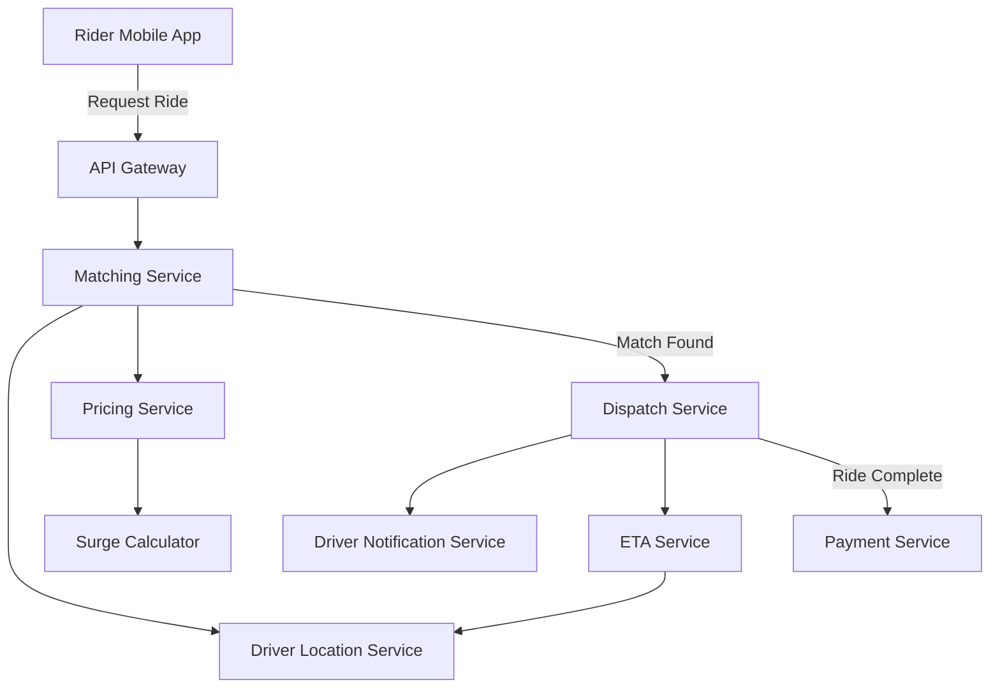

# How to Set Up Observability for a Ride-Sharing Platform Using OpenTelemetry

Author: [nawazdhandala](https://www.github.com/nawazdhandala)

Tags: OpenTelemetry, Observability, Ride-Sharing, Distributed Tracing, Microservices, Monitoring

Description: Learn how to build full-stack observability for a ride-sharing platform using OpenTelemetry, covering tracing, metrics, and logs across matching, pricing, and dispatch services.

---

Ride-sharing platforms are among the most demanding distributed systems in production today. A single ride request touches dozens of services: the mobile app sends a request, a matching engine finds nearby drivers, a pricing service calculates the fare, a dispatch system notifies the driver, and a payment service handles the transaction. When something goes wrong, like a rider waiting five minutes for a match that should take ten seconds, you need to trace that request across every service it touched.

OpenTelemetry gives you the instrumentation layer to make that possible. In this guide, we will walk through setting up observability for the core components of a ride-sharing platform, with real code examples and architecture patterns you can adapt to your own system.

## Architecture Overview

A typical ride-sharing platform has several interconnected services that must work together with low latency. Here is a simplified view of the request flow:



Each arrow represents a network call that can fail, slow down, or produce unexpected results. OpenTelemetry lets you trace a single ride request as it flows through all of these services.

## Setting Up the OpenTelemetry SDK

First, let us configure the base OpenTelemetry setup that every service in the platform will share. We will use Python here since many ride-sharing backends use it, but the concepts apply to any language.

```python
# otel_setup.py - Shared OpenTelemetry configuration for all services
from opentelemetry import trace, metrics
from opentelemetry.sdk.trace import TracerProvider
from opentelemetry.sdk.trace.export import BatchSpanProcessor
from opentelemetry.sdk.metrics import MeterProvider
from opentelemetry.sdk.metrics.export import PeriodicExportingMetricReader
from opentelemetry.exporter.otlp.proto.grpc.trace_exporter import OTLPSpanExporter
from opentelemetry.exporter.otlp.proto.grpc.metric_exporter import OTLPMetricExporter
from opentelemetry.sdk.resources import Resource, SERVICE_NAME, SERVICE_VERSION

def configure_opentelemetry(service_name: str, service_version: str = "1.0.0"):
    """Initialize OpenTelemetry with tracing and metrics for a ride-sharing service."""

    # Resource identifies this service in the observability backend
    resource = Resource.create({
        SERVICE_NAME: service_name,
        SERVICE_VERSION: service_version,
        "deployment.environment": "production",
        "service.namespace": "ride-sharing",
    })

    # Configure tracing with OTLP export
    tracer_provider = TracerProvider(resource=resource)
    span_exporter = OTLPSpanExporter(endpoint="otel-collector:4317", insecure=True)
    tracer_provider.add_span_processor(BatchSpanProcessor(span_exporter))
    trace.set_tracer_provider(tracer_provider)

    # Configure metrics with OTLP export
    metric_reader = PeriodicExportingMetricReader(
        OTLPMetricExporter(endpoint="otel-collector:4317", insecure=True),
        export_interval_millis=10000,  # Export every 10 seconds
    )
    meter_provider = MeterProvider(resource=resource, metric_readers=[metric_reader])
    metrics.set_meter_provider(meter_provider)

    return trace.get_tracer(service_name), metrics.get_meter(service_name)
```

This shared configuration ensures every service reports telemetry with consistent resource attributes. The `service.namespace` attribute groups all ride-sharing services together, which is helpful when your observability backend also handles telemetry from other platforms.

## Instrumenting the Matching Service

The matching service is the heart of the platform. It receives a ride request, queries nearby drivers, scores them, and returns the best match. This is where latency problems most commonly surface.

```python
# matching_service.py - Core matching logic with OpenTelemetry instrumentation
from otel_setup import configure_opentelemetry
from opentelemetry import trace, metrics

tracer, meter = configure_opentelemetry("matching-service")

# Custom metrics for matching performance
match_duration = meter.create_histogram(
    name="ride.match.duration",
    description="Time taken to find a driver match",
    unit="ms",
)
match_attempts = meter.create_counter(
    name="ride.match.attempts",
    description="Number of match attempts by outcome",
)
nearby_drivers_gauge = meter.create_histogram(
    name="ride.nearby_drivers.count",
    description="Number of drivers available within matching radius",
)

async def find_match(ride_request):
    """Find the best available driver for a ride request."""

    # Create a span that covers the entire matching process
    with tracer.start_as_current_span(
        "find_driver_match",
        attributes={
            "ride.request_id": ride_request.id,
            "ride.pickup_lat": ride_request.pickup_lat,
            "ride.pickup_lng": ride_request.pickup_lng,
            "ride.vehicle_type": ride_request.vehicle_type,
        },
    ) as span:
        import time
        start = time.monotonic()

        # Step 1: Query nearby drivers from the location service
        with tracer.start_as_current_span("query_nearby_drivers") as driver_span:
            drivers = await location_service.get_nearby_drivers(
                lat=ride_request.pickup_lat,
                lng=ride_request.pickup_lng,
                radius_km=5.0,
                vehicle_type=ride_request.vehicle_type,
            )
            driver_span.set_attribute("drivers.found", len(drivers))
            nearby_drivers_gauge.record(len(drivers))

        if not drivers:
            span.set_attribute("match.outcome", "no_drivers")
            match_attempts.add(1, {"outcome": "no_drivers"})
            return None

        # Step 2: Score each driver based on distance, rating, acceptance rate
        with tracer.start_as_current_span("score_drivers") as score_span:
            scored = score_drivers(drivers, ride_request)
            score_span.set_attribute("drivers.scored", len(scored))

        # Step 3: Get pricing estimate for the best match
        with tracer.start_as_current_span("get_price_estimate"):
            best_driver = scored[0]
            price = await pricing_service.calculate(ride_request, best_driver)
            span.set_attribute("ride.estimated_price", price.amount)

        # Record match duration and success
        duration_ms = (time.monotonic() - start) * 1000
        match_duration.record(duration_ms, {"vehicle_type": ride_request.vehicle_type})
        match_attempts.add(1, {"outcome": "matched"})

        span.set_attribute("match.outcome", "matched")
        span.set_attribute("match.driver_id", best_driver.id)
        span.set_attribute("match.duration_ms", duration_ms)

        return Match(driver=best_driver, price=price)
```

Notice how each logical step within the matching process gets its own child span. This gives you a waterfall view in your tracing backend, so you can immediately see whether the bottleneck is in querying drivers, scoring them, or getting a price estimate. The custom metrics let you build dashboards that show matching performance trends over time.

## Instrumenting the Dispatch and ETA Services

Once a match is found, the dispatch service takes over. It needs to notify the driver, calculate the ETA, and keep the rider updated. Latency here directly affects the user experience.

```python
# dispatch_service.py - Dispatch logic with tracing and event tracking
from otel_setup import configure_opentelemetry
from opentelemetry import trace

tracer, meter = configure_opentelemetry("dispatch-service")

# Track dispatch outcomes
dispatch_counter = meter.create_counter(
    name="ride.dispatch.total",
    description="Total dispatch attempts by status",
)
eta_accuracy = meter.create_histogram(
    name="ride.eta.accuracy_seconds",
    description="Difference between estimated and actual arrival time",
)

async def dispatch_ride(match):
    """Dispatch a matched ride to the driver and track the full lifecycle."""

    with tracer.start_as_current_span(
        "dispatch_ride",
        attributes={
            "ride.request_id": match.ride_request.id,
            "driver.id": match.driver.id,
        },
    ) as span:

        # Calculate ETA using real-time traffic data
        with tracer.start_as_current_span("calculate_eta") as eta_span:
            eta = await eta_service.calculate(
                driver_location=match.driver.current_location,
                pickup_location=match.ride_request.pickup,
            )
            eta_span.set_attribute("eta.minutes", eta.minutes)
            eta_span.set_attribute("eta.traffic_factor", eta.traffic_multiplier)

        # Send push notification to the driver
        with tracer.start_as_current_span("notify_driver") as notify_span:
            notification_result = await notification_service.send_to_driver(
                driver_id=match.driver.id,
                ride_details=match.ride_request,
                eta=eta,
            )
            notify_span.set_attribute("notification.delivered", notification_result.success)

            # Add span event for the notification delivery timestamp
            if notification_result.success:
                span.add_event("driver_notified", {
                    "driver.id": match.driver.id,
                    "notification.channel": "push",
                })

        # Wait for driver acceptance with timeout
        with tracer.start_as_current_span("await_driver_response") as wait_span:
            response = await wait_for_driver_response(
                driver_id=match.driver.id,
                timeout_seconds=30,
            )
            wait_span.set_attribute("driver.response", response.status)
            wait_span.set_attribute("driver.response_time_seconds", response.elapsed)

        if response.accepted:
            dispatch_counter.add(1, {"status": "accepted"})
            span.add_event("ride_accepted")
        else:
            dispatch_counter.add(1, {"status": "declined"})
            span.add_event("ride_declined")

        return response
```

The span events within the dispatch flow are particularly valuable. When you are investigating why a ride took too long to start, you can look at the trace and see the exact timestamps for when the driver was notified, when they responded, and how long each step took.

## Collector Configuration for Ride-Sharing Telemetry

The OpenTelemetry Collector acts as a central hub for all telemetry data. For a ride-sharing platform, you want to configure it to handle high-throughput data while applying useful transformations.

```yaml
# otel-collector-config.yaml
receivers:
  otlp:
    protocols:
      grpc:
        endpoint: 0.0.0.0:4317
      http:
        endpoint: 0.0.0.0:4318

processors:
  # Batch telemetry for efficient export
  batch:
    timeout: 5s
    send_batch_size: 512
    send_batch_max_size: 1024

  # Add ride-sharing specific resource attributes
  resource:
    attributes:
      - key: platform
        value: ride-sharing
        action: upsert

  # Sample traces intelligently to reduce volume
  # Keep all error traces and slow matches, sample routine traces
  tail_sampling:
    decision_wait: 10s
    policies:
      # Always keep traces with errors
      - name: errors
        type: status_code
        status_code:
          status_codes: [ERROR]
      # Always keep slow matching operations
      - name: slow-matches
        type: latency
        latency:
          threshold_ms: 3000
      # Sample 10% of normal traces
      - name: normal-traffic
        type: probabilistic
        probabilistic:
          sampling_percentage: 10

exporters:
  otlp:
    endpoint: oneuptime-collector:4317
    tls:
      insecure: false

service:
  pipelines:
    traces:
      receivers: [otlp]
      processors: [resource, tail_sampling, batch]
      exporters: [otlp]
    metrics:
      receivers: [otlp]
      processors: [resource, batch]
      exporters: [otlp]
```

The tail sampling configuration is especially important for ride-sharing platforms. During peak hours, you might process thousands of ride requests per minute. Keeping every single trace would be expensive and noisy. By sampling intelligently, you keep all the traces that matter (errors and slow operations) while still maintaining a representative sample of normal traffic.

## Building Dashboards for Ride-Sharing Metrics

With the instrumentation in place, you can build dashboards that give your operations team real-time visibility into platform health. Here are the key metrics to track:

- **ride.match.duration** broken down by vehicle type shows whether certain ride categories are experiencing matching delays
- **ride.match.attempts** with the outcome label reveals your match success rate and helps identify coverage gaps
- **ride.dispatch.total** by status tells you how often drivers accept or decline rides
- **ride.eta.accuracy_seconds** measures how well your ETA predictions hold up against reality
- **ride.nearby_drivers.count** as a time series shows driver supply patterns throughout the day

## Alerting on Critical Paths

Set up alerts on the metrics that directly impact user experience:

- Match duration P95 exceeding 5 seconds means riders are waiting too long
- Match success rate dropping below 80% indicates a supply problem
- Driver notification delivery failures above 5% suggest a push notification infrastructure issue
- ETA accuracy diverging by more than 3 minutes consistently means your routing data may be stale

## Conclusion

Setting up observability for a ride-sharing platform requires thinking carefully about which signals matter at each stage of the ride lifecycle. OpenTelemetry gives you a vendor-neutral way to capture those signals consistently across all your services. The key is to instrument not just the technical operations (HTTP calls, database queries) but also the business-level events (match found, driver notified, ride accepted) that tell the real story of what is happening on your platform.

Start with the matching and dispatch services since they have the most direct impact on user experience, then expand to cover payment processing, driver onboarding, and trip analytics as your observability practice matures.
