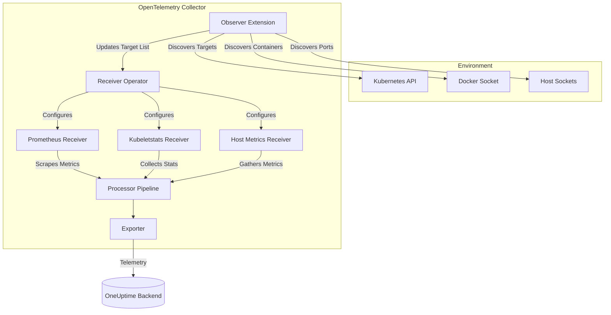

# How to Configure the Observer Extension for Dynamic Service Discovery

Author: [nawazdhandala](https://www.github.com/nawazdhandala)

Tags: OpenTelemetry, Collector, Extension, Service Discovery, Dynamic Configuration, Kubernetes, Docker

Description: Learn how to configure the Observer Extension in OpenTelemetry Collector for automatic service discovery, enabling dynamic monitoring of ephemeral workloads in Kubernetes, Docker.

---

Modern cloud-native environments are highly dynamic. Services scale up and down, containers are created and destroyed, and endpoints change constantly. The Observer Extension in the OpenTelemetry Collector enables automatic discovery of these ephemeral targets, eliminating the need for manual configuration updates and ensuring comprehensive telemetry coverage across your infrastructure.

## What is the Observer Extension?

The Observer Extension is an OpenTelemetry Collector component that automatically discovers services, containers, and endpoints in dynamic environments. It integrates with orchestration platforms like Kubernetes and Docker, and host-level network endpoint discovery, to maintain an up-to-date inventory of monitoring targets.

The extension operates as a discovery mechanism that feeds dynamic target information to receivers. As new services appear or existing services disappear, the Observer Extension automatically updates the receiver configuration without requiring Collector restarts or manual intervention.

Key capabilities include:

- Automatic discovery of Kubernetes pods, ports, services, ingresses, and nodes
- Docker container monitoring with real-time container lifecycle tracking
- Endpoint discovery for scraping metrics from dynamic targets
- Label and annotation-based receiver rules for selective monitoring

## Why Use the Observer Extension?

Manual configuration becomes impractical in dynamic environments. Consider a Kubernetes cluster where pods scale from 10 to 100 instances based on load. Without automatic discovery, you would need to update the Collector configuration every time pods are created or destroyed, resulting in monitoring gaps and operational overhead.

**Challenges Without Service Discovery**:

- **Configuration Drift**: Static configurations quickly become outdated as services scale or migrate
- **Monitoring Gaps**: New services might not be monitored until manually added to configuration
- **Operational Overhead**: DevOps teams spend significant time maintaining monitoring configurations
- **Scale Limitations**: Manual approaches don't scale beyond small, stable environments
- **Delayed Detection**: Issues in newly deployed services go unnoticed until monitoring is manually configured

The Observer Extension solves these problems through continuous, automatic service discovery that adapts to environment changes in real-time.

## Architecture and Integration

The Observer Extension integrates with receivers that support dynamic configuration. Here's how the components work together:


```mermaid
graph TB
    subgraph Environment
        K[Kubernetes API]
        D[Docker Socket]
        H[Host Sockets]
    end

    subgraph OpenTelemetry Collector
        O[Observer Extension] -->|Discovers Targets| K
        O -->|Discovers Containers| D
        O -->|Discovers Ports| H

        O -->|Updates Target List| R[Receiver Operator]

        R -->|Configures| P1[Prometheus Receiver]
        R -->|Configures| P2[Kubeletstats Receiver]
        R -->|Configures| P3[Host Metrics Receiver]

        P1 -->|Scrapes Metrics| PR[Processor Pipeline]
        P2 -->|Collects Stats| PR
        P3 -->|Gathers Metrics| PR

        PR --> E[Exporter]
    end

    E -->|Telemetry| B[(OneUptime Backend)]
```

The Observer Extension watches or refreshes discovery sources such as the Kubernetes API, Docker socket, and host listening sockets. When targets appear or disappear, the extension notifies compatible receivers, which dynamically update their scraping configurations.

## Basic Kubernetes Observer Configuration

The most common use case is Kubernetes service discovery for monitoring pod metrics:

```yaml
# extensions section defines observer configuration

extensions:
  # Kubernetes observer discovers pods and services
  k8s_observer:
    # Authentication method for Kubernetes API
    auth_type: serviceAccount    # Use pod's service account

    # Node on which this observer is running
    # Leave empty to discover all nodes in cluster
    node: ${env:K8S_NODE_NAME}    # Typically set via downward API

    # Watch for specific resource types
    observe_pods: true            # Discover pods
    observe_nodes: true           # Discover nodes
    observe_services: true        # Discover services

# receivers section uses observer data
receivers:
  # Receiver creator dynamically instantiates receivers
  receiver_creator:
    # Link to k8s_observer extension
    watch_observers: [k8s_observer]

    # Configure receivers based on discovered targets
    receivers:
      # Scrape Prometheus metrics from discovered pods
      prometheus:
        # Rule for when to create this receiver
        rule: type == "pod" && annotations["prometheus.io/scrape"] == "true"

        # Dynamic configuration using discovered target data
        config:
          scrape_configs:
            - job_name: 'kubernetes-pods'
              scrape_interval: 30s

              # Use discovered endpoint information
              static_configs:
                - targets: ['`endpoint`:`"prometheus.io/port" in annotations ? annotations["prometheus.io/port"] : 9090`']

              # Preserve Kubernetes labels as metric labels
              relabel_configs:
                - target_label: pod
                  replacement: '`name`'
                - target_label: namespace
                  replacement: '`namespace`'

processors:
  batch:
    timeout: 10s
    send_batch_size: 1024

  # Add resource attributes from discovered metadata
  resource:
    attributes:
      - key: k8s.cluster.name
        value: production-cluster
        action: upsert

exporters:
  otlphttp:
    endpoint: https://oneuptime.com/otlp
    headers:
      x-oneuptime-token: ${env:ONEUPTIME_TOKEN}

service:
  # Enable observer extension
  extensions: [k8s_observer]

  pipelines:
    metrics:
      receivers: [receiver_creator]
      processors: [resource, batch]
      exporters: [otlphttp]
```

This configuration automatically discovers all Kubernetes pods with the `prometheus.io/scrape: "true"` annotation and dynamically creates Prometheus scrape jobs for each discovered target.

## Advanced Kubernetes Discovery Patterns

### Label-Based Filtering

Filter discovered targets based on labels and annotations to monitor specific workload types:

```yaml
extensions:
  k8s_observer:
    auth_type: serviceAccount
    node: ${env:K8S_NODE_NAME}
    observe_pods: true
    observe_services: true

    # Limit discovery to application namespaces
    namespaces: [production, staging]

receivers:
  receiver_creator:
    watch_observers: [k8s_observer]

    receivers:
      # Prometheus receiver for application metrics
      prometheus/app:
        rule: |
          type == "pod" &&
          annotations["prometheus.io/scrape"] == "true" &&
          namespace != "kube-system" &&
          namespace != "kube-public" &&
          namespace != "kube-node-lease" &&
          labels["app.kubernetes.io/component"] == "backend"

        config:
          scrape_configs:
            - job_name: 'backend-metrics'
              scrape_interval: 15s
              metrics_path: '`"prometheus.io/path" in annotations ? annotations["prometheus.io/path"] : "/metrics"`'
              static_configs:
                - targets: ['`endpoint`:`"prometheus.io/port" in annotations ? annotations["prometheus.io/port"] : 9090`']

      # Separate receiver for different component type
      prometheus/frontend:
        rule: |
          type == "pod" &&
          annotations["prometheus.io/scrape"] == "true" &&
          namespace != "kube-system" &&
          namespace != "kube-public" &&
          namespace != "kube-node-lease" &&
          labels["app.kubernetes.io/component"] == "frontend"

        config:
          scrape_configs:
            - job_name: 'frontend-metrics'
              scrape_interval: 30s          # Less frequent for frontend
              static_configs:
                - targets: ['`endpoint`:`"prometheus.io/port" in annotations ? annotations["prometheus.io/port"] : 9090`']

processors:
  batch:
    timeout: 10s

  resource:
    attributes:
      - key: k8s.cluster.name
        value: production-cluster
        action: upsert

exporters:
  otlphttp:
    endpoint: https://oneuptime.com/otlp
    headers:
      x-oneuptime-token: ${env:ONEUPTIME_TOKEN}

service:
  extensions: [k8s_observer]

  pipelines:
    metrics:
      receivers: [receiver_creator]
      processors: [resource, batch]
      exporters: [otlphttp]
```

This configuration creates separate monitoring pipelines for backend and frontend components with different scrape intervals, demonstrating how to handle heterogeneous workloads.

### Multi-Namespace Discovery

Monitor services across multiple namespaces with different configurations:

```yaml
extensions:
  # Observer for production namespace
  k8s_observer/production:
    auth_type: serviceAccount
    observe_pods: true
    namespaces: [production]

  # Observer for staging namespace
  k8s_observer/staging:
    auth_type: serviceAccount
    observe_pods: true
    namespaces: [staging]

receivers:
  # Production monitoring with strict SLAs
  receiver_creator/production:
    watch_observers: [k8s_observer/production]

    receivers:
      prometheus:
        rule: type == "pod" && annotations["prometheus.io/scrape"] == "true"

        config:
          scrape_configs:
            - job_name: 'production-pods'
              scrape_interval: 15s      # Frequent scraping
              scrape_timeout: 10s

              static_configs:
                - targets: ['`endpoint`:`"prometheus.io/port" in annotations ? annotations["prometheus.io/port"] : 9090`']

              metric_relabel_configs:
                # Add environment label
                - target_label: environment
                  replacement: production

  # Staging monitoring with relaxed requirements
  receiver_creator/staging:
    watch_observers: [k8s_observer/staging]

    receivers:
      prometheus:
        rule: type == "pod" && annotations["prometheus.io/scrape"] == "true"

        config:
          scrape_configs:
            - job_name: 'staging-pods'
              scrape_interval: 60s      # Less frequent
              scrape_timeout: 30s

              static_configs:
                - targets: ['`endpoint`:`"prometheus.io/port" in annotations ? annotations["prometheus.io/port"] : 9090`']

              metric_relabel_configs:
                - target_label: environment
                  replacement: staging

processors:
  batch/production:
    timeout: 5s                   # Quick flushing for production
    send_batch_size: 2048

  batch/staging:
    timeout: 30s                  # Longer batching for staging
    send_batch_size: 512

exporters:
  otlphttp:
    endpoint: https://oneuptime.com/otlp
    headers:
      x-oneuptime-token: ${env:ONEUPTIME_TOKEN}

service:
  extensions: [k8s_observer/production, k8s_observer/staging]

  pipelines:
    # Separate pipeline for production metrics
    metrics/production:
      receivers: [receiver_creator/production]
      processors: [batch/production]
      exporters: [otlphttp]

    # Separate pipeline for staging metrics
    metrics/staging:
      receivers: [receiver_creator/staging]
      processors: [batch/staging]
      exporters: [otlphttp]
```

This pattern allows environment-specific monitoring configurations with different scrape intervals, timeouts, and processing strategies.

## Docker Observer Configuration

For Docker environments, the Observer Extension monitors container lifecycle events:

```yaml
extensions:
  # Docker observer watches container events
  docker_observer:
    # Docker socket endpoint
    endpoint: unix:///var/run/docker.sock

    # Watch for container events in real-time
    use_host_bindings: true       # Discover host port mappings

    # Exclude containers by image name using literals, globs, or regex
    excluded_images:
      - "pause"
      - "/.*-sidecar.*/"

receivers:
  receiver_creator:
    watch_observers: [docker_observer]

    receivers:
      # Prometheus receiver for Docker containers
      prometheus:
        rule: type == "container" && labels["prometheus.scrape"] == "true" && port != 0

        config:
          scrape_configs:
            - job_name: 'docker-containers'
              scrape_interval: 30s

              # Use discovered container endpoint
              static_configs:
                - targets: ['`host`:`port`']

              relabel_configs:
                # Add container metadata as labels
                - target_label: container
                  replacement: '`name`'
                - target_label: app
                  replacement: '`labels["app"]`'

  # Docker stats receiver for resource metrics
  docker_stats:
    endpoint: unix:///var/run/docker.sock
    collection_interval: 30s

    # Collect comprehensive container metrics
    metrics:
      container.cpu.usage.total:
        enabled: true
      container.memory.usage.limit:
        enabled: true
      container.network.io.usage.tx_bytes:
        enabled: true
      container.network.io.usage.rx_bytes:
        enabled: true

processors:
  batch:
    timeout: 10s

  # Enrich with Docker metadata
  resource:
    attributes:
      - key: container.runtime
        value: docker
        action: upsert

exporters:
  otlphttp:
    endpoint: https://oneuptime.com/otlp
    headers:
      x-oneuptime-token: ${env:ONEUPTIME_TOKEN}

service:
  extensions: [docker_observer]

  pipelines:
    metrics:
      receivers: [receiver_creator, docker_stats]
      processors: [resource, batch]
      exporters: [otlphttp]
```

This configuration automatically discovers Docker containers with monitoring labels and collects both application metrics (via Prometheus) and container resource metrics (via Docker stats).

## Host Observer for Static Infrastructure

For traditional infrastructure with VMs or bare-metal hosts, use the host observer:

```yaml
extensions:
  # Host observer monitors local endpoints
  host_observer:
    # Interval for endpoint discovery
    refresh_interval: 30s

receivers:
  receiver_creator:
    watch_observers: [host_observer]

    receivers:
      # Prometheus receiver for discovered endpoints
      prometheus:
        rule: type == "port"

        config:
          scrape_configs:
            - job_name: 'host-endpoints'
              scrape_interval: 30s

              static_configs:
                - targets: ['`endpoint`']

              relabel_configs:
                - source_labels: [__address__]
                  target_label: instance

  # Host metrics receiver for system metrics
  host_metrics:
    collection_interval: 30s

    scrapers:
      cpu:
        metrics:
          system.cpu.utilization:
            enabled: true
      memory:
        metrics:
          system.memory.utilization:
            enabled: true
      disk:
        metrics:
          system.disk.io:
            enabled: true
      network:
        metrics:
          system.network.io:
            enabled: true
      processes:
        metrics:
          system.processes.count:
            enabled: true

processors:
  batch:
    timeout: 10s

  resource:
    attributes:
      - key: host.name
        value: ${env:HOSTNAME}
        action: upsert

exporters:
  otlphttp:
    endpoint: https://oneuptime.com/otlp
    headers:
      x-oneuptime-token: ${env:ONEUPTIME_TOKEN}

service:
  extensions: [host_observer]

  pipelines:
    metrics:
      receivers: [receiver_creator, host_metrics]
      processors: [resource, batch]
      exporters: [otlphttp]
```

The host observer is useful for monitoring services on static infrastructure or development environments where orchestration platforms are not available.

## Performance and Scalability

### Optimizing Discovery Scope

Balance discovery coverage with API load:

```yaml
extensions:
  # Discovery for critical production workloads
  k8s_observer/critical:
    auth_type: serviceAccount
    namespaces: [production]
    kube_api_qps: 10
    kube_api_burst: 20

  # Standard discovery for normal workloads
  k8s_observer/standard:
    auth_type: serviceAccount
    namespaces: [staging]
    kube_api_qps: 5
    kube_api_burst: 10

  # Batch namespace discovery
  k8s_observer/batch:
    auth_type: serviceAccount
    namespaces: [batch-jobs]
    kube_api_qps: 2
    kube_api_burst: 5

receivers:
  receiver_creator/critical:
    watch_observers: [k8s_observer/critical]
    receivers:
      prometheus:
        rule: |
          type == "pod" &&
          annotations["prometheus.io/scrape"] == "true" &&
          labels["tier"] == "critical"
        config:
          scrape_configs:
            - job_name: 'critical'
              scrape_interval: 15s
              static_configs:
                - targets: ['`endpoint`:`"prometheus.io/port" in annotations ? annotations["prometheus.io/port"] : 9090`']

  receiver_creator/standard:
    watch_observers: [k8s_observer/standard]
    receivers:
      prometheus:
        rule: |
          type == "pod" &&
          annotations["prometheus.io/scrape"] == "true" &&
          labels["tier"] == "standard"
        config:
          scrape_configs:
            - job_name: 'standard'
              scrape_interval: 30s
              static_configs:
                - targets: ['`endpoint`:`"prometheus.io/port" in annotations ? annotations["prometheus.io/port"] : 9090`']

  receiver_creator/batch:
    watch_observers: [k8s_observer/batch]
    receivers:
      prometheus:
        rule: type == "pod" && annotations["prometheus.io/scrape"] == "true"
        config:
          scrape_configs:
            - job_name: 'batch'
              scrape_interval: 60s
              static_configs:
                - targets: ['`endpoint`:`"prometheus.io/port" in annotations ? annotations["prometheus.io/port"] : 9090`']

processors:
  batch:
    timeout: 10s

exporters:
  otlphttp:
    endpoint: https://oneuptime.com/otlp
    headers:
      x-oneuptime-token: ${env:ONEUPTIME_TOKEN}

service:
  extensions:
    - k8s_observer/critical
    - k8s_observer/standard
    - k8s_observer/batch

  pipelines:
    metrics:
      receivers:
        - receiver_creator/critical
        - receiver_creator/standard
        - receiver_creator/batch
      processors: [batch]
      exporters: [otlphttp]
```

This tiered approach reduces API load by limiting which namespaces are watched and by applying workload filters in receiver rules.

### Memory Management

Limit memory consumption in large environments:

```yaml
extensions:
  k8s_observer:
    auth_type: serviceAccount
    namespaces: [production]

receivers:
  receiver_creator:
    watch_observers: [k8s_observer]

    receivers:
      prometheus:
        rule: type == "pod" && annotations["prometheus.io/scrape"] == "true"
        config:
          scrape_configs:
            - job_name: 'pods'
              scrape_interval: 30s
              static_configs:
                - targets: ['`endpoint`:`"prometheus.io/port" in annotations ? annotations["prometheus.io/port"] : 9090`']

processors:
  # Protect against memory exhaustion
  memory_limiter:
    check_interval: 1s
    limit_mib: 4096               # Hard limit (4GB)
    spike_limit_mib: 1024

  batch:
    timeout: 10s

exporters:
  otlphttp:
    endpoint: https://oneuptime.com/otlp
    headers:
      x-oneuptime-token: ${env:ONEUPTIME_TOKEN}

service:
  extensions: [k8s_observer]

  pipelines:
    metrics:
      receivers: [receiver_creator]
      processors: [memory_limiter, batch]
      exporters: [otlphttp]
```

The memory limiter helps protect the Collector process from memory exhaustion; namespace scoping and selective receiver rules reduce the number of dynamic receivers created in large environments.

## Troubleshooting and Debugging

### Enable Discovery Logging

Debug discovery issues with detailed logging:

```yaml
extensions:
  k8s_observer:
    auth_type: serviceAccount

receivers:
  receiver_creator:
    watch_observers: [k8s_observer]

    receivers:
      prometheus:
        rule: type == "pod" && annotations["prometheus.io/scrape"] == "true"
        config:
          scrape_configs:
            - job_name: 'pods'
              scrape_interval: 30s
              static_configs:
                - targets: ['`endpoint`:`"prometheus.io/port" in annotations ? annotations["prometheus.io/port"] : 9090`']

processors:
  batch:
    timeout: 10s

exporters:
  # Use debug exporter for local inspection
  debug:
    verbosity: detailed
    sampling_initial: 10
    sampling_thereafter: 100

  otlphttp:
    endpoint: https://oneuptime.com/otlp
    headers:
      x-oneuptime-token: ${env:ONEUPTIME_TOKEN}

service:
  # Enable debug telemetry
  telemetry:
    logs:
      level: debug

  extensions: [k8s_observer]

  pipelines:
    metrics:
      receivers: [receiver_creator]
      processors: [batch]
      exporters: [debug, otlphttp]
```

Collector debug logs and the debug exporter output help diagnose discovery and configuration issues.

## Production Best Practices

### RBAC Configuration for Kubernetes

Grant minimal required permissions:

```yaml
# ServiceAccount
apiVersion: v1
kind: ServiceAccount
metadata:
  name: otel-collector-observer
  namespace: observability

---
# ClusterRole with minimal permissions
apiVersion: rbac.authorization.k8s.io/v1
kind: ClusterRole
metadata:
  name: otel-collector-observer
rules:
  # Read-only access to pods
  - apiGroups: [""]
    resources: ["pods"]
    verbs: ["get", "list", "watch"]

  # Read-only access to services
  - apiGroups: [""]
    resources: ["services"]
    verbs: ["get", "list", "watch"]

  # Read-only access to nodes (for node observer)
  - apiGroups: [""]
    resources: ["nodes"]
    verbs: ["get", "list", "watch"]

  # Read-only access to ingresses (if observe_ingresses is enabled)
  - apiGroups: ["networking.k8s.io"]
    resources: ["ingresses"]
    verbs: ["get", "list", "watch"]

---
# ClusterRoleBinding
apiVersion: rbac.authorization.k8s.io/v1
kind: ClusterRoleBinding
metadata:
  name: otel-collector-observer
roleRef:
  apiGroup: rbac.authorization.k8s.io
  kind: ClusterRole
  name: otel-collector-observer
subjects:
  - kind: ServiceAccount
    name: otel-collector-observer
    namespace: observability
```

### High Availability Deployment

Deploy observers in DaemonSet mode for node-level discovery:

```yaml
apiVersion: apps/v1
kind: DaemonSet
metadata:
  name: otel-collector-observer
  namespace: observability
spec:
  selector:
    matchLabels:
      app: otel-collector-observer

  template:
    metadata:
      labels:
        app: otel-collector-observer

    spec:
      serviceAccountName: otel-collector-observer

      # Node selector for specific node pools
      nodeSelector:
        node-role.kubernetes.io/worker: "true"

      # Tolerate taints to run on all nodes
      tolerations:
        - effect: NoSchedule
          operator: Exists

      containers:
        - name: otel-collector
          image: otel/opentelemetry-collector-contrib:0.153.0

          env:
            # Inject node name for node-scoped discovery
            - name: K8S_NODE_NAME
              valueFrom:
                fieldRef:
                  fieldPath: spec.nodeName

            - name: K8S_NAMESPACE
              valueFrom:
                fieldRef:
                  fieldPath: metadata.namespace

            - name: ONEUPTIME_TOKEN
              valueFrom:
                secretKeyRef:
                  name: oneuptime-credentials
                  key: token

          volumeMounts:
            - name: config
              mountPath: /etc/otel-collector

          resources:
            limits:
              memory: 1Gi
              cpu: 500m
            requests:
              memory: 512Mi
              cpu: 200m

      volumes:
        - name: config
          configMap:
            name: otel-collector-observer-config
```

DaemonSet deployment ensures each node has a local observer for efficient, scalable discovery.

## Related Resources

For comprehensive observability in dynamic environments, explore these related topics:

- [OpenTelemetry Collector: What It Is, When You Need It, and When You Don't](https://oneuptime.com/blog/post/2025-09-18-what-is-opentelemetry-collector-and-why-use-one/view)
- [How to reduce noise in OpenTelemetry](https://oneuptime.com/blog/post/2025-08-25-how-to-reduce-noise-in-opentelemetry/view)
- [Kubernetes Network Policies for Zero Trust Security](https://oneuptime.com/blog/post/2026-01-06-kubernetes-network-policies-zero-trust/view)

## Summary

The Observer Extension enables automatic service discovery in dynamic environments, eliminating manual configuration maintenance and ensuring comprehensive telemetry coverage. By integrating with Kubernetes, Docker, and host-level discovery, it adapts monitoring configurations in real-time as services scale and migrate.

Start with basic Kubernetes pod discovery using annotation-based filtering. As requirements grow, implement label-based filtering, multi-namespace discovery, and tiered scrape intervals to optimize for your specific environment characteristics.

Monitor discovery performance through internal metrics and adjust Kubernetes API QPS and burst settings based on API load and discovery latency requirements. Proper RBAC configuration ensures security while DaemonSet deployments provide scalable, efficient discovery across large clusters.

The Observer Extension transforms static monitoring configurations into dynamic, self-adapting observability pipelines that keep pace with modern cloud-native environments.

Need a production-grade backend for your dynamic observability infrastructure? OneUptime provides native support for OpenTelemetry with automatic service correlation, intelligent aggregation, and comprehensive cloud-native integration without vendor lock-in.
