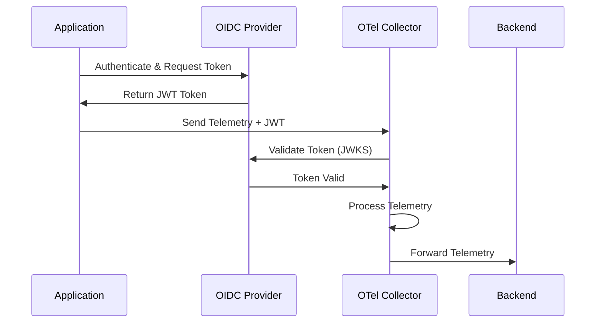

# How to Configure OIDC Auth Extension in the OpenTelemetry Collector

Author: [nawazdhandala](https://www.github.com/nawazdhandala)

Tags: OpenTelemetry, Collector, Extensions, Authentication, OIDC, OAuth2, Security, Identity

Description: Learn how to configure OpenID Connect authentication in the OpenTelemetry Collector to secure receivers with token-based identity verification and authorization.

OpenID Connect (OIDC) is an identity layer built on top of OAuth 2.0 that enables clients to verify the identity of end users. The OpenTelemetry Collector's OIDC auth extension provides robust authentication for incoming telemetry data by validating JWT tokens issued by OIDC providers like Auth0, Okta, Keycloak, or cloud identity platforms.

## Understanding OIDC Authentication

OpenID Connect extends OAuth 2.0 by adding an identity layer that returns information about authenticated users. When a client authenticates with an OIDC provider, it receives an ID token (a JWT) that contains claims about the user's identity. These tokens can be validated to ensure that requests come from authenticated and authorized sources.

The OIDC auth extension in the OpenTelemetry Collector validates these JWT tokens for incoming requests, ensuring that only authenticated clients can send telemetry data. This is particularly valuable in multi-tenant environments, service mesh architectures, or when exposing collectors to untrusted networks.

## Why Use OIDC Authentication?

OIDC authentication provides several advantages for securing telemetry pipelines:

**Strong Identity Verification**: OIDC tokens contain cryptographically signed claims that verify the identity of the sender, making it difficult to forge or impersonate legitimate clients.

**Fine-Grained Authorization**: Token claims can include custom attributes like user roles, tenant IDs, or service names, enabling sophisticated authorization logic.

**Centralized Identity Management**: Integrate with enterprise identity providers to leverage existing authentication infrastructure and user management systems.

**Token Expiration**: JWT tokens have built-in expiration times, automatically limiting the window of opportunity if a token is compromised.

**Industry Standard**: OIDC is widely adopted across cloud platforms, making it compatible with numerous identity providers and existing security infrastructure.

## Architecture Overview

The OIDC auth extension validates incoming requests by verifying JWT tokens against an OIDC provider:



The collector obtains the OIDC provider's public keys (JWKS) to validate token signatures without making a request for every validation, enabling efficient authentication at scale.

## Basic Configuration

Here's a minimal OIDC configuration for protecting a collector receiver:

```yaml
# Define the OIDC auth extension
extensions:
  # oidc extension configuration
  oidc:
    # URL of the OIDC issuer (identity provider)
    issuer_url: "https://accounts.google.com"
    # Audience claim that must be present in the token
    audience: "your-client-id"

# Configure receivers that require authentication
receivers:
  otlp:
    protocols:
      grpc:
        endpoint: 0.0.0.0:4317
        # Require OIDC authentication for incoming requests
        auth:
          authenticator: oidc
      http:
        endpoint: 0.0.0.0:4318
        auth:
          authenticator: oidc

# Processors transform the data
processors:
  batch:
    timeout: 10s
    send_batch_size: 1024

# Exporters send data to backends
exporters:
  logging:
    loglevel: info

# Service configuration
service:
  # Include the extension in the service
  extensions: [oidc]

  pipelines:
    traces:
      receivers: [otlp]
      processors: [batch]
      exporters: [logging]
```

With this configuration, clients must include a valid JWT token in the Authorization header when sending telemetry:

```bash
curl -X POST https://localhost:4318/v1/traces \
  -H "Authorization: Bearer YOUR_JWT_TOKEN" \
  -H "Content-Type: application/json" \
  -d '{"resourceSpans": []}'
```

## Advanced OIDC Configuration

The OIDC extension supports various configuration options for different identity providers and security requirements:

```yaml
extensions:
  oidc:
    # OIDC provider configuration
    issuer_url: "https://auth.example.com"

    # Expected audience claim in the token
    # This should match your application/service identifier
    audience: "otel-collector-production"

    # Optional: Additional audiences to accept
    audiences:
      - "otel-collector-production"
      - "otel-collector-staging"

    # Optional: Username claim to extract from token
    # Default is "sub" (subject)
    username_claim: "email"

    # Optional: Groups claim for authorization
    groups_claim: "groups"

    # Optional: Custom CA certificate for OIDC provider
    issuer_ca_path: "/etc/otel/certs/idp-ca.crt"

    # Optional: Claim mappings for attribute extraction
    attribute:
      # Extract tenant ID from custom claim
      tenant_id: "tenant"
      # Extract service name from claim
      service_name: "service"

receivers:
  otlp:
    protocols:
      grpc:
        endpoint: 0.0.0.0:4317
        auth:
          authenticator: oidc
        # TLS configuration for encrypted transport
        tls:
          cert_file: /etc/otel/certs/server.crt
          key_file: /etc/otel/certs/server.key

processors:
  batch:
    timeout: 10s

  # Add authentication context to telemetry
  resource:
    attributes:
      - key: authenticated
        value: "true"
        action: upsert

exporters:
  otlp:
    endpoint: backend.example.com:4317

service:
  extensions: [oidc]

  pipelines:
    traces:
      receivers: [otlp]
      processors: [resource, batch]
      exporters: [otlp]
```

## Integration with Auth0

Auth0 is a popular identity platform that provides OIDC authentication. Here's how to configure the collector to work with Auth0:

```yaml
extensions:
  oidc:
    # Auth0 tenant domain
    issuer_url: "https://your-tenant.auth0.com/"

    # Auth0 API identifier (audience)
    audience: "https://api.yourcompany.com/otel-collector"

    # Use email as username
    username_claim: "email"

    # Optional: Require specific Auth0 roles
    groups_claim: "https://yourcompany.com/roles"

receivers:
  otlp:
    protocols:
      http:
        endpoint: 0.0.0.0:4318
        auth:
          authenticator: oidc
        tls:
          cert_file: /etc/otel/certs/server.crt
          key_file: /etc/otel/certs/server.key

processors:
  batch:
    timeout: 10s

  # Add user context from token
  resource:
    attributes:
      - key: user.authenticated
        value: "true"
        action: upsert

exporters:
  otlp:
    endpoint: backend.example.com:4317

service:
  extensions: [oidc]

  pipelines:
    traces:
      receivers: [otlp]
      processors: [resource, batch]
      exporters: [otlp]
```

Applications authenticate with Auth0 and include the token when sending telemetry:

```javascript
// Node.js example
const axios = require('axios');
const { auth } = require('express-oauth2-jwt-bearer');

// Get token from Auth0
async function getAuth0Token() {
  const response = await axios.post(
    'https://your-tenant.auth0.com/oauth/token',
    {
      client_id: 'YOUR_CLIENT_ID',
      client_secret: 'YOUR_CLIENT_SECRET',
      audience: 'https://api.yourcompany.com/otel-collector',
      grant_type: 'client_credentials'
    }
  );
  return response.data.access_token;
}

// Send telemetry with token
async function sendTelemetry(traces) {
  const token = await getAuth0Token();

  await axios.post(
    'https://collector.example.com:4318/v1/traces',
    traces,
    {
      headers: {
        'Authorization': `Bearer ${token}`,
        'Content-Type': 'application/json'
      }
    }
  );
}
```

## Integration with Keycloak

Keycloak is an open-source identity and access management solution that supports OIDC:

```yaml
extensions:
  oidc:
    # Keycloak realm URL
    issuer_url: "https://keycloak.example.com/realms/production"

    # Client ID configured in Keycloak
    audience: "otel-collector"

    # Extract username from preferred_username claim
    username_claim: "preferred_username"

    # Extract groups from realm roles
    groups_claim: "realm_access.roles"

receivers:
  otlp:
    protocols:
      grpc:
        endpoint: 0.0.0.0:4317
        auth:
          authenticator: oidc
        tls:
          cert_file: /etc/otel/certs/server.crt
          key_file: /etc/otel/certs/server.key

processors:
  batch:
    timeout: 10s

  # Filter based on authentication context
  filter:
    traces:
      span:
        # Only allow authenticated spans
        - 'attributes["authenticated"] == "true"'

exporters:
  otlp:
    endpoint: backend.example.com:4317

service:
  extensions: [oidc]

  pipelines:
    traces:
      receivers: [otlp]
      processors: [batch, filter]
      exporters: [otlp]
```

## Multi-Tenant Configuration

For multi-tenant environments, use token claims to route telemetry to tenant-specific pipelines:

```yaml
extensions:
  oidc:
    issuer_url: "https://auth.example.com"
    audience: "otel-collector-multitenant"

    # Extract tenant ID from custom claim
    attribute:
      tenant_id: "tenant_id"

receivers:
  otlp:
    protocols:
      http:
        endpoint: 0.0.0.0:4318
        auth:
          authenticator: oidc

processors:
  batch:
    timeout: 10s

  # Add tenant context from token claims
  resource:
    attributes:
      - key: tenant.id
        from_attribute: tenant_id
        action: upsert

  # Route based on tenant ID
  routing:
    from_attribute: tenant.id
    table:
      - value: "tenant-a"
        exporters: [otlp/tenant-a]
      - value: "tenant-b"
        exporters: [otlp/tenant-b]
    default_exporters: [otlp/default]

exporters:
  # Tenant-specific exporters
  otlp/tenant-a:
    endpoint: backend-a.example.com:4317

  otlp/tenant-b:
    endpoint: backend-b.example.com:4317

  otlp/default:
    endpoint: backend-default.example.com:4317

service:
  extensions: [oidc]

  pipelines:
    traces:
      receivers: [otlp]
      processors: [resource, batch, routing]
      # Routing processor handles exporter selection
```

## Integration with Cloud Identity Providers

Configure the collector to work with major cloud identity providers:

### Google Cloud Identity Platform

```yaml
extensions:
  oidc:
    issuer_url: "https://accounts.google.com"
    audience: "YOUR_CLIENT_ID.apps.googleusercontent.com"
    username_claim: "email"

receivers:
  otlp:
    protocols:
      http:
        endpoint: 0.0.0.0:4318
        auth:
          authenticator: oidc

processors:
  batch:
    timeout: 10s

exporters:
  otlp:
    endpoint: backend.example.com:4317

service:
  extensions: [oidc]
  pipelines:
    traces:
      receivers: [otlp]
      processors: [batch]
      exporters: [otlp]
```

### Azure Active Directory

```yaml
extensions:
  oidc:
    issuer_url: "https://login.microsoftonline.com/YOUR_TENANT_ID/v2.0"
    audience: "api://otel-collector"
    username_claim: "preferred_username"
    groups_claim: "roles"

receivers:
  otlp:
    protocols:
      http:
        endpoint: 0.0.0.0:4318
        auth:
          authenticator: oidc

processors:
  batch:
    timeout: 10s

exporters:
  otlp:
    endpoint: backend.example.com:4317

service:
  extensions: [oidc]
  pipelines:
    traces:
      receivers: [otlp]
      processors: [batch]
      exporters: [otlp]
```

### AWS Cognito

```yaml
extensions:
  oidc:
    issuer_url: "https://cognito-idp.REGION.amazonaws.com/YOUR_USER_POOL_ID"
    audience: "YOUR_APP_CLIENT_ID"
    username_claim: "cognito:username"
    groups_claim: "cognito:groups"

receivers:
  otlp:
    protocols:
      http:
        endpoint: 0.0.0.0:4318
        auth:
          authenticator: oidc

processors:
  batch:
    timeout: 10s

exporters:
  otlp:
    endpoint: backend.example.com:4317

service:
  extensions: [oidc]
  pipelines:
    traces:
      receivers: [otlp]
      processors: [batch]
      exporters: [otlp]
```

## Kubernetes Deployment

Deploy the collector with OIDC authentication in Kubernetes:

```yaml
apiVersion: v1
kind: ConfigMap
metadata:
  name: otel-collector-config
  namespace: observability
data:
  config.yaml: |
    extensions:
      oidc:
        issuer_url: "https://auth.example.com"
        audience: "otel-collector-k8s"
        username_claim: "email"
        groups_claim: "groups"

    receivers:
      otlp:
        protocols:
          http:
            endpoint: 0.0.0.0:4318
            auth:
              authenticator: oidc
            tls:
              cert_file: /etc/otel/certs/tls.crt
              key_file: /etc/otel/certs/tls.key

    processors:
      batch:
        timeout: 10s

      resource:
        attributes:
          - key: k8s.cluster
            value: "production"
            action: upsert

    exporters:
      otlp:
        endpoint: backend.example.com:4317

    service:
      extensions: [oidc]
      pipelines:
        traces:
          receivers: [otlp]
          processors: [resource, batch]
          exporters: [otlp]
---
apiVersion: apps/v1
kind: Deployment
metadata:
  name: otel-collector
  namespace: observability
spec:
  replicas: 3
  selector:
    matchLabels:
      app: otel-collector
  template:
    metadata:
      labels:
        app: otel-collector
    spec:
      containers:
      - name: otel-collector
        image: otel/opentelemetry-collector-contrib:latest
        volumeMounts:
        - name: config
          mountPath: /etc/otel
          readOnly: true
        - name: certs
          mountPath: /etc/otel/certs
          readOnly: true
        args:
        - --config=/etc/otel/config.yaml
        ports:
        - containerPort: 4318
          name: otlp-http
      volumes:
      - name: config
        configMap:
          name: otel-collector-config
      - name: certs
        secret:
          secretName: otel-collector-tls
---
apiVersion: v1
kind: Service
metadata:
  name: otel-collector
  namespace: observability
spec:
  selector:
    app: otel-collector
  ports:
  - name: otlp-http
    port: 4318
    targetPort: 4318
  type: ClusterIP
```

## Production Configuration

Here's a comprehensive production configuration with OIDC authentication:

```yaml
extensions:
  # OIDC authentication
  oidc:
    issuer_url: "https://auth.production.example.com"
    audience: "otel-collector-production"
    username_claim: "email"
    groups_claim: "groups"
    issuer_ca_path: "/etc/otel/certs/idp-ca.crt"

    attribute:
      tenant_id: "tenant_id"
      environment: "env"

  # Health check endpoint
  health_check:
    endpoint: 0.0.0.0:13133

  # Performance profiling
  pprof:
    endpoint: localhost:1777

receivers:
  otlp:
    protocols:
      grpc:
        endpoint: 0.0.0.0:4317
        auth:
          authenticator: oidc
        tls:
          cert_file: /etc/otel/certs/server.crt
          key_file: /etc/otel/certs/server.key
          client_ca_file: /etc/otel/certs/ca.crt
      http:
        endpoint: 0.0.0.0:4318
        auth:
          authenticator: oidc
        tls:
          cert_file: /etc/otel/certs/server.crt
          key_file: /etc/otel/certs/server.key
          client_ca_file: /etc/otel/certs/ca.crt

processors:
  # Prevent memory issues
  memory_limiter:
    check_interval: 1s
    limit_mib: 2048
    spike_limit_mib: 512

  # Add authentication context
  resource:
    attributes:
      - key: authenticated
        value: "true"
        action: upsert
      - key: tenant.id
        from_attribute: tenant_id
        action: upsert

  # Batch for efficiency
  batch:
    timeout: 10s
    send_batch_size: 2048

  # Remove sensitive attributes
  attributes:
    actions:
      - key: password
        action: delete
      - key: token
        action: delete

exporters:
  otlp/backend:
    endpoint: backend.production.example.com:4317
    tls:
      insecure: false
      ca_file: /etc/otel/certs/backend-ca.crt
    retry_on_failure:
      enabled: true
      initial_interval: 5s
      max_interval: 30s
    sending_queue:
      enabled: true
      num_consumers: 10
      queue_size: 5000

  logging:
    loglevel: info
    sampling_initial: 5
    sampling_thereafter: 200

service:
  extensions: [oidc, health_check, pprof]

  pipelines:
    traces:
      receivers: [otlp]
      processors: [memory_limiter, resource, attributes, batch]
      exporters: [otlp/backend, logging]

    metrics:
      receivers: [otlp]
      processors: [memory_limiter, resource, batch]
      exporters: [otlp/backend]
```

## Troubleshooting

**Token Validation Failures**: Ensure the issuer URL is correct and accessible from the collector. Check that the audience claim in tokens matches the configured audience.

**Certificate Issues**: If the OIDC provider uses a custom CA, provide the certificate via issuer_ca_path. Verify certificate validity and trust chain.

**Claim Extraction**: Use the collector's debug logging to see what claims are present in tokens. Adjust username_claim and groups_claim accordingly.

**Performance**: OIDC validation requires fetching and caching JWKS. Monitor the collector's performance and adjust caching settings if needed.

## Security Best Practices

Always use TLS for receiver endpoints when OIDC authentication is enabled. Token validation alone does not encrypt data in transit.

Configure short token expiration times (15-60 minutes) to limit the window of opportunity if tokens are compromised.

Implement token refresh mechanisms in client applications to automatically obtain new tokens before expiration.

Monitor authentication failures which could indicate expired tokens, misconfigured clients, or potential security incidents.

Use the groups_claim to implement authorization logic, ensuring clients can only access resources they are permitted to use.

## Related Resources

For more information about OpenTelemetry Collector authentication, check out these related posts:

- [How to Configure Bearer Token Auth Extension in the OpenTelemetry Collector](https://oneuptime.com/blog/post/2026-02-06-bearer-token-auth-extension-opentelemetry-collector/view)
- [How to Configure Basic Auth Extension in the OpenTelemetry Collector](https://oneuptime.com/blog/post/2026-02-06-basic-auth-extension-opentelemetry-collector/view)
- [How to Configure OAuth2 Client Auth Extension in the OpenTelemetry Collector](https://oneuptime.com/blog/post/2026-02-06-oauth2-client-auth-extension-opentelemetry-collector/view)

OIDC authentication provides enterprise-grade security for OpenTelemetry Collector deployments. By integrating with existing identity infrastructure and validating cryptographically signed tokens, you can ensure that only authenticated and authorized clients can send telemetry data to your collectors.
