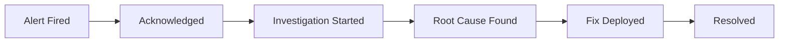

# How to Build an On-Call Dashboard with Alert History and MTTR Trends from OpenTelemetry Data

Author: [nawazdhandala](https://www.github.com/nawazdhandala)

Tags: OpenTelemetry, On-Call, MTTR, Observability, Incident Management

Description: Build an on-call dashboard that tracks alert history and mean time to resolution trends using OpenTelemetry metrics and traces.

On-call rotations generate a huge amount of operational data - alerts fired, acknowledgment times, resolution durations, escalation counts. Most teams track these in spreadsheets or rely on their incident management tool's built-in reports. But if you are already collecting telemetry with OpenTelemetry, you can build a far more useful on-call dashboard that correlates alert patterns with actual system behavior.

This post walks through instrumenting your alerting pipeline with OpenTelemetry, computing MTTR (Mean Time to Resolution) from span data, and building a dashboard that surfaces actionable trends.

## The Data Model

On-call metrics break down into a few key signals:

- **Alert volume** - how many alerts fire per shift, per service, per severity
- **Acknowledgment time** - how long before someone responds
- **Resolution time** - how long from alert to resolution (MTTR)
- **Escalation rate** - how often alerts escalate beyond the first responder
- **Noise ratio** - alerts that auto-resolve or get closed without action

We can model each incident as an OpenTelemetry trace, with spans representing each phase of the incident lifecycle.



## Instrumenting the Alert Pipeline

The first step is to emit a span each time an alert fires and track subsequent lifecycle events as child spans. Here is a Python example using the OpenTelemetry SDK that instruments an alert handler.

```python
from opentelemetry import trace
from opentelemetry.trace import StatusCode
import time

tracer = trace.get_tracer("oncall.alert.pipeline")

def handle_alert(alert):
    # Start a root span for the full incident lifecycle
    with tracer.start_as_current_span(
        "incident.lifecycle",
        attributes={
            "alert.id": alert["id"],
            "alert.severity": alert["severity"],
            "alert.service": alert["service"],
            "alert.source": alert["source"],
            "oncall.responder": alert["assigned_to"],
        }
    ) as incident_span:

        # Child span for the acknowledgment phase
        with tracer.start_as_current_span("incident.acknowledge") as ack_span:
            ack_time = wait_for_acknowledgment(alert)
            ack_span.set_attribute("incident.ack_time_seconds", ack_time)

        # Child span for the investigation phase
        with tracer.start_as_current_span("incident.investigate") as inv_span:
            root_cause = investigate(alert)
            inv_span.set_attribute("incident.root_cause", root_cause)

        # Child span for the resolution phase
        with tracer.start_as_current_span("incident.resolve") as res_span:
            resolve(alert, root_cause)
            res_span.set_attribute("incident.resolution_method", "deploy_fix")

        incident_span.set_status(StatusCode.OK)
```

## Recording MTTR as a Metric

Traces give you per-incident detail, but for dashboard trends you also want aggregated metrics. Record MTTR as a histogram so you can compute percentiles over time.

```python
from opentelemetry import metrics

meter = metrics.get_meter("oncall.metrics")

# Histogram captures the distribution of resolution times
mttr_histogram = meter.create_histogram(
    name="incident.mttr.seconds",
    description="Mean Time to Resolution in seconds",
    unit="s",
)

alert_counter = meter.create_counter(
    name="incident.alerts.total",
    description="Total number of alerts fired",
)

def record_incident_metrics(alert, resolution_time_seconds):
    labels = {
        "service": alert["service"],
        "severity": alert["severity"],
        "shift": get_current_shift(),  # e.g., "us-east-morning"
    }
    # Record the resolution time in the histogram
    mttr_histogram.record(resolution_time_seconds, labels)
    # Increment the alert counter
    alert_counter.add(1, labels)
```

## OpenTelemetry Collector Configuration

Route the incident telemetry through the OpenTelemetry Collector. This configuration receives OTLP data and exports traces to Jaeger and metrics to Prometheus.

```yaml
# otel-collector-config.yaml
receivers:
  otlp:
    protocols:
      grpc:
        endpoint: 0.0.0.0:4317
      http:
        endpoint: 0.0.0.0:4318

processors:
  batch:
    timeout: 10s
    send_batch_size: 512

  # Add shift metadata based on time of day
  attributes:
    actions:
      - key: oncall.shift_period
        value: "business_hours"
        action: upsert

exporters:
  # Traces go to Jaeger for per-incident drill-down
  otlp/jaeger:
    endpoint: jaeger:4317
    tls:
      insecure: true

  # Metrics go to Prometheus for dashboard aggregation
  prometheusremotewrite:
    endpoint: http://prometheus:9090/api/v1/write

service:
  pipelines:
    traces:
      receivers: [otlp]
      processors: [batch, attributes]
      exporters: [otlp/jaeger]
    metrics:
      receivers: [otlp]
      processors: [batch]
      exporters: [prometheusremotewrite]
```

## Building the Dashboard Queries

With metrics flowing into Prometheus, you can build panels that answer the questions your team actually cares about. Here are the key PromQL queries.

```promql
# MTTR p50 over the last 7 days, broken down by service
histogram_quantile(0.50,
  sum(rate(incident_mttr_seconds_bucket[7d])) by (le, service)
)

# Alert volume per shift per day
sum(increase(incident_alerts_total[1d])) by (shift, severity)

# MTTR trend - weekly p95 over the last 3 months
histogram_quantile(0.95,
  sum(rate(incident_mttr_seconds_bucket[7d])) by (le)
)

# Noise ratio - alerts resolved in under 60 seconds (likely auto-resolved)
sum(rate(incident_mttr_seconds_bucket{le="60"}[7d]))
/
sum(rate(incident_mttr_seconds_count[7d]))
```

## What to Put on the Dashboard

A good on-call dashboard should have these panels:

1. **Alert volume heatmap** - shows when alerts cluster by hour and day of week
2. **MTTR trend line** - p50 and p95 resolution times over weeks, so you can spot regressions
3. **Top noisy services** - ranked by alert count, helps prioritize reliability work
4. **Escalation rate** - percentage of incidents that needed a second responder
5. **Shift comparison** - are night shifts handling more incidents than day shifts?

The key insight is that MTTR alone is not enough. You want to correlate it with deployment frequency (from your CI/CD traces) and error rates (from your application traces). Because everything flows through OpenTelemetry, you can join these signals using shared attributes like `service.name` and time ranges.

## Closing Thoughts

The advantage of building on-call dashboards from OpenTelemetry data rather than relying on a single vendor's reporting is flexibility. You can correlate incident data with application performance, infrastructure metrics, and deployment events - all in one place. Start with the basic alert counter and MTTR histogram, then expand as your team identifies which trends matter most for reducing on-call burden.
