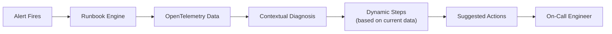

# How to Implement On-Call Runbooks Powered by OpenTelemetry Signals

Author: [nawazdhandala](https://www.github.com/nawazdhandala)

Tags: OpenTelemetry, Runbooks, On-Call, Incident Response, Automation, Observability, SRE, Operations

Description: Learn how to build intelligent on-call runbooks that leverage OpenTelemetry signals to provide context-aware diagnostic steps and automated remediation suggestions.

---

On-call runbooks are supposed to help engineers respond to incidents quickly, but most runbooks are static documents that go stale within weeks. They tell you to "check the database" without specifying which metric to look at or what value is concerning. When it is 3 AM and you have been paged, a vague runbook is almost worse than no runbook at all.

OpenTelemetry changes this equation. When your runbooks can query real-time telemetry data, they become living documents that provide specific, context-aware guidance. Instead of "check if the error rate is high," the runbook can tell you "the error rate on /checkout is currently 5.3%, which is 15x above the baseline of 0.35%. Here are the top 3 error types." That is the difference between fumbling in the dark and having a flashlight.

---

## Architecture



The runbook engine sits between your alerting system and the on-call engineer. When an alert fires, the engine pulls relevant OpenTelemetry data and generates a context-aware diagnostic report.

---

## Defining Runbook Templates

Each runbook is a template that knows which signals to query and how to interpret them.

```python
# runbook_template.py
from dataclasses import dataclass, field
from typing import List, Callable, Optional
from datetime import datetime, timedelta

@dataclass
class DiagnosticStep:
    """A single diagnostic step in a runbook."""
    name: str
    description: str
    query: dict           # Metric or trace query parameters
    evaluate: Callable    # Function to evaluate the query result
    severity_threshold: Optional[float] = None

@dataclass
class RunbookTemplate:
    """
    A template for an on-call runbook that queries OpenTelemetry
    data to provide context-aware diagnostic guidance.
    """
    name: str
    description: str
    alert_name: str       # The alert that triggers this runbook
    service: str
    steps: List[DiagnosticStep] = field(default_factory=list)
    escalation_criteria: str = ""
    remediation_actions: List[str] = field(default_factory=list)

# Example: High error rate runbook
high_error_rate_runbook = RunbookTemplate(
    name="High Error Rate Investigation",
    description="Diagnose and resolve elevated error rates on API endpoints",
    alert_name="api_error_rate_high",
    service="api-gateway",
    steps=[
        DiagnosticStep(
            name="Check current error rate",
            description="Query the current error rate and compare to baseline",
            query={
                "metric": "http.server.errors",
                "labels": {"service.name": "api-gateway"},
                "function": "rate",
                "window": "5m",
            },
            evaluate=lambda value, baseline: {
                "status": "critical" if value > baseline * 10 else "warning",
                "message": f"Current error rate: {value:.2f}/s (baseline: {baseline:.2f}/s)",
            },
        ),
        DiagnosticStep(
            name="Identify affected endpoints",
            description="Break down errors by endpoint to find the source",
            query={
                "metric": "http.server.errors",
                "labels": {"service.name": "api-gateway"},
                "group_by": ["http.route"],
                "function": "sum",
                "window": "15m",
            },
            evaluate=lambda grouped_values, _: {
                "status": "info",
                "message": "Affected endpoints:\n" + "\n".join(
                    f"  - {route}: {count} errors"
                    for route, count in sorted(
                        grouped_values.items(), key=lambda x: x[1], reverse=True
                    )[:5]
                ),
            },
        ),
        DiagnosticStep(
            name="Check downstream dependencies",
            description="Verify if the errors originate from a downstream service",
            query={
                "type": "trace",
                "attributes": {
                    "service.name": "api-gateway",
                    "otel.status_code": "ERROR",
                },
                "limit": 20,
            },
            evaluate=lambda traces, _: {
                "status": "info",
                "message": analyze_error_origins(traces),
            },
        ),
        DiagnosticStep(
            name="Check recent deployments",
            description="Look for recent deployments that might have introduced the issue",
            query={
                "type": "log",
                "search": "deployment OR deploy",
                "service": "api-gateway",
                "window": "60m",
            },
            evaluate=lambda logs, _: {
                "status": "warning" if logs else "info",
                "message": (
                    f"Found {len(logs)} recent deployments" if logs
                    else "No recent deployments found"
                ),
            },
        ),
    ],
    escalation_criteria=(
        "Escalate if error rate exceeds 10% or if the issue persists "
        "for more than 15 minutes after initial investigation"
    ),
    remediation_actions=[
        "If caused by recent deployment: Roll back using 'kubectl rollout undo'",
        "If caused by downstream dependency: Check dependency status page and consider enabling circuit breaker",
        "If caused by resource exhaustion: Scale up the service using 'kubectl scale --replicas=N'",
        "If cause is unknown after 15 minutes: Escalate to the service owner",
    ],
)
```

Each diagnostic step has a query that fetches specific OpenTelemetry data and an evaluate function that interprets the result. This is much more useful than a static checklist because the output reflects the actual current state of the system.

---

## The Runbook Execution Engine

The engine takes a runbook template and executes it against live telemetry data.

```python
# runbook_engine.py
from dataclasses import dataclass
from datetime import datetime
from typing import List

@dataclass
class StepResult:
    """The result of executing a single diagnostic step."""
    step_name: str
    status: str       # "info", "warning", "critical"
    message: str
    raw_data: dict
    timestamp: datetime

@dataclass
class RunbookExecution:
    """The complete result of executing a runbook."""
    runbook_name: str
    alert_name: str
    service: str
    started_at: datetime
    completed_at: datetime
    step_results: List[StepResult]
    overall_status: str
    suggested_actions: List[str]

class RunbookEngine:
    """
    Executes runbook templates against live OpenTelemetry data,
    producing context-aware diagnostic reports.
    """

    def __init__(self, metrics_client, trace_client, log_client):
        self.metrics_client = metrics_client
        self.trace_client = trace_client
        self.log_client = log_client
        self.baselines = {}  # Cached baseline values

    def execute(self, runbook: RunbookTemplate) -> RunbookExecution:
        """Execute a runbook and return the diagnostic report."""
        started_at = datetime.utcnow()
        step_results = []

        for step in runbook.steps:
            result = self._execute_step(step, runbook.service)
            step_results.append(result)

        completed_at = datetime.utcnow()

        # Determine overall status (worst status among steps)
        severity_order = {"info": 0, "warning": 1, "critical": 2}
        overall_status = max(
            [r.status for r in step_results],
            key=lambda s: severity_order.get(s, 0),
        )

        # Select suggested actions based on findings
        suggested_actions = self._select_actions(
            runbook.remediation_actions, step_results
        )

        return RunbookExecution(
            runbook_name=runbook.name,
            alert_name=runbook.alert_name,
            service=runbook.service,
            started_at=started_at,
            completed_at=completed_at,
            step_results=step_results,
            overall_status=overall_status,
            suggested_actions=suggested_actions,
        )

    def _execute_step(self, step: DiagnosticStep, service: str) -> StepResult:
        """Execute a single diagnostic step."""
        query = step.query

        # Fetch data based on query type
        if query.get("type") == "trace":
            data = self.trace_client.query_traces(**query)
        elif query.get("type") == "log":
            data = self.log_client.search(**query)
        else:
            data = self.metrics_client.query(**query)

        # Get baseline for comparison
        baseline = self.baselines.get(f"{service}:{step.name}", 0)

        # Evaluate the result
        evaluation = step.evaluate(data, baseline)

        return StepResult(
            step_name=step.name,
            status=evaluation["status"],
            message=evaluation["message"],
            raw_data={"query": query, "result_summary": str(data)[:500]},
            timestamp=datetime.utcnow(),
        )

    def _select_actions(self, all_actions: List[str], results: List[StepResult]) -> List[str]:
        """Select relevant remediation actions based on diagnostic findings."""
        selected = []
        result_text = " ".join(r.message for r in results).lower()

        for action in all_actions:
            # Simple keyword matching to select relevant actions
            action_lower = action.lower()
            if "deployment" in result_text and "deployment" in action_lower:
                selected.append(action)
            elif "downstream" in result_text and "dependency" in action_lower:
                selected.append(action)
            elif "resource" in result_text and "resource" in action_lower:
                selected.append(action)

        # Always include the escalation action
        escalation_actions = [a for a in all_actions if "escalate" in a.lower()]
        selected.extend(escalation_actions)

        return selected if selected else all_actions  # Return all if no match
```

The engine executes each step sequentially, queries the relevant telemetry data, and produces a structured report. The action selection logic matches findings to relevant remediation steps, so the on-call engineer sees only the actions that apply to the current situation.

---

## Formatting the Runbook Output

The output needs to be clean and scannable, especially at 3 AM.

```python
# runbook_formatter.py
def format_runbook_output(execution: RunbookExecution) -> str:
    """Format a runbook execution result for display in Slack or a terminal."""
    lines = [
        f"## Runbook: {execution.runbook_name}",
        f"Service: {execution.service} | Alert: {execution.alert_name}",
        f"Status: {execution.overall_status.upper()}",
        f"Executed: {execution.started_at.strftime('%Y-%m-%d %H:%M:%S UTC')}",
        "",
        "### Diagnostic Results",
        "",
    ]

    status_icons = {"info": "[OK]", "warning": "[WARN]", "critical": "[CRIT]"}

    for result in execution.step_results:
        icon = status_icons.get(result.status, "[?]")
        lines.append(f"{icon} **{result.step_name}**")
        lines.append(f"    {result.message}")
        lines.append("")

    if execution.suggested_actions:
        lines.append("### Suggested Actions")
        lines.append("")
        for i, action in enumerate(execution.suggested_actions, 1):
            lines.append(f"{i}. {action}")

    return "\n".join(lines)
```

---

## Integrating with Alerting

Wire the runbook engine into your alerting pipeline so it executes automatically when an alert fires.

```python
# alert_integration.py
runbook_registry = {
    "api_error_rate_high": high_error_rate_runbook,
    # Add more runbooks for different alert types
}

def on_alert_fired(alert: dict):
    """
    Callback when an alert fires. Looks up the corresponding runbook,
    executes it, and sends the output to the on-call engineer.
    """
    alert_name = alert["name"]

    runbook = runbook_registry.get(alert_name)
    if not runbook:
        send_to_oncall(
            f"Alert '{alert_name}' fired but no runbook found. "
            f"Please investigate manually."
        )
        return

    # Execute the runbook against live data
    engine = RunbookEngine(metrics_client, trace_client, log_client)
    execution = engine.execute(runbook)

    # Format and send to the on-call engineer
    output = format_runbook_output(execution)
    send_to_oncall(output)

    # If critical, also post to the incident channel
    if execution.overall_status == "critical":
        post_to_incident_channel(output)
```

---

## Summary

On-call runbooks powered by OpenTelemetry signals turn a stale document into a live diagnostic tool. When an alert fires, the runbook automatically queries the relevant traces, metrics, and logs, evaluates the results, and presents the on-call engineer with a clear picture of what is wrong and what to do about it. This reduces mean time to resolution because the engineer skips the initial 10-15 minutes of "let me pull up dashboards and figure out what is going on" and goes straight to informed action. Start by creating runbooks for your top 5 most common alerts. Each one will save significant time during every future incident of that type.
