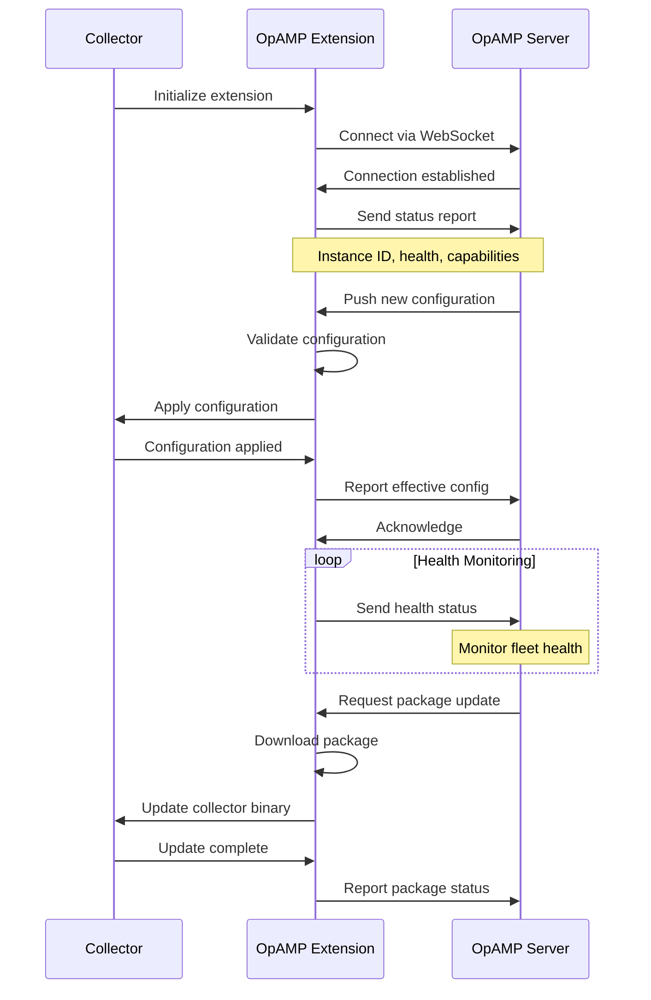
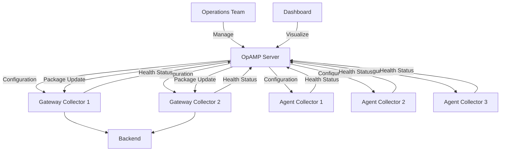

# How to Configure the OpAMP Extension for Remote Collector Management

Author: [nawazdhandala](https://www.github.com/nawazdhandala)

Tags: OpenTelemetry, Collector, Extensions, OpAMP, Remote Management, Operations, Fleet Management

Description: Learn how to configure the OpAMP extension in OpenTelemetry Collector for centralized remote management, dynamic configuration updates, and automated fleet operations at scale.

Managing OpenTelemetry Collectors at scale across distributed infrastructure presents significant operational challenges. The OpAMP (Open Agent Management Protocol) extension addresses these challenges by enabling centralized remote management, dynamic configuration updates, and automated operations for collector fleets.

## What is OpAMP?

OpAMP is an open standard protocol designed for remote management of telemetry agents, including OpenTelemetry Collectors. It provides bidirectional communication between a central management server and distributed collectors, enabling capabilities like configuration management, package delivery, health monitoring, and remote diagnostics.

The protocol defines a client-server architecture where collectors act as OpAMP clients that connect to an OpAMP server. The server can push configuration changes, query collector status, and coordinate fleet-wide operations without requiring manual intervention or redeployment.

## Why Use OpAMP?

Traditional collector deployment requires configuration files baked into container images or mounted from configuration management systems. This approach becomes cumbersome at scale. OpAMP provides several advantages:

**Centralized configuration management**: Update collector configurations from a central location without touching individual instances.

**Dynamic updates**: Apply configuration changes without restarting collectors, minimizing service disruption.

**Package management**: Distribute and update collector binaries, plugins, and dependencies remotely.

**Health monitoring**: Receive real-time status updates from all collectors in your fleet.

**Selective targeting**: Apply changes to specific collectors based on attributes like environment, region, or service.

**Audit trail**: Track all configuration changes and their distribution across your fleet.

## Basic OpAMP Configuration

Here's a minimal configuration to enable the OpAMP extension:

```yaml
# collector-config.yaml
extensions:
  # Configure OpAMP client extension
  opamp:
    # OpAMP server endpoint
    server:
      # WebSocket endpoint for OpAMP protocol
      ws:
        endpoint: "ws://opamp-server:4320/v1/opamp"

        # TLS configuration (recommended for production)
        tls:
          insecure: true

    # Unique identifier for this collector instance
    instance_id: "collector-${HOSTNAME}"

    # Capabilities this collector supports
    capabilities:
      - reports_effective_config
      - reports_health
      - accepts_remote_config
      - reports_remote_config

receivers:
  otlp:
    protocols:
      grpc:
        endpoint: 0.0.0.0:4317
      http:
        endpoint: 0.0.0.0:4318

processors:
  batch:
    timeout: 10s

exporters:
  logging:
    verbosity: detailed

service:
  extensions: [opamp]
  pipelines:
    traces:
      receivers: [otlp]
      processors: [batch]
      exporters: [logging]
```

This configuration connects the collector to an OpAMP server and enables core management capabilities. The collector can now receive configuration updates, report health status, and be managed remotely.

## Secure Connection with TLS

For production deployments, always use TLS to secure communication with the OpAMP server:

```yaml
extensions:
  opamp:
    server:
      ws:
        endpoint: "wss://opamp-server.example.com:4320/v1/opamp"

        # TLS configuration
        tls:
          # Disable insecure mode
          insecure: false

          # CA certificate to verify server
          ca_file: "/etc/certs/opamp-ca.pem"

          # Client certificate for mutual TLS
          cert_file: "/etc/certs/collector-client.pem"
          key_file: "/etc/certs/collector-client-key.pem"

          # Server name for verification
          server_name_override: "opamp-server.example.com"

    # Collector identification
    instance_id: "collector-${HOSTNAME}-${POD_NAME}"

    # Capabilities
    capabilities:
      - reports_effective_config
      - reports_health
      - accepts_remote_config
      - reports_remote_config
      - accepts_packages

receivers:
  otlp:
    protocols:
      grpc:
        endpoint: 0.0.0.0:4317

processors:
  batch:
    timeout: 10s

exporters:
  logging:
    verbosity: detailed

service:
  extensions: [opamp]
  pipelines:
    traces:
      receivers: [otlp]
      processors: [batch]
      exporters: [logging]
```

Mutual TLS ensures both the server and client authenticate each other, providing strong security for management operations.

## HTTP Connection Alternative

In addition to WebSocket, OpAMP supports HTTP for environments where WebSocket connections are problematic:

```yaml
extensions:
  opamp:
    server:
      # HTTP polling instead of WebSocket
      http:
        endpoint: "https://opamp-server.example.com:4320/v1/opamp"

        # Polling interval
        polling_interval: 30s

        tls:
          insecure: false
          ca_file: "/etc/certs/opamp-ca.pem"

    instance_id: "collector-${HOSTNAME}"

    capabilities:
      - reports_effective_config
      - reports_health
      - accepts_remote_config
      - reports_remote_config

receivers:
  otlp:
    protocols:
      grpc:
        endpoint: 0.0.0.0:4317

processors:
  batch:
    timeout: 10s

exporters:
  logging:
    verbosity: detailed

service:
  extensions: [opamp]
  pipelines:
    traces:
      receivers: [otlp]
      processors: [batch]
      exporters: [logging]
```

HTTP polling is less efficient than WebSocket but works in restrictive network environments. Adjust the polling_interval based on how quickly you need configuration changes to propagate.

## OpAMP Communication Flow

The following diagram illustrates the bidirectional communication between collectors and the OpAMP server:



## Instance Identification and Metadata

Provide rich metadata to help identify and target collectors:

```yaml
extensions:
  opamp:
    server:
      ws:
        endpoint: "wss://opamp-server.example.com:4320/v1/opamp"
        tls:
          insecure: false
          ca_file: "/etc/certs/opamp-ca.pem"

    # Unique instance identifier
    instance_id: "collector-${HOSTNAME}-${POD_NAME}"

    # Descriptive attributes for this collector
    identity:
      service_name: "otel-collector"
      service_version: "0.98.0"
      service_instance_id: "${HOSTNAME}"

    # Resource attributes for targeting
    resource_attributes:
      - key: "environment"
        value: "production"
      - key: "region"
        value: "us-east-1"
      - key: "cluster"
        value: "prod-cluster-1"
      - key: "role"
        value: "gateway"

    capabilities:
      - reports_effective_config
      - reports_health
      - accepts_remote_config
      - reports_remote_config
      - accepts_packages
      - reports_package_statuses

receivers:
  otlp:
    protocols:
      grpc:
        endpoint: 0.0.0.0:4317

processors:
  batch:
    timeout: 10s

exporters:
  logging:
    verbosity: detailed

service:
  extensions: [opamp]
  pipelines:
    traces:
      receivers: [otlp]
      processors: [batch]
      exporters: [logging]
```

These attributes enable the OpAMP server to target specific collectors for configuration updates. For example, you can update only production collectors in us-east-1 or all collectors with the "gateway" role.

## Remote Configuration Management

Enable the collector to accept and apply remote configuration updates:

```yaml
extensions:
  opamp:
    server:
      ws:
        endpoint: "wss://opamp-server.example.com:4320/v1/opamp"
        tls:
          insecure: false
          ca_file: "/etc/certs/opamp-ca.pem"

    instance_id: "collector-${HOSTNAME}"

    # Configuration management settings
    remote_config:
      # Enable remote configuration
      enabled: true

      # Strategy for applying configuration
      # Options: immediate, on_restart, manual
      apply_strategy: "immediate"

      # Backup current config before applying new one
      backup_config: true
      backup_dir: "/var/lib/otelcol/backups"

      # Validate configuration before applying
      validate_before_apply: true

      # Rollback on failure
      auto_rollback: true
      rollback_timeout: 30s

    capabilities:
      - reports_effective_config
      - reports_health
      - accepts_remote_config
      - reports_remote_config

receivers:
  otlp:
    protocols:
      grpc:
        endpoint: 0.0.0.0:4317

processors:
  batch:
    timeout: 10s

exporters:
  logging:
    verbosity: detailed

service:
  extensions: [opamp]
  pipelines:
    traces:
      receivers: [otlp]
      processors: [batch]
      exporters: [logging]
```

This configuration enables safe remote configuration updates with validation, backup, and automatic rollback on failure. The collector applies new configurations immediately but can revert if issues are detected.

## Package Management

Enable remote package delivery and updates:

```yaml
extensions:
  opamp:
    server:
      ws:
        endpoint: "wss://opamp-server.example.com:4320/v1/opamp"
        tls:
          insecure: false
          ca_file: "/etc/certs/opamp-ca.pem"

    instance_id: "collector-${HOSTNAME}"

    # Package management configuration
    packages:
      # Enable package management
      enabled: true

      # Directory for downloaded packages
      download_dir: "/var/lib/otelcol/packages"

      # Executable path for self-update
      executable_path: "/usr/local/bin/otelcol"

      # Verification settings
      verify_signature: true
      public_key_file: "/etc/certs/package-signing-key.pub"

      # Update strategy
      # Options: immediate, scheduled, manual
      update_strategy: "scheduled"

      # Schedule for updates (cron format)
      update_schedule: "0 2 * * *"  # 2 AM daily

      # Restart behavior after update
      auto_restart: true
      restart_delay: 10s

    capabilities:
      - reports_effective_config
      - reports_health
      - accepts_remote_config
      - reports_remote_config
      - accepts_packages
      - reports_package_statuses

receivers:
  otlp:
    protocols:
      grpc:
        endpoint: 0.0.0.0:4317

processors:
  batch:
    timeout: 10s

exporters:
  logging:
    verbosity: detailed

service:
  extensions: [opamp]
  pipelines:
    traces:
      receivers: [otlp]
      processors: [batch]
      exporters: [logging]
```

Package management enables the OpAMP server to remotely update collector binaries, plugins, and other artifacts. Updates are cryptographically verified and applied according to the configured schedule.

## Health Reporting

Configure detailed health reporting to the OpAMP server:

```yaml
extensions:
  opamp:
    server:
      ws:
        endpoint: "wss://opamp-server.example.com:4320/v1/opamp"
        tls:
          insecure: false
          ca_file: "/etc/certs/opamp-ca.pem"

    instance_id: "collector-${HOSTNAME}"

    # Health reporting configuration
    health:
      # Enable health reporting
      enabled: true

      # Report interval
      report_interval: 30s

      # Include metrics in health reports
      include_metrics: true

      # Metrics to include
      metrics:
        - "otelcol_process_uptime"
        - "otelcol_process_runtime_heap_alloc_bytes"
        - "otelcol_receiver_accepted_spans"
        - "otelcol_exporter_sent_spans"
        - "otelcol_exporter_send_failed_spans"

      # Include collector logs in health reports
      include_logs: true
      log_level: "info"
      max_log_entries: 100

    capabilities:
      - reports_effective_config
      - reports_health
      - accepts_remote_config
      - reports_remote_config

receivers:
  otlp:
    protocols:
      grpc:
        endpoint: 0.0.0.0:4317

processors:
  batch:
    timeout: 10s

exporters:
  logging:
    verbosity: detailed

service:
  extensions: [opamp]
  pipelines:
    traces:
      receivers: [otlp]
      processors: [batch]
      exporters: [logging]
```

Health reports provide visibility into collector operation, enabling the OpAMP server to detect issues, track performance, and trigger automated responses to problems.

## Fleet Management Architecture

Here's how OpAMP enables centralized management of collector fleets:



## Selective Configuration Updates

Use resource attributes to target specific collector subsets:

```yaml
extensions:
  opamp:
    server:
      ws:
        endpoint: "wss://opamp-server.example.com:4320/v1/opamp"
        tls:
          insecure: false
          ca_file: "/etc/certs/opamp-ca.pem"

    instance_id: "collector-${HOSTNAME}"

    # Rich metadata for targeting
    resource_attributes:
      - key: "environment"
        value: "${ENVIRONMENT}"
      - key: "region"
        value: "${REGION}"
      - key: "cluster"
        value: "${CLUSTER_NAME}"
      - key: "tier"
        value: "${TIER}"  # e.g., "edge", "aggregation", "central"
      - key: "version"
        value: "0.98.0"

    remote_config:
      enabled: true
      apply_strategy: "immediate"

      # Only accept configs matching these tags
      config_tags:
        - "stable"
        - "production"

    capabilities:
      - reports_effective_config
      - reports_health
      - accepts_remote_config
      - reports_remote_config

receivers:
  otlp:
    protocols:
      grpc:
        endpoint: 0.0.0.0:4317

processors:
  batch:
    timeout: 10s

exporters:
  logging:
    verbosity: detailed

service:
  extensions: [opamp]
  pipelines:
    traces:
      receivers: [otlp]
      processors: [batch]
      exporters: [logging]
```

The OpAMP server can use these attributes to implement sophisticated deployment strategies like canary releases, regional rollouts, or environment-specific configurations.

## Connection Resilience

Configure the OpAMP extension for reliable operation in unreliable networks:

```yaml
extensions:
  opamp:
    server:
      ws:
        endpoint: "wss://opamp-server.example.com:4320/v1/opamp"
        tls:
          insecure: false
          ca_file: "/etc/certs/opamp-ca.pem"

    instance_id: "collector-${HOSTNAME}"

    # Connection resilience settings
    connection:
      # Initial connection timeout
      timeout: 30s

      # Retry configuration
      retry:
        enabled: true
        initial_interval: 5s
        max_interval: 5m
        multiplier: 2.0
        max_elapsed_time: 0  # Retry indefinitely

      # Keepalive settings
      keepalive:
        interval: 30s
        timeout: 10s

      # Compression
      compression:
        enabled: true
        algorithm: "gzip"

    # Buffering for when connection is unavailable
    buffer:
      enabled: true
      max_buffer_size: 100
      # Buffer health reports and status updates
      buffer_health_reports: true
      buffer_config_reports: true

    capabilities:
      - reports_effective_config
      - reports_health
      - accepts_remote_config
      - reports_remote_config

receivers:
  otlp:
    protocols:
      grpc:
        endpoint: 0.0.0.0:4317

processors:
  batch:
    timeout: 10s

exporters:
  logging:
    verbosity: detailed

service:
  extensions: [opamp]
  pipelines:
    traces:
      receivers: [otlp]
      processors: [batch]
      exporters: [logging]
```

These settings ensure the collector maintains operation during network issues and automatically reconnects to the OpAMP server when connectivity is restored.

## Kubernetes Deployment

Deploy OpAMP-enabled collectors in Kubernetes with proper configuration:

```yaml
apiVersion: v1
kind: ConfigMap
metadata:
  name: otel-collector-opamp-config
  namespace: monitoring
data:
  config.yaml: |
    extensions:
      opamp:
        server:
          ws:
            endpoint: "wss://opamp-server.monitoring.svc.cluster.local:4320/v1/opamp"
            tls:
              insecure: false
              ca_file: "/etc/certs/ca.pem"

        instance_id: "collector-${POD_NAME}"

        resource_attributes:
          - key: "k8s.namespace.name"
            value: "${POD_NAMESPACE}"
          - key: "k8s.pod.name"
            value: "${POD_NAME}"
          - key: "k8s.node.name"
            value: "${NODE_NAME}"

        remote_config:
          enabled: true
          apply_strategy: "immediate"

        capabilities:
          - reports_effective_config
          - reports_health
          - accepts_remote_config
          - reports_remote_config

    receivers:
      otlp:
        protocols:
          grpc:
            endpoint: 0.0.0.0:4317

    processors:
      batch:
        timeout: 10s

    exporters:
      logging:
        verbosity: detailed

    service:
      extensions: [opamp]
      pipelines:
        traces:
          receivers: [otlp]
          processors: [batch]
          exporters: [logging]
---
apiVersion: apps/v1
kind: DaemonSet
metadata:
  name: otel-collector
  namespace: monitoring
spec:
  selector:
    matchLabels:
      app: otel-collector
  template:
    metadata:
      labels:
        app: otel-collector
    spec:
      containers:
      - name: otel-collector
        image: otel/opentelemetry-collector-contrib:latest
        env:
        - name: POD_NAME
          valueFrom:
            fieldRef:
              fieldPath: metadata.name
        - name: POD_NAMESPACE
          valueFrom:
            fieldRef:
              fieldPath: metadata.namespace
        - name: NODE_NAME
          valueFrom:
            fieldRef:
              fieldPath: spec.nodeName
        volumeMounts:
        - name: config
          mountPath: /etc/otel
        - name: certs
          mountPath: /etc/certs
      volumes:
      - name: config
        configMap:
          name: otel-collector-opamp-config
      - name: certs
        secret:
          secretName: opamp-tls-certs
```

## Best Practices

**Use unique instance identifiers**: Include hostname, pod name, or other unique identifiers to distinguish collectors in your fleet.

**Enable TLS with mutual authentication**: Protect management communications with strong encryption and authentication.

**Implement gradual rollouts**: Use resource attributes to deploy configuration changes incrementally rather than fleet-wide.

**Monitor OpAMP connection health**: Track connection status and reconnection attempts to identify network issues.

**Backup configurations**: Enable configuration backups before applying remote updates to enable quick recovery.

**Use package verification**: Always verify package signatures to prevent deployment of compromised binaries.

**Implement health reporting**: Enable comprehensive health reporting to detect and respond to collector issues quickly.

**Test in staging**: Validate configuration changes in staging environments before deploying to production collectors.

## Troubleshooting

**Connection refused errors**: Verify the OpAMP server is running and accessible. Check firewall rules and network policies.

**TLS handshake failures**: Ensure CA certificates are properly configured and collector client certificates are valid.

**Configuration not applied**: Check collector logs for validation errors. Verify the collector has the accepts_remote_config capability enabled.

**Health reports not received**: Verify health reporting is enabled and the report_interval is appropriate. Check for network connectivity issues.

**Package updates failing**: Ensure package verification settings match the server's signing configuration. Check file permissions on the download directory.

## Conclusion

The OpAMP extension transforms OpenTelemetry Collector operations by enabling centralized, automated fleet management. By implementing dynamic configuration updates, package management, and comprehensive health monitoring, OpAMP reduces operational overhead and improves reliability at scale.

For related collector management topics, see guides on [Storage Extension](https://oneuptime.com/blog/post/2026-02-06-storage-extension-opentelemetry-collector/view) and [Jaeger Remote Sampling](https://oneuptime.com/blog/post/2026-02-06-jaeger-remote-sampling-extension-opentelemetry-collector/view).
