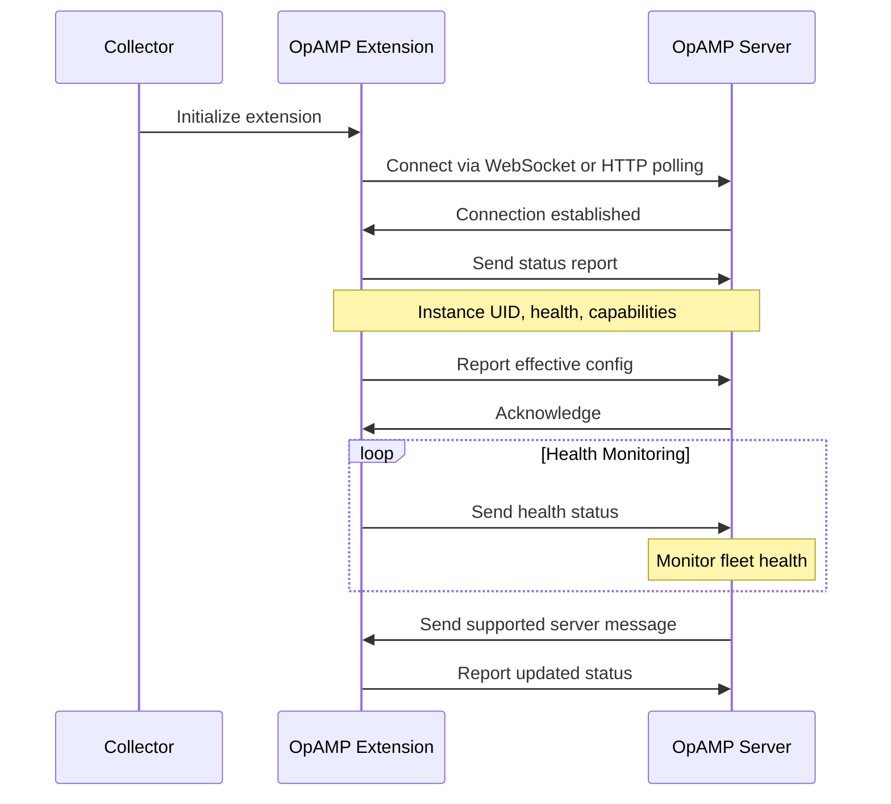
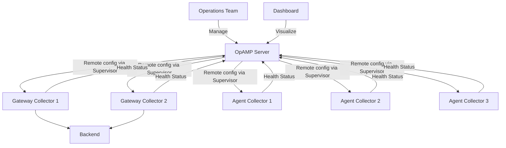

# How to Configure the OpAMP Extension for Remote Collector Management

Author: [nawazdhandala](https://www.github.com/nawazdhandala)

Tags: OpenTelemetry, Collector, Extension, OpAMP, Remote Management, Operation, Fleet Management

Description: Learn how to configure the OpAMP extension in OpenTelemetry Collector for centralized remote management, dynamic configuration updates, and automated fleet operations at scale.

Managing OpenTelemetry Collectors at scale across distributed infrastructure presents significant operational challenges. The OpAMP (Open Agent Management Protocol) extension helps address these challenges by connecting collectors to an OpAMP control plane for status reporting and remote management workflows.

## What is OpAMP?

OpAMP is an open standard protocol designed for remote management of telemetry agents, including OpenTelemetry Collectors. It provides bidirectional communication between a central management server and distributed collectors, enabling capabilities like configuration management, package delivery, health monitoring, and remote diagnostics.

The protocol defines a client-server architecture where collectors or supervisors act as OpAMP clients that connect to an OpAMP server. The server can query agent status and coordinate fleet-wide operations without requiring manual intervention on each instance.

## Why Use OpAMP?

Traditional collector deployment requires configuration files baked into container images or mounted from configuration management systems. This approach becomes cumbersome at scale. OpAMP provides several advantages:

**Centralized configuration management**: Use an OpAMP control plane to coordinate collector configuration workflows from a central location.

**Dynamic updates**: When using the OpAMP Supervisor, apply remote configuration sent by the server and restart the managed collector when needed.

**Package management**: The OpAMP protocol defines package update messages; support depends on the client implementation.

**Health monitoring**: Receive status updates from collectors or supervisors in your fleet.

**Selective targeting**: Apply changes to specific collectors based on attributes like environment, region, or service when your OpAMP server supports that targeting model.

**Audit trail**: Track all configuration changes and their distribution across your fleet in the management plane.

## Basic OpAMP Configuration

Here's a minimal configuration to enable the OpAMP extension:

```yaml
# collector-config.yaml

extensions:
  # Configure OpAMP client extension.
  opamp:
    server:
      ws:
        endpoint: "ws://opamp-server:4320/v1/opamp"

receivers:
  otlp:
    protocols:
      grpc:
        endpoint: 0.0.0.0:4317
      http:
        endpoint: 0.0.0.0:4318

processors:
  batch:
    timeout: 10s

exporters:
  debug:
    verbosity: detailed

service:
  extensions: [opamp]
  pipelines:
    traces:
      receivers: [otlp]
      processors: [batch]
      exporters: [debug]
```

This configuration connects the collector to an OpAMP server. By default, the extension reports health, effective configuration, and available components. If `instance_uid` is omitted, the extension generates one on startup.

## Secure Connection with TLS

For production deployments, always use TLS to secure communication with the OpAMP server:

```yaml
extensions:
  opamp:
    server:
      ws:
        endpoint: "wss://opamp-server.example.com:4320/v1/opamp"
        tls:
          ca_file: "/etc/certs/opamp-ca.pem"
          cert_file: "/etc/certs/collector-client.pem"
          key_file: "/etc/certs/collector-client-key.pem"
          server_name_override: "opamp-server.example.com"

    # Optional stable identifier. Must be a UUIDv7 in canonical form.
    instance_uid: "018f2e08-90d3-7bda-9f15-8f5dbddb3c42"

    capabilities:
      reports_effective_config: true
      reports_health: true
      reports_available_components: true

receivers:
  otlp:
    protocols:
      grpc:
        endpoint: 0.0.0.0:4317

processors:
  batch:
    timeout: 10s

exporters:
  debug:
    verbosity: detailed

service:
  extensions: [opamp]
  pipelines:
    traces:
      receivers: [otlp]
      processors: [batch]
      exporters: [debug]
```

Mutual TLS ensures both the server and client authenticate each other, providing strong security for management operations.

## HTTP Connection Alternative

In addition to WebSocket, the Collector OpAMP extension supports HTTP polling for environments where WebSocket connections are problematic:

```yaml
extensions:
  opamp:
    server:
      http:
        endpoint: "https://opamp-server.example.com:4320/v1/opamp"
        polling_interval: 30s
        tls:
          ca_file: "/etc/certs/opamp-ca.pem"

    capabilities:
      reports_effective_config: true
      reports_health: true
      reports_available_components: true

receivers:
  otlp:
    protocols:
      grpc:
        endpoint: 0.0.0.0:4317

processors:
  batch:
    timeout: 10s

exporters:
  debug:
    verbosity: detailed

service:
  extensions: [opamp]
  pipelines:
    traces:
      receivers: [otlp]
      processors: [batch]
      exporters: [debug]
```

HTTP polling is less efficient than WebSocket but works in restrictive network environments. Adjust the `polling_interval` based on how quickly you need server-side state changes to propagate.

## OpAMP Communication Flow

The following diagram illustrates the bidirectional communication between collectors and the OpAMP server:


```mermaid
sequenceDiagram
    participant C as Collector
    participant O as OpAMP Extension
    participant S as OpAMP Server

    C->>O: Initialize extension
    O->>S: Connect via WebSocket or HTTP polling
    S->>O: Connection established

    O->>S: Send status report
    Note over O,S: Instance UID, health, capabilities

    O->>S: Report effective config
    S->>O: Acknowledge

    loop Health Monitoring
        O->>S: Send health status
        Note over S: Monitor fleet health
    end

    S->>O: Send supported server message
    O->>S: Report updated status
```

## Instance Identification and Metadata

Provide metadata to help identify and target collectors:

```yaml
extensions:
  opamp:
    server:
      ws:
        endpoint: "wss://opamp-server.example.com:4320/v1/opamp"
        tls:
          ca_file: "/etc/certs/opamp-ca.pem"

    # Optional stable identifier. Must be a UUIDv7 in canonical form.
    instance_uid: "018f2e08-90d3-7bda-9f15-8f5dbddb3c42"

    agent_description:
      include_resource_attributes: true
      non_identifying_attributes:
        environment: "production"
        region: "us-east-1"
        cluster: "prod-cluster-1"
        role: "gateway"

    capabilities:
      reports_effective_config: true
      reports_health: true
      reports_available_components: true

receivers:
  otlp:
    protocols:
      grpc:
        endpoint: 0.0.0.0:4317

processors:
  batch:
    timeout: 10s

exporters:
  debug:
    verbosity: detailed

service:
  extensions: [opamp]
  pipelines:
    traces:
      receivers: [otlp]
      processors: [batch]
      exporters: [debug]
```

These attributes enable the OpAMP server to target specific collectors for management operations. For example, you can update only production collectors in `us-east-1` or all collectors with the `gateway` role if your server implements that targeting logic.

## Remote Configuration Management

The Collector OpAMP extension does not expose `remote_config`, backup, rollback, or package-update settings in the collector configuration. For remote configuration of a collector process, use the OpAMP Supervisor:

```yaml
# supervisor.yaml
server:
  endpoint: wss://opamp-server.example.com:4320/v1/opamp
  tls:
    ca_file: "/etc/certs/opamp-ca.pem"
    cert_file: "/etc/certs/collector-client.pem"
    key_file: "/etc/certs/collector-client-key.pem"

capabilities:
  accepts_remote_config: true
  reports_effective_config: true
  reports_own_metrics: false
  reports_own_logs: true
  reports_own_traces: false
  reports_health: true
  reports_remote_config: true

agent:
  executable: /usr/local/bin/otelcol-contrib

storage:
  directory: /var/lib/opampsupervisor
```

This configuration enables the supervisor to receive remote configuration from the OpAMP server, compose the effective collector configuration, run the collector process, and report configuration status back to the server.

## Package Management

Package management is part of the OpAMP protocol, but the OpenTelemetry OpAMP Supervisor does not currently implement the `accepts_packages` capability. Do not add a `packages` block to the Collector `opamp` extension configuration; it is not a supported field.

```yaml
extensions:
  opamp:
    server:
      ws:
        endpoint: "wss://opamp-server.example.com:4320/v1/opamp"
        tls:
          ca_file: "/etc/certs/opamp-ca.pem"

    capabilities:
      reports_effective_config: true
      reports_health: true
      reports_available_components: true
```

If you need binary or plugin rollout workflows, handle them through your deployment platform or a vendor/server implementation that explicitly documents package support.

## Health Reporting

Configure health reporting by enabling the supported `reports_health` capability:

```yaml
extensions:
  opamp:
    server:
      ws:
        endpoint: "wss://opamp-server.example.com:4320/v1/opamp"
        tls:
          ca_file: "/etc/certs/opamp-ca.pem"

    capabilities:
      reports_effective_config: true
      reports_health: true
      reports_available_components: true

receivers:
  otlp:
    protocols:
      grpc:
        endpoint: 0.0.0.0:4317

processors:
  batch:
    timeout: 10s

exporters:
  debug:
    verbosity: detailed

service:
  extensions: [opamp]
  pipelines:
    traces:
      receivers: [otlp]
      processors: [batch]
      exporters: [debug]
```

Health reports provide visibility into collector operation, enabling the OpAMP server to detect issues and track fleet status.

## Fleet Management Architecture

Here's how OpAMP enables centralized management of collector fleets:


```mermaid
graph TB
    S[OpAMP Server] -->|Remote config via Supervisor| G1[Gateway Collector 1]
    S -->|Remote config via Supervisor| G2[Gateway Collector 2]
    S -->|Remote config via Supervisor| A1[Agent Collector 1]
    S -->|Remote config via Supervisor| A2[Agent Collector 2]
    S -->|Remote config via Supervisor| A3[Agent Collector 3]

    G1 -->|Health Status| S
    G2 -->|Health Status| S
    A1 -->|Health Status| S
    A2 -->|Health Status| S
    A3 -->|Health Status| S

    U[Operations Team] -->|Manage| S
    D[Dashboard] -->|Visualize| S

    G1 --> B[Backend]
    G2 --> B
```

## Selective Configuration Updates

Use agent description attributes to target specific collector subsets:

```yaml
extensions:
  opamp:
    server:
      ws:
        endpoint: "wss://opamp-server.example.com:4320/v1/opamp"
        tls:
          ca_file: "/etc/certs/opamp-ca.pem"

    agent_description:
      non_identifying_attributes:
        environment: "${env:ENVIRONMENT}"
        region: "${env:REGION}"
        cluster: "${env:CLUSTER_NAME}"
        tier: "${env:TIER}"
        collector.version: "0.153.0"

    capabilities:
      reports_effective_config: true
      reports_health: true
      reports_available_components: true

receivers:
  otlp:
    protocols:
      grpc:
        endpoint: 0.0.0.0:4317

processors:
  batch:
    timeout: 10s

exporters:
  debug:
    verbosity: detailed

service:
  extensions: [opamp]
  pipelines:
    traces:
      receivers: [otlp]
      processors: [batch]
      exporters: [debug]
```

The OpAMP server can use these attributes to implement sophisticated deployment strategies like canary releases, regional rollouts, or environment-specific configurations.

## Connection Resilience

The Collector OpAMP extension handles connection management internally. The extension configuration does not expose custom `connection`, retry, keepalive, compression, or buffering blocks.

```yaml
extensions:
  opamp:
    server:
      http:
        endpoint: "https://opamp-server.example.com:4320/v1/opamp"
        polling_interval: 30s
        tls:
          ca_file: "/etc/certs/opamp-ca.pem"

    capabilities:
      reports_effective_config: true
      reports_health: true
      reports_available_components: true
```

For unreliable networks, prefer TLS-protected WebSocket when possible, or use HTTP polling with an appropriate `polling_interval` for restrictive environments.

## Kubernetes Deployment

Deploy OpAMP-enabled collectors in Kubernetes with proper configuration:

```yaml
apiVersion: v1
kind: ConfigMap
metadata:
  name: otel-collector-opamp-config
  namespace: monitoring
data:
  config.yaml: |
    extensions:
      opamp:
        server:
          ws:
            endpoint: "wss://opamp-server.monitoring.svc.cluster.local:4320/v1/opamp"
            tls:
              ca_file: "/etc/certs/ca.pem"

        agent_description:
          non_identifying_attributes:
            k8s.namespace.name: "${env:POD_NAMESPACE}"
            k8s.pod.name: "${env:POD_NAME}"
            k8s.node.name: "${env:NODE_NAME}"

        capabilities:
          reports_effective_config: true
          reports_health: true
          reports_available_components: true

    receivers:
      otlp:
        protocols:
          grpc:
            endpoint: 0.0.0.0:4317

    processors:
      batch:
        timeout: 10s

    exporters:
      debug:
        verbosity: detailed

    service:
      extensions: [opamp]
      pipelines:
        traces:
          receivers: [otlp]
          processors: [batch]
          exporters: [debug]
---
apiVersion: apps/v1
kind: DaemonSet
metadata:
  name: otel-collector
  namespace: monitoring
spec:
  selector:
    matchLabels:
      app: otel-collector
  template:
    metadata:
      labels:
        app: otel-collector
    spec:
      containers:
      - name: otel-collector
        image: otel/opentelemetry-collector-contrib:0.153.0
        args:
        - "--config=/etc/otel/config.yaml"
        env:
        - name: POD_NAME
          valueFrom:
            fieldRef:
              fieldPath: metadata.name
        - name: POD_NAMESPACE
          valueFrom:
            fieldRef:
              fieldPath: metadata.namespace
        - name: NODE_NAME
          valueFrom:
            fieldRef:
              fieldPath: spec.nodeName
        volumeMounts:
        - name: config
          mountPath: /etc/otel
        - name: certs
          mountPath: /etc/certs
      volumes:
      - name: config
        configMap:
          name: otel-collector-opamp-config
      - name: certs
        secret:
          secretName: opamp-tls-certs
```

## Best Practices

**Use stable instance identifiers carefully**: If you set `instance_uid`, use a UUIDv7 and keep it stable across restarts for the same collector instance. Otherwise, let the extension generate one.

**Enable TLS with mutual authentication**: Protect management communications with strong encryption and authentication.

**Implement gradual rollouts**: Use agent description attributes and OpAMP server targeting to deploy changes incrementally rather than fleet-wide.

**Monitor OpAMP connection health**: Track connection status and reconnection behavior to identify network issues.

**Validate remote configurations**: When using the OpAMP Supervisor for remote configuration, validate collector config before rollout and maintain an out-of-band recovery path.

**Use deployment tooling for package rollout**: Do not assume package update support unless your OpAMP client and server explicitly document it.

**Implement health reporting**: Enable health reporting to detect and respond to collector issues quickly.

**Test in staging**: Validate configuration changes in staging environments before deploying to production collectors.

## Troubleshooting

**Connection refused errors**: Verify the OpAMP server is running and accessible. Check firewall rules and network policies.

**TLS handshake failures**: Ensure CA certificates are properly configured and collector client certificates are valid.

**Configuration not applied**: If you need remote configuration, verify that you are using the OpAMP Supervisor with `accepts_remote_config: true`; the in-process Collector extension does not apply remote config by itself.

**Health reports not received**: Verify the `reports_health` capability is enabled and check for network connectivity issues.

**Package updates failing**: Verify that your OpAMP client and server support package management. The OpenTelemetry OpAMP Supervisor does not currently advertise `accepts_packages`.

## Conclusion

The OpAMP extension connects OpenTelemetry Collectors to a centralized management plane for status reporting and control-plane communication. For dynamic remote configuration of a running collector process, use the OpAMP Supervisor, which manages the collector process and reports configuration status back to the server.

For related collector management topics, see guides on [Storage Extension](https://oneuptime.com/blog/post/2026-02-06-storage-extension-opentelemetry-collector/view) and [Jaeger Remote Sampling](https://oneuptime.com/blog/post/2026-02-06-jaeger-remote-sampling-extension-opentelemetry-collector/view).
