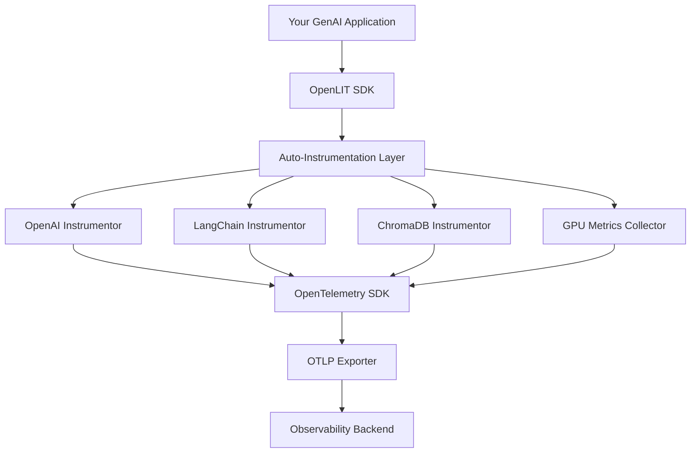
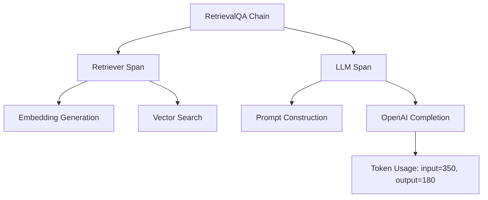

# How to Set Up OpenLIT for OpenTelemetry-Native GenAI Observability

Author: [nawazdhandala](https://www.github.com/nawazdhandala)

Tags: OpenTelemetry, OpenLIT, GenAI, LLM Observability, Python

Description: A practical guide to setting up OpenLIT for automatic OpenTelemetry-native instrumentation of GenAI applications including LLMs, vector databases, and GPU metrics.

---

Getting observability into your GenAI stack without manually instrumenting every single LLM call, every vector database query, and every GPU metric is a real challenge. OpenLIT solves this by providing automatic, OpenTelemetry-native instrumentation that hooks into popular AI libraries. Instead of writing custom tracing code around each OpenAI or LangChain call, you initialize OpenLIT once and it handles the rest.

This guide walks through setting up OpenLIT from scratch, configuring it to export telemetry via OTLP, and customizing what gets captured. By the end, you'll have full GenAI observability flowing into your preferred backend.

## What is OpenLIT?

OpenLIT is an open-source Python SDK that automatically instruments GenAI applications. It captures traces, metrics, and logs from LLM providers (OpenAI, Anthropic, Cohere, Mistral), orchestration frameworks (LangChain, LlamaIndex), vector databases (Pinecone, ChromaDB, Qdrant), and even GPU hardware metrics.

The key differentiator is that OpenLIT is built on OpenTelemetry from the ground up. It doesn't use a proprietary format or require a specific backend. Everything it produces is standard OTLP, which means you can send it to OneUptime, Jaeger, Grafana, or any other OTLP-compatible system.



## Installation

Getting started is a single pip install. OpenLIT bundles all of its instrumentors together, so you don't need to install separate packages for each library you want to trace.

```bash
# Install OpenLIT - this includes all instrumentors for supported GenAI libraries
pip install openlit
```

If you also want GPU monitoring (for NVIDIA GPUs), install the optional dependency:

```bash
# Install with GPU monitoring support for NVIDIA GPUs
pip install openlit[gpu]
```

## Basic Setup

The simplest way to use OpenLIT is a single `openlit.init()` call at the top of your application. This activates automatic instrumentation for all supported libraries that are installed in your environment.

```python
# app.py - Minimal OpenLIT setup with OTLP export
import openlit
import openai

# Initialize OpenLIT with OTLP export
# This automatically instruments all supported libraries in your environment
openlit.init(
    otlp_endpoint="https://otlp.oneuptime.com",
    otlp_headers={"x-oneuptime-token": "YOUR_ONEUPTIME_TOKEN"},
    application_name="my-genai-app",
    environment="production",
)

# Now any OpenAI call is automatically traced - no extra code needed
client = openai.OpenAI()
response = client.chat.completions.create(
    model="gpt-4",
    messages=[{"role": "user", "content": "What is observability?"}],
)

print(response.choices[0].message.content)
```

That's genuinely it. With those few lines, OpenLIT captures the full trace for the OpenAI call, including the prompt, completion, model parameters, token usage, and latency.

## Configuration Options

OpenLIT's `init()` function accepts several parameters that let you customize its behavior. Let's look at the most important ones.

```python
# advanced_config.py - OpenLIT with detailed configuration options
import openlit

openlit.init(
    # Where to send telemetry data (OTLP endpoint)
    otlp_endpoint="https://otlp.oneuptime.com",

    # Authentication headers for your backend
    otlp_headers={"x-oneuptime-token": "YOUR_TOKEN"},

    # Application identifier - shows up in your traces
    application_name="chatbot-service",

    # Environment tag for filtering (production, staging, dev)
    environment="production",

    # Whether to capture prompt and completion content
    # Set to False in production if you handle sensitive data
    trace_content=True,

    # Disable specific instrumentors if needed
    disabled_instrumentors=["chroma"],

    # Enable GPU metrics collection (requires openlit[gpu])
    collect_gpu_stats=True,

    # How often to collect GPU metrics in seconds
    gpu_stats_interval=5,
)
```

## Using Environment Variables

If you prefer not to hard-code configuration, OpenLIT respects the standard OpenTelemetry environment variables along with some of its own. This is the recommended approach for production deployments.

```bash
# Standard OpenTelemetry environment variables
export OTEL_EXPORTER_OTLP_ENDPOINT="https://otlp.oneuptime.com"
export OTEL_EXPORTER_OTLP_HEADERS="x-oneuptime-token=YOUR_TOKEN"

# OpenLIT-specific variables
export OPENLIT_APPLICATION_NAME="my-genai-app"
export OPENLIT_ENVIRONMENT="production"
export OPENLIT_TRACE_CONTENT="true"
export OPENLIT_COLLECT_GPU_STATS="true"
```

Then your code is even simpler:

```python
# app.py - OpenLIT with configuration from environment variables
import openlit

# Reads all configuration from environment variables
openlit.init()
```

## Tracing LangChain Applications

OpenLIT shines when you're using orchestration frameworks like LangChain. It captures the entire chain execution, including individual LLM calls, retrieval steps, and tool usage, all as nested spans within a single trace.

```python
# langchain_traced.py - LangChain RAG pipeline with automatic OpenLIT tracing
import openlit
from langchain_openai import ChatOpenAI, OpenAIEmbeddings
from langchain_community.vectorstores import Chroma
from langchain.chains import RetrievalQA
from langchain.text_splitter import RecursiveCharacterTextSplitter

# Initialize OpenLIT once at startup
openlit.init(
    otlp_endpoint="https://otlp.oneuptime.com",
    otlp_headers={"x-oneuptime-token": "YOUR_TOKEN"},
    application_name="rag-pipeline",
)

# Set up the RAG components - all of these will be traced automatically
embeddings = OpenAIEmbeddings()
llm = ChatOpenAI(model="gpt-4", temperature=0)

# Create a vector store from some documents
documents = ["OpenTelemetry is an observability framework...", "LLMs need monitoring..."]
text_splitter = RecursiveCharacterTextSplitter(chunk_size=500, chunk_overlap=50)
texts = text_splitter.create_documents(documents)
vectorstore = Chroma.from_documents(texts, embeddings)

# Build the retrieval chain
qa_chain = RetrievalQA.from_chain_type(
    llm=llm,
    chain_type="stuff",
    retriever=vectorstore.as_retriever(),
)

# This single call generates a rich trace with nested spans for:
# 1. The retrieval step (embedding query + vector search)
# 2. The LLM call (prompt construction + completion)
result = qa_chain.invoke({"query": "How do I monitor LLMs?"})
print(result["result"])
```

The trace for this single query will show the full execution breakdown:



## Controlling What Gets Captured

In production, you might want to trace the structure of your LLM calls without capturing the actual prompt and completion text. This is common in healthcare, finance, and other regulated industries. OpenLIT makes this a one-line change.

```python
# production_config.py - Disable content capture for sensitive environments
import openlit

# trace_content=False still captures timing, token counts, model info,
# and span structure - just not the actual prompt/completion text
openlit.init(
    otlp_endpoint="https://otlp.oneuptime.com",
    otlp_headers={"x-oneuptime-token": "YOUR_TOKEN"},
    application_name="healthcare-assistant",
    environment="production",
    trace_content=False,  # No prompt or completion content in traces
)
```

You still get all the structural and performance telemetry. You just won't see the actual text content in your trace events. This is a great middle ground between full observability and data privacy compliance.

## GPU Monitoring

If you're running local models or fine-tuning, GPU utilization is a critical metric. OpenLIT can collect NVIDIA GPU stats and export them as OpenTelemetry metrics.

```python
# gpu_monitoring.py - Enable GPU metrics collection alongside LLM tracing
import openlit

openlit.init(
    otlp_endpoint="https://otlp.oneuptime.com",
    otlp_headers={"x-oneuptime-token": "YOUR_TOKEN"},
    application_name="local-inference-server",
    collect_gpu_stats=True,       # Enable GPU metric collection
    gpu_stats_interval=5,         # Collect every 5 seconds
)

# The following metrics are collected automatically:
# - gpu.utilization (percentage)
# - gpu.memory.used (bytes)
# - gpu.memory.available (bytes)
# - gpu.temperature (celsius)
# - gpu.power.draw (watts)
```

## Custom Span Attributes

Sometimes you need to add business-specific attributes to your GenAI traces - things like the user ID, the feature flag state, or the A/B test variant. You can do this by accessing the current span.

```python
# custom_attributes.py - Adding business context to auto-instrumented spans
import openlit
from opentelemetry import trace

openlit.init(
    otlp_endpoint="https://otlp.oneuptime.com",
    otlp_headers={"x-oneuptime-token": "YOUR_TOKEN"},
    application_name="chatbot",
)

def handle_user_message(user_id: str, message: str, ab_variant: str):
    """Process a user message with business context added to the trace."""

    # Create a parent span with your business attributes
    tracer = trace.get_tracer("chatbot")
    with tracer.start_as_current_span("handle_user_message") as span:
        # Add custom business attributes
        span.set_attribute("user.id", user_id)
        span.set_attribute("ab_test.variant", ab_variant)
        span.set_attribute("feature.name", "smart-reply")

        # The OpenAI call inside here is auto-instrumented by OpenLIT
        # and will appear as a child span with all GenAI attributes
        import openai
        client = openai.OpenAI()
        response = client.chat.completions.create(
            model="gpt-4",
            messages=[
                {"role": "system", "content": "You are a helpful assistant."},
                {"role": "user", "content": message},
            ],
        )
        return response.choices[0].message.content
```

## Troubleshooting Common Issues

A few things to watch out for when setting up OpenLIT:

**Spans not appearing** - Make sure `openlit.init()` is called before you import or instantiate the AI library clients. OpenLIT patches the libraries at init time, so anything created before that won't be instrumented.

**High memory usage** - If you're tracing very large prompts (like RAG contexts with thousands of tokens), the span events can get big. Use `trace_content=False` or implement content truncation.

**Missing instrumentors** - OpenLIT only instruments libraries that are actually installed. If you don't see LangChain traces, double-check that `langchain` is in your pip list.

## Conclusion

OpenLIT provides the fastest path to GenAI observability that's fully compatible with the OpenTelemetry ecosystem. A single `init()` call gives you automatic instrumentation for LLM providers, orchestration frameworks, vector databases, and GPU hardware. Because it speaks standard OTLP, you're not locked into any particular backend. You can start with OpenLIT today and have full GenAI observability running in minutes, not days.
