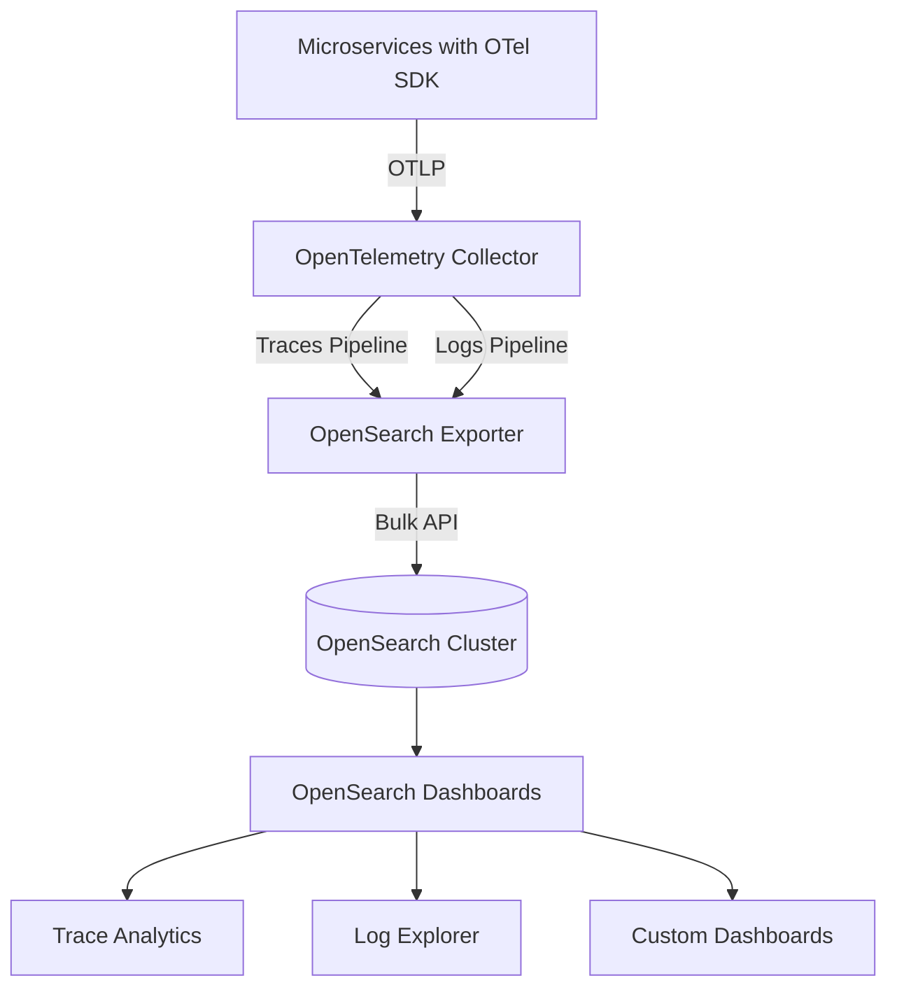

# How to Use OpenSearch as an OpenTelemetry Backend

Author: [nawazdhandala](https://www.github.com/nawazdhandala)

Tags: OpenTelemetry, OpenSearch, Observability, Backend, Logs, Traces, Open Source

Description: A hands-on guide to deploying OpenSearch as a fully open-source backend for OpenTelemetry traces and logs with Collector configuration and dashboards.

---

OpenSearch is the community-driven fork of Elasticsearch that emerged in 2021 when Elastic changed its licensing. For teams that want a fully open-source (Apache 2.0 licensed) search and analytics engine as their observability backend, OpenSearch is the natural choice. It provides the same core capabilities you would expect from Elasticsearch (full-text search, structured queries, aggregations, dashboards) while being free to use, modify, and distribute without licensing concerns.

This guide shows you how to set up OpenSearch as a backend for OpenTelemetry traces and logs. We will cover deployment, Collector configuration, index management, and how to use OpenSearch Dashboards (the Kibana equivalent) for trace and log exploration.

## Why OpenSearch for OpenTelemetry

OpenSearch checks several boxes for an observability backend. It handles high write throughput well, provides flexible querying through both its query DSL and SQL plugin, and includes built-in observability features through its Observability plugin. The fact that it is fully open-source means no surprise licensing changes, and the project has a healthy community with regular releases.

OpenSearch also ships with its own Trace Analytics feature, which understands OpenTelemetry trace data natively. This gives you a service map, trace waterfall views, and error rate dashboards out of the box, without needing to build everything from scratch.



## Deploying OpenSearch

OpenSearch provides official Docker images that include both the search engine and the dashboards UI. Here is a Docker Compose configuration that starts an OpenSearch cluster with dashboards.

```yaml
# docker-compose.yml - OpenSearch cluster with Dashboards
version: "3.8"
services:
  opensearch-node1:
    image: opensearchproject/opensearch:2.12.0
    container_name: opensearch-node1
    environment:
      - cluster.name=otel-cluster
      - node.name=opensearch-node1
      - discovery.seed_hosts=opensearch-node1
      - cluster.initial_cluster_manager_nodes=opensearch-node1
      - bootstrap.memory_lock=true
      - "OPENSEARCH_JAVA_OPTS=-Xms2g -Xmx2g"
      # Default admin credentials
      - OPENSEARCH_INITIAL_ADMIN_PASSWORD=Admin_12345!
    ulimits:
      memlock:
        soft: -1
        hard: -1
      nofile:
        soft: 65536
        hard: 65536
    volumes:
      - opensearch-data:/usr/share/opensearch/data
    ports:
      - "9200:9200"
      - "9600:9600"

  opensearch-dashboards:
    image: opensearchproject/opensearch-dashboards:2.12.0
    container_name: opensearch-dashboards
    ports:
      - "5601:5601"
    environment:
      - OPENSEARCH_HOSTS=["https://opensearch-node1:9200"]
    depends_on:
      - opensearch-node1

volumes:
  opensearch-data:
```

Start the stack and wait for OpenSearch to become ready.

```bash
# Start the OpenSearch stack
docker compose up -d

# Wait for OpenSearch to be ready (may take 30-60 seconds)
# Check the cluster health endpoint
curl -k -u admin:Admin_12345! https://localhost:9200/_cluster/health?pretty
```

Once the health endpoint returns a status of "green" or "yellow", OpenSearch is ready to receive data.

## Setting Up Data Prepper (Optional)

OpenSearch has its own ingestion pipeline called Data Prepper, which is designed specifically for OpenTelemetry data. While you can send data directly from the OTel Collector to OpenSearch using the Elasticsearch exporter (OpenSearch is API-compatible), Data Prepper provides richer integration with OpenSearch's Trace Analytics features.

Here is how to run Data Prepper alongside the Collector.

```yaml
# data-prepper-config.yaml
# Data Prepper pipeline for trace and log ingestion

entry-pipeline:
  source:
    otel_trace_source:
      # Data Prepper receives OTLP traces on port 21890
      ssl: false
  processor:
    - trace_peer_forwarder:
  sink:
    - pipeline:
        name: span-pipeline

span-pipeline:
  source:
    pipeline:
      name: entry-pipeline
  processor:
    - otel_traces:
  sink:
    - opensearch:
        hosts: ["https://opensearch-node1:9200"]
        username: admin
        password: Admin_12345!
        insecure: true
        index_type: trace-analytics-raw

service-map-pipeline:
  source:
    pipeline:
      name: entry-pipeline
  processor:
    - service_map:
  sink:
    - opensearch:
        hosts: ["https://opensearch-node1:9200"]
        username: admin
        password: Admin_12345!
        insecure: true
        index_type: trace-analytics-service-map
```

## Configuring the OpenTelemetry Collector

If you prefer to skip Data Prepper and go directly from the Collector to OpenSearch, the Elasticsearch exporter works because OpenSearch maintains API compatibility. Here is the Collector configuration.

```yaml
# otel-collector-config.yaml
# Direct export from OTel Collector to OpenSearch

receivers:
  otlp:
    protocols:
      grpc:
        endpoint: 0.0.0.0:4317
      http:
        endpoint: 0.0.0.0:4318

processors:
  batch:
    send_batch_size: 5000
    send_batch_max_size: 10000
    timeout: 5s

  memory_limiter:
    check_interval: 1s
    limit_mib: 1024
    spike_limit_mib: 256

  # Add resource attributes for filtering in dashboards
  resource:
    attributes:
      - key: deployment.environment
        value: production
        action: upsert

exporters:
  # Using the Elasticsearch exporter with OpenSearch
  # OpenSearch is API-compatible with Elasticsearch
  elasticsearch/traces:
    endpoints: [https://localhost:9200]
    user: admin
    password: Admin_12345!
    traces_index: otel-v1-apm-span
    tls:
      insecure_skip_verify: true
    flush:
      bytes: 5242880
      interval: 5s
    retry:
      enabled: true
      max_requests: 3

  elasticsearch/logs:
    endpoints: [https://localhost:9200]
    user: admin
    password: Admin_12345!
    logs_index: otel-v1-apm-log
    tls:
      insecure_skip_verify: true
    flush:
      bytes: 5242880
      interval: 5s
    retry:
      enabled: true
      max_requests: 3

service:
  pipelines:
    traces:
      receivers: [otlp]
      processors: [memory_limiter, resource, batch]
      exporters: [elasticsearch/traces]
    logs:
      receivers: [otlp]
      processors: [memory_limiter, resource, batch]
      exporters: [elasticsearch/logs]
```

If you are using Data Prepper, the Collector configuration is simpler because you just point the OTLP exporter at Data Prepper instead.

```yaml
# Alternative: send traces to Data Prepper instead of directly to OpenSearch
exporters:
  otlp/data-prepper:
    endpoint: data-prepper:21890
    tls:
      insecure: true

service:
  pipelines:
    traces:
      receivers: [otlp]
      processors: [memory_limiter, batch]
      exporters: [otlp/data-prepper]
```

## Using OpenSearch Dashboards for Trace Analytics

Once data is flowing into OpenSearch, open the Dashboards UI at http://localhost:5601. Navigate to the Observability section in the left menu, where you will find Trace Analytics.

The Trace Analytics dashboard provides several views out of the box. The service map shows your microservices and the connections between them, with color coding for error rates. The traces view lets you search for traces by service name, operation, duration, and status. The services view shows per-service metrics like average latency and error rate.

To set up these views when using the direct Elasticsearch exporter approach, you may need to create index patterns manually. Go to Stack Management, then Index Patterns, and create patterns for your trace and log indices.

## Index Management with ISM

OpenSearch uses Index State Management (ISM) policies instead of Elasticsearch's ILM. The concept is the same: automatically manage index lifecycle based on age and size.

```json
// ISM policy for OpenTelemetry trace data
// PUT _plugins/_ism/policies/otel-traces-policy
{
  "policy": {
    "description": "Manage OpenTelemetry trace index lifecycle",
    "default_state": "hot",
    "states": [
      {
        "name": "hot",
        "actions": [
          {
            "rollover": {
              "min_index_age": "1d",
              "min_primary_shard_size": "30gb"
            }
          }
        ],
        "transitions": [
          {
            "state_name": "warm",
            "conditions": {
              "min_index_age": "3d"
            }
          }
        ]
      },
      {
        "name": "warm",
        "actions": [
          {
            "force_merge": {
              "max_num_segments": 1
            }
          }
        ],
        "transitions": [
          {
            "state_name": "delete",
            "conditions": {
              "min_index_age": "14d"
            }
          }
        ]
      },
      {
        "name": "delete",
        "actions": [
          {
            "delete": {}
          }
        ]
      }
    ],
    "ism_template": [
      {
        "index_patterns": ["otel-v1-apm-span-*"],
        "priority": 100
      }
    ]
  }
}
```

## Querying OpenSearch

OpenSearch supports the same query DSL as Elasticsearch, plus it includes a SQL plugin that lets you write queries in SQL. Here is an example using the SQL plugin.

```sql
-- Find the slowest operations per service in the last 24 hours
-- Uses the OpenSearch SQL plugin
SELECT
  serviceName,
  operationName,
  AVG(durationInNanos) / 1000000 AS avg_duration_ms,
  MAX(durationInNanos) / 1000000 AS max_duration_ms,
  COUNT(*) AS request_count
FROM otel-v1-apm-span
WHERE startTime > DATE_SUB(NOW(), INTERVAL 24 HOUR)
GROUP BY serviceName, operationName
ORDER BY avg_duration_ms DESC
LIMIT 20;
```

## Wrapping Up

OpenSearch gives you a fully open-source observability backend that is API-compatible with Elasticsearch but free from licensing concerns. Its built-in Trace Analytics feature understands OpenTelemetry data natively, and the ISM policies handle automated index lifecycle management. Whether you use the direct Elasticsearch exporter approach or the Data Prepper pipeline depends on whether you need the richer Trace Analytics integration. Either way, OpenSearch provides a solid foundation for storing and exploring your OpenTelemetry data.
