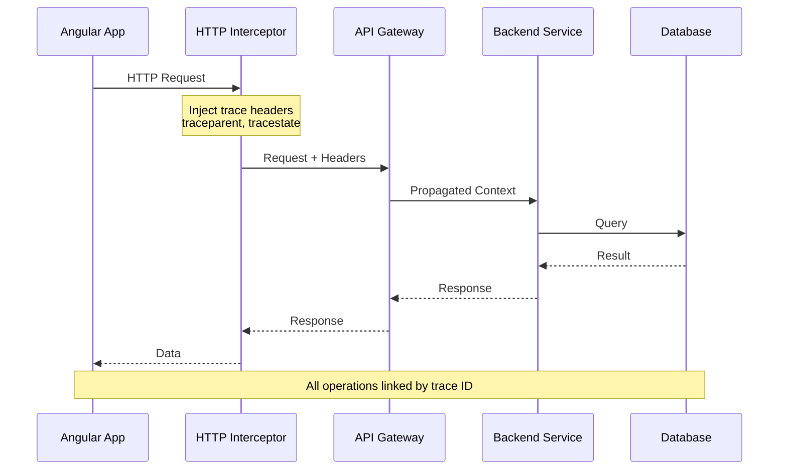

# How to Use the OpenTelemetry Angular HTTP Interceptor for Automatic Trace Propagation

Author: [nawazdhandala](https://www.github.com/nawazdhandala)

Tags: OpenTelemetry, Angular, HTTP Interceptor, Trace Propagation, TypeScript

Description: Master trace propagation in Angular using HTTP interceptors to connect frontend and backend traces for end-to-end distributed tracing.

Distributed tracing connects frontend and backend operations into a single view, showing how a user action flows through your entire system. Angular's HTTP interceptors provide the perfect mechanism for automatic trace propagation, injecting trace context into outgoing requests without modifying service code. This guide demonstrates how to implement comprehensive trace propagation using Angular HTTP interceptors and OpenTelemetry.

## Understanding Trace Propagation

Trace propagation transmits trace context from one service to another, allowing observability systems to connect related spans across service boundaries. When a user clicks a button in your Angular app, the resulting HTTP request should connect to backend spans, creating a complete trace from browser to database.



The trace context flows through headers, typically using the W3C Trace Context standard with the `traceparent` and `tracestate` headers.

## Setting Up Dependencies

Install the required OpenTelemetry packages for Angular applications.

```bash
npm install @opentelemetry/api \
  @opentelemetry/sdk-trace-web \
  @opentelemetry/core \
  @opentelemetry/instrumentation-fetch \
  @opentelemetry/instrumentation-xml-http-request \
  @opentelemetry/exporter-trace-otlp-http \
  @opentelemetry/resources \
  @opentelemetry/semantic-conventions \
  @opentelemetry/propagator-b3 \
  @opentelemetry/propagator-jaeger
```

These packages provide the core tracing functionality and various propagation formats.

## Creating the Trace Propagation Interceptor

Build an HTTP interceptor that automatically injects trace context into outgoing requests.

```typescript
// src/app/interceptors/trace-propagation.interceptor.ts

import { Injectable } from '@angular/core';
import {
  HttpInterceptor,
  HttpRequest,
  HttpHandler,
  HttpEvent,
  HttpResponse,
  HttpErrorResponse,
} from '@angular/common/http';
import { Observable } from 'rxjs';
import { tap, finalize } from 'rxjs/operators';
import {
  trace,
  context,
  propagation,
  SpanStatusCode,
  SpanKind,
  Span,
} from '@opentelemetry/api';
import { W3CTraceContextPropagator } from '@opentelemetry/core';

@Injectable()
export class TracePropagationInterceptor implements HttpInterceptor {
  private tracer = trace.getTracer('angular-http-client');
  private propagator = new W3CTraceContextPropagator();

  intercept(
    request: HttpRequest<unknown>,
    next: HttpHandler
  ): Observable<HttpEvent<unknown>> {
    // Create a span for this HTTP request
    const span = this.tracer.startSpan(`HTTP ${request.method}`, {
      kind: SpanKind.CLIENT,
      attributes: {
        'http.method': request.method,
        'http.url': request.url,
        'http.target': this.getTarget(request),
        'http.host': this.getHost(request),
        'http.scheme': this.getScheme(request),
      },
    });

    // Inject trace context into request headers
    const modifiedRequest = this.injectTraceContext(request, span);

    const startTime = Date.now();

    // Execute the request within the span's context
    return context.with(trace.setSpan(context.active(), span), () => {
      return next.handle(modifiedRequest).pipe(
        tap({
          next: (event) => {
            if (event instanceof HttpResponse) {
              const duration = Date.now() - startTime;

              // Add response attributes to span
              span.setAttributes({
                'http.status_code': event.status,
                'http.status_text': event.statusText,
                'http.response_content_length':
                  event.headers.get('content-length') || 0,
                'http.response_time_ms': duration,
              });

              // Extract backend trace information if available
              this.extractBackendTraceInfo(event, span);

              span.setStatus({ code: SpanStatusCode.OK });
            }
          },
          error: (error) => {
            if (error instanceof HttpErrorResponse) {
              span.setAttributes({
                'http.status_code': error.status,
                'http.status_text': error.statusText,
                'error.type': error.name,
                'error.message': error.message,
              });

              span.recordException(error);
              span.setStatus({
                code: SpanStatusCode.ERROR,
                message: error.message,
              });
            }
          },
        }),
        finalize(() => {
          span.end();
        })
      );
    });
  }

  private injectTraceContext(
    request: HttpRequest<unknown>,
    span: Span
  ): HttpRequest<unknown> {
    // Create a carrier object to hold trace headers
    const carrier: { [key: string]: string } = {};

    // Inject trace context into carrier using the propagator
    propagation.inject(
      trace.setSpan(context.active(), span),
      carrier
    );

    // Clone the request and add trace headers
    let modifiedRequest = request;
    Object.keys(carrier).forEach(key => {
      modifiedRequest = modifiedRequest.clone({
        setHeaders: { [key]: carrier[key] },
      });
    });

    return modifiedRequest;
  }

  private extractBackendTraceInfo(event: HttpResponse<any>, span: Span): void {
    // Extract custom headers that backends might return
    const serverTiming = event.headers.get('server-timing');
    if (serverTiming) {
      span.setAttribute('http.server_timing', serverTiming);
    }

    const requestId = event.headers.get('x-request-id');
    if (requestId) {
      span.setAttribute('http.request_id', requestId);
    }

    const traceId = event.headers.get('x-trace-id');
    if (traceId) {
      span.setAttribute('http.backend_trace_id', traceId);
    }
  }

  private getTarget(request: HttpRequest<unknown>): string {
    const url = new URL(request.url, window.location.origin);
    return url.pathname + url.search;
  }

  private getHost(request: HttpRequest<unknown>): string {
    const url = new URL(request.url, window.location.origin);
    return url.host;
  }

  private getScheme(request: HttpRequest<unknown>): string {
    const url = new URL(request.url, window.location.origin);
    return url.protocol.replace(':', '');
  }
}
```

## Registering the Interceptor

Register the interceptor in your Angular module to apply it to all HTTP requests.

```typescript
// src/app/app.module.ts

import { NgModule } from '@angular/core';
import { BrowserModule } from '@angular/platform-browser';
import { HttpClientModule, HTTP_INTERCEPTORS } from '@angular/common/http';
import { AppComponent } from './app.component';
import { TracePropagationInterceptor } from './interceptors/trace-propagation.interceptor';

@NgModule({
  declarations: [
    AppComponent,
  ],
  imports: [
    BrowserModule,
    HttpClientModule,
  ],
  providers: [
    {
      provide: HTTP_INTERCEPTORS,
      useClass: TracePropagationInterceptor,
      multi: true,
    },
  ],
  bootstrap: [AppComponent]
})
export class AppModule { }
```

## Configuring Multiple Propagation Formats

Different backend services might use different trace propagation formats. Support multiple formats by configuring composite propagators.

```typescript
// src/app/services/tracing-config.service.ts

import { Injectable } from '@angular/core';
import { propagation } from '@opentelemetry/api';
import {
  W3CTraceContextPropagator,
  W3CBaggagePropagator,
  CompositePropagator,
} from '@opentelemetry/core';
import { B3Propagator, B3InjectEncoding } from '@opentelemetry/propagator-b3';
import { JaegerPropagator } from '@opentelemetry/propagator-jaeger';

@Injectable({
  providedIn: 'root'
})
export class TracingConfigService {

  constructor() {
    this.configurePropagators();
  }

  private configurePropagators(): void {
    // Configure multiple propagation formats
    // This allows the application to work with different backend services
    propagation.setGlobalPropagator(
      new CompositePropagator({
        propagators: [
          new W3CTraceContextPropagator(),
          new W3CBaggagePropagator(),
          new B3Propagator(),
          new B3Propagator({ injectEncoding: B3InjectEncoding.MULTI_HEADER }),
          new JaegerPropagator(),
        ],
      })
    );
  }
}
```

Initialize the configuration service early in your application:

```typescript
// src/app/app.module.ts

import { APP_INITIALIZER } from '@angular/core';
import { TracingConfigService } from './services/tracing-config.service';

export function initializeTracing(tracingConfig: TracingConfigService) {
  return () => {
    // Configuration happens in constructor
    return Promise.resolve();
  };
}

@NgModule({
  providers: [
    TracingConfigService,
    {
      provide: APP_INITIALIZER,
      useFactory: initializeTracing,
      deps: [TracingConfigService],
      multi: true,
    },
  ],
})
export class AppModule { }
```

## Selective Trace Propagation

Not all HTTP requests require trace propagation. Implement filtering to propagate traces only for relevant requests.

```typescript
// src/app/interceptors/selective-trace-propagation.interceptor.ts

import { Injectable } from '@angular/core';
import {
  HttpInterceptor,
  HttpRequest,
  HttpHandler,
  HttpEvent,
} from '@angular/common/http';
import { Observable } from 'rxjs';
import { trace, context, propagation } from '@opentelemetry/api';

@Injectable()
export class SelectiveTracePropagationInterceptor implements HttpInterceptor {
  private tracer = trace.getTracer('angular-http-client');

  // Configure which URLs should receive trace headers
  private propagationUrls = [
    /^https:\/\/api\.yourapp\.com/,
    /^https:\/\/.*\.yourapp\.com/,
    /^http:\/\/localhost:3000/,
  ];

  // URLs to exclude from trace propagation
  private excludedUrls = [
    /\/health$/,
    /\/metrics$/,
    /\/analytics/,
    /\.(?:jpg|jpeg|png|gif|svg|css|js)$/,
  ];

  intercept(
    request: HttpRequest<unknown>,
    next: HttpHandler
  ): Observable<HttpEvent<unknown>> {
    // Check if this request should propagate traces
    if (!this.shouldPropagate(request.url)) {
      return next.handle(request);
    }

    const span = this.tracer.startSpan(`HTTP ${request.method} ${this.getPath(request)}`);

    // Inject trace context
    const carrier: { [key: string]: string } = {};
    propagation.inject(trace.setSpan(context.active(), span), carrier);

    const modifiedRequest = request.clone({
      setHeaders: carrier,
    });

    return context.with(trace.setSpan(context.active(), span), () => {
      return next.handle(modifiedRequest);
    });
  }

  private shouldPropagate(url: string): boolean {
    // Exclude specific URLs
    if (this.excludedUrls.some(pattern => pattern.test(url))) {
      return false;
    }

    // Only propagate to configured URLs
    return this.propagationUrls.some(pattern => pattern.test(url));
  }

  private getPath(request: HttpRequest<unknown>): string {
    try {
      const url = new URL(request.url, window.location.origin);
      return url.pathname;
    } catch {
      return request.url;
    }
  }
}
```

## Adding Baggage for Context Propagation

Baggage allows you to propagate additional context beyond trace IDs, such as user information or feature flags.

```typescript
// src/app/services/baggage.service.ts

import { Injectable } from '@angular/core';
import { propagation, context, baggageUtils } from '@opentelemetry/api';

@Injectable({
  providedIn: 'root'
})
export class BaggageService {

  /**
   * Set baggage items that will be propagated with traces
   */
  setBaggage(key: string, value: string): void {
    const currentBaggage = propagation.getBaggage(context.active()) || baggageUtils.createBaggage();
    const newBaggage = currentBaggage.setEntry(key, { value });
    context.with(propagation.setBaggage(context.active(), newBaggage), () => {
      // Baggage is now set in the current context
    });
  }

  /**
   * Get a baggage item from the current context
   */
  getBaggage(key: string): string | undefined {
    const baggage = propagation.getBaggage(context.active());
    return baggage?.getEntry(key)?.value;
  }

  /**
   * Set user context that will be propagated to backend
   */
  setUserContext(userId: string, userRole: string): void {
    this.setBaggage('user.id', userId);
    this.setBaggage('user.role', userRole);
  }

  /**
   * Set feature flags that backend can use for conditional logic
   */
  setFeatureFlags(flags: Record<string, boolean>): void {
    Object.entries(flags).forEach(([key, value]) => {
      this.setBaggage(`feature.${key}`, value.toString());
    });
  }
}
```

Use the baggage service in your components:

```typescript
// src/app/components/dashboard.component.ts

import { Component, OnInit } from '@angular/core';
import { BaggageService } from '../services/baggage.service';
import { AuthService } from '../services/auth.service';

@Component({
  selector: 'app-dashboard',
  templateUrl: './dashboard.component.html',
})
export class DashboardComponent implements OnInit {

  constructor(
    private baggageService: BaggageService,
    private authService: AuthService
  ) {}

  ngOnInit(): void {
    // Set user context for trace propagation
    const user = this.authService.getCurrentUser();
    if (user) {
      this.baggageService.setUserContext(user.id, user.role);
    }

    // Set feature flags
    this.baggageService.setFeatureFlags({
      'newDashboard': true,
      'experimentalFeature': false,
    });
  }
}
```

## Creating an Enhanced Interceptor with Retry Logic

Combine trace propagation with retry logic and error handling.

```typescript
// src/app/interceptors/enhanced-trace-interceptor.ts

import { Injectable } from '@angular/core';
import {
  HttpInterceptor,
  HttpRequest,
  HttpHandler,
  HttpEvent,
  HttpErrorResponse,
} from '@angular/common/http';
import { Observable, throwError } from 'rxjs';
import { retry, catchError, finalize } from 'rxjs/operators';
import { trace, context, propagation, SpanStatusCode } from '@opentelemetry/api';

@Injectable()
export class EnhancedTraceInterceptor implements HttpInterceptor {
  private tracer = trace.getTracer('angular-http-client');
  private maxRetries = 3;
  private retryableStatusCodes = [408, 429, 500, 502, 503, 504];

  intercept(
    request: HttpRequest<unknown>,
    next: HttpHandler
  ): Observable<HttpEvent<unknown>> {
    const span = this.tracer.startSpan(`HTTP ${request.method} ${request.url}`);
    let attemptCount = 0;

    // Inject trace context
    const carrier: { [key: string]: string } = {};
    propagation.inject(trace.setSpan(context.active(), span), carrier);

    const modifiedRequest = request.clone({
      setHeaders: {
        ...carrier,
        'x-attempt-number': '1',
      },
    });

    return context.with(trace.setSpan(context.active(), span), () => {
      return next.handle(modifiedRequest).pipe(
        retry({
          count: this.maxRetries,
          delay: (error, retryCount) => {
            attemptCount = retryCount;

            // Only retry on specific status codes
            if (error instanceof HttpErrorResponse) {
              if (!this.retryableStatusCodes.includes(error.status)) {
                throw error;
              }

              // Add retry information to span
              span.addEvent('http.retry', {
                'retry.attempt': retryCount,
                'http.status_code': error.status,
              });

              // Exponential backoff
              const delayMs = Math.min(1000 * Math.pow(2, retryCount - 1), 10000);
              return new Observable(observer => {
                setTimeout(() => {
                  observer.next();
                  observer.complete();
                }, delayMs);
              });
            }
            throw error;
          },
        }),
        catchError((error: HttpErrorResponse) => {
          span.setAttributes({
            'http.status_code': error.status,
            'error.type': error.name,
            'error.message': error.message,
            'http.retry_count': attemptCount,
          });

          span.recordException(error);
          span.setStatus({
            code: SpanStatusCode.ERROR,
            message: `HTTP ${error.status}: ${error.message}`,
          });

          return throwError(() => error);
        }),
        finalize(() => {
          if (attemptCount > 0) {
            span.setAttribute('http.total_attempts', attemptCount + 1);
          }
          span.end();
        })
      );
    });
  }
}
```

## Monitoring Trace Propagation

Create a service to monitor and debug trace propagation.

```typescript
// src/app/services/trace-monitoring.service.ts

import { Injectable } from '@angular/core';
import { trace, context } from '@opentelemetry/api';

@Injectable({
  providedIn: 'root'
})
export class TraceMonitoringService {

  /**
   * Log current trace context for debugging
   */
  logCurrentTrace(): void {
    const span = trace.getSpan(context.active());
    if (span) {
      const spanContext = span.spanContext();
      console.log('Current Trace Context:', {
        traceId: spanContext.traceId,
        spanId: spanContext.spanId,
        traceFlags: spanContext.traceFlags,
      });
    } else {
      console.log('No active span in current context');
    }
  }

  /**
   * Validate that trace propagation is working
   */
  validatePropagation(request: Request): boolean {
    const traceparent = request.headers.get('traceparent');
    const tracestate = request.headers.get('tracestate');

    if (!traceparent) {
      console.warn('No traceparent header found in request');
      return false;
    }

    console.log('Trace Headers:', { traceparent, tracestate });
    return true;
  }

  /**
   * Extract trace information from response headers
   */
  extractTraceInfo(headers: Headers): Record<string, string> {
    const traceInfo: Record<string, string> = {};

    const relevantHeaders = [
      'x-trace-id',
      'x-span-id',
      'x-request-id',
      'server-timing',
    ];

    relevantHeaders.forEach(header => {
      const value = headers.get(header);
      if (value) {
        traceInfo[header] = value;
      }
    });

    return traceInfo;
  }
}
```

## Backend Integration Example

Ensure your backend correctly extracts and propagates trace context.

```typescript
// Example Node.js/Express backend middleware

import { trace, context, propagation } from '@opentelemetry/api';

export function traceContextMiddleware(req, res, next) {
  // Extract trace context from incoming headers
  const extractedContext = propagation.extract(context.active(), req.headers);

  // Run the request within the extracted context
  context.with(extractedContext, () => {
    const tracer = trace.getTracer('backend-service');
    const span = tracer.startSpan(`${req.method} ${req.path}`);

    // Add request attributes
    span.setAttributes({
      'http.method': req.method,
      'http.url': req.url,
      'http.path': req.path,
    });

    // Store span in request for later use
    req.span = span;

    // Add response timing header
    const startTime = Date.now();
    res.on('finish', () => {
      const duration = Date.now() - startTime;
      span.setAttribute('http.status_code', res.statusCode);
      span.setAttribute('http.duration_ms', duration);

      // Add Server-Timing header for frontend
      res.setHeader('Server-Timing', `total;dur=${duration}`);

      span.end();
    });

    next();
  });
}
```

Trace propagation through HTTP interceptors creates a seamless connection between your Angular frontend and backend services, enabling comprehensive distributed tracing. By automatically injecting trace context into every request, you gain complete visibility into how user actions flow through your entire system, making it dramatically easier to diagnose issues and optimize performance.

