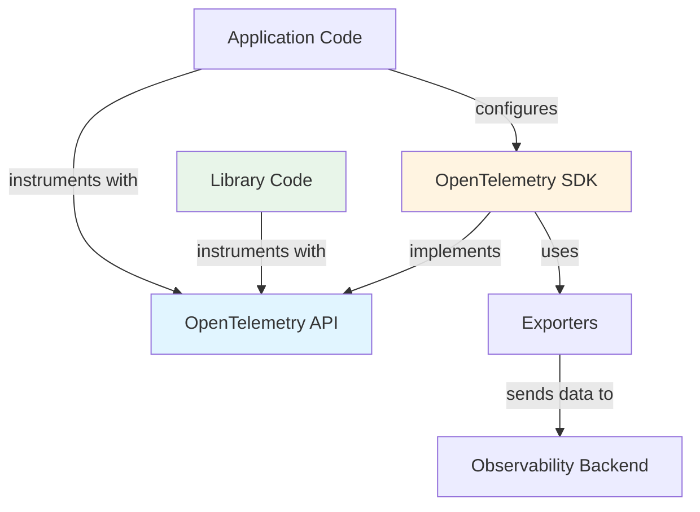

# How to Understand the Difference Between OpenTelemetry API and SDK

Author: [nawazdhandala](https://www.github.com/nawazdhandala)

Tags: OpenTelemetry, API, SDK, Instrumentation, Architecture

Description: Understanding the distinction between OpenTelemetry API and SDK is critical for building maintainable observability pipelines that remain portable across vendors.

When you start instrumenting applications with OpenTelemetry, you'll quickly encounter two terms: API and SDK. They're often used interchangeably by people who haven't dug deeper, but they serve fundamentally different purposes. Mixing them up leads to vendor lock-in, brittle instrumentation, and confusion when trying to swap backends or upgrade libraries.

The separation between API and SDK is deliberate. It's not an academic distinction- it's a practical design that keeps your instrumentation code decoupled from implementation details. Understanding this split will make you a better engineer when working with distributed systems observability.

## The Core Separation

The **API** defines what you can do. The **SDK** defines how it actually happens.

Here's the mental model: the API is a contract. It's a set of interfaces, abstract classes, and method signatures that tell you how to create spans, record metrics, and emit logs. The SDK is the concrete implementation that does the actual work- batching, sampling, exporting, resource detection, and formatting data for backends.

When you write instrumentation code, you import from the API package. When you configure the telemetry pipeline (sampling rules, exporters, processors), you import from the SDK package. This boundary is enforced through package naming conventions across all OpenTelemetry language implementations.

## Why the Split Matters

Imagine you instrument a library- let's say a database client wrapper. If you depend directly on SDK implementation details, every consumer of your library inherits those decisions. They're stuck with your choice of exporter, your sampling strategy, your resource attributes.

By depending only on the API, your library becomes a no-op if the application doesn't initialize an SDK. If they do initialize one, your instrumentation automatically lights up- using their configuration, their backends, their sampling rules. No coordination needed.

This is why well-maintained OpenTelemetry instrumentation libraries declare dependencies only on API packages. SDKs are application-level concerns.



## What's in the API

The API provides no-op implementations by default. You can call `tracer.startSpan()` all day long without an SDK, and nothing breaks. The span just doesn't get recorded or exported. This is a feature, not a bug.

### Core API components

**Tracer Provider**: A factory for creating Tracers. Each tracer is associated with an instrumentation scope (library name + version).

**Tracer**: Creates spans. You never instantiate this directly- you get it from the provider.

**Span**: Represents a unit of work. You add attributes, events, set status, record exceptions. The API defines the interface; the SDK decides if/when/how to export it.

**Context Propagation**: APIs for storing and retrieving trace context across async boundaries (thread locals, async hooks, etc). The propagators that serialize context into headers (W3C Trace Context, B3, etc) live in the SDK.

**Metrics API**: Similar hierarchy- Meter Provider → Meter → Instruments (Counter, Histogram, Gauge). You record values through the API; the SDK aggregates and exports them.

### Example using only the API

This code works without an SDK. It just won't emit any telemetry.

```javascript
// Using only the API - no SDK imported
import { trace, context } from '@opentelemetry/api';

function processOrder(orderId) {
  const tracer = trace.getTracer('order-service', '1.0.0');
  const span = tracer.startSpan('process_order');

  // Set span attributes using the API
  span.setAttribute('order.id', orderId);
  span.setAttribute('order.processor', 'main');

  try {
    // Business logic here
    const result = executeOrderProcessing(orderId);
    span.setStatus({ code: 1 }); // OK status
    return result;
  } catch (error) {
    // Record exception using API
    span.recordException(error);
    span.setStatus({ code: 2, message: error.message }); // ERROR status
    throw error;
  } finally {
    span.end();
  }
}
```

This library can ship to npm. Consumers decide if they want telemetry.

## What's in the SDK

The SDK makes your instrumentation useful. It provides the components that turn API calls into actual telemetry data flowing to backends.

### Core SDK components

**Tracer Provider (SDK)**: Concrete implementation that manages sampling, span processors, and resource detection.

**Span Processors**: Define what happens when spans start and end. BatchSpanProcessor batches spans before export. SimpleSpanProcessor exports immediately (useful for debugging, terrible for production).

**Span Exporters**: Serialize spans and send them somewhere. OTLP exporter, Jaeger exporter, Zipkin exporter, console exporter (stdout).

**Samplers**: Decide whether to record and export a trace. TraceIdRatioBasedSampler samples a percentage. ParentBasedSampler respects upstream sampling decisions. You can write custom samplers.

**Resource Detectors**: Automatically detect environment attributes (service name, host, cloud provider, k8s metadata). Merge them into every span.

**Metric Readers**: Pull metrics periodically or on-demand. PeriodicExportingMetricReader exports at intervals. PrometheusExporter exposes a scrape endpoint.

**Views**: Configure aggregation behavior for metrics. Change histogram boundaries, drop attributes, rename instruments.

### Example initializing the SDK

This is application-level setup code. You do this once at startup.

```javascript
// SDK initialization - application-level code
import { NodeSDK } from '@opentelemetry/sdk-node';
import { OTLPTraceExporter } from '@opentelemetry/exporter-trace-otlp-http';
import { OTLPMetricExporter } from '@opentelemetry/exporter-metrics-otlp-http';
import { PeriodicExportingMetricReader } from '@opentelemetry/sdk-metrics';
import { Resource } from '@opentelemetry/resources';
import { SemanticResourceAttributes } from '@opentelemetry/semantic-conventions';
import { ParentBasedSampler, TraceIdRatioBasedSampler } from '@opentelemetry/sdk-trace-base';

// Define resource attributes for this service
const resource = new Resource({
  [SemanticResourceAttributes.SERVICE_NAME]: 'order-api',
  [SemanticResourceAttributes.SERVICE_VERSION]: '2.1.3',
  [SemanticResourceAttributes.DEPLOYMENT_ENVIRONMENT]: process.env.ENV || 'dev',
});

// Configure trace exporter
const traceExporter = new OTLPTraceExporter({
  url: 'https://oneuptime.com/otlp/v1/traces',
  headers: { 'x-oneuptime-token': process.env.ONEUPTIME_TOKEN },
});

// Configure metric exporter
const metricExporter = new OTLPMetricExporter({
  url: 'https://oneuptime.com/otlp/v1/metrics',
  headers: { 'x-oneuptime-token': process.env.ONEUPTIME_TOKEN },
});

// Initialize the SDK with configuration
const sdk = new NodeSDK({
  resource,
  traceExporter,
  // Sample 20% of traces, but always sample if parent was sampled
  sampler: new ParentBasedSampler({
    root: new TraceIdRatioBasedSampler(0.2),
  }),
  metricReader: new PeriodicExportingMetricReader({
    exporter: metricExporter,
    exportIntervalMillis: 60000, // Export metrics every 60 seconds
  }),
});

sdk.start();

// Graceful shutdown on process termination
process.on('SIGTERM', () => {
  sdk.shutdown()
    .then(() => console.log('Telemetry terminated'))
    .catch((error) => console.error('Error terminating telemetry', error))
    .finally(() => process.exit(0));
});
```

After this initialization runs, all the API calls in your libraries and application code start producing real telemetry.

## Practical Boundaries in Code

Here's how package boundaries look across different languages:

### JavaScript/TypeScript
```
@opentelemetry/api           → API only (import in libraries)
@opentelemetry/sdk-trace-base → SDK trace components
@opentelemetry/sdk-metrics    → SDK metric components
@opentelemetry/sdk-node       → SDK initialization for Node.js
@opentelemetry/exporter-*     → SDK exporters
```

### Python
```
opentelemetry-api            → API only
opentelemetry-sdk            → SDK implementation
opentelemetry-exporter-*     → SDK exporters
```

### Go
```
go.opentelemetry.io/otel               → API
go.opentelemetry.io/otel/sdk           → SDK
go.opentelemetry.io/otel/exporters/*   → Exporters
```

### Java
```
io.opentelemetry:opentelemetry-api            → API
io.opentelemetry:opentelemetry-sdk            → SDK
io.opentelemetry:opentelemetry-exporter-*     → Exporters
```

If you're writing a library, your dependency list should only include the API package. If you're writing an application, you'll have both API (for custom instrumentation) and SDK (for configuration).

## Common Misconceptions

**"I don't need the SDK if I use auto-instrumentation."**

False. Auto-instrumentation libraries inject spans using the API. They still need an SDK to export that data. The auto-instrumentation agent or library initializes the SDK for you, but it's still there.

**"The SDK is optional."**

Technically true but useless. Without an SDK, all your instrumentation is a no-op. You need an SDK to turn API calls into telemetry.

**"I should always use the latest SDK."**

The API has stability guarantees. The SDK evolves faster. You can upgrade SDKs without changing instrumentation code, as long as the API version remains compatible. This is the point of the separation.

**"Custom instrumentation requires the SDK."**

No. Custom instrumentation uses the API. You create spans, record metrics, add attributes- all through the API. The SDK handles the export.

## Version Compatibility

The API stabilized at 1.0. Implementations guarantee backward compatibility. You can use an older SDK with a newer API package (within reason), or vice versa.

The key rule: API versions must match or be compatible. Mixing incompatible versions leads to runtime errors or silent no-ops.

Most package managers will handle this automatically if you declare dependencies correctly. Just be aware of version constraints when working with monorepos or multiple microservices.

## When to Import What

**Import API when:**
- Writing a library that others will consume
- Adding custom spans to business logic
- Recording custom metrics
- Propagating context across async boundaries
- Checking if tracing is enabled (rarely needed)

**Import SDK when:**
- Initializing telemetry in your application entry point
- Configuring sampling strategies
- Setting up exporters and backends
- Configuring resource attributes
- Implementing custom samplers or span processors
- Tuning metric aggregation with views

If you find yourself importing SDK packages in library code, stop. You're coupling your library to implementation details.

## The No-Op Performance Win

Because the API provides no-op implementations, there's negligible performance cost when the SDK isn't initialized. The JIT compiler can often optimize away the entire call chain.

This means libraries can be instrumented aggressively without penalizing users who don't want observability. If they initialize an SDK, they get telemetry. If they don't, they pay almost nothing.

This is why "instrument everything" is feasible with OpenTelemetry, unlike older tracing systems where instrumentation had non-trivial overhead even when disabled.

## Building Custom Components

Sometimes you need custom behavior: a sampler that respects tenant quotas, a processor that redacts PII, an exporter that writes to your internal system.

These are SDK concerns. You implement SDK interfaces (Sampler, SpanProcessor, SpanExporter) and register them during initialization.

### Example custom sampler

This sampler drops traces for health checks but keeps everything else.

```javascript
import { Sampler, SamplingDecision, SamplingResult } from '@opentelemetry/sdk-trace-base';
import { Attributes, SpanKind, Context } from '@opentelemetry/api';

class HealthCheckSampler implements Sampler {
  shouldSample(
    context: Context,
    traceId: string,
    spanName: string,
    spanKind: SpanKind,
    attributes: Attributes
  ): SamplingResult {
    // Drop health check traces
    if (attributes['http.target'] === '/health' || attributes['http.target'] === '/healthz') {
      return { decision: SamplingDecision.NOT_RECORD };
    }

    // Record everything else
    return { decision: SamplingDecision.RECORD_AND_SAMPLED };
  }

  toString(): string {
    return 'HealthCheckSampler';
  }
}

// Use it during SDK initialization
const sdk = new NodeSDK({
  sampler: new HealthCheckSampler(),
  // ... other config
});
```

Notice this implements an SDK interface. You'd never import this in library code.

## The Collector Relationship

The OpenTelemetry Collector is another SDK-level concern. It receives telemetry exported by application SDKs, processes it (sampling, filtering, enrichment), and forwards it to backends.

Your application code doesn't know or care if there's a Collector in the middle. You configure your SDK to export OTLP (the protocol), and it sends data to an endpoint. That endpoint might be a backend directly or a Collector.

This is the portability promise: instrument once, route anywhere. The API-SDK split enables it.

Related reading: [What is OpenTelemetry Collector and why use one?](https://oneuptime.com/blog/post/2025-09-18-what-is-opentelemetry-collector-and-why-use-one/view)

## Testing Instrumentation

For unit tests, you can use in-memory exporters from the SDK test packages. Instrument your code normally (using the API), initialize an SDK with an in-memory exporter, run your code, then assert on the captured spans.

```javascript
import { InMemorySpanExporter } from '@opentelemetry/sdk-trace-base';
import { NodeTracerProvider } from '@opentelemetry/sdk-trace-node';
import { SimpleSpanProcessor } from '@opentelemetry/sdk-trace-base';

describe('Order Processing', () => {
  let exporter;
  let provider;

  beforeEach(() => {
    // Set up in-memory exporter for testing
    exporter = new InMemorySpanExporter();
    provider = new NodeTracerProvider();
    provider.addSpanProcessor(new SimpleSpanProcessor(exporter));
    provider.register();
  });

  afterEach(() => {
    // Clean up after each test
    exporter.reset();
  });

  it('creates span for order processing', () => {
    processOrder('order-123');

    const spans = exporter.getFinishedSpans();
    expect(spans.length).toBe(1);
    expect(spans[0].name).toBe('process_order');
    expect(spans[0].attributes['order.id']).toBe('order-123');
  });
});
```

This is SDK usage for testing purposes. Your production code doesn't change.

## Key Takeaways

The API-SDK separation is a design pattern, not a bureaucratic annoyance. It gives you:

- **Portability**: Swap backends without changing instrumentation
- **Performance**: No-op behavior when telemetry is disabled
- **Modularity**: Libraries can instrument without forcing configuration choices
- **Testability**: Mock SDKs for unit testing without network calls
- **Flexibility**: Custom samplers, processors, and exporters without forking core libraries

When writing code that will be consumed by others (libraries, shared utilities), depend only on the API. When configuring telemetry for your application, use the SDK. Keep the boundary clean, and your observability infrastructure stays flexible.

If you're unsure which package to import, ask: "Am I creating telemetry or configuring how it's processed?" The former is API territory. The latter is SDK territory.

Understanding this distinction will save you from painful refactors when you decide to change backends, upgrade libraries, or optimize performance. The separation is fundamental to OpenTelemetry's architecture- respect it, and your instrumentation will age gracefully.

**Related Reading:**
- [How to reduce noise in OpenTelemetry? Keep What Matters, Drop the Rest](https://oneuptime.com/blog/post/2025-08-25-how-to-reduce-noise-in-opentelemetry/view)
- [Three Pillars of Observability: Logs, Metrics, Traces](https://oneuptime.com/blog/post/2025-08-20-three-pillars-of-observability-logs-metrics-traces/view)
