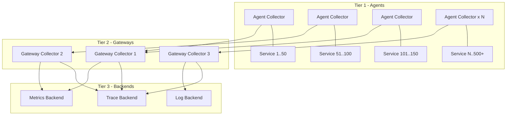

# How to Design an OpenTelemetry Architecture for 500+ Microservices

Author: [nawazdhandala](https://www.github.com/nawazdhandala)

Tags: OpenTelemetry, Architecture, Microservices, Scalability, Collector, Observability

Description: Learn how to design a scalable OpenTelemetry architecture that handles telemetry from 500 or more microservices without bottlenecks or data loss.

---

When you have a handful of microservices, any reasonable OpenTelemetry setup works. You spin up a collector, point your services at it, and you are done. But when you cross the threshold of hundreds of microservices generating thousands of spans per second, the architecture decisions you made early on start to show their limits. Collectors become bottlenecks. Sampling decisions get complicated. Configuration management becomes a full-time job. Network bandwidth for telemetry traffic becomes a real cost.

This post covers the architectural patterns that work at scale for organizations running 500 or more microservices. These are not theoretical designs. They are patterns that have been proven in production at companies dealing with massive telemetry volumes.

## The Scale Challenge

Let us put some numbers on the problem. Assume 500 microservices, each producing an average of 100 spans per second. That is 50,000 spans per second across the system. At an average span size of 1KB, you are looking at 50MB/s of raw trace data, or about 4.3TB per day. And that is just traces. Add metrics and logs, and you are easily dealing with 10TB+ per day of telemetry data.

At this scale, you need:
- Multiple collector tiers to handle the load
- Intelligent sampling to reduce data volume
- Configuration management that does not require touching 500 services
- Fault tolerance so that collector failures do not cause data loss
- Cost management to keep observability affordable

## Multi-Tier Collector Architecture

The foundation of a scalable architecture is a multi-tier collector deployment:



**Tier 1: Agent collectors** run as DaemonSets on every Kubernetes node. Each agent handles telemetry from all pods on its node. They do minimal processing: receive, batch, and forward. This tier absorbs the burst traffic from applications and provides a stable local endpoint.

**Tier 2: Gateway collectors** are the workhorses. They handle sampling decisions, attribute enrichment, filtering, and routing. Run them as a horizontally-scalable Deployment behind a Kubernetes Service. This is where your processing logic lives.

**Tier 3: Backends** receive the processed and sampled data. These are your tracing, metrics, and logging platforms.

## Agent Collector Configuration

Agent collectors should be lightweight and fast:

```yaml
# agent-collector-config.yaml
# Minimal configuration for DaemonSet agent collectors.
# These run on every node and handle local telemetry collection.
receivers:
  otlp:
    protocols:
      grpc:
        endpoint: 0.0.0.0:4317
      http:
        endpoint: 0.0.0.0:4318

processors:
  # Memory limiter prevents OOM kills on busy nodes
  memory_limiter:
    check_interval: 1s
    limit_mib: 512
    spike_limit_mib: 128

  # Batch for efficient network usage to the gateway tier
  batch:
    timeout: 2s
    send_batch_size: 512

  # Add node-level metadata to all telemetry
  resource:
    attributes:
      - key: k8s.node.name
        from_attribute: ""
        action: insert
        value: "${K8S_NODE_NAME}"

exporters:
  # Use load-balanced exporter to distribute across gateway instances
  loadbalancing:
    protocol:
      otlp:
        timeout: 5s
    resolver:
      dns:
        hostname: otel-gateway.observability.svc
        port: 4317

service:
  pipelines:
    traces:
      receivers: [otlp]
      processors: [memory_limiter, resource, batch]
      exporters: [loadbalancing]
    metrics:
      receivers: [otlp]
      processors: [memory_limiter, resource, batch]
      exporters: [loadbalancing]
```

The load-balancing exporter is crucial. It distributes telemetry across all gateway instances, and for traces, it routes spans with the same trace ID to the same gateway. This is important for tail-based sampling, which needs to see all spans of a trace in one place.

## Gateway Collector Configuration

Gateway collectors handle the complex processing:

```yaml
# gateway-collector-config.yaml
# Gateway collectors perform sampling, enrichment, and routing.
receivers:
  otlp:
    protocols:
      grpc:
        endpoint: 0.0.0.0:4317

processors:
  memory_limiter:
    check_interval: 1s
    limit_mib: 4096
    spike_limit_mib: 1024

  # Tail-based sampling makes decisions after seeing the complete trace
  tail_sampling:
    decision_wait: 30s
    num_traces: 100000
    policies:
      # Always keep traces with errors
      - name: errors
        type: status_code
        status_code:
          status_codes:
            - ERROR
      # Always keep slow traces
      - name: slow-traces
        type: latency
        latency:
          threshold_ms: 2000
      # Sample 5% of normal traces
      - name: probabilistic
        type: probabilistic
        probabilistic:
          sampling_percentage: 5

  # Enrich spans with Kubernetes metadata
  k8sattributes:
    auth_type: "serviceAccount"
    extract:
      metadata:
        - k8s.namespace.name
        - k8s.deployment.name
        - k8s.pod.name

  batch:
    timeout: 5s
    send_batch_size: 1024
    send_batch_max_size: 2048

exporters:
  otlphttp/traces:
    endpoint: https://oneuptime.com/otlp
    retry_on_failure:
      enabled: true
      max_elapsed_time: 300s

  otlphttp/metrics:
    endpoint: https://oneuptime.com/otlp

service:
  pipelines:
    traces:
      receivers: [otlp]
      processors: [memory_limiter, k8sattributes, tail_sampling, batch]
      exporters: [otlphttp/traces]
    metrics:
      receivers: [otlp]
      processors: [memory_limiter, k8sattributes, batch]
      exporters: [otlphttp/metrics]
```

## Kubernetes Deployment

Deploy the agent collectors as a DaemonSet so every node gets one:

```yaml
# DaemonSet for agent collectors - one per node
apiVersion: apps/v1
kind: DaemonSet
metadata:
  name: otel-agent
  namespace: observability
spec:
  selector:
    matchLabels:
      app: otel-agent
  template:
    metadata:
      labels:
        app: otel-agent
    spec:
      containers:
        - name: collector
          image: otel/opentelemetry-collector-contrib:0.96.0
          resources:
            requests:
              cpu: 200m
              memory: 256Mi
            limits:
              cpu: 500m
              memory: 512Mi
          env:
            - name: K8S_NODE_NAME
              valueFrom:
                fieldRef:
                  fieldPath: spec.nodeName
      # Use hostNetwork for performance on high-traffic nodes
      hostNetwork: false
      serviceAccountName: otel-agent
```

Deploy gateway collectors as a scalable Deployment:

```yaml
# Deployment for gateway collectors with HPA
apiVersion: apps/v1
kind: Deployment
metadata:
  name: otel-gateway
  namespace: observability
spec:
  replicas: 3
  selector:
    matchLabels:
      app: otel-gateway
  template:
    metadata:
      labels:
        app: otel-gateway
    spec:
      containers:
        - name: collector
          image: otel/opentelemetry-collector-contrib:0.96.0
          resources:
            requests:
              cpu: "1"
              memory: 4Gi
            limits:
              cpu: "2"
              memory: 8Gi
---
# HPA scales gateway collectors based on CPU usage
apiVersion: autoscaling/v2
kind: HorizontalPodAutoscaler
metadata:
  name: otel-gateway
  namespace: observability
spec:
  scaleTargetRef:
    apiVersion: apps/v1
    kind: Deployment
    name: otel-gateway
  minReplicas: 3
  maxReplicas: 10
  metrics:
    - type: Resource
      resource:
        name: cpu
        target:
          type: Utilization
          averageUtilization: 70
```

## Service Configuration Strategy

With 500+ services, you cannot configure each one individually. Use environment variable injection through Kubernetes:

```yaml
# MutatingWebhookConfiguration or simply a namespace-level ConfigMap
# that all services reference. This provides consistent OTel configuration
# without modifying each service's deployment spec.
apiVersion: v1
kind: ConfigMap
metadata:
  name: otel-sdk-config
  namespace: default
data:
  OTEL_EXPORTER_OTLP_ENDPOINT: "http://otel-agent.observability.svc:4318"
  OTEL_EXPORTER_OTLP_PROTOCOL: "http/protobuf"
  OTEL_TRACES_SAMPLER: "parentbased_always_on"
  OTEL_RESOURCE_ATTRIBUTES: "deployment.environment=production"
```

Use the OpenTelemetry Operator to handle auto-instrumentation for services that support it. This reduces the number of services that need code changes to zero for languages with agent-based instrumentation like Java and Python.

## Monitoring the Observability Infrastructure

At this scale, you need to monitor your monitoring. The collectors expose Prometheus metrics about their own health:

```yaml
# Prometheus ServiceMonitor for collector self-monitoring
apiVersion: monitoring.coreos.com/v1
kind: ServiceMonitor
metadata:
  name: otel-gateway
  namespace: observability
spec:
  selector:
    matchLabels:
      app: otel-gateway
  endpoints:
    - port: metrics
      interval: 15s
```

Key metrics to watch:
- `otelcol_exporter_sent_spans`: spans successfully exported
- `otelcol_exporter_send_failed_spans`: export failures
- `otelcol_processor_dropped_spans`: spans dropped by processors
- `otelcol_receiver_accepted_spans`: spans received from applications

## Conclusion

Designing an OpenTelemetry architecture for 500+ microservices requires thinking about telemetry as a distributed system in its own right. The multi-tier collector approach with agents and gateways provides the scalability, fault tolerance, and processing flexibility you need. Tail-based sampling at the gateway tier keeps costs manageable while preserving interesting traces. And centralized configuration through Kubernetes primitives and the OpenTelemetry Operator keeps the management overhead reasonable even as you add more services. The architecture should scale horizontally at every tier, so you are never limited by a single component.
