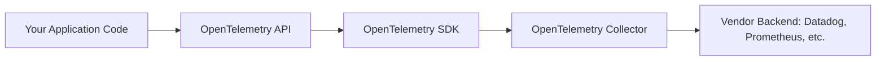
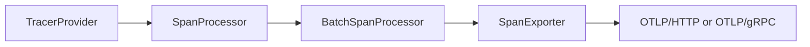
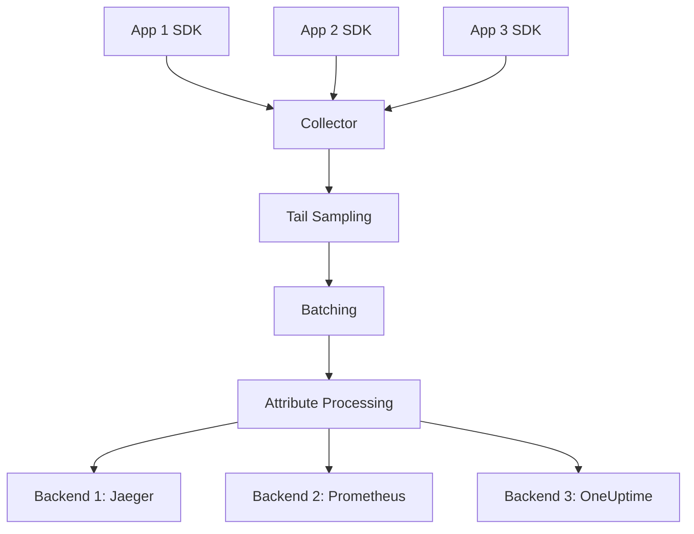
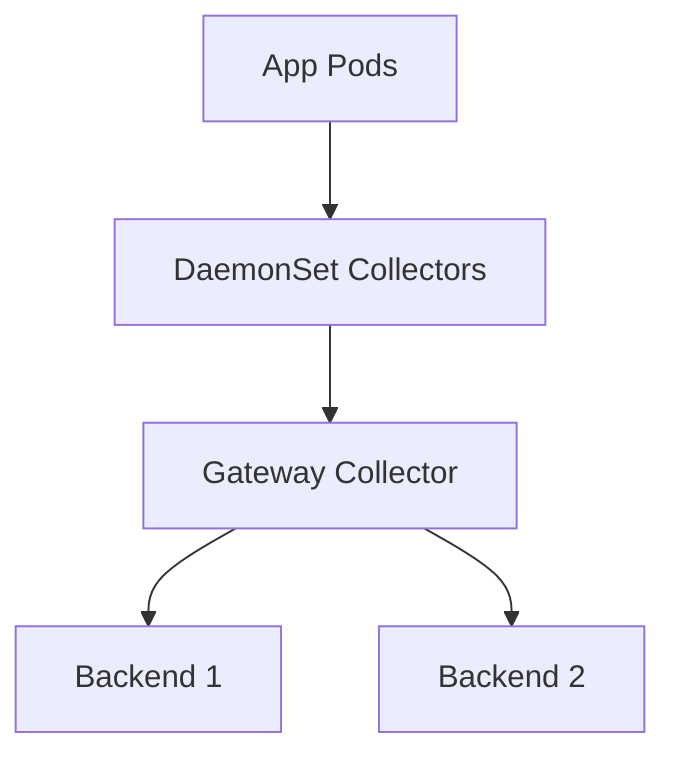

# How to Understand OpenTelemetry Architecture: API, SDK, and Collector Explained Simply

Author: [nawazdhandala](https://www.github.com/nawazdhandala)

Tags: OpenTelemetry, Architecture, Observability, API, SDK, Collector

Description: A clear breakdown of OpenTelemetry's three core components - API, SDK, and Collector - and how they work together to give you vendor-neutral observability.

OpenTelemetry solves a real problem: vendor lock-in with observability tooling. Before OpenTelemetry, switching from Datadog to Prometheus meant rewriting instrumentation code across your entire codebase. OpenTelemetry's architecture prevents this by separating concerns into three distinct layers: API, SDK, and Collector.

Understanding how these three components interact will help you instrument applications correctly and debug issues when telemetry doesn't flow as expected.

## The Three-Layer Architecture

OpenTelemetry's design follows a clear separation:



Each layer has a specific job. The API defines what instrumentation looks like. The SDK implements how telemetry gets created and processed. The Collector handles routing, transformation, and export to backends.

## Layer 1: The OpenTelemetry API

The API is the contract between your application code and the telemetry system. It defines interfaces without implementing behavior. When you write instrumentation, you import and call API functions.

Here's what API usage looks like in Node.js:

```javascript
// Import the API (not the SDK)
const { trace, context } = require('@opentelemetry/api');

// Get a tracer from the API
const tracer = trace.getTracer('payment-service', '1.0.0');

async function processPayment(orderId, amount) {
  // Create a span using the API
  const span = tracer.startSpan('payment.process', {
    attributes: {
      'order.id': orderId,
      'payment.amount': amount
    }
  });

  try {
    // Your business logic here
    const result = await chargeCard(amount);
    span.setStatus({ code: 1 }); // OK
    return result;
  } catch (error) {
    span.recordException(error);
    span.setStatus({ code: 2, message: error.message }); // ERROR
    throw error;
  } finally {
    span.end();
  }
}
```

The critical insight: this code never mentions Datadog, Jaeger, or any specific backend. The API is deliberately backend-agnostic.

### Why Separate the API?

Because libraries should depend on abstractions, not implementations. If you maintain an HTTP client library and want to add tracing, you depend on `@opentelemetry/api` (around 50KB) instead of the full SDK (several MB). Application developers choose which SDK to configure.

This pattern follows dependency inversion - your code depends on interfaces defined by the API, and the SDK provides concrete implementations at runtime.

## Layer 2: The OpenTelemetry SDK

The SDK implements the API's interfaces. It contains the machinery for creating spans, recording metrics, processing logs, sampling, batching, and exporting telemetry.

Here's SDK configuration for a Node.js application:

```javascript
// SDK imports (used during application initialization)
const { NodeSDK } = require('@opentelemetry/sdk-node');
const { OTLPTraceExporter } = require('@opentelemetry/exporter-trace-otlp-http');
const { Resource } = require('@opentelemetry/resources');
const { SemanticResourceAttributes } = require('@opentelemetry/semantic-conventions');

// Configure resource attributes that apply to all telemetry
const resource = new Resource({
  [SemanticResourceAttributes.SERVICE_NAME]: 'payment-service',
  [SemanticResourceAttributes.SERVICE_VERSION]: '2.1.0',
  [SemanticResourceAttributes.DEPLOYMENT_ENVIRONMENT]: 'production'
});

// Configure where telemetry gets exported
const traceExporter = new OTLPTraceExporter({
  url: 'http://localhost:4318/v1/traces',
});

// Initialize the SDK (do this once at application startup)
const sdk = new NodeSDK({
  resource,
  traceExporter,
  instrumentations: [], // Auto-instrumentation can go here
});

sdk.start();
```

The SDK handles concerns your application code shouldn't worry about:

- **Sampling decisions**: Should this trace be recorded or dropped?
- **Batching**: Grouping spans together before export to reduce network calls
- **Context propagation**: Ensuring trace context flows through async operations
- **Export retry logic**: What happens when the collector is temporarily unavailable?

### SDK Components: Providers, Processors, and Exporters

The SDK organizes functionality into pipelines:



**TracerProvider**: Factory that creates Tracers. You typically have one per application.

**SpanProcessor**: Processes spans as they're created and ended. The `BatchSpanProcessor` queues spans and exports them in batches for efficiency.

**SpanExporter**: Sends telemetry to a destination. OpenTelemetry provides exporters for OTLP (the standard protocol), Jaeger, Zipkin, and console output.

Here's explicit processor and exporter configuration:

```javascript
const { BatchSpanProcessor } = require('@opentelemetry/sdk-trace-base');
const { OTLPTraceExporter } = require('@opentelemetry/exporter-trace-otlp-http');
const { NodeTracerProvider } = require('@opentelemetry/sdk-trace-node');

const provider = new NodeTracerProvider({
  resource: resource,
});

// Configure batching behavior
const processor = new BatchSpanProcessor(
  new OTLPTraceExporter({
    url: 'http://localhost:4318/v1/traces',
  }),
  {
    maxQueueSize: 2048,
    maxExportBatchSize: 512,
    scheduledDelayMillis: 5000, // Export every 5 seconds
  }
);

provider.addSpanProcessor(processor);
provider.register();
```

This gives you control over performance tradeoffs. Larger batch sizes reduce network overhead but increase memory usage and delay before telemetry appears in backends.

## Layer 3: The OpenTelemetry Collector

The Collector is a standalone binary that receives, processes, and exports telemetry. While you can export directly from SDK to backend, running a Collector provides significant advantages.

Architecture with Collector:



### Why Use a Collector?

**Decoupling**: Applications export to localhost Collector. Backend changes don't require application redeployment.

**Centralized processing**: Sampling, filtering, and enrichment logic lives in one place instead of scattered across application SDK configs.

**Fan-out**: Send the same telemetry to multiple backends simultaneously. Useful during migrations or when different teams use different tools.

**Buffering**: The Collector queues telemetry when backends are slow or unavailable, preventing data loss.

**Resource efficiency**: One Collector can receive from hundreds of applications, reducing total network connections to backends.

### Basic Collector Configuration

The Collector uses a YAML configuration with three sections: receivers, processors, and exporters.

```yaml
# Receive OTLP telemetry over HTTP and gRPC
receivers:
  otlp:
    protocols:
      http:
        endpoint: 0.0.0.0:4318
      grpc:
        endpoint: 0.0.0.0:4317

# Process telemetry (add attributes, batch, sample, etc.)
processors:
  batch:
    send_batch_size: 1024
    timeout: 10s

  # Add environment information to all telemetry
  resource:
    attributes:
      - key: environment
        value: production
        action: upsert
      - key: cluster
        value: us-east-1a
        action: upsert

# Export to backends
exporters:
  # Export to OneUptime
  otlphttp:
    endpoint: "https://oneuptime.com/otlp"
    encoding: json
    headers:
      "x-oneuptime-token": "your-token-here"

  # Also export to local Jaeger for development
  jaeger:
    endpoint: localhost:14250
    tls:
      insecure: true

# Wire components together into pipelines
service:
  pipelines:
    traces:
      receivers: [otlp]
      processors: [batch, resource]
      exporters: [otlphttp, jaeger]

    metrics:
      receivers: [otlp]
      processors: [batch, resource]
      exporters: [otlphttp]
```

This configuration receives OTLP telemetry, batches it, adds environment attributes, and exports to two backends.

### Running the Collector

The Collector runs as a separate process. In Kubernetes, deploy it as a DaemonSet (one per node) or Deployment (centralized).

Docker example:

```bash
docker run -d \
  --name otel-collector \
  -p 4317:4317 \
  -p 4318:4318 \
  -v $(pwd)/collector-config.yaml:/etc/otel/config.yaml \
  otel/opentelemetry-collector:latest \
  --config=/etc/otel/config.yaml
```

Applications then export to `http://localhost:4318` (HTTP) or `localhost:4317` (gRPC).

## How the Three Layers Work Together

Here's the flow when your application creates a span:

1. **Application code** calls API: `tracer.startSpan('db.query')`
2. **SDK** creates a Span object, assigns trace and span IDs
3. **SDK** applies sampling decision (keep or drop?)
4. If kept, **SDK** passes span to configured SpanProcessor
5. **BatchSpanProcessor** queues span in memory
6. After timeout or batch size reached, **SpanProcessor** passes batch to SpanExporter
7. **SpanExporter** serializes spans to OTLP format
8. **SDK** sends OTLP over HTTP/gRPC to Collector
9. **Collector** receives OTLP, runs processors (sampling, filtering, enrichment)
10. **Collector** exports to configured backends (Jaeger, Prometheus, OneUptime, etc.)

The beauty of this architecture: you can swap or reconfigure any layer without affecting the others.

## Practical Example: Multi-Backend Setup

You're migrating from Jaeger to OneUptime. You want to send traces to both systems during transition.

Your application code doesn't change at all. It still uses the API:

```javascript
const { trace } = require('@opentelemetry/api');
const tracer = trace.getTracer('orders-service');

function createOrder(userId, items) {
  const span = tracer.startSpan('order.create');
  // Business logic
  span.end();
}
```

Your SDK config points to the Collector:

```javascript
const sdk = new NodeSDK({
  resource,
  traceExporter: new OTLPTraceExporter({
    url: 'http://localhost:4318/v1/traces',
  }),
});
sdk.start();
```

The Collector configuration handles dual export:

```yaml
exporters:
  # Existing Jaeger backend
  jaeger:
    endpoint: jaeger.company.internal:14250

  # New OneUptime backend
  otlphttp:
    endpoint: "https://oneuptime.com/otlp"
    headers:
      "x-oneuptime-token": "token"

service:
  pipelines:
    traces:
      receivers: [otlp]
      processors: [batch]
      exporters: [jaeger, otlphttp]  # Both!
```

When you're confident in OneUptime, remove the Jaeger exporter from the Collector config. No application code changes required.

## Common Architecture Patterns

**Pattern 1: SDK Direct Export** (simple, low-scale)

Application SDK exports directly to backend. No Collector. Good for single-service prototypes.

**Pattern 2: Sidecar Collector** (Kubernetes common)

Each pod runs a Collector container alongside the application container. Application exports to `localhost:4318`. Collector forwards to central backend.

**Pattern 3: DaemonSet Collector** (efficient for large clusters)

One Collector per Kubernetes node. All pods on that node export to the node's Collector. Reduces per-pod resource overhead.

**Pattern 4: Gateway Collector** (hybrid/multi-cloud)

Applications export to local Collectors (DaemonSet or sidecar). Local Collectors forward to a centralized Gateway Collector that handles backend fan-out and advanced processing.



## Debugging the Architecture

When telemetry doesn't appear in your backend, debug layer by layer:

**Check the API layer**: Is your code actually creating spans? Add console output:

```javascript
const span = tracer.startSpan('test');
console.log('Created span:', span.spanContext());
span.end();
```

**Check the SDK layer**: Is the SDK configured and started? Enable debug logging:

```javascript
const { diag, DiagConsoleLogger, DiagLogLevel } = require('@opentelemetry/api');
diag.setLogger(new DiagConsoleLogger(), DiagLogLevel.DEBUG);
```

**Check the Collector**: Is it receiving data? Check Collector logs:

```bash
docker logs otel-collector
```

Look for receiver metrics. Enable debug exporter:

```yaml
exporters:
  logging:
    verbosity: detailed

service:
  pipelines:
    traces:
      exporters: [logging]  # Add alongside real exporters
```

**Check the backend**: Are there network connectivity issues? Authentication problems? Check backend-specific logs.

## Key Architectural Decisions

**When to use Collector**: Always, unless you're building a toy project. The flexibility is worth the operational overhead.

**Deployment pattern**: DaemonSet for large-scale Kubernetes, Deployment for smaller setups or when you need Gateway functionality.

**OTLP transport**: Use HTTP (port 4318) by default. It's easier to debug and works through more proxies. Use gRPC (port 4317) only if you need absolute maximum throughput.

**SDK batching**: Start with defaults (512 batch size, 5 second timeout). Tune based on observed memory usage and latency requirements.

## The Value of Separation

OpenTelemetry's three-layer architecture gives you:

**Portability**: Instrument once, export anywhere. Switch backends without code changes.

**Flexibility**: Run Collectors as sidecars, DaemonSets, or centralized gateways depending on your needs.

**Vendor neutrality**: No lock-in. You control the data pipeline.

**Gradual adoption**: Start with SDK direct export, add Collector later as needs grow.

The architecture initially seems complex, but each layer has a clear purpose. Understanding the boundaries helps you instrument correctly, debug effectively, and evolve your observability stack without vendor lock-in.

## Related Reading

- [What is OpenTelemetry Collector and Why Use One?](https://oneuptime.com/blog/post/2025-09-18-what-is-opentelemetry-collector-and-why-use-one/view)
- [How to Reduce Noise in OpenTelemetry](https://oneuptime.com/blog/post/2025-08-25-how-to-reduce-noise-in-opentelemetry/view)
- [OpenTelemetry: Escape from Observability Cartel](https://oneuptime.com/blog/post/2025-11-03-opentelemetry-escape-from-observability-cartel/view)
