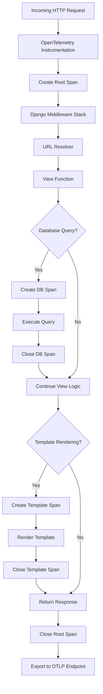

# How to Set Up OpenTelemetry Auto-Instrumentation in Django with Zero Code Changes

Author: [nawazdhandala](https://www.github.com/nawazdhandala)

Tags: OpenTelemetry, Django, Python, Auto-Instrumentation, Zero-Code

Description: Learn how to instrument your Django application with OpenTelemetry using automatic instrumentation that requires zero code changes to your existing application.

OpenTelemetry provides automatic instrumentation for Django applications that captures traces, metrics, and logs without requiring you to modify your existing codebase. This approach is perfect for adding observability to legacy applications or when you want to get started quickly without investing time in manual instrumentation.

## Why Auto-Instrumentation Matters

Auto-instrumentation hooks into Django's request/response cycle and automatically creates spans for HTTP requests, database queries, template rendering, and cache operations. You get comprehensive observability data without writing a single line of instrumentation code in your application logic.

The Django auto-instrumentation library captures:

- HTTP request spans with method, path, status code, and duration
- Database query spans with SQL statements and execution time
- Template rendering operations
- Cache operations (Redis, Memcached)
- Middleware execution timing
- Automatic context propagation across service boundaries

## Installation and Dependencies

First, install the required OpenTelemetry packages. The `opentelemetry-distro` package includes the auto-instrumentation bootstrap tool, while `opentelemetry-instrumentation-django` provides Django-specific instrumentation.

```bash
pip install opentelemetry-distro opentelemetry-instrumentation-django
pip install opentelemetry-exporter-otlp
```

After installation, run the bootstrap command to discover and install all available instrumentations for your detected packages:

```bash
opentelemetry-bootstrap -a install
```

This command scans your installed Python packages and installs the appropriate instrumentation libraries for frameworks and libraries it recognizes (like psycopg2, redis, requests, etc.).

## Configuration via Environment Variables

Auto-instrumentation is configured entirely through environment variables. This makes it easy to change observability settings without modifying code or redeploying your application.

```bash
# Service identification
export OTEL_SERVICE_NAME="django-api"
export OTEL_RESOURCE_ATTRIBUTES="service.namespace=production,service.version=1.0.0"

# OTLP exporter configuration
export OTEL_EXPORTER_OTLP_ENDPOINT="https://your-collector:4318"
export OTEL_EXPORTER_OTLP_HEADERS="x-api-key=your-api-key"
export OTEL_EXPORTER_OTLP_PROTOCOL="http/protobuf"

# Trace configuration
export OTEL_TRACES_EXPORTER="otlp"
export OTEL_METRICS_EXPORTER="otlp"
export OTEL_LOGS_EXPORTER="otlp"

# Propagation format (for distributed tracing)
export OTEL_PROPAGATORS="tracecontext,baggage"
```

If you're using OneUptime as your observability backend, configure the endpoint to point to your OneUptime instance:

```bash
export OTEL_EXPORTER_OTLP_ENDPOINT="https://oneuptime.com/otlp"
export OTEL_EXPORTER_OTLP_HEADERS="x-oneuptime-service-token=your-service-token"
```

## Running Your Django Application with Auto-Instrumentation

The standard way to run auto-instrumentation is using the `opentelemetry-instrument` command wrapper. This command sets up the instrumentation hooks before your Django application starts.

```bash
opentelemetry-instrument python manage.py runserver
```

For production deployments with Gunicorn:

```bash
opentelemetry-instrument gunicorn myproject.wsgi:application \
  --bind 0.0.0.0:8000 \
  --workers 4 \
  --timeout 120
```

For uWSGI deployments:

```bash
opentelemetry-instrument uwsgi --http :8000 --module myproject.wsgi:application
```

## Docker Container Setup

When running Django in containers, add the environment variables to your Dockerfile or docker-compose configuration.

Here's a Dockerfile example:

```dockerfile
FROM python:3.11-slim

WORKDIR /app

# Install dependencies
COPY requirements.txt .
RUN pip install -r requirements.txt

# Install OpenTelemetry packages
RUN pip install opentelemetry-distro opentelemetry-instrumentation-django opentelemetry-exporter-otlp
RUN opentelemetry-bootstrap -a install

# Copy application code
COPY . .

# Set OpenTelemetry environment variables
ENV OTEL_SERVICE_NAME="django-api"
ENV OTEL_EXPORTER_OTLP_ENDPOINT="https://your-collector:4318"
ENV OTEL_TRACES_EXPORTER="otlp"

# Run with auto-instrumentation
CMD ["opentelemetry-instrument", "gunicorn", "myproject.wsgi:application", "--bind", "0.0.0.0:8000"]
```

For docker-compose:

```yaml
version: '3.8'

services:
  django:
    build: .
    ports:
      - "8000:8000"
    environment:
      OTEL_SERVICE_NAME: "django-api"
      OTEL_EXPORTER_OTLP_ENDPOINT: "http://otel-collector:4318"
      OTEL_TRACES_EXPORTER: "otlp"
      OTEL_METRICS_EXPORTER: "otlp"
      OTEL_RESOURCE_ATTRIBUTES: "service.namespace=production"
      DATABASE_URL: "postgresql://user:pass@db:5432/mydb"
    depends_on:
      - db
      - otel-collector

  otel-collector:
    image: otel/opentelemetry-collector-contrib:latest
    volumes:
      - ./otel-collector-config.yaml:/etc/otel-collector-config.yaml
    command: ["--config=/etc/otel-collector-config.yaml"]
    ports:
      - "4318:4318"
```

## Controlling What Gets Instrumented

You can selectively disable certain instrumentations using environment variables. This is useful if specific instrumentation causes conflicts or generates too much data.

```bash
# Disable specific instrumentations
export OTEL_PYTHON_DISABLED_INSTRUMENTATIONS="requests,urllib3"

# Only instrument specific libraries
export OTEL_PYTHON_DJANGO_INSTRUMENT="True"
export OTEL_PYTHON_PSYCOPG2_INSTRUMENT="True"
```

You can also exclude specific URLs from tracing to reduce noise from health checks and static files:

```bash
export OTEL_PYTHON_DJANGO_EXCLUDED_URLS="/health,/readiness,/static/*,/media/*"
```

## Trace Visualization Flow

Here's how requests flow through your instrumented Django application:



## Verifying Auto-Instrumentation Works

After starting your Django application with auto-instrumentation, you should see initialization logs indicating which instrumentations were loaded:

```
Starting OpenTelemetry automatic instrumentation...
Instrumenting django
Instrumenting psycopg2
Instrumenting redis
Instrumenting requests
```

Make a few requests to your application and check your observability backend. You should see traces with spans for:

- HTTP requests (span name: `HTTP GET /api/users/`)
- Database queries (span name: `SELECT FROM auth_user`)
- Template rendering (span name: `django.template`)
- Cache operations (span name: `redis.GET`)

## Performance Considerations

Auto-instrumentation adds minimal overhead to your application. The instrumentation hooks are highly optimized and typically add less than 1ms of latency per request.

However, be aware of these factors:

- Exporting traces over network adds latency. Use batching and asynchronous export.
- Capturing SQL query parameters can expose sensitive data. Disable with `OTEL_PYTHON_DJANGO_INSTRUMENT_SQL_QUERY_PARAMS=False`
- High-traffic applications should use sampling to reduce data volume

Configure sampling to only trace a percentage of requests:

```bash
# Trace 10% of requests
export OTEL_TRACES_SAMPLER="traceidratio"
export OTEL_TRACES_SAMPLER_ARG="0.1"
```

## Troubleshooting Common Issues

If traces aren't appearing in your backend, check these common issues:

**Problem: No traces exported**
- Verify `OTEL_EXPORTER_OTLP_ENDPOINT` is reachable
- Check firewall rules and network connectivity
- Enable debug logging with `OTEL_LOG_LEVEL=debug`

**Problem: Instrumentation not loading**
- Ensure `opentelemetry-bootstrap -a install` was run
- Check that Django is imported after auto-instrumentation initializes
- Verify package versions are compatible

**Problem: Missing database spans**
- Install the database-specific instrumentation (e.g., `opentelemetry-instrumentation-psycopg2`)
- Check that the database client library is supported

**Problem: Authentication errors**
- Verify `OTEL_EXPORTER_OTLP_HEADERS` format is correct
- Check API keys or tokens are valid
- Ensure headers are properly URL-encoded if needed

## Integration with Django Settings

While auto-instrumentation works without code changes, you can add optional configuration to your Django settings for additional control:

```python
# settings.py

# Add OpenTelemetry middleware for enhanced context propagation
MIDDLEWARE = [
    'django.middleware.security.SecurityMiddleware',
    # ... other middleware
]

# Configure logging to capture logs with trace context
LOGGING = {
    'version': 1,
    'disable_existing_loggers': False,
    'handlers': {
        'console': {
            'class': 'logging.StreamHandler',
        },
    },
    'root': {
        'handlers': ['console'],
        'level': 'INFO',
    },
}
```

## Next Steps

Now that you have basic auto-instrumentation working, you can enhance your observability:

- Add custom attributes to spans using manual instrumentation
- Implement business logic metrics with custom metrics
- Add structured logging with trace context correlation
- Set up alerting based on trace data

For more advanced Django instrumentation patterns, check out our guide on [manual OpenTelemetry instrumentation for Django middleware](https://oneuptime.com/blog/post/2026-02-06-manual-opentelemetry-instrumentation-django-middleware/view).

Auto-instrumentation gives you immediate visibility into your Django application's behavior without the investment of manual instrumentation. It's an excellent starting point for adding observability to any Django project, whether you're building a new service or adding monitoring to an existing application.
