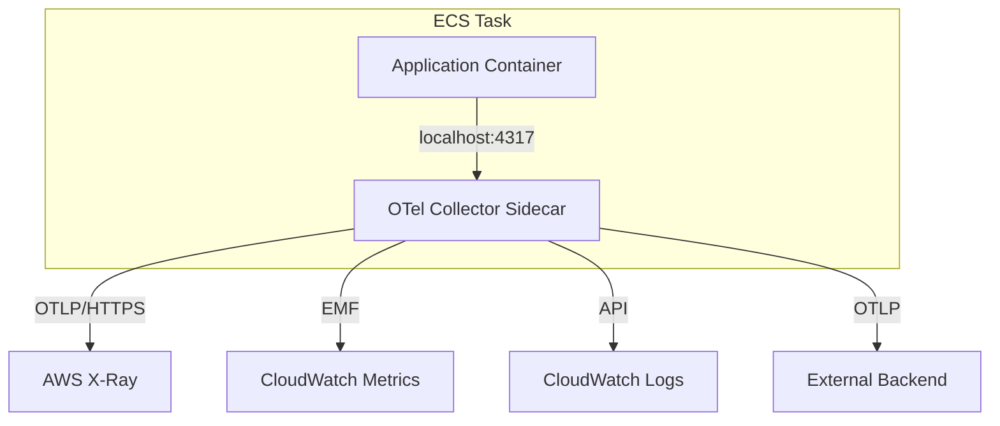
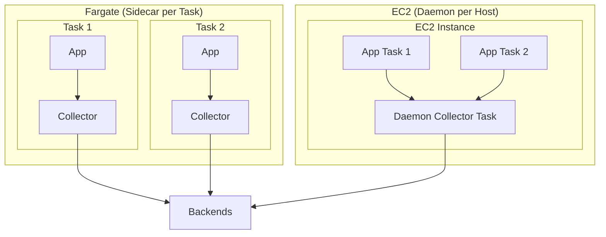

# How to Configure OpenTelemetry for AWS ECS with Sidecar Collector

Author: [nawazdhandala](https://www.github.com/nawazdhandala)

Tags: OpenTelemetry, AWS ECS, Sidecar, Collector, Observability, Containers

Description: Learn how to deploy the OpenTelemetry Collector as a sidecar container in AWS ECS task definitions for collecting traces, metrics, and logs from your services.

---

AWS ECS does not have a DaemonSet concept like Kubernetes. On ECS with Fargate, you cannot run a shared agent on the host at all because there is no host you control. The standard pattern for running the OpenTelemetry Collector on ECS is as a sidecar: a second container in the same task definition that runs alongside your application container.

This approach has the nice property that each service gets its own collector with its own configuration. The downside is that every task runs a collector, which uses extra CPU and memory. But for most services, the overhead is small (128MB RAM and 0.25 vCPU is usually plenty).

## Architecture

In the sidecar pattern, your application container and the collector container share the same network namespace within an ECS task. Your app sends telemetry to `localhost:4317` (gRPC) or `localhost:4318` (HTTP), and the collector forwards it to your chosen backends.



Since both containers share the task's network interface, communication between them stays local and does not cross any network boundary. There is no need for service discovery or DNS resolution.

## Step 1: Create the Collector Configuration

First, create a collector configuration file. You will store this in AWS Systems Manager Parameter Store so ECS can inject it into the container at launch time.

```yaml
# collector-config.yaml
# Sidecar collector config for ECS - receives OTLP and exports to AWS services
receivers:
  otlp:
    protocols:
      grpc:
        endpoint: 0.0.0.0:4317
      http:
        endpoint: 0.0.0.0:4318

processors:
  # Batch telemetry to reduce API call volume
  batch:
    timeout: 10s
    send_batch_size: 256

  # Set memory limits - important for Fargate where memory is fixed
  memory_limiter:
    check_interval: 5s
    limit_mib: 100
    spike_limit_mib: 30

  # Add ECS resource attributes automatically
  resourcedetection:
    detectors: [env, ecs]
    timeout: 5s
    override: false

exporters:
  # Send traces to X-Ray
  awsxray:
    region: us-east-1

  # Send metrics to CloudWatch via EMF
  awsemf:
    region: us-east-1
    namespace: MyECSApplication
    log_group_name: /ecs/otel/metrics

  # Send logs to CloudWatch Logs
  awscloudwatchlogs:
    region: us-east-1
    log_group_name: /ecs/otel/applogs
    log_stream_name: "{TaskId}"

service:
  pipelines:
    traces:
      receivers: [otlp]
      processors: [resourcedetection, memory_limiter, batch]
      exporters: [awsxray]
    metrics:
      receivers: [otlp]
      processors: [resourcedetection, memory_limiter, batch]
      exporters: [awsemf]
```

Notice the `resourcedetection` processor with the `ecs` detector. This automatically adds ECS-specific resource attributes like task ARN, cluster name, and container name to your telemetry. These attributes are extremely useful for filtering and grouping data in your backend.

Store the config in Parameter Store:

```bash
# Upload the collector config to SSM Parameter Store
# The ECS task will reference this parameter to configure the collector
aws ssm put-parameter \
  --name /otel/collector-config \
  --type String \
  --value file://collector-config.yaml \
  --region us-east-1
```

## Step 2: Create the IAM Task Role

The collector sidecar needs permissions to write to X-Ray, CloudWatch, and CloudWatch Logs. Create a task role with the necessary policies.

```json
{
  "Version": "2012-10-17",
  "Statement": [
    {
      "Effect": "Allow",
      "Action": [
        "xray:PutTraceSegments",
        "xray:PutTelemetryRecords",
        "xray:GetSamplingRules",
        "xray:GetSamplingTargets",
        "logs:PutLogEvents",
        "logs:CreateLogGroup",
        "logs:CreateLogStream",
        "logs:DescribeLogStreams",
        "cloudwatch:PutMetricData",
        "ssm:GetParameter"
      ],
      "Resource": "*"
    }
  ]
}
```

```bash
# Create the IAM task role for ECS
# This role is assumed by the containers in the task
aws iam create-role \
  --role-name ecs-otel-task-role \
  --assume-role-policy-document '{
    "Version": "2012-10-17",
    "Statement": [{
      "Effect": "Allow",
      "Principal": {"Service": "ecs-tasks.amazonaws.com"},
      "Action": "sts:AssumeRole"
    }]
  }'

# Attach the policy with X-Ray, CloudWatch, and SSM permissions
aws iam put-role-policy \
  --role-name ecs-otel-task-role \
  --policy-name otel-collector-policy \
  --policy-document file://task-role-policy.json
```

## Step 3: Define the ECS Task Definition

Here is a complete task definition that includes your application container and the OpenTelemetry Collector as a sidecar.

```json
{
  "family": "my-service-with-otel",
  "taskRoleArn": "arn:aws:iam::123456789012:role/ecs-otel-task-role",
  "executionRoleArn": "arn:aws:iam::123456789012:role/ecsTaskExecutionRole",
  "networkMode": "awsvpc",
  "requiresCompatibilities": ["FARGATE"],
  "cpu": "512",
  "memory": "1024",
  "containerDefinitions": [
    {
      "name": "app",
      "image": "123456789012.dkr.ecr.us-east-1.amazonaws.com/my-service:latest",
      "essential": true,
      "portMappings": [
        {
          "containerPort": 8080,
          "protocol": "tcp"
        }
      ],
      "environment": [
        {
          "name": "OTEL_EXPORTER_OTLP_ENDPOINT",
          "value": "http://localhost:4317"
        },
        {
          "name": "OTEL_SERVICE_NAME",
          "value": "my-service"
        },
        {
          "name": "OTEL_RESOURCE_ATTRIBUTES",
          "value": "deployment.environment=production,service.version=1.0.0"
        }
      ],
      "dependsOn": [
        {
          "containerName": "otel-collector",
          "condition": "START"
        }
      ],
      "logConfiguration": {
        "logDriver": "awslogs",
        "options": {
          "awslogs-group": "/ecs/my-service",
          "awslogs-region": "us-east-1",
          "awslogs-stream-prefix": "app"
        }
      }
    },
    {
      "name": "otel-collector",
      "image": "public.ecr.aws/aws-observability/aws-otel-collector:v0.39.0",
      "essential": false,
      "cpu": 256,
      "memory": 256,
      "command": [
        "--config", "env:COLLECTOR_CONFIG"
      ],
      "secrets": [
        {
          "name": "COLLECTOR_CONFIG",
          "valueFrom": "arn:aws:ssm:us-east-1:123456789012:parameter/otel/collector-config"
        }
      ],
      "portMappings": [
        {
          "containerPort": 4317,
          "protocol": "tcp"
        },
        {
          "containerPort": 4318,
          "protocol": "tcp"
        }
      ],
      "logConfiguration": {
        "logDriver": "awslogs",
        "options": {
          "awslogs-group": "/ecs/otel-collector",
          "awslogs-region": "us-east-1",
          "awslogs-stream-prefix": "collector"
        }
      },
      "healthCheck": {
        "command": ["CMD-SHELL", "wget -qO- http://localhost:13133/health || exit 1"],
        "interval": 30,
        "timeout": 5,
        "retries": 3,
        "startPeriod": 15
      }
    }
  ]
}
```

A few things to note in this task definition:

- The app container has `dependsOn` set to wait for the collector to start. This prevents the app from trying to send telemetry before the collector is ready.
- The collector is marked as `essential: false` so that if it crashes, the application container keeps running. You lose telemetry but not availability.
- The collector config is pulled from SSM Parameter Store using the `secrets` field. This lets you update the config without rebuilding the collector image.
- The health check uses the health extension endpoint at port 13133.

To enable the health check endpoint, add this to your collector config:

```yaml
# Add to the collector config to enable the health check endpoint
extensions:
  health_check:
    endpoint: 0.0.0.0:13133

service:
  extensions: [health_check]
  pipelines:
    # ... your existing pipelines
```

## Step 4: Register and Run the Task

```bash
# Register the task definition with ECS
aws ecs register-task-definition \
  --cli-input-json file://task-definition.json \
  --region us-east-1

# Create or update the service to use the new task definition
aws ecs update-service \
  --cluster my-cluster \
  --service my-service \
  --task-definition my-service-with-otel \
  --force-new-deployment \
  --region us-east-1
```

## Step 5: Configure Your Application

Your application just needs to point the OpenTelemetry SDK at `localhost:4317`. Here is a Go example since Go is popular for ECS services:

```go
// main.go
// Initializes OpenTelemetry with OTLP export to the sidecar collector
package main

import (
    "context"
    "log"
    "os"
    "time"

    "go.opentelemetry.io/otel"
    "go.opentelemetry.io/otel/exporters/otlp/otlptrace/otlptracegrpc"
    "go.opentelemetry.io/otel/exporters/otlp/otlpmetric/otlpmetricgrpc"
    "go.opentelemetry.io/otel/sdk/metric"
    "go.opentelemetry.io/otel/sdk/resource"
    sdktrace "go.opentelemetry.io/otel/sdk/trace"
    semconv "go.opentelemetry.io/otel/semconv/v1.24.0"
)

func initTelemetry(ctx context.Context) (func(), error) {
    // Build the resource that describes this service
    res, err := resource.Merge(
        resource.Default(),
        resource.NewWithAttributes(
            semconv.SchemaURL,
            semconv.ServiceName(os.Getenv("OTEL_SERVICE_NAME")),
        ),
    )
    if err != nil {
        return nil, err
    }

    // Set up trace exporter pointing at the sidecar collector on localhost
    traceExporter, err := otlptracegrpc.New(ctx,
        otlptracegrpc.WithEndpoint("localhost:4317"),
        otlptracegrpc.WithInsecure(), // localhost, no TLS needed
    )
    if err != nil {
        return nil, err
    }

    // Create the tracer provider
    tp := sdktrace.NewTracerProvider(
        sdktrace.WithBatcher(traceExporter),
        sdktrace.WithResource(res),
    )
    otel.SetTracerProvider(tp)

    // Set up metric exporter
    metricExporter, err := otlpmetricgrpc.New(ctx,
        otlpmetricgrpc.WithEndpoint("localhost:4317"),
        otlpmetricgrpc.WithInsecure(),
    )
    if err != nil {
        return nil, err
    }

    // Create the meter provider with a 30 second export interval
    mp := metric.NewMeterProvider(
        metric.WithReader(metric.NewPeriodicReader(metricExporter,
            metric.WithInterval(30*time.Second),
        )),
        metric.WithResource(res),
    )
    otel.SetMeterProvider(mp)

    // Return a cleanup function
    cleanup := func() {
        ctx, cancel := context.WithTimeout(context.Background(), 5*time.Second)
        defer cancel()
        tp.Shutdown(ctx)
        mp.Shutdown(ctx)
    }

    return cleanup, nil
}

func main() {
    ctx := context.Background()
    cleanup, err := initTelemetry(ctx)
    if err != nil {
        log.Fatalf("Failed to initialize telemetry: %v", err)
    }
    defer cleanup()

    // Your application code here
    log.Println("Service started with OpenTelemetry instrumentation")
}
```

## Step 6: Verify the Setup

After deploying, check that data is flowing through the collector and reaching your backends.

```bash
# Check that both containers are running in the task
aws ecs describe-tasks \
  --cluster my-cluster \
  --tasks $(aws ecs list-tasks --cluster my-cluster --service-name my-service --query 'taskArns[0]' --output text) \
  --query 'tasks[0].containers[*].{name:name,status:lastStatus,health:healthStatus}' \
  --output table \
  --region us-east-1
```

Check the collector logs for export confirmations:

```bash
# View the collector sidecar logs for any errors or successful export messages
aws logs filter-log-events \
  --log-group-name /ecs/otel-collector \
  --start-time $(date -d '10 minutes ago' +%s000) \
  --filter-pattern "export" \
  --region us-east-1
```

## ECS on EC2 vs Fargate

The sidecar approach works on both EC2 and Fargate launch types, but there are some differences:

**Fargate:** The sidecar is your only option. You cannot run a daemon process on the host. Memory and CPU for the collector come from your task's allocation, so account for it when sizing tasks.

**EC2:** You have the additional option of running the collector as a daemon service (one task per EC2 instance). This is more efficient because multiple application tasks share one collector. Define a separate task definition for the collector daemon and create a DAEMON service type. Your app containers would then send telemetry to the host's IP instead of localhost.



## Resource Sizing Guidelines

For the collector sidecar, start with these allocations and adjust based on your telemetry volume:

| Telemetry Volume | CPU | Memory |
|-----------------|-----|--------|
| Low (< 100 spans/sec) | 64 CPU units | 128 MB |
| Medium (100-1000 spans/sec) | 128 CPU units | 256 MB |
| High (1000+ spans/sec) | 256 CPU units | 512 MB |

Monitor the collector container's CPU and memory utilization through CloudWatch Container Insights to determine if you need to adjust these values.

## Troubleshooting

**Collector fails to start:** Check the collector logs in CloudWatch Logs. Common issues include malformed YAML in the SSM parameter or missing IAM permissions.

**No telemetry reaching backends:** Verify the `OTEL_EXPORTER_OTLP_ENDPOINT` environment variable in the app container is set to `http://localhost:4317`. Check that port 4317 is listed in the collector's port mappings.

**Task running out of memory:** The collector's `memory_limiter` processor should prevent it from consuming too much RAM, but if the application and collector together exceed the task memory limit, Fargate will kill the task. Increase the task memory or reduce the collector's `limit_mib`.

**Collector crashes but app continues:** This is expected when `essential` is set to `false`. Your app stays up but you lose telemetry. Monitor the collector's health check status and set up alarms for unhealthy containers.

## Wrapping Up

The sidecar pattern for the OpenTelemetry Collector on ECS is straightforward once you have the task definition right. The collector handles all the heavy lifting of batching, retrying, and exporting telemetry to AWS services. Your application just sends data to localhost and does not need to know anything about the backend. When you want to change where telemetry goes, update the SSM parameter and redeploy. No application changes needed.
