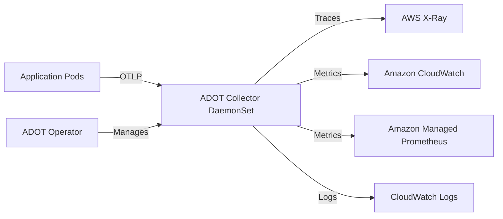
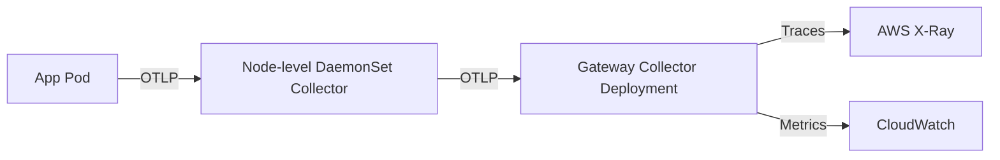

# How to Set Up OpenTelemetry on AWS EKS with ADOT (AWS Distro for OpenTelemetry)

Author: [nawazdhandala](https://www.github.com/nawazdhandala)

Tags: OpenTelemetry, AWS, EKS, ADOT, Kubernetes, Observability

Description: A practical guide to deploying the AWS Distro for OpenTelemetry (ADOT) on Amazon EKS for collecting traces, metrics, and logs from your Kubernetes workloads.

---

Running Kubernetes workloads on Amazon EKS is common in production environments, but getting proper observability into those workloads takes deliberate effort. The AWS Distro for OpenTelemetry (ADOT) is Amazon's supported distribution of the OpenTelemetry project. It bundles the OpenTelemetry Collector with AWS-specific exporters and extensions, so you can ship telemetry data to AWS services like X-Ray, CloudWatch, and Amazon Managed Service for Prometheus without stitching things together yourself.

This guide walks you through setting up ADOT on an EKS cluster from scratch.

## What Is ADOT and Why Use It?

ADOT is essentially a curated build of the OpenTelemetry Collector that AWS maintains. It includes receivers, processors, and exporters that work well with AWS services out of the box. The main benefits over rolling your own collector are:

- AWS tests and patches it regularly against their services
- It ships with IAM integration through IRSA (IAM Roles for Service Accounts)
- The ADOT Operator for Kubernetes simplifies lifecycle management
- You get support from AWS if you are on a support plan

If you are already running EKS and using AWS observability backends, ADOT removes a lot of the glue work.

## Architecture Overview

Here is how the components fit together in a typical ADOT on EKS deployment:



The ADOT Operator watches for custom resources and manages the collector deployment. Your application pods send telemetry over OTLP to the collector, which then routes data to the appropriate AWS backends.

## Prerequisites

Before you begin, make sure you have:

- An EKS cluster running Kubernetes 1.25 or later
- kubectl configured to talk to your cluster
- Helm 3 installed
- The AWS CLI configured with appropriate permissions
- eksctl installed (optional but helpful)

## Step 1: Install cert-manager

The ADOT Operator relies on cert-manager for webhook TLS certificates. Install it first if you do not already have it.

```bash
# Install cert-manager, which handles TLS certificates for the ADOT Operator webhooks
kubectl apply -f https://github.com/cert-manager/cert-manager/releases/download/v1.14.5/cert-manager.yaml

# Wait for cert-manager pods to be ready before proceeding
kubectl wait --for=condition=ready pod -l app.kubernetes.io/instance=cert-manager -n cert-manager --timeout=120s
```

## Step 2: Install the ADOT Operator

The ADOT Operator is an EKS add-on. You can install it through eksctl, the AWS console, or the CLI.

```bash
# Install the ADOT add-on on your EKS cluster
# Replace 'my-cluster' with your actual cluster name and adjust the region
aws eks create-addon \
  --cluster-name my-cluster \
  --addon-name adot \
  --addon-version v0.92.1-eksbuild.1 \
  --region us-east-1
```

You can also install it through eksctl if you prefer:

```bash
# Alternative: install ADOT add-on using eksctl
eksctl create addon \
  --name adot \
  --cluster my-cluster \
  --region us-east-1 \
  --force
```

Verify the operator is running:

```bash
# Check that the ADOT operator pod is in Running state
kubectl get pods -n opentelemetry-operator-system
```

You should see a pod named something like `opentelemetry-operator-controller-manager-xxxxx` in the Running state.

## Step 3: Set Up IAM Roles for Service Accounts (IRSA)

The collector needs AWS permissions to write to services like X-Ray and CloudWatch. IRSA lets you associate an IAM role with a Kubernetes service account without distributing long-lived credentials.

First, create an IAM policy:

```json
{
  "Version": "2012-10-17",
  "Statement": [
    {
      "Effect": "Allow",
      "Action": [
        "xray:PutTraceSegments",
        "xray:PutTelemetryRecords",
        "xray:GetSamplingRules",
        "xray:GetSamplingTargets",
        "cloudwatch:PutMetricData",
        "logs:PutLogEvents",
        "logs:CreateLogGroup",
        "logs:CreateLogStream",
        "logs:DescribeLogStreams"
      ],
      "Resource": "*"
    }
  ]
}
```

Then create the IRSA association:

```bash
# Create an IAM service account that the ADOT collector will use
# This links a Kubernetes service account to an IAM role via OIDC
eksctl create iamserviceaccount \
  --name adot-collector \
  --namespace opentelemetry \
  --cluster my-cluster \
  --region us-east-1 \
  --attach-policy-arn arn:aws:iam::123456789012:policy/ADOTCollectorPolicy \
  --approve \
  --override-existing-serviceaccounts
```

## Step 4: Deploy the OpenTelemetry Collector

Now create the collector instance using the OpenTelemetryCollector custom resource. This tells the ADOT Operator what kind of collector to deploy and how to configure it.

```yaml
# adot-collector.yaml
# This defines a DaemonSet collector that runs on every node in the cluster
apiVersion: opentelemetry.io/v1alpha1
kind: OpenTelemetryCollector
metadata:
  name: adot-collector
  namespace: opentelemetry
spec:
  mode: daemonset  # One collector pod per node for low-latency local collection
  serviceAccount: adot-collector
  image: public.ecr.aws/aws-observability/aws-otel-collector:v0.39.0
  config: |
    receivers:
      # Accept OTLP data over both gRPC and HTTP
      otlp:
        protocols:
          grpc:
            endpoint: 0.0.0.0:4317
          http:
            endpoint: 0.0.0.0:4318

    processors:
      # Batch telemetry data to reduce the number of outgoing requests
      batch:
        timeout: 10s
        send_batch_size: 1024

      # Set memory limits to prevent the collector from using too much RAM
      memory_limiter:
        check_interval: 5s
        limit_mib: 512
        spike_limit_mib: 128

    exporters:
      # Send traces to AWS X-Ray
      awsxray:
        region: us-east-1

      # Send metrics to Amazon CloudWatch
      awsemf:
        region: us-east-1
        namespace: MyApplication
        log_group_name: /aws/otel/metrics

    service:
      pipelines:
        traces:
          receivers: [otlp]
          processors: [memory_limiter, batch]
          exporters: [awsxray]
        metrics:
          receivers: [otlp]
          processors: [memory_limiter, batch]
          exporters: [awsemf]
```

Apply the manifest:

```bash
# Create the namespace if it does not exist, then apply the collector configuration
kubectl create namespace opentelemetry --dry-run=client -o yaml | kubectl apply -f -
kubectl apply -f adot-collector.yaml
```

## Step 5: Configure Your Application to Send Telemetry

Your application pods need to send OTLP data to the collector. Since we deployed as a DaemonSet, each node has a local collector. Use the node's host IP to reach it.

Here is how you would configure a Python application using the OpenTelemetry SDK:

```python
# configure_otel.py
# Set up OpenTelemetry to send traces to the ADOT collector running on the same node
import os
from opentelemetry import trace
from opentelemetry.sdk.trace import TracerProvider
from opentelemetry.sdk.trace.export import BatchSpanProcessor
from opentelemetry.exporter.otlp.proto.grpc.trace_exporter import OTLPSpanExporter

# Point to the ADOT collector on the local node via the Kubernetes downward API
# The HOST_IP environment variable should be set from status.hostIP in your pod spec
collector_endpoint = f"http://{os.environ.get('HOST_IP', 'localhost')}:4317"

# Create and configure the tracer provider with OTLP export
provider = TracerProvider()
exporter = OTLPSpanExporter(endpoint=collector_endpoint, insecure=True)
provider.add_span_processor(BatchSpanProcessor(exporter))
trace.set_tracer_provider(provider)
```

In your Kubernetes deployment, inject the host IP:

```yaml
# Snippet for your application Deployment spec
# Injects the node IP so the app knows where to send telemetry
env:
  - name: HOST_IP
    valueFrom:
      fieldRef:
        fieldPath: status.hostIP
  - name: OTEL_EXPORTER_OTLP_ENDPOINT
    value: "http://$(HOST_IP):4317"
```

## Step 6: Verify the Setup

After deploying everything, check that data flows correctly.

```bash
# Verify collector pods are running on each node
kubectl get pods -n opentelemetry -l app.kubernetes.io/component=opentelemetry-collector

# Check collector logs for errors or successful exports
kubectl logs -n opentelemetry -l app.kubernetes.io/component=opentelemetry-collector --tail=50
```

You should see log lines indicating successful exports to X-Ray and CloudWatch. Head over to the AWS X-Ray console and the CloudWatch metrics console to confirm data is appearing.

## Troubleshooting Common Issues

**Collector pods stuck in Pending:** Check that the IRSA service account was created in the right namespace and that your node group has capacity.

**No data in X-Ray:** Verify the IAM policy is attached correctly. Run `kubectl describe serviceaccount adot-collector -n opentelemetry` and confirm the annotation shows the correct IAM role ARN.

**Memory pressure on nodes:** If the collector is using too much memory, lower the `limit_mib` in the memory_limiter processor and reduce `send_batch_size`. DaemonSet mode means one collector per node, so each one handles only local traffic.

**Connection refused errors in apps:** Make sure the HOST_IP environment variable is set correctly and that port 4317 is accessible. Check that no NetworkPolicy is blocking traffic between app pods and the collector.

## Scaling Considerations

For large clusters, the DaemonSet approach works well because each collector only handles the pods on its own node. But if you have high-cardinality metrics or want to do tail-based sampling, consider adding a second collector tier in Deployment mode that acts as a gateway. The DaemonSet collectors would forward to the gateway, and the gateway would handle the heavier processing before exporting.



This two-tier architecture gives you the low latency of local collection with the flexibility of centralized processing.

## Wrapping Up

Setting up ADOT on EKS involves a handful of moving parts, but each step is straightforward once you understand the flow. The ADOT Operator handles the collector lifecycle, IRSA provides secure AWS access, and the collector pipelines route telemetry to the right backends. Once this foundation is in place, you can instrument new services quickly and have their telemetry flowing to X-Ray and CloudWatch within minutes.
