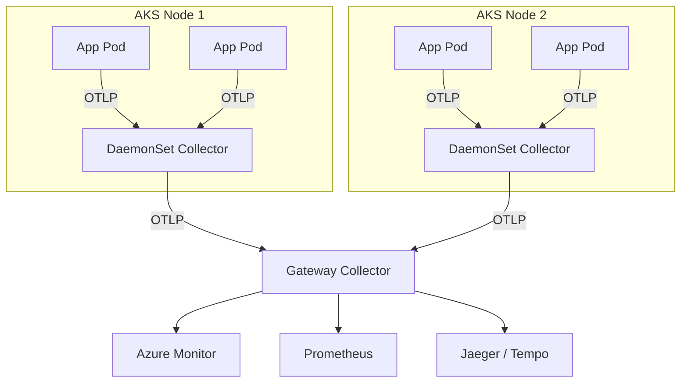

# How to Set Up OpenTelemetry on Azure Kubernetes Service (AKS)

Author: [nawazdhandala](https://www.github.com/nawazdhandala)

Tags: OpenTelemetry, Azure, Kubernetes, AKS, Observability, Tracing, Metrics

Description: A complete guide to deploying the OpenTelemetry Collector on AKS and instrumenting workloads for traces, metrics, and logs.

---

Azure Kubernetes Service (AKS) is Microsoft's managed Kubernetes offering. It handles the control plane, patching, and scaling for you, but observability is still your responsibility. Kubernetes clusters generate a massive amount of telemetry data: container metrics, pod logs, network traces, and application-level signals. OpenTelemetry gives you a unified way to collect all of it.

This guide covers the full setup: deploying the OpenTelemetry Collector on AKS, instrumenting your workloads, and routing telemetry to your backend of choice. We will use the OpenTelemetry Operator for Kubernetes to simplify the deployment, and walk through a real application example.

## Architecture Overview

The standard pattern for OpenTelemetry on Kubernetes is a two-tier Collector deployment. A DaemonSet Collector runs on every node and collects infrastructure metrics plus application telemetry from pods on that node. A central gateway Collector receives data from the DaemonSet agents, processes it, and exports it to your backend.



## Prerequisites

- An AKS cluster running Kubernetes 1.26 or later.
- `kubectl` configured to access your cluster.
- Helm 3 installed.
- Cluster admin permissions for installing operators and CRDs.

## Step 1: Install the OpenTelemetry Operator

The OpenTelemetry Operator for Kubernetes manages Collector deployments and can auto-instrument workloads. It requires cert-manager for TLS certificate management.

```bash
# Install cert-manager (required by the OpenTelemetry Operator)
kubectl apply -f https://github.com/cert-manager/cert-manager/releases/download/v1.14.4/cert-manager.yaml

# Wait for cert-manager to be ready
kubectl wait --for=condition=Available deployment/cert-manager -n cert-manager --timeout=120s
kubectl wait --for=condition=Available deployment/cert-manager-webhook -n cert-manager --timeout=120s
```

Now install the OpenTelemetry Operator using Helm.

```bash
# Add the OpenTelemetry Helm repository
helm repo add open-telemetry https://open-telemetry.github.io/opentelemetry-helm-charts
helm repo update

# Install the operator in its own namespace
helm install opentelemetry-operator open-telemetry/opentelemetry-operator \
  --namespace opentelemetry \
  --create-namespace \
  --set admissionWebhooks.certManager.enabled=true \
  --set manager.collectorImage.repository=otel/opentelemetry-collector-contrib
```

## Step 2: Deploy the DaemonSet Collector

Create an `OpenTelemetryCollector` custom resource that deploys the Collector as a DaemonSet. This agent runs on every node and collects telemetry from the pods scheduled on that node.

```yaml
# otel-daemonset-collector.yaml
apiVersion: opentelemetry.io/v1beta1
kind: OpenTelemetryCollector
metadata:
  name: otel-agent
  namespace: opentelemetry
spec:
  mode: daemonset
  # Use the contrib image for additional receivers and exporters
  image: otel/opentelemetry-collector-contrib:0.96.0

  # Mount the host filesystem for node-level metrics
  volumeMounts:
    - name: hostfs
      mountPath: /hostfs
      readOnly: true
  volumes:
    - name: hostfs
      hostPath:
        path: /

  env:
    # Set the node name for resource detection
    - name: K8S_NODE_NAME
      valueFrom:
        fieldRef:
          fieldPath: spec.nodeName

  config:
    receivers:
      otlp:
        protocols:
          grpc:
            # Listen for application telemetry
            endpoint: 0.0.0.0:4317
          http:
            endpoint: 0.0.0.0:4318

      # Collect node and pod metrics from the kubelet
      kubeletstats:
        collection_interval: 30s
        auth_type: serviceAccount
        endpoint: "https://${env:K8S_NODE_NAME}:10250"
        insecure_skip_verify: true
        metric_groups:
          - node
          - pod
          - container

      # Collect host-level system metrics
      hostmetrics:
        collection_interval: 30s
        root_path: /hostfs
        scrapers:
          cpu: {}
          memory: {}
          disk: {}
          filesystem: {}
          network: {}

    processors:
      batch:
        # Batch telemetry before forwarding to the gateway
        send_batch_size: 1000
        timeout: 10s

      # Automatically detect Kubernetes metadata
      k8sattributes:
        auth_type: serviceAccount
        extract:
          metadata:
            - k8s.namespace.name
            - k8s.pod.name
            - k8s.deployment.name
            - k8s.node.name
            - k8s.container.name
          labels:
            - tag_name: app.label.name
              key: app
              from: pod

      # Add resource attributes for Azure
      resourcedetection:
        detectors: [env, aks]
        timeout: 5s
        override: false

      # Limit memory usage on each node
      memory_limiter:
        check_interval: 5s
        limit_mib: 512
        spike_limit_mib: 128

    exporters:
      # Forward everything to the gateway collector
      otlp:
        endpoint: otel-gateway-collector.opentelemetry.svc.cluster.local:4317
        tls:
          insecure: true

    service:
      pipelines:
        traces:
          receivers: [otlp]
          processors: [memory_limiter, k8sattributes, resourcedetection, batch]
          exporters: [otlp]
        metrics:
          receivers: [otlp, kubeletstats, hostmetrics]
          processors: [memory_limiter, k8sattributes, resourcedetection, batch]
          exporters: [otlp]
        logs:
          receivers: [otlp]
          processors: [memory_limiter, k8sattributes, resourcedetection, batch]
          exporters: [otlp]
```

Apply the configuration.

```bash
# Deploy the DaemonSet collector
kubectl apply -f otel-daemonset-collector.yaml
```

## Step 3: Deploy the Gateway Collector

The gateway Collector receives data from all the DaemonSet agents and exports it to your observability backends. This is where you configure your final destinations.

```yaml
# otel-gateway-collector.yaml
apiVersion: opentelemetry.io/v1beta1
kind: OpenTelemetryCollector
metadata:
  name: otel-gateway
  namespace: opentelemetry
spec:
  mode: deployment
  replicas: 2
  image: otel/opentelemetry-collector-contrib:0.96.0

  config:
    receivers:
      otlp:
        protocols:
          grpc:
            endpoint: 0.0.0.0:4317

    processors:
      batch:
        send_batch_size: 2000
        timeout: 10s

      # Filter out noisy health check spans
      filter:
        error_mode: ignore
        traces:
          span:
            - 'attributes["http.route"] == "/healthz"'
            - 'attributes["http.route"] == "/readyz"'

    exporters:
      # Export traces to an OTLP-compatible backend
      otlp/traces:
        endpoint: your-trace-backend:4317
        tls:
          insecure: false

      # Export metrics to Azure Monitor (Application Insights)
      azuremonitor:
        connection_string: "${env:APPLICATIONINSIGHTS_CONNECTION_STRING}"

      # Export metrics to Prometheus (if running Prometheus on AKS)
      prometheusremotewrite:
        endpoint: "http://prometheus-server.monitoring.svc.cluster.local:9090/api/v1/write"

      # Debug exporter for troubleshooting
      debug:
        verbosity: basic

    service:
      pipelines:
        traces:
          receivers: [otlp]
          processors: [filter, batch]
          exporters: [otlp/traces, azuremonitor]
        metrics:
          receivers: [otlp]
          processors: [batch]
          exporters: [prometheusremotewrite, azuremonitor]
        logs:
          receivers: [otlp]
          processors: [batch]
          exporters: [azuremonitor]
```

Apply the gateway configuration.

```bash
# Deploy the gateway collector
kubectl apply -f otel-gateway-collector.yaml

# Verify both collectors are running
kubectl get pods -n opentelemetry
```

## Step 4: Configure RBAC

The DaemonSet Collector needs permissions to query the Kubernetes API for pod metadata and kubelet stats.

```yaml
# otel-rbac.yaml
apiVersion: v1
kind: ServiceAccount
metadata:
  name: otel-agent-collector
  namespace: opentelemetry
---
apiVersion: rbac.authorization.k8s.io/v1
kind: ClusterRole
metadata:
  name: otel-collector
rules:
  # Permissions for k8sattributes processor
  - apiGroups: [""]
    resources: ["pods", "namespaces", "nodes", "nodes/stats"]
    verbs: ["get", "list", "watch"]
  - apiGroups: ["apps"]
    resources: ["replicasets", "deployments"]
    verbs: ["get", "list", "watch"]
---
apiVersion: rbac.authorization.k8s.io/v1
kind: ClusterRoleBinding
metadata:
  name: otel-collector
roleRef:
  apiGroup: rbac.authorization.k8s.io
  kind: ClusterRole
  name: otel-collector
subjects:
  - kind: ServiceAccount
    name: otel-agent-collector
    namespace: opentelemetry
```

```bash
# Apply the RBAC configuration
kubectl apply -f otel-rbac.yaml
```

## Step 5: Instrument Your Application

With the Collector infrastructure in place, your applications just need to export telemetry to the local DaemonSet agent. Here is an example Kubernetes Deployment for a Python service.

```yaml
# sample-app.yaml
apiVersion: apps/v1
kind: Deployment
metadata:
  name: order-service
  namespace: default
spec:
  replicas: 3
  selector:
    matchLabels:
      app: order-service
  template:
    metadata:
      labels:
        app: order-service
    spec:
      containers:
        - name: order-service
          image: your-registry/order-service:latest
          ports:
            - containerPort: 8080
          env:
            # Point the OTLP exporter to the DaemonSet agent on the same node
            - name: OTEL_EXPORTER_OTLP_ENDPOINT
              value: "http://otel-agent-collector.opentelemetry.svc.cluster.local:4317"
            # Set the service name for this application
            - name: OTEL_SERVICE_NAME
              value: "order-service"
            # Set the resource attributes
            - name: OTEL_RESOURCE_ATTRIBUTES
              value: "k8s.namespace.name=default,k8s.deployment.name=order-service"
            # Use the W3C trace context propagator
            - name: OTEL_PROPAGATORS
              value: "tracecontext,baggage"
```

If you want to use the DaemonSet agent via the node's host IP (to avoid going through kube-dns), you can use the downward API.

```yaml
env:
  # Use the node's IP to reach the DaemonSet agent directly
  - name: NODE_IP
    valueFrom:
      fieldRef:
        fieldPath: status.hostIP
  - name: OTEL_EXPORTER_OTLP_ENDPOINT
    value: "http://$(NODE_IP):4317"
```

## Step 6: Auto-Instrumentation (Optional)

The OpenTelemetry Operator supports auto-instrumentation for Java, Python, Node.js, .NET, and Go. This injects the OTel SDK into your pods at startup without changing your application code or container image.

```yaml
# auto-instrumentation.yaml
apiVersion: opentelemetry.io/v1alpha1
kind: Instrumentation
metadata:
  name: auto-instrumentation
  namespace: default
spec:
  exporter:
    endpoint: http://otel-agent-collector.opentelemetry.svc.cluster.local:4317
  propagators:
    - tracecontext
    - baggage
  # Configure language-specific settings
  python:
    env:
      - name: OTEL_PYTHON_LOG_CORRELATION
        value: "true"
  nodejs:
    env:
      - name: OTEL_NODE_RESOURCE_DETECTORS
        value: "env,host,os"
```

Apply the instrumentation resource and annotate your pods.

```bash
# Create the instrumentation resource
kubectl apply -f auto-instrumentation.yaml

# Annotate existing deployments to enable auto-instrumentation
# For Python applications:
kubectl patch deployment order-service -n default -p '{"spec":{"template":{"metadata":{"annotations":{"instrumentation.opentelemetry.io/inject-python":"true"}}}}}'

# For Node.js applications:
kubectl patch deployment api-gateway -n default -p '{"spec":{"template":{"metadata":{"annotations":{"instrumentation.opentelemetry.io/inject-nodejs":"true"}}}}}'
```

The operator will restart the pods and inject an init container that adds the OpenTelemetry SDK. Your application gets instrumented without any code changes.

## Monitoring the Collectors Themselves

Do not forget to monitor your Collector deployments. The Collector exposes its own metrics on port 8888 by default. You can scrape these with Prometheus or add a self-monitoring pipeline.

```yaml
# Add this to the gateway collector's config to expose its own metrics
service:
  telemetry:
    metrics:
      # Expose Collector health and performance metrics
      address: 0.0.0.0:8888
      level: detailed
```

Key metrics to watch include `otelcol_exporter_sent_spans`, `otelcol_exporter_send_failed_spans`, `otelcol_processor_batch_batch_send_size`, and `otelcol_receiver_accepted_spans`. If the failed count is climbing, you have an export problem.

## Troubleshooting Common Issues

A few issues come up frequently when running OpenTelemetry on AKS.

If pods cannot reach the DaemonSet Collector, check that the service endpoint is correct and that network policies are not blocking port 4317. Running `kubectl port-forward` to the Collector pod and testing with `grpcurl` is a quick way to verify connectivity.

If you see gaps in kubelet metrics, make sure the service account has the right RBAC permissions. The kubelet stats endpoint requires explicit access to `nodes/stats`.

If memory usage on the DaemonSet is high, tune the `memory_limiter` processor. The spike limit should be about 25% of the total limit. Also check if the gateway is healthy, because if the gateway is slow to accept data, the DaemonSet agents will buffer more data in memory.

## Summary

Setting up OpenTelemetry on AKS involves deploying the Collector infrastructure, configuring RBAC, and pointing your workloads at the agent. The two-tier DaemonSet plus gateway pattern works well for production clusters because it keeps telemetry traffic local to each node while giving you a centralized point for processing and export. With the OpenTelemetry Operator, you can also get auto-instrumentation for free, covering your workloads without changing a single line of application code.
