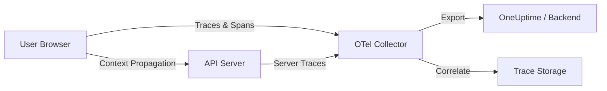

# How to Set Up OpenTelemetry Browser Instrumentation for Real User Monitoring

Author: [nawazdhandala](https://www.github.com/nawazdhandala)

Tags: OpenTelemetry, Browser, Real User Monitoring, RUM, JavaScript, Frontend Observability

Description: Learn how to set up OpenTelemetry browser instrumentation for real user monitoring, capturing traces, spans, and performance data from actual user sessions.

---

Real user monitoring gives you something synthetic tests never can: the truth about how your application performs for the people actually using it. While synthetic checks run from controlled environments on predictable schedules, real user monitoring captures every page load, every click, and every network request as it happens in the wild. OpenTelemetry brings this capability to the browser with its JavaScript SDK, letting you collect distributed traces that connect frontend interactions all the way to backend services.

## Why Browser Instrumentation Matters

Server-side monitoring only tells half the story. A backend endpoint might respond in 50 milliseconds, but if the browser spends 3 seconds parsing JavaScript and rendering the DOM, your users are still waiting. Browser instrumentation captures the full picture: DNS resolution, TLS handshake, server response time, content download, JavaScript execution, and rendering. When you combine this with backend traces through context propagation, you get a single trace that spans the entire request lifecycle.

## Architecture Overview

Here is how OpenTelemetry browser instrumentation fits into a typical observability stack:



The browser SDK generates spans for user interactions and network requests, then exports them to an OpenTelemetry Collector. The collector processes and forwards the data to your observability backend. Context propagation headers link browser spans to server spans, creating end-to-end traces.

## Installing the SDK

Start by installing the core OpenTelemetry packages for the browser. You need the API, the SDK, and the instrumentations you want to use.

```bash
# Install core OpenTelemetry browser packages
npm install @opentelemetry/api \
  @opentelemetry/sdk-trace-web \
  @opentelemetry/sdk-trace-base \
  @opentelemetry/resources \
  @opentelemetry/semantic-conventions \
  @opentelemetry/exporter-trace-otlp-http \
  @opentelemetry/context-zone \
  @opentelemetry/instrumentation-document-load \
  @opentelemetry/instrumentation-fetch \
  @opentelemetry/instrumentation-xml-http-request \
  @opentelemetry/instrumentation-user-interaction
```

These packages cover the essentials: trace management, HTTP export, zone-based context propagation, and automatic instrumentation for document loads, fetch requests, XMLHttpRequests, and user interactions.

## Configuring the Tracer Provider

Create a tracing configuration file that initializes the SDK early in your application startup. This file should run before any other application code so that all network requests and interactions are captured from the start.

```javascript
// src/tracing.js
import { WebTracerProvider } from '@opentelemetry/sdk-trace-web';
import { BatchSpanProcessor } from '@opentelemetry/sdk-trace-base';
import { OTLPTraceExporter } from '@opentelemetry/exporter-trace-otlp-http';
import { ZoneContextManager } from '@opentelemetry/context-zone';
import { Resource } from '@opentelemetry/resources';
import {
  ATTR_SERVICE_NAME,
  ATTR_SERVICE_VERSION,
} from '@opentelemetry/semantic-conventions';
import { registerInstrumentations } from '@opentelemetry/instrumentation';
import { DocumentLoadInstrumentation } from '@opentelemetry/instrumentation-document-load';
import { FetchInstrumentation } from '@opentelemetry/instrumentation-fetch';
import { XMLHttpRequestInstrumentation } from '@opentelemetry/instrumentation-xml-http-request';
import { UserInteractionInstrumentation } from '@opentelemetry/instrumentation-user-interaction';

// Define the resource that represents this application
const resource = new Resource({
  [ATTR_SERVICE_NAME]: 'my-web-app',
  [ATTR_SERVICE_VERSION]: '1.0.0',
  'deployment.environment': 'production',
});

// Configure the OTLP exporter to send traces to your collector
const exporter = new OTLPTraceExporter({
  // Point this to your OTel Collector endpoint
  url: 'https://otel-collector.example.com/v1/traces',
});

// Create the tracer provider with resource metadata
const provider = new WebTracerProvider({
  resource: resource,
});

// Use BatchSpanProcessor to buffer and send spans efficiently
provider.addSpanProcessor(
  new BatchSpanProcessor(exporter, {
    // Maximum number of spans to buffer before sending
    maxQueueSize: 100,
    // Maximum batch size per export
    maxExportBatchSize: 50,
    // How often to flush the buffer in milliseconds
    scheduledDelayMillis: 5000,
    // Timeout for each export attempt
    exportTimeoutMillis: 30000,
  })
);

// Register the provider globally so all instrumentations use it
provider.register({
  // ZoneContextManager maintains trace context across async operations
  contextManager: new ZoneContextManager(),
});

// Register automatic instrumentations
registerInstrumentations({
  instrumentations: [
    // Captures page load timing from the Navigation Timing API
    new DocumentLoadInstrumentation(),

    // Automatically instruments all fetch() calls
    new FetchInstrumentation({
      // Add trace context headers to requests going to your API
      propagateTraceHeaderCorsUrls: [
        /https:\/\/api\.example\.com\/.*/,
      ],
      // Ignore requests to analytics or third-party services
      ignoreUrls: [
        /https:\/\/analytics\.example\.com\/.*/,
        /https:\/\/cdn\.example\.com\/.*/,
      ],
    }),

    // Instruments legacy XMLHttpRequest calls
    new XMLHttpRequestInstrumentation({
      propagateTraceHeaderCorsUrls: [
        /https:\/\/api\.example\.com\/.*/,
      ],
    }),

    // Captures user interactions like clicks
    new UserInteractionInstrumentation(),
  ],
});

export default provider;
```

The key decisions here are around the `BatchSpanProcessor` configuration. Sending spans one at a time would create excessive network overhead, so batching them improves performance. The `scheduledDelayMillis` value of 5000 milliseconds means spans are flushed every 5 seconds, which is a reasonable balance between timeliness and efficiency.

## Loading the Tracer Early

Import the tracing configuration at the very top of your application entry point, before any other imports that might make network requests.

```javascript
// src/index.js
// IMPORTANT: Import tracing first so all subsequent network
// requests and interactions are captured automatically
import './tracing';

// Now import the rest of your application
import { createApp } from './app';

const app = createApp();
app.mount('#root');
```

If you are using a bundler like webpack or Vite, the import order in your entry file determines initialization order. Placing the tracing import first ensures that the fetch and XHR instrumentations are patched before any application code runs.

## Context Propagation for Distributed Traces

Context propagation is what turns isolated browser spans into distributed traces. When the browser makes an API request, the fetch instrumentation injects trace context headers (W3C Traceparent by default) into the outgoing request. Your backend service reads these headers and continues the same trace.

```javascript
// The fetch instrumentation automatically adds headers like:
// traceparent: 00-<trace-id>-<span-id>-01
//
// Your backend OpenTelemetry SDK reads these headers and links
// its spans to the same trace, creating an end-to-end view.

// Example: a normal fetch call that is automatically instrumented
async function loadUserProfile(userId) {
  // This fetch call will automatically include trace context headers
  // because we configured propagateTraceHeaderCorsUrls above
  const response = await fetch(
    `https://api.example.com/users/${userId}`
  );

  if (!response.ok) {
    throw new Error(`Failed to load profile: ${response.status}`);
  }

  return response.json();
}
```

For this to work across origins, your backend must be configured to accept the `traceparent` and `tracestate` headers in its CORS policy. Without that, the browser will strip the headers from preflight requests and context propagation will silently fail.

## Adding Custom Spans

The automatic instrumentations cover network requests and page loads, but you often want to trace application-specific operations like form submissions, search queries, or complex UI rendering. Use the OpenTelemetry API to create custom spans.

```javascript
// src/utils/custom-tracing.js
import { trace, SpanStatusCode, context } from '@opentelemetry/api';

// Get a tracer instance for your application
const tracer = trace.getTracer('my-web-app', '1.0.0');

// Trace a search operation including both the request and rendering
export async function tracedSearch(query) {
  // Start a parent span for the entire search operation
  return tracer.startActiveSpan('search', async (span) => {
    // Add the search query as an attribute
    span.setAttribute('search.query', query);
    span.setAttribute('search.timestamp', Date.now());

    try {
      // The fetch inside this function will become a child span
      const results = await fetchSearchResults(query);

      // Add result metadata
      span.setAttribute('search.result_count', results.length);
      span.setStatus({ code: SpanStatusCode.OK });

      return results;
    } catch (error) {
      // Record the error in the span
      span.recordException(error);
      span.setStatus({
        code: SpanStatusCode.ERROR,
        message: error.message,
      });
      throw error;
    } finally {
      span.end();
    }
  });
}
```

The `startActiveSpan` method creates a new span and sets it as the active span in the current context. Any child spans created while this span is active (including automatic fetch spans) will be nested under it in the trace view.

## Handling Session and User Context

Enrich your spans with session and user context to make RUM data actionable. When you can filter traces by user ID or session, debugging production issues becomes much faster.

```javascript
// src/utils/session.js
import { trace } from '@opentelemetry/api';

// Generate or retrieve a session ID
function getSessionId() {
  let sessionId = sessionStorage.getItem('otel_session_id');
  if (!sessionId) {
    // Generate a simple unique session identifier
    sessionId = crypto.randomUUID();
    sessionStorage.setItem('otel_session_id', sessionId);
  }
  return sessionId;
}

// Add session attributes to the active span
export function enrichWithSessionContext() {
  const span = trace.getActiveSpan();
  if (span) {
    span.setAttribute('session.id', getSessionId());
    span.setAttribute('browser.language', navigator.language);
    span.setAttribute('browser.user_agent', navigator.userAgent);
    span.setAttribute('screen.width', window.screen.width);
    span.setAttribute('screen.height', window.screen.height);
    span.setAttribute('page.url', window.location.href);
  }
}
```

Be mindful of privacy when adding user context. Avoid storing personally identifiable information in spans unless you have explicit consent and your data pipeline is set up to handle it properly.

## Exporting Spans Safely

Browser environments have unique challenges for telemetry export. Users close tabs, navigate away, and lose network connectivity. The `sendBeacon` API helps ensure that buffered spans are delivered even during page unload.

```javascript
// src/tracing-lifecycle.js
import provider from './tracing';

// Flush any remaining spans when the user leaves the page
window.addEventListener('visibilitychange', () => {
  if (document.visibilityState === 'hidden') {
    // Force flush triggers an immediate export of buffered spans
    provider.forceFlush().catch((err) => {
      console.warn('Failed to flush spans on page hide:', err);
    });
  }
});

// Also handle the beforeunload event as a fallback
window.addEventListener('beforeunload', () => {
  provider.forceFlush().catch(() => {
    // Silently catch errors during unload
  });
});
```

The `visibilitychange` event is more reliable than `beforeunload` on modern browsers, especially on mobile devices where `beforeunload` may not fire. Using both provides the best coverage.

## Verifying Your Setup

After setting up instrumentation, open your browser DevTools and check the Network tab. You should see periodic POST requests to your collector endpoint containing trace data. The request body will be Protocol Buffers or JSON (depending on your exporter configuration) containing span data.

You can also add a simple diagnostic span to verify everything works:

```javascript
// Quick verification span
const tracer = trace.getTracer('test');
const span = tracer.startSpan('verification-span');
span.setAttribute('test', true);
span.end();
// Check your collector logs or backend for this span
```

## Summary

Setting up OpenTelemetry browser instrumentation involves installing the SDK packages, configuring a tracer provider with appropriate batching and export settings, registering automatic instrumentations for document loads and network requests, and ensuring context propagation headers are allowed through CORS. Once running, you get real user monitoring data that connects directly to your backend traces, giving you complete visibility into every user interaction from click to database query and back.
