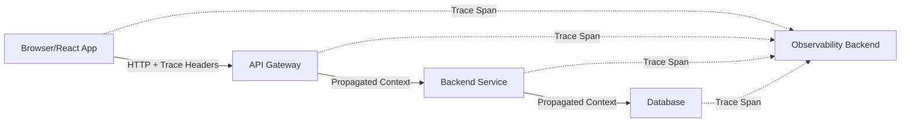

# How to Add OpenTelemetry Browser Tracing to a React Application

Author: [nawazdhandala](https://www.github.com/nawazdhandala)

Tags: OpenTelemetry, React, Browser, Tracing, JavaScript, Frontend

Description: Learn how to implement OpenTelemetry browser tracing in React applications for comprehensive frontend observability and performance monitoring.

Modern web applications demand robust observability to understand user experiences and diagnose performance issues. OpenTelemetry provides a vendor-neutral way to instrument React applications, capturing traces that show exactly how your frontend behaves in production. This guide walks through setting up OpenTelemetry browser tracing in a React application from scratch.

## Understanding Browser Tracing

Browser tracing captures the lifecycle of user interactions and network requests in your React application. Unlike traditional logging, traces provide context about how operations relate to each other, making it easier to identify bottlenecks and errors. OpenTelemetry's browser instrumentation automatically captures XMLHttpRequest, Fetch API calls, and resource timing data.

## Installation and Dependencies

Start by installing the required OpenTelemetry packages. The core packages provide tracing functionality, while instrumentation packages automatically capture browser events.

```bash
npm install @opentelemetry/api \
  @opentelemetry/sdk-trace-web \
  @opentelemetry/instrumentation \
  @opentelemetry/auto-instrumentations-web \
  @opentelemetry/exporter-trace-otlp-http \
  @opentelemetry/resources \
  @opentelemetry/semantic-conventions
```

These packages give you everything needed for browser tracing: the API for manual instrumentation, the Web SDK for trace collection, automatic instrumentations for common browser APIs, and an exporter to send traces to your backend.

## Creating the Tracing Configuration

Create a dedicated file to initialize OpenTelemetry. This separation keeps tracing logic isolated and makes it easier to manage configuration across environments.

```javascript
// src/tracing.js

import { WebTracerProvider } from '@opentelemetry/sdk-trace-web';
import { Resource } from '@opentelemetry/resources';
import { SemanticResourceAttributes } from '@opentelemetry/semantic-conventions';
import { registerInstrumentations } from '@opentelemetry/instrumentation';
import { getWebAutoInstrumentations } from '@opentelemetry/auto-instrumentations-web';
import { OTLPTraceExporter } from '@opentelemetry/exporter-trace-otlp-http';
import { BatchSpanProcessor } from '@opentelemetry/sdk-trace-web';

// Define your application's resource attributes
// These attributes help identify traces from this specific application
const resource = Resource.default().merge(
  new Resource({
    [SemanticResourceAttributes.SERVICE_NAME]: 'react-frontend',
    [SemanticResourceAttributes.SERVICE_VERSION]: '1.0.0',
    [SemanticResourceAttributes.DEPLOYMENT_ENVIRONMENT]: process.env.NODE_ENV,
  })
);

// Create the tracer provider with the resource configuration
const provider = new WebTracerProvider({
  resource: resource,
});

// Configure the OTLP exporter to send traces to your observability backend
// Replace the URL with your actual collector endpoint
const exporter = new OTLPTraceExporter({
  url: 'https://your-observability-backend.com/v1/traces',
  headers: {
    'x-api-key': process.env.REACT_APP_OTEL_API_KEY,
  },
});

// Use BatchSpanProcessor to batch traces before sending
// This reduces network overhead compared to sending each span immediately
provider.addSpanProcessor(new BatchSpanProcessor(exporter));

// Register the provider globally
provider.register();

// Enable automatic instrumentations for browser APIs
// This captures fetch, XHR, and user interaction events automatically
registerInstrumentations({
  instrumentations: [
    getWebAutoInstrumentations({
      '@opentelemetry/instrumentation-fetch': {
        propagateTraceHeaderCorsUrls: [
          /https:\/\/api\.yourapp\.com\/.*/,
          /https:\/\/backend\.yourapp\.com\/.*/,
        ],
        clearTimingResources: true,
      },
      '@opentelemetry/instrumentation-xml-http-request': {
        propagateTraceHeaderCorsUrls: [
          /https:\/\/api\.yourapp\.com\/.*/,
          /https:\/\/backend\.yourapp\.com\/.*/,
        ],
      },
    }),
  ],
});

export default provider;
```

## Initializing Tracing in Your React App

Import the tracing configuration at the earliest point in your application lifecycle. This ensures all subsequent operations are instrumented.

```javascript
// src/index.js

import React from 'react';
import ReactDOM from 'react-dom/client';
import './tracing'; // Initialize tracing before anything else
import App from './App';
import './index.css';

const root = ReactDOM.createRoot(document.getElementById('root'));
root.render(
  <React.StrictMode>
    <App />
  </React.StrictMode>
);
```

By importing the tracing module first, you guarantee that OpenTelemetry intercepts all network calls and user interactions that happen during your app's initialization.

## Understanding Trace Propagation

Trace propagation connects frontend traces to backend traces, creating a complete picture of request flow through your system. The `propagateTraceHeaderCorsUrls` configuration tells OpenTelemetry which API endpoints should receive trace context headers.



When configured correctly, trace headers flow from your React application through your entire backend infrastructure, allowing you to see how a single user interaction impacts multiple services.

## Manual Instrumentation for Custom Operations

Automatic instrumentation covers common scenarios, but you'll often want to trace custom operations specific to your application logic.

```javascript
// src/components/DataProcessor.jsx

import { trace } from '@opentelemetry/api';
import { useState, useCallback } from 'react';

const tracer = trace.getTracer('react-frontend');

function DataProcessor() {
  const [data, setData] = useState(null);

  // Create a span for a complex data processing operation
  const processData = useCallback(async (rawData) => {
    const span = tracer.startSpan('process-data');

    try {
      // Add attributes to provide context about the operation
      span.setAttribute('data.size', rawData.length);
      span.setAttribute('data.type', typeof rawData);

      // Simulate complex processing
      const processed = await heavyComputation(rawData);

      span.setAttribute('result.size', processed.length);
      span.setStatus({ code: 1 }); // OK status

      setData(processed);
      return processed;
    } catch (error) {
      // Record errors in the span
      span.recordException(error);
      span.setStatus({
        code: 2, // ERROR status
        message: error.message
      });
      throw error;
    } finally {
      // Always end the span
      span.end();
    }
  }, []);

  return (
    <div>
      <button onClick={() => processData(someData)}>
        Process Data
      </button>
      {data && <div>Processed: {JSON.stringify(data)}</div>}
    </div>
  );
}

async function heavyComputation(data) {
  // Simulate processing time
  await new Promise(resolve => setTimeout(resolve, 100));
  return data.map(item => item * 2);
}

export default DataProcessor;
```

## Creating a Custom Hook for Tracing

Encapsulate tracing logic in a custom React hook to make it reusable across your application.

```javascript
// src/hooks/useTracing.js

import { trace, context } from '@opentelemetry/api';
import { useCallback, useRef } from 'react';

const tracer = trace.getTracer('react-frontend');

export function useTracing(componentName) {
  const activeSpans = useRef(new Map());

  // Start a new span for an operation
  const startSpan = useCallback((operationName, attributes = {}) => {
    const spanName = `${componentName}.${operationName}`;
    const span = tracer.startSpan(spanName);

    // Add custom attributes
    Object.entries(attributes).forEach(([key, value]) => {
      span.setAttribute(key, value);
    });

    const spanId = `${operationName}-${Date.now()}`;
    activeSpans.current.set(spanId, span);

    return spanId;
  }, [componentName]);

  // End a previously started span
  const endSpan = useCallback((spanId, attributes = {}) => {
    const span = activeSpans.current.get(spanId);
    if (span) {
      Object.entries(attributes).forEach(([key, value]) => {
        span.setAttribute(key, value);
      });
      span.end();
      activeSpans.current.delete(spanId);
    }
  }, []);

  // Record an error in a span
  const recordError = useCallback((spanId, error) => {
    const span = activeSpans.current.get(spanId);
    if (span) {
      span.recordException(error);
      span.setStatus({ code: 2, message: error.message });
    }
  }, []);

  return { startSpan, endSpan, recordError };
}
```

Use this hook in your components for consistent tracing:

```javascript
// src/components/UserProfile.jsx

import { useTracing } from '../hooks/useTracing';
import { useEffect, useState } from 'react';

function UserProfile({ userId }) {
  const { startSpan, endSpan, recordError } = useTracing('UserProfile');
  const [profile, setProfile] = useState(null);

  useEffect(() => {
    const spanId = startSpan('load-profile', { userId });

    fetch(`/api/users/${userId}`)
      .then(res => res.json())
      .then(data => {
        setProfile(data);
        endSpan(spanId, { 'profile.loaded': true });
      })
      .catch(error => {
        recordError(spanId, error);
        endSpan(spanId);
      });
  }, [userId, startSpan, endSpan, recordError]);

  return profile ? <div>{profile.name}</div> : <div>Loading...</div>;
}

export default UserProfile;
```

## Environment-Specific Configuration

Different environments require different tracing configurations. Use environment variables to control tracing behavior without code changes.

```javascript
// src/tracing.js (environment-aware version)

const isProduction = process.env.NODE_ENV === 'production';
const isDevelopment = process.env.NODE_ENV === 'development';

// Adjust sampling based on environment
// Sample 100% in development, but only 10% in production to reduce costs
const sampler = isProduction
  ? new TraceIdRatioBasedSampler(0.1)
  : new AlwaysOnSampler();

const provider = new WebTracerProvider({
  resource: resource,
  sampler: sampler,
});

// In development, log spans to console instead of sending to backend
if (isDevelopment) {
  provider.addSpanProcessor(new SimpleSpanProcessor(new ConsoleSpanExporter()));
} else {
  provider.addSpanProcessor(new BatchSpanProcessor(exporter));
}
```

## Monitoring Component Lifecycle

Track React component lifecycle events to understand rendering performance and identify unnecessary re-renders.

```javascript
// src/components/TracedComponent.jsx

import { trace } from '@opentelemetry/api';
import { useEffect } from 'react';

const tracer = trace.getTracer('react-frontend');

function TracedComponent({ data }) {
  useEffect(() => {
    const span = tracer.startSpan('TracedComponent.mount');
    span.setAttribute('component.props.data', JSON.stringify(data));
    span.end();

    return () => {
      const unmountSpan = tracer.startSpan('TracedComponent.unmount');
      unmountSpan.end();
    };
  }, []);

  useEffect(() => {
    const span = tracer.startSpan('TracedComponent.update');
    span.setAttribute('component.props.data', JSON.stringify(data));
    span.end();
  }, [data]);

  return <div>Traced Component</div>;
}

export default TracedComponent;
```

## Debugging and Validation

Verify your tracing setup by checking the browser console for OpenTelemetry logs and inspecting network requests to your collector endpoint.

```javascript
// Enable verbose logging during development
if (process.env.NODE_ENV === 'development') {
  // This helps debug instrumentation issues
  import('@opentelemetry/core').then(({ diag, DiagConsoleLogger, DiagLogLevel }) => {
    diag.setLogger(new DiagConsoleLogger(), DiagLogLevel.DEBUG);
  });
}
```

## Performance Considerations

Browser tracing adds minimal overhead, but you should still be mindful of performance. Batching spans reduces network calls, and sampling controls data volume in production. Monitor the performance impact using browser developer tools and adjust configuration as needed.

OpenTelemetry browser tracing transforms how you understand your React application's behavior in production. By combining automatic instrumentation with strategic manual tracing, you gain deep insights into user experiences and can quickly identify and resolve issues before they impact users.

