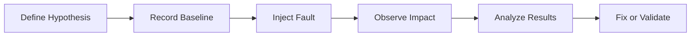
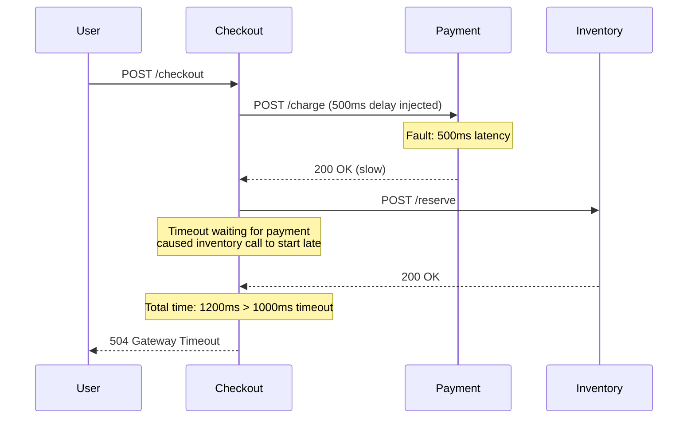

# How to Use OpenTelemetry for Chaos Engineering Experiments

Author: [nawazdhandala](https://www.github.com/nawazdhandala)

Tags: OpenTelemetry, Chaos Engineering, Resilience Testing, Observability, Fault Injection, Microservices

Description: Learn how to use OpenTelemetry to observe, measure, and validate chaos engineering experiments, turning fault injection from guesswork into a data-driven practice.

---

> Chaos engineering without observability is just breaking things. OpenTelemetry gives you the instrumentation to measure exactly how your system behaves when faults are injected, turning chaos experiments from scary exercises into scientific investigations.

The whole point of chaos engineering is to discover weaknesses in your system before they cause real outages. But discovering weaknesses requires being able to see what happens when you inject a fault. Without good observability, you inject latency into a service and then stare at your monitoring hoping to notice something. With OpenTelemetry, you can precisely measure the blast radius, track cascading failures, and verify that your resilience mechanisms actually work.

This guide shows you how to instrument chaos experiments with OpenTelemetry so you can run them confidently and learn from the results.

---

## The Chaos Experiment Lifecycle

Every chaos experiment follows a predictable lifecycle. OpenTelemetry plays a role at each stage:



1. **Define Hypothesis**: "If the payment service has 500ms of added latency, the checkout success rate will remain above 99% because our timeout and retry logic will handle it."

2. **Record Baseline**: Use OpenTelemetry metrics to capture normal behavior before the experiment.

3. **Inject Fault**: Introduce the failure condition (latency, errors, resource exhaustion).

4. **Observe Impact**: Watch OpenTelemetry traces, metrics, and logs to see what actually happens.

5. **Analyze Results**: Compare experiment behavior to your baseline and hypothesis.

---

## Instrumenting Chaos Experiments with Custom Spans

When running a chaos experiment, you want to clearly mark in your telemetry when faults are active. This makes it easy to correlate behavior changes with the experiment.

Here is a Python library that wraps chaos experiments in OpenTelemetry spans:

```python
# chaos_experiment.py
# Framework for running chaos experiments with OpenTelemetry observability

import time
from contextlib import contextmanager
from opentelemetry import trace, metrics
from opentelemetry.trace import StatusCode

tracer = trace.get_tracer("chaos-engineering")
meter = metrics.get_meter("chaos-engineering")

# Track the number of experiments run and their outcomes
experiment_counter = meter.create_counter(
    name="chaos.experiments.total",
    description="Total number of chaos experiments executed",
    unit="1",
)

# Track the duration of each experiment phase
phase_duration = meter.create_histogram(
    name="chaos.experiment.phase.duration",
    description="Duration of each experiment phase in seconds",
    unit="s",
)

@contextmanager
def chaos_experiment(name, hypothesis, fault_type, target_service):
    """
    Context manager that wraps a chaos experiment in OpenTelemetry telemetry.
    Creates a parent span for the entire experiment and child spans for each phase.
    """
    with tracer.start_as_current_span(
        f"chaos.experiment.{name}",
        attributes={
            "chaos.experiment.name": name,
            "chaos.hypothesis": hypothesis,
            "chaos.fault_type": fault_type,
            "chaos.target_service": target_service,
        },
    ) as experiment_span:

        experiment_counter.add(1, {
            "chaos.fault_type": fault_type,
            "chaos.target_service": target_service,
        })

        result = {"hypothesis_validated": None, "observations": []}

        try:
            yield result
        except Exception as e:
            experiment_span.set_status(StatusCode.ERROR, str(e))
            experiment_span.record_exception(e)
            result["hypothesis_validated"] = False
            raise
        finally:
            # Record the experiment outcome as span attributes
            experiment_span.set_attribute(
                "chaos.hypothesis_validated",
                result.get("hypothesis_validated", False),
            )
            for i, obs in enumerate(result.get("observations", [])):
                experiment_span.set_attribute(f"chaos.observation.{i}", obs)


@contextmanager
def experiment_phase(phase_name):
    """Track individual phases of the experiment as child spans"""
    start = time.time()
    with tracer.start_as_current_span(f"chaos.phase.{phase_name}") as span:
        yield span
    duration = time.time() - start
    phase_duration.record(duration, {"chaos.phase": phase_name})
```

---

## Running a Latency Injection Experiment

Here is a complete example of running a latency injection experiment against a payment service and measuring the results:

```python
# experiment_payment_latency.py
# Chaos experiment: inject 500ms latency into the payment service
# and verify that checkout success rate stays above 99%

import time
import requests
from chaos_experiment import chaos_experiment, experiment_phase
from opentelemetry import metrics

meter = metrics.get_meter("chaos-engineering")

def run_payment_latency_experiment():
    with chaos_experiment(
        name="payment-latency-500ms",
        hypothesis="Checkout success rate remains above 99% with 500ms payment latency",
        fault_type="latency",
        target_service="payment-service",
    ) as result:

        # Phase 1: Record baseline metrics
        with experiment_phase("baseline") as span:
            baseline = measure_checkout_success_rate(duration_seconds=60)
            span.set_attribute("chaos.baseline.success_rate", baseline)
            span.set_attribute("chaos.baseline.p99_latency_ms", measure_p99_latency())
            result["observations"].append(
                f"Baseline success rate: {baseline:.2%}"
            )

        # Phase 2: Inject the fault
        # Using a service mesh (Istio) fault injection rule
        with experiment_phase("fault_injection") as span:
            inject_latency_fault(
                service="payment-service",
                delay_ms=500,
                percentage=100,  # Apply to all requests
            )
            span.set_attribute("chaos.fault.delay_ms", 500)
            span.set_attribute("chaos.fault.percentage", 100)
            # Wait for the fault to take effect
            time.sleep(5)

        # Phase 3: Measure impact during the fault
        with experiment_phase("measurement") as span:
            experiment_success_rate = measure_checkout_success_rate(duration_seconds=120)
            experiment_p99 = measure_p99_latency()
            span.set_attribute("chaos.experiment.success_rate", experiment_success_rate)
            span.set_attribute("chaos.experiment.p99_latency_ms", experiment_p99)
            result["observations"].append(
                f"Experiment success rate: {experiment_success_rate:.2%}"
            )
            result["observations"].append(
                f"Experiment p99 latency: {experiment_p99}ms"
            )

        # Phase 4: Remove the fault
        with experiment_phase("rollback") as span:
            remove_latency_fault(service="payment-service")
            time.sleep(5)

        # Phase 5: Verify recovery
        with experiment_phase("recovery_verification") as span:
            recovery_rate = measure_checkout_success_rate(duration_seconds=60)
            span.set_attribute("chaos.recovery.success_rate", recovery_rate)
            result["observations"].append(
                f"Recovery success rate: {recovery_rate:.2%}"
            )

        # Evaluate hypothesis
        result["hypothesis_validated"] = experiment_success_rate >= 0.99
        if not result["hypothesis_validated"]:
            result["observations"].append(
                "HYPOTHESIS FAILED: Success rate dropped below 99%"
            )


def inject_latency_fault(service, delay_ms, percentage):
    """Apply an Istio VirtualService fault injection rule"""
    fault_config = {
        "apiVersion": "networking.istio.io/v1beta1",
        "kind": "VirtualService",
        "metadata": {"name": f"{service}-chaos"},
        "spec": {
            "hosts": [service],
            "http": [{
                "fault": {
                    "delay": {
                        "percentage": {"value": percentage},
                        "fixedDelay": f"{delay_ms}ms",
                    }
                },
                "route": [{"destination": {"host": service}}],
            }],
        },
    }
    # Apply via Kubernetes API
    requests.post(
        "http://kubernetes.default/apis/networking.istio.io/v1beta1/virtualservices",
        json=fault_config,
    )


def remove_latency_fault(service):
    """Remove the fault injection rule"""
    requests.delete(
        f"http://kubernetes.default/apis/networking.istio.io/v1beta1/virtualservices/{service}-chaos"
    )


def measure_checkout_success_rate(duration_seconds):
    """Query the metrics backend for checkout success rate"""
    # In practice, this queries your Prometheus/OTel backend
    # Here we simulate the measurement
    return 0.994


def measure_p99_latency():
    """Query the metrics backend for p99 latency"""
    return 750
```

---

## Tracking Cascading Failures with Traces

One of the most valuable things OpenTelemetry reveals during chaos experiments is cascading failures. When you inject a fault into one service, traces show you exactly how that fault propagates through the dependency chain.



By examining the traces during the experiment, you can see that the 500ms payment latency cascaded into a checkout timeout because the checkout service's total timeout was 1000ms and it had to make two sequential calls. The fix would be to either increase the checkout timeout or parallelize the payment and inventory calls.

---

## Automated Experiment Validation

Instead of manually checking dashboards after each experiment, you can automate the validation by querying OpenTelemetry metrics programmatically:

```python
# validate_experiment.py
# Automatically validate chaos experiment results against SLO targets

from opentelemetry import trace

tracer = trace.get_tracer("chaos-validation")

def validate_experiment_results(
    metrics_client,
    service_name,
    experiment_start,
    experiment_end,
    slo_targets,
):
    """
    Validate that the system met its SLO targets during the chaos experiment.
    Returns a detailed report of which targets were met and which were violated.
    """
    with tracer.start_as_current_span("chaos.validation") as span:
        results = {}

        # Check availability target
        if "availability" in slo_targets:
            error_rate = metrics_client.query(
                f'sum(rate(http_server_request_errors_total{{'
                f'service_name="{service_name}"'
                f'}}[{experiment_end - experiment_start}s]))'
                f' / sum(rate(http_server_request_total{{'
                f'service_name="{service_name}"'
                f'}}[{experiment_end - experiment_start}s]))',
                time=experiment_end,
            )
            availability = 1 - error_rate
            target = slo_targets["availability"]
            passed = availability >= target

            results["availability"] = {
                "target": target,
                "actual": availability,
                "passed": passed,
            }
            span.set_attribute("chaos.validation.availability", availability)
            span.set_attribute("chaos.validation.availability_passed", passed)

        # Check latency target
        if "p99_latency_ms" in slo_targets:
            p99 = metrics_client.query(
                f'histogram_quantile(0.99, sum(rate('
                f'http_server_request_duration_bucket{{'
                f'service_name="{service_name}"'
                f'}}[{experiment_end - experiment_start}s])) by (le))',
                time=experiment_end,
            )
            target = slo_targets["p99_latency_ms"]
            passed = p99 <= target

            results["p99_latency"] = {
                "target_ms": target,
                "actual_ms": p99,
                "passed": passed,
            }
            span.set_attribute("chaos.validation.p99_latency_ms", p99)
            span.set_attribute("chaos.validation.p99_passed", passed)

        # Overall result
        all_passed = all(r["passed"] for r in results.values())
        span.set_attribute("chaos.validation.all_passed", all_passed)

        return {
            "all_targets_met": all_passed,
            "details": results,
        }
```

---

## Best Practices for Chaos Observability

1. **Always record baselines**: Measure your key metrics for at least 5 minutes before injecting faults. Without a baseline, you cannot determine the experiment's impact.

2. **Tag everything with experiment metadata**: Add attributes like `chaos.experiment.name` and `chaos.fault_type` to all telemetry during experiments. This lets you filter dashboards to show only experiment-related data.

3. **Start small**: Run experiments in staging first. When you move to production, start with a small blast radius (one pod, 10% of traffic) and expand gradually.

4. **Automate rollback**: Always have an automated rollback mechanism. If your experiment causes more damage than expected, you need to remove the fault immediately.

5. **Share results widely**: Chaos experiment results, captured in OpenTelemetry traces and metrics, make excellent post-experiment reports. They show exactly what happened, when, and why.

OpenTelemetry transforms chaos engineering from "we broke something and hope we noticed" into "we injected a precise fault and measured exactly how the system responded." That precision is what makes chaos engineering safe enough to run in production.
