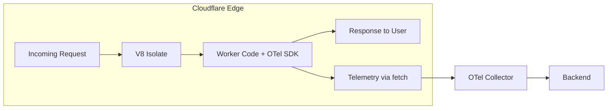

# How to Set Up OpenTelemetry for Cloudflare Workers Edge Functions

Author: [nawazdhandala](https://www.github.com/nawazdhandala)

Tags: OpenTelemetry, Cloudflare Workers, Edge Computing, Serverless, Tracing, Observability, JavaScript

Description: A practical guide to instrumenting Cloudflare Workers with OpenTelemetry for distributed tracing and metrics collection at the edge.

---

Cloudflare Workers run at the edge, close to your users, in over 300 data centers worldwide. That makes them fast. It also makes them hard to observe. Traditional APM agents do not work in the Workers runtime because it is not Node.js. There is no file system, no native modules, and no long-running process to attach to. You have to approach instrumentation differently.

OpenTelemetry can work in Cloudflare Workers, but you need to use the right components. The standard Node.js SDK will not run in the Workers environment. Instead, you build on the lightweight browser-compatible pieces of the OpenTelemetry JS API and export telemetry over HTTP using the OTLP JSON exporter. This guide walks through the full setup from scratch.

## Understanding the Workers Runtime Constraints

The Cloudflare Workers runtime is built on V8 isolates, not on Node.js. This has real implications for OpenTelemetry.



Key constraints you need to work with:
- No `fs`, `net`, `http`, or other Node.js built-in modules
- No gRPC support, so you must use HTTP/JSON for OTLP export
- Execution time limits (typically 30 seconds for paid plans, 10ms CPU for free)
- The `waitUntil` API lets you send telemetry after the response without blocking the user

These constraints mean you cannot simply install `@opentelemetry/sdk-node` and call it a day. But you can build a lightweight instrumentation layer that works perfectly within these limits.

## Installing the Compatible OpenTelemetry Packages

Start with only the packages that work in the Workers runtime. Avoid anything that pulls in Node.js dependencies.

```bash
# Install the core API and SDK packages that are runtime-agnostic
npm install @opentelemetry/api
npm install @opentelemetry/sdk-trace-base
npm install @opentelemetry/resources
npm install @opentelemetry/semantic-conventions

# Install the OTLP HTTP exporter using JSON format,
# which works with the fetch API available in Workers
npm install @opentelemetry/exporter-trace-otlp-http
```

Do not install `@opentelemetry/sdk-trace-node` or `@opentelemetry/auto-instrumentations-node`. Those packages import Node.js modules and will fail at deploy time.

## Configuring the Trace Provider for Workers

The trace provider needs to be configured to use a simple span processor and the HTTP exporter. In a Workers environment, you want to flush spans at the end of each request rather than batching across requests, because each request may run in a different isolate.

```javascript
// tracing.js
import { trace, context, SpanStatusCode } from '@opentelemetry/api';
import {
  BasicTracerProvider,
  SimpleSpanProcessor,
} from '@opentelemetry/sdk-trace-base';
import { OTLPTraceExporter } from '@opentelemetry/exporter-trace-otlp-http';
import { Resource } from '@opentelemetry/resources';
import {
  ATTR_SERVICE_NAME,
  ATTR_SERVICE_VERSION,
} from '@opentelemetry/semantic-conventions';

// Create a provider factory that builds a fresh provider per request.
// Workers isolates may be reused, but we want clean state for each
// request to avoid leaking context between different users.
export function createTracerProvider(env) {
  const resource = new Resource({
    [ATTR_SERVICE_NAME]: 'cloudflare-worker-api',
    [ATTR_SERVICE_VERSION]: '1.0.0',
    // Tag with the Cloudflare data center for geographic analysis
    'cloud.provider': 'cloudflare',
    'cloud.platform': 'cloudflare_workers',
  });

  // Use the OTLP HTTP exporter with JSON encoding.
  // The fetch-based transport works natively in Workers.
  const exporter = new OTLPTraceExporter({
    url: env.OTEL_EXPORTER_OTLP_ENDPOINT || 'https://your-collector:4318/v1/traces',
    headers: {
      // Include an API key if your collector requires authentication
      Authorization: `Bearer ${env.OTEL_API_KEY || ''}`,
    },
  });

  const provider = new BasicTracerProvider({
    resource,
    spanProcessors: [new SimpleSpanProcessor(exporter)],
  });

  // Register this provider as the global trace provider
  provider.register();

  return provider;
}
```

We use `SimpleSpanProcessor` instead of `BatchSpanProcessor` because Workers requests are short-lived. The simple processor exports each span immediately when it ends, which fits the Workers execution model better. In a long-running server you would batch, but here immediacy matters more than throughput.

## Instrumenting the Worker Request Handler

Now wire the tracing into your actual Worker code. The pattern is to create a root span for each incoming request, propagate context to any downstream calls, and flush telemetry using `waitUntil`.

```javascript
// index.js
import { trace, context, SpanStatusCode, propagation } from '@opentelemetry/api';
import { createTracerProvider } from './tracing.js';

export default {
  async fetch(request, env, ctx) {
    // Initialize the tracer provider with environment bindings
    const provider = createTracerProvider(env);
    const tracer = trace.getTracer('cloudflare-worker', '1.0.0');

    // Extract any incoming trace context from the request headers.
    // This enables distributed tracing across services that call
    // this Worker.
    const parentContext = propagation.extract(
      context.active(),
      Object.fromEntries(request.headers),
      {
        get(carrier, key) { return carrier[key]; },
        keys(carrier) { return Object.keys(carrier); },
      }
    );

    // Start the root span for this request
    const span = tracer.startSpan(
      'worker.request',
      {
        attributes: {
          'http.method': request.method,
          'http.url': request.url,
          'http.target': new URL(request.url).pathname,
          // Capture the Cloudflare data center from the cf object
          'cf.colo': request.cf?.colo || 'unknown',
          'cf.country': request.cf?.country || 'unknown',
        },
      },
      parentContext
    );

    let response;
    try {
      // Run the actual request handling within the span context
      response = await context.with(
        trace.setSpan(parentContext, span),
        () => handleRequest(request, env, tracer)
      );

      // Record the response status on the span
      span.setAttribute('http.status_code', response.status);
      if (response.status >= 400) {
        span.setStatus({ code: SpanStatusCode.ERROR });
      }
    } catch (error) {
      // Record the error details on the span
      span.recordException(error);
      span.setStatus({
        code: SpanStatusCode.ERROR,
        message: error.message,
      });
      response = new Response('Internal Server Error', { status: 500 });
    } finally {
      span.end();
    }

    // Use waitUntil to flush telemetry after the response is sent.
    // This keeps the user-facing latency low because the telemetry
    // export happens in the background.
    ctx.waitUntil(provider.forceFlush());

    return response;
  },
};
```

The `waitUntil` call is critical. Without it, the Worker runtime might terminate the isolate before the telemetry has been exported. The `waitUntil` method tells Cloudflare to keep the isolate alive until the promise resolves, even though the response has already been sent to the user.

## Tracing Downstream Fetch Calls

Most Workers make fetch calls to origin servers or APIs. You want those calls to show up as child spans and to propagate trace context to the downstream service.

```javascript
// traced-fetch.js
import { trace, context, SpanStatusCode, propagation } from '@opentelemetry/api';

// A wrapper around fetch that creates a child span and propagates
// trace context headers to the downstream service
export async function tracedFetch(url, options = {}) {
  const tracer = trace.getTracer('cloudflare-worker');
  const span = tracer.startSpan('fetch', {
    attributes: {
      'http.method': options.method || 'GET',
      'http.url': url,
    },
  });

  return context.with(trace.setSpan(context.active(), span), async () => {
    // Inject trace context headers into the outgoing request
    // so the downstream service can continue the trace
    const headers = new Headers(options.headers || {});
    propagation.inject(context.active(), headers, {
      set(carrier, key, value) {
        carrier.set(key, value);
      },
    });

    try {
      const response = await fetch(url, { ...options, headers });

      span.setAttribute('http.status_code', response.status);
      if (response.status >= 400) {
        span.setStatus({ code: SpanStatusCode.ERROR });
      }

      return response;
    } catch (error) {
      span.recordException(error);
      span.setStatus({ code: SpanStatusCode.ERROR, message: error.message });
      throw error;
    } finally {
      span.end();
    }
  });
}
```

Now use `tracedFetch` anywhere you would normally use `fetch`:

```javascript
// handler.js
import { tracedFetch } from './traced-fetch.js';

export async function handleRequest(request, env, tracer) {
  const url = new URL(request.url);

  if (url.pathname === '/api/data') {
    // This fetch call will appear as a child span in your traces
    const apiResponse = await tracedFetch('https://api.example.com/data', {
      headers: { 'Content-Type': 'application/json' },
    });

    const data = await apiResponse.json();
    return new Response(JSON.stringify(data), {
      headers: { 'Content-Type': 'application/json' },
    });
  }

  return new Response('Not Found', { status: 404 });
}
```

Every downstream call now gets its own span with timing, status codes, and trace context propagation. When the downstream service is also instrumented with OpenTelemetry, you get a complete end-to-end trace from the edge through your entire backend.

## Adding Custom Span Events and Attributes

Beyond automatic HTTP tracing, you often want to record business-level events within a request.

```javascript
// Using the active span to record custom events
import { trace } from '@opentelemetry/api';

export async function processUserRequest(userId, action) {
  const span = trace.getActiveSpan();

  if (span) {
    // Add business context as span attributes
    span.setAttribute('user.id', userId);
    span.setAttribute('user.action', action);

    // Record a span event when something noteworthy happens.
    // Events are timestamped markers within a span's timeline.
    span.addEvent('cache.lookup', {
      'cache.key': `user:${userId}`,
      'cache.hit': false,
    });
  }

  // ... rest of your business logic
}
```

These custom attributes and events make traces useful for debugging specific user issues, not just system-level performance monitoring.

## Configuring wrangler.toml for OpenTelemetry

Your Cloudflare Worker configuration needs the right environment variables and bindings to support telemetry export.

```toml
# wrangler.toml
name = "my-otel-worker"
main = "src/index.js"
compatibility_date = "2024-01-01"

# Bind environment variables for the OTel configuration.
# Use secrets for the API key so it is not stored in plain text.
[vars]
OTEL_EXPORTER_OTLP_ENDPOINT = "https://your-collector:4318/v1/traces"

# The API key should be set as a secret using:
# wrangler secret put OTEL_API_KEY
```

Set the API key as a secret rather than a plain variable to keep it out of your version control and build logs.

## Performance Considerations

Instrumentation adds overhead, and at the edge, every millisecond counts. A few things to keep in mind when running OpenTelemetry in Workers:

The `SimpleSpanProcessor` with HTTP export adds a fetch call at the end of each request. This runs inside `waitUntil`, so it does not affect user-facing latency, but it does consume CPU time that counts against your Worker limits. For high-traffic Workers, consider sampling to reduce the volume of exported traces.

Keep span attributes lean. Every attribute you add increases the size of the telemetry payload. Avoid dumping entire request bodies or large JSON objects into attributes.

If your Worker handles thousands of requests per second, use a head-based sampler to export only a fraction of traces while still catching errors.

```javascript
// Add sampling to reduce telemetry volume on high-traffic Workers
import { TraceIdRatioBasedSampler } from '@opentelemetry/sdk-trace-base';

// Sample 10% of traces in production
const sampler = new TraceIdRatioBasedSampler(0.1);
```

## Wrapping Up

Getting OpenTelemetry running in Cloudflare Workers requires working around the V8 isolate constraints, but the result is worth it. You get distributed tracing from the edge all the way through your backend, complete with geographic context from Cloudflare's network. The key pieces are the HTTP-based OTLP exporter, the `waitUntil` pattern for non-blocking telemetry export, and a traced fetch wrapper for propagating context to downstream services.
