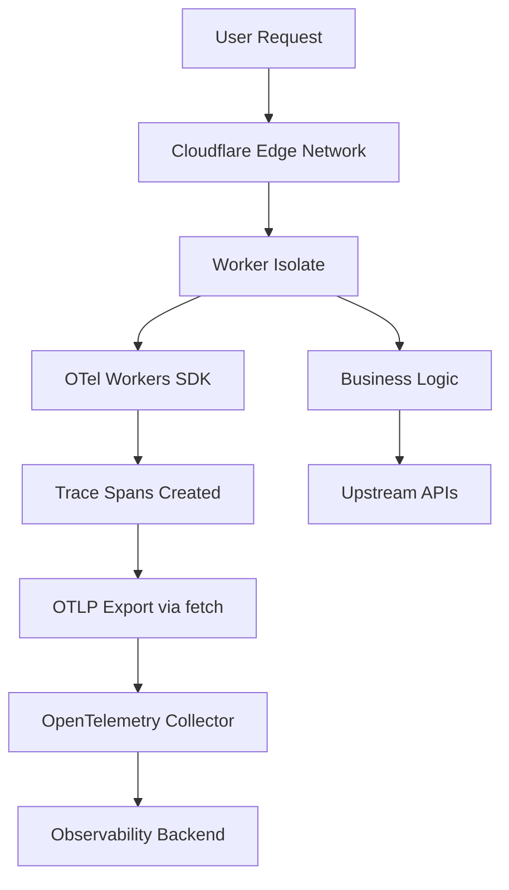
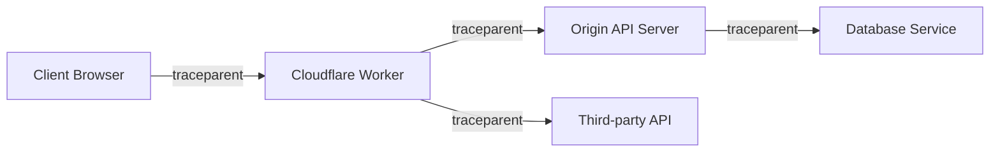

# How to Use OpenTelemetry with Cloudflare Workers

Author: [nawazdhandala](https://www.github.com/nawazdhandala)

Tags: OpenTelemetry, Cloudflare Workers, Edge Computing, Tracing, Serverless, JavaScript

Description: A complete guide to integrating OpenTelemetry with Cloudflare Workers for distributed tracing and observability at the edge.

---

Cloudflare Workers run your code at the edge, close to your users, across Cloudflare's global network. They execute in a V8 isolate rather than a traditional Node.js environment, which makes them fast but also introduces some unique challenges for observability. Standard OpenTelemetry Node.js SDKs won't work here because Workers don't have access to Node.js APIs.

In this guide, we'll walk through how to instrument Cloudflare Workers with OpenTelemetry using libraries built for the Workers runtime. You'll learn how to capture traces, add custom spans, and export telemetry data to any OTLP-compatible backend.

## The Cloudflare Workers Runtime Challenge

Cloudflare Workers use the V8 JavaScript engine directly, not Node.js. This means:

- No `fs`, `net`, `http`, or other Node.js built-in modules
- No `process` object or environment variables in the traditional sense
- The `fetch` API is the primary way to make HTTP requests
- Execution contexts are isolated and short-lived

Because of these constraints, you can't just drop in the standard `@opentelemetry/sdk-node` package. Instead, you need a Workers-compatible approach.



## Installing the Workers-Compatible SDK

The `@microlabs/otel-cf-workers` package provides an OpenTelemetry SDK that works within the Cloudflare Workers runtime. It handles the differences between Workers and Node.js for you.

```bash
# Install the Cloudflare Workers OpenTelemetry SDK
npm install @microlabs/otel-cf-workers
```

If you're using Wrangler (Cloudflare's CLI tool for Workers development), your project should already be set up with a `wrangler.toml` configuration file.

## Basic Instrumentation Setup

The core idea is to wrap your Worker's fetch handler with an instrumentation layer. This creates a root span for every incoming request and provides a context for creating child spans.

```typescript
// src/index.ts - Cloudflare Worker with OpenTelemetry instrumentation
import { instrument, ResolveConfigFn } from '@microlabs/otel-cf-workers';

// Define your Worker handler as usual
const handler = {
  async fetch(request: Request, env: Env, ctx: ExecutionContext): Promise<Response> {
    // Your normal Worker logic goes here
    const url = new URL(request.url);

    if (url.pathname === '/api/hello') {
      return new Response(JSON.stringify({ message: 'Hello from the edge!' }), {
        headers: { 'Content-Type': 'application/json' },
      });
    }

    return new Response('Not Found', { status: 404 });
  },
};

// Configuration function that receives the environment bindings
// This is called once when the Worker starts handling requests
const config: ResolveConfigFn = (env: Env, _trigger) => {
  return {
    exporter: {
      // Send traces to your OTLP-compatible collector
      url: env.OTEL_EXPORTER_OTLP_ENDPOINT + '/v1/traces',
      headers: {
        // Authentication headers for your backend
        'x-oneuptime-token': env.ONEUPTIME_TOKEN,
      },
    },
    service: {
      name: env.SERVICE_NAME || 'cloudflare-worker',
      version: '1.0.0',
    },
  };
};

// Wrap the handler with OpenTelemetry instrumentation
// This automatically creates spans for incoming requests
export default instrument(handler, config);
```

The `instrument()` function wraps your handler and automatically creates a root span for each incoming request. It captures details like the HTTP method, URL, status code, and response time.

## Adding Environment Variables

In Cloudflare Workers, environment variables are configured through `wrangler.toml` or the Cloudflare dashboard. Add your OpenTelemetry configuration variables there.

```toml
# wrangler.toml - Worker configuration with OpenTelemetry settings
name = "my-worker"
main = "src/index.ts"
compatibility_date = "2024-01-01"

[vars]
SERVICE_NAME = "my-cloudflare-worker"
OTEL_EXPORTER_OTLP_ENDPOINT = "https://your-collector.example.com"

# For sensitive values like tokens, use secrets instead:
# wrangler secret put ONEUPTIME_TOKEN
```

For sensitive values like authentication tokens, use Wrangler secrets rather than plain text variables.

```bash
# Store your authentication token as a secret
wrangler secret put ONEUPTIME_TOKEN
```

## Creating Custom Spans

Auto-instrumentation gives you the request-level span, but you'll want to trace specific operations within your Worker. Use the OpenTelemetry trace API to create child spans.

```typescript
// src/index.ts - Worker with custom spans for business logic
import { instrument, ResolveConfigFn } from '@microlabs/otel-cf-workers';
import { trace, SpanStatusCode } from '@opentelemetry/api';

const tracer = trace.getTracer('my-worker');

const handler = {
  async fetch(request: Request, env: Env, ctx: ExecutionContext): Promise<Response> {
    const url = new URL(request.url);

    if (url.pathname === '/api/transform') {
      // Wrap the data transformation in a custom span
      return tracer.startActiveSpan('transform-data', async (span) => {
        try {
          const body = await request.json();
          span.setAttribute('input.size', JSON.stringify(body).length);

          // Trace the upstream API call as a separate child span
          const enriched = await tracer.startActiveSpan('call-enrichment-api', async (apiSpan) => {
            const response = await fetch('https://api.example.com/enrich', {
              method: 'POST',
              body: JSON.stringify(body),
              headers: { 'Content-Type': 'application/json' },
            });

            apiSpan.setAttribute('http.status_code', response.status);
            apiSpan.end();
            return response.json();
          });

          span.setAttribute('output.size', JSON.stringify(enriched).length);
          return new Response(JSON.stringify(enriched), {
            headers: { 'Content-Type': 'application/json' },
          });
        } catch (error) {
          // Record errors on the span for easy debugging
          span.recordException(error as Error);
          span.setStatus({ code: SpanStatusCode.ERROR, message: (error as Error).message });
          return new Response('Internal Error', { status: 500 });
        } finally {
          span.end();
        }
      });
    }

    return new Response('Not Found', { status: 404 });
  },
};
```

## Tracing KV Store and Durable Object Access

Cloudflare Workers often use KV Store, R2, or Durable Objects for state management. These operations are worth tracing since they can be significant sources of latency.

```typescript
// Trace KV Store reads with custom spans
async function getFromKV(env: Env, key: string): Promise<string | null> {
  return tracer.startActiveSpan('kv-get', async (span) => {
    // Add KV-specific attributes to the span
    span.setAttribute('kv.namespace', 'MY_KV');
    span.setAttribute('kv.key', key);

    const value = await env.MY_KV.get(key);

    // Record whether it was a cache hit or miss
    span.setAttribute('kv.hit', value !== null);
    span.end();
    return value;
  });
}

// Trace Durable Object calls
async function callDurableObject(env: Env, id: string, action: string): Promise<Response> {
  return tracer.startActiveSpan('durable-object-call', async (span) => {
    span.setAttribute('do.id', id);
    span.setAttribute('do.action', action);

    // Get a stub for the Durable Object
    const objId = env.MY_DURABLE_OBJECT.idFromName(id);
    const stub = env.MY_DURABLE_OBJECT.get(objId);

    // Forward the request to the Durable Object
    const response = await stub.fetch(new Request(`https://do/${action}`));
    span.setAttribute('http.status_code', response.status);
    span.end();
    return response;
  });
}
```

## Trace Context Propagation

When your Worker calls other services, you want the trace context to travel with the request. The `@microlabs/otel-cf-workers` package automatically injects W3C Trace Context headers into outgoing `fetch` calls made within an active span context.



If you need to manually extract or inject trace context (for example, when passing context through a queue), you can use the propagation API directly.

```typescript
// Manual trace context propagation for non-HTTP transports
import { context, propagation } from '@opentelemetry/api';

function injectTraceContext(): Record<string, string> {
  // Extract the current trace context into a plain object
  const carrier: Record<string, string> = {};
  propagation.inject(context.active(), carrier);
  return carrier;
  // carrier now contains { traceparent: '...', tracestate: '...' }
}
```

## Instrumenting Scheduled Workers (Cron Triggers)

Cloudflare Workers can also run on a schedule using Cron Triggers. You can instrument these the same way.

```typescript
// Instrumenting a scheduled Worker (cron trigger)
const handler = {
  async fetch(request: Request, env: Env, ctx: ExecutionContext): Promise<Response> {
    return new Response('OK');
  },

  // The scheduled handler runs on a cron schedule
  async scheduled(event: ScheduledEvent, env: Env, ctx: ExecutionContext): Promise<void> {
    return tracer.startActiveSpan('scheduled-cleanup', async (span) => {
      span.setAttribute('cron.trigger', event.cron);
      span.setAttribute('scheduled.time', event.scheduledTime);

      try {
        // Run your scheduled task
        const deletedCount = await cleanupExpiredSessions(env);
        span.setAttribute('cleanup.deleted_count', deletedCount);
      } catch (error) {
        span.recordException(error as Error);
        span.setStatus({ code: SpanStatusCode.ERROR });
        throw error;
      } finally {
        span.end();
      }
    });
  },
};

// The instrument() wrapper handles both fetch and scheduled handlers
export default instrument(handler, config);
```

## Performance Tips

Edge functions need to be fast. Here are some practical tips for keeping OpenTelemetry overhead low in your Workers.

Keep your span count low. Each span adds serialization and export overhead. Focus on spans that represent meaningful operations like external API calls, KV reads, and business logic steps. Don't create spans for simple in-memory computations.

Use `ctx.waitUntil()` when possible. Cloudflare provides this API to keep the Worker alive after sending the response. The `@microlabs/otel-cf-workers` library uses this internally to export spans after the response has been sent, so the user doesn't wait for the telemetry export.

Consider sampling for high-traffic Workers. If your Worker handles millions of requests per day, exporting a trace for every single one will be expensive. Configure a sampling rate to capture a representative subset.

## Summary

Instrumenting Cloudflare Workers with OpenTelemetry requires a different approach than traditional Node.js applications because of the V8 isolate runtime. The `@microlabs/otel-cf-workers` package bridges this gap, giving you automatic request tracing and the ability to create custom spans.

The key takeaways are:

- Use a Workers-compatible SDK, not the standard Node.js OpenTelemetry packages
- Wrap your handler with `instrument()` for automatic request-level tracing
- Create custom spans for KV, Durable Object, and external API calls
- Configure environment variables through `wrangler.toml` or the Cloudflare dashboard
- Take advantage of `ctx.waitUntil()` for non-blocking telemetry export

With proper instrumentation, you get visibility into your edge computing workloads and can debug issues that would otherwise be invisible.
