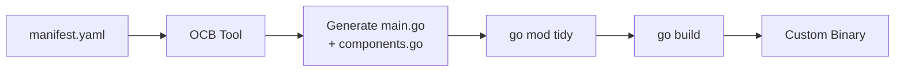
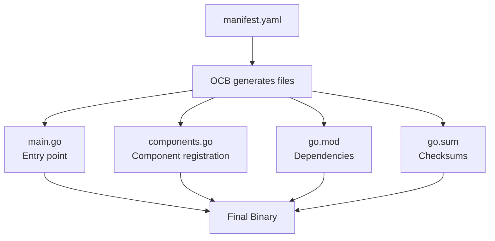

# How to Use the OpenTelemetry Collector Builder (ocb) Tool

Author: [nawazdhandala](https://www.github.com/nawazdhandala)

Tags: OpenTelemetry, OCB, Collector Builder, Tooling, Go

Description: A practical guide to using the OpenTelemetry Collector Builder tool to generate custom collector binaries with exactly the components you need.

---

The OpenTelemetry Collector Builder, commonly called OCB, is the official tool for assembling custom OpenTelemetry Collector distributions. Instead of relying on the pre-built core or contrib distributions, OCB lets you define a manifest of components and produces a ready-to-run binary. This post covers everything you need to know to use OCB effectively.

## What is the OCB Tool?

OCB reads a YAML manifest that lists the receivers, processors, exporters, extensions, and connectors you want. It then generates Go source code, resolves dependencies, and compiles everything into a single binary. Think of it as a package manager specifically for OpenTelemetry Collector components.



## Installing OCB

There are a few ways to install OCB depending on your workflow.

### Option 1: Install with Go

The simplest approach if you already have Go installed:

```bash
# Install the latest version of the builder tool
go install go.opentelemetry.io/collector/cmd/builder@latest

# Verify the installation
builder version
```

### Option 2: Download a Pre-Built Release

Grab the binary directly from the GitHub releases page:

```bash
# Download the OCB binary for your platform
# Replace the version and platform as needed
curl -L -o ocb \
  https://github.com/open-telemetry/opentelemetry-collector-releases/releases/download/cmd%2Fbuilder%2Fv0.96.0/ocb_0.96.0_linux_amd64

# Make it executable
chmod +x ocb

# Move it to your PATH
sudo mv ocb /usr/local/bin/
```

### Option 3: Use Docker

If you prefer not to install Go locally:

```bash
# Run OCB inside a Go container
docker run --rm -v $(pwd):/workspace -w /workspace golang:1.22 \
  sh -c "go install go.opentelemetry.io/collector/cmd/builder@latest && builder --config manifest.yaml"
```

## Understanding the Manifest File

The manifest file is where you declare what goes into your collector. Here is a complete example with annotations:

```yaml
# manifest.yaml
# Full manifest example showing all available sections

dist:
  # The binary name that gets produced
  name: otelcol-custom
  # Human-readable description
  description: "Our team's custom OTel collector"
  # Where the generated code and binary land
  output_path: ./dist
  # Which collector version to base this on
  otelcol_version: "0.96.0"
  # Go module path for dependency resolution
  module: github.com/myteam/otelcol-custom
  # Target OS and architecture (optional, defaults to current platform)
  # Uncomment these to cross-compile
  # go_os: linux
  # go_arch: amd64

# Receivers ingest telemetry data
receivers:
  - gomod: go.opentelemetry.io/collector/receiver/otlpreceiver v0.96.0
  - gomod: github.com/open-telemetry/opentelemetry-collector-contrib/receiver/filelogreceiver v0.96.0
  - gomod: github.com/open-telemetry/opentelemetry-collector-contrib/receiver/prometheusreceiver v0.96.0

# Processors transform data in the pipeline
processors:
  - gomod: go.opentelemetry.io/collector/processor/batchprocessor v0.96.0
  - gomod: go.opentelemetry.io/collector/processor/memorylimiterprocessor v0.96.0
  - gomod: github.com/open-telemetry/opentelemetry-collector-contrib/processor/filterprocessor v0.96.0
  - gomod: github.com/open-telemetry/opentelemetry-collector-contrib/processor/transformprocessor v0.96.0

# Exporters send data to backends
exporters:
  - gomod: go.opentelemetry.io/collector/exporter/otlpexporter v0.96.0
  - gomod: go.opentelemetry.io/collector/exporter/otlphttpexporter v0.96.0
  - gomod: go.opentelemetry.io/collector/exporter/debugexporter v0.96.0

# Extensions add operational features
extensions:
  - gomod: github.com/open-telemetry/opentelemetry-collector-contrib/extension/healthcheckextension v0.96.0
  - gomod: github.com/open-telemetry/opentelemetry-collector-contrib/extension/pprofextension v0.96.0

# Connectors bridge between pipelines
connectors:
  - gomod: go.opentelemetry.io/collector/connector/forwardconnector v0.96.0

# Replace directives for local development (optional)
# Useful when developing custom components
replaces:
  # - github.com/myteam/custom-receiver => ../custom-receiver
```

## OCB Command-Line Options

OCB accepts several flags that control its behavior:

```bash
# Build using a specific manifest file
builder --config manifest.yaml

# Skip the compilation step and only generate source code
# Useful when you want to inspect or modify the generated code
builder --config manifest.yaml --skip-compilation

# Skip generating source and only compile existing code
# Useful after manual edits to the generated source
builder --config manifest.yaml --skip-generate

# Enable verbose logging to debug build issues
builder --config manifest.yaml --verbose

# Specify a custom path for the Go binary
builder --config manifest.yaml --go /usr/local/go/bin/go

# Set build flags passed to the Go compiler
builder --config manifest.yaml --ldflags "-s -w"
```

## The Generated Code

When OCB runs, it generates several files in the output directory. Understanding these helps when debugging build failures.



Here is what the generated `main.go` looks like:

```go
// main.go (generated by OCB)
// This is the entry point for the custom collector.
// You generally should not edit this file since OCB regenerates it.
package main

import (
	"log"

	"go.opentelemetry.io/collector/component"
	"go.opentelemetry.io/collector/otelcol"
)

func main() {
	// Build collector settings with the registered components
	info := component.BuildInfo{
		Command:     "otelcol-custom",
		Description: "Our team's custom OTel collector",
		Version:     "0.96.0",
	}

	// Create the collector parameters
	params := otelcol.CollectorSettings{
		BuildInfo: info,
		Factories: components,
	}

	// Start the collector
	if err := run(params); err != nil {
		log.Fatal(err)
	}
}
```

And the generated `components.go`:

```go
// components.go (generated by OCB)
// This file registers all the components specified in the manifest.
package main

import (
	"go.opentelemetry.io/collector/connector"
	"go.opentelemetry.io/collector/exporter"
	"go.opentelemetry.io/collector/extension"
	"go.opentelemetry.io/collector/otelcol"
	"go.opentelemetry.io/collector/processor"
	"go.opentelemetry.io/collector/receiver"

	// Import the specific components
	otlpreceiver "go.opentelemetry.io/collector/receiver/otlpreceiver"
	batchprocessor "go.opentelemetry.io/collector/processor/batchprocessor"
	otlpexporter "go.opentelemetry.io/collector/exporter/otlpexporter"
	// ... more imports based on your manifest
)

func components() (otelcol.Factories, error) {
	var err error
	factories := otelcol.Factories{}

	// Register receivers
	factories.Receivers, err = receiver.MakeFactoryMap(
		otlpreceiver.NewFactory(),
	)
	if err != nil {
		return otelcol.Factories{}, err
	}

	// Register processors
	factories.Processors, err = processor.MakeFactoryMap(
		batchprocessor.NewFactory(),
	)
	if err != nil {
		return otelcol.Factories{}, err
	}

	// Register exporters
	factories.Exporters, err = exporter.MakeFactoryMap(
		otlpexporter.NewFactory(),
	)
	if err != nil {
		return otelcol.Factories{}, err
	}

	return factories, nil
}
```

## Cross-Compilation

OCB makes it simple to build for different platforms:

```yaml
# manifest-linux.yaml
# Cross-compile for Linux AMD64 from any platform
dist:
  name: otelcol-custom
  output_path: ./dist/linux-amd64
  otelcol_version: "0.96.0"
  module: github.com/myteam/otelcol-custom

# Components stay the same regardless of target platform
receivers:
  - gomod: go.opentelemetry.io/collector/receiver/otlpreceiver v0.96.0

processors:
  - gomod: go.opentelemetry.io/collector/processor/batchprocessor v0.96.0

exporters:
  - gomod: go.opentelemetry.io/collector/exporter/otlpexporter v0.96.0
```

Build for multiple platforms with a simple script:

```bash
#!/bin/bash
# build-all-platforms.sh
# Build the collector for multiple target platforms

PLATFORMS=("linux/amd64" "linux/arm64" "darwin/amd64" "darwin/arm64")

for PLATFORM in "${PLATFORMS[@]}"; do
  OS="${PLATFORM%/*}"
  ARCH="${PLATFORM#*/}"
  echo "Building for ${OS}/${ARCH}..."

  # Set Go environment variables for cross-compilation
  GOOS=$OS GOARCH=$ARCH builder --config manifest.yaml

  # Move the binary to a platform-specific directory
  mkdir -p "./dist/${OS}-${ARCH}"
  mv ./dist/otelcol-custom "./dist/${OS}-${ARCH}/otelcol-custom"
done

echo "All builds complete."
```

## Debugging Build Failures

When OCB fails, the error messages usually point to dependency issues. Here are common problems and solutions.

### Version Mismatch

All components must target the same collector version:

```yaml
# This will fail because versions do not match
receivers:
  - gomod: go.opentelemetry.io/collector/receiver/otlpreceiver v0.96.0
exporters:
  # Wrong version - must match the otelcol_version in dist section
  - gomod: go.opentelemetry.io/collector/exporter/otlpexporter v0.94.0
```

### Missing Dependency

If a component has been renamed or moved:

```bash
# Check available versions and module paths
go list -m -versions github.com/open-telemetry/opentelemetry-collector-contrib/receiver/prometheusreceiver
```

### Using Replace Directives

When developing a custom component locally, use the `replaces` section:

```yaml
# manifest.yaml with local component development
dist:
  name: otelcol-dev
  output_path: ./dist
  otelcol_version: "0.96.0"
  module: github.com/myteam/otelcol-dev

receivers:
  - gomod: github.com/myteam/custom-receiver v0.0.0

# Point to the local source instead of fetching from a registry
replaces:
  - github.com/myteam/custom-receiver => ../custom-receiver
```

## Integrating OCB into a Makefile

For teams that prefer Make-based workflows:

```makefile
# Makefile for building and managing the custom collector

OTELCOL_VERSION := 0.96.0
BINARY_NAME := otelcol-custom
MANIFEST := manifest.yaml
OUTPUT_DIR := ./dist

.PHONY: build clean test run

# Build the custom collector
build:
	@echo "Building custom collector..."
	builder --config $(MANIFEST)

# Remove build artifacts
clean:
	@echo "Cleaning build artifacts..."
	rm -rf $(OUTPUT_DIR)

# Run the collector with the local config
run: build
	$(OUTPUT_DIR)/$(BINARY_NAME) --config config.yaml

# Validate the config without starting the collector
validate: build
	$(OUTPUT_DIR)/$(BINARY_NAME) validate --config config.yaml

# Build the Docker image
docker:
	docker build -t $(BINARY_NAME):latest .
```

## Wrapping Up

OCB is a focused tool that does one thing well: it turns a component manifest into a runnable collector binary. Once you get comfortable with the manifest format, building custom distributions becomes a routine part of your observability workflow. Start by listing the components you actually use in production, create a manifest, and let OCB handle the rest.
