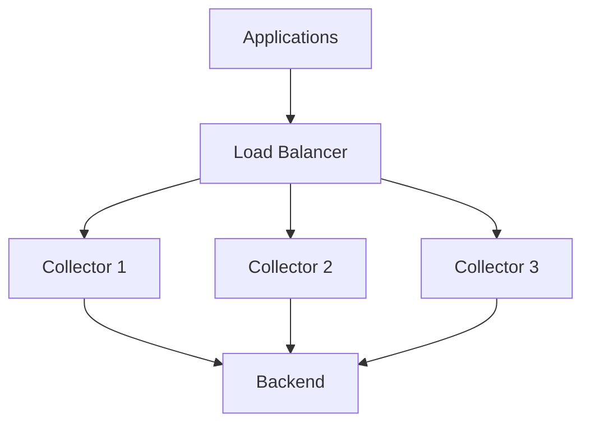

# How to Understand the OpenTelemetry Collector Pipeline Model (Receivers, Processors, Exporters)

Author: [nawazdhandala](https://www.github.com/nawazdhandala)

Tags: OpenTelemetry, Collector, Pipeline, Receivers, Processors, Exporters

Description: Learn how the OpenTelemetry Collector's pipeline architecture processes telemetry data through receivers, processors, and exporters.

The OpenTelemetry Collector sits between your instrumented applications and your observability backends, acting as a telemetry data processing engine. Understanding its pipeline model unlocks powerful capabilities: data transformation, routing, sampling, and vendor abstraction.

Most teams start by treating the Collector as a simple forwarder. Applications send telemetry to the Collector, which forwards it to a backend. This works, but it barely scratches the surface of what's possible. The pipeline model enables sophisticated data processing that solves real operational problems.

## The Pipeline Mental Model

Think of the Collector as an assembly line for telemetry data. Raw data enters through receivers, gets transformed by processors, and exits through exporters to one or more destinations.


Each component has a specific job. Receivers handle data ingestion. Processors transform, filter, or enrich data. Exporters send data to backends. You compose these components into pipelines that define how different signal types flow through the system.

A typical configuration creates separate pipelines for traces, metrics, and logs because each signal type often needs different processing.

```yaml
# Basic pipeline structure
service:
  pipelines:
    traces:
      receivers: [otlp]
      processors: [batch]
      exporters: [otlp/jaeger]
    metrics:
      receivers: [otlp, prometheus]
      processors: [batch]
      exporters: [prometheusremotewrite]
    logs:
      receivers: [otlp]
      processors: [batch]
      exporters: [loki]
```

This configuration defines three pipelines. The traces pipeline receives OTLP traces, batches them, and exports to Jaeger. The metrics pipeline receives from both OTLP and Prometheus, batches, and exports to Prometheus remote write. The logs pipeline receives OTLP logs, batches, and exports to Loki.

Data flows through these pipelines independently. A trace entering the traces pipeline never touches the metrics pipeline. This separation lets you optimize each signal type differently.

## Receivers: The Input Layer

Receivers are the entry points for telemetry data. They listen on network ports, scrape endpoints, or pull from queues. Each receiver implements a specific protocol or data format.

### OTLP Receiver

The OTLP receiver accepts the OpenTelemetry Protocol, the native format for OpenTelemetry data. It supports both gRPC and HTTP protocols.

```yaml
receivers:
  otlp:
    protocols:
      # gRPC endpoint for high-performance ingestion
      grpc:
        endpoint: 0.0.0.0:4317
        max_recv_msg_size_mib: 32
        keepalive:
          server_parameters:
            max_connection_idle: 11s
            max_connection_age: 12s

      # HTTP endpoint for compatibility
      http:
        endpoint: 0.0.0.0:4318
        cors:
          allowed_origins:
            - http://localhost:*
            - https://*.example.com
```

Applications instrumented with OpenTelemetry SDKs send data to these endpoints. The gRPC endpoint provides better performance for high-volume scenarios. The HTTP endpoint offers broader compatibility and easier debugging.

### Prometheus Receiver

The Prometheus receiver scrapes metrics from Prometheus-formatted endpoints, allowing you to collect metrics from applications not using OpenTelemetry.

```yaml
receivers:
  prometheus:
    config:
      scrape_configs:
        - job_name: 'api-servers'
          scrape_interval: 30s
          static_configs:
            - targets: ['api-1:8080', 'api-2:8080', 'api-3:8080']

        - job_name: 'kubernetes-pods'
          scrape_interval: 30s
          kubernetes_sd_configs:
            - role: pod
          relabel_configs:
            # Only scrape pods with prometheus.io/scrape annotation
            - source_labels: [__meta_kubernetes_pod_annotation_prometheus_io_scrape]
              action: keep
              regex: true
```

This configuration scrapes metrics from static API servers and automatically discovers Kubernetes pods with appropriate annotations.

### Filelog Receiver

The filelog receiver tails log files, useful for collecting logs from applications that write to disk rather than streaming logs over network protocols.

```yaml
receivers:
  filelog:
    include:
      - /var/log/app/*.log
    exclude:
      - /var/log/app/*.debug.log

    # Parse JSON-formatted logs
    operators:
      - type: json_parser
        parse_from: body

      # Extract timestamp
      - type: time_parser
        parse_from: attributes.timestamp
        layout: '%Y-%m-%d %H:%M:%S'

      # Extract severity
      - type: severity_parser
        parse_from: attributes.level
        mapping:
          error: [error, err, fatal]
          warn: [warning, warn]
          info: [info]
          debug: [debug, trace]
```

The filelog receiver can parse structured logs, extract timestamps, and map severity levels to standard values.

### Kafka Receiver

For event-driven architectures, the Kafka receiver consumes telemetry from Kafka topics.

```yaml
receivers:
  kafka:
    protocol_version: 2.0.0
    brokers:
      - kafka-1:9092
      - kafka-2:9092
      - kafka-3:9092
    topic: telemetry.traces
    encoding: otlp_proto
    group_id: otel-collector

    # Authentication for secure Kafka
    auth:
      sasl:
        username: otel-collector
        password: ${KAFKA_PASSWORD}
        mechanism: SCRAM-SHA-512
```

This pattern decouples telemetry production from collection. Applications produce to Kafka, and the Collector consumes at its own pace. This provides buffering during backend outages.

## Processors: The Transformation Layer

Processors modify, filter, or enrich telemetry data as it flows through pipelines. This is where you implement business logic for data handling.

### Batch Processor

The batch processor groups data before exporting, reducing network overhead and improving throughput. This is essential for production deployments.

```yaml
processors:
  batch:
    # Send batch when timeout reached OR size limit hit
    timeout: 10s
    send_batch_size: 1024
    send_batch_max_size: 2048
```

Without batching, the Collector exports each span, metric, or log individually. With batching, it accumulates data and sends larger, more efficient requests.

### Resource Processor

The resource processor adds, modifies, or removes resource attributes. This enriches telemetry with environmental context.

```yaml
processors:
  resource:
    attributes:
      - key: deployment.environment
        value: production
        action: insert

      - key: cloud.provider
        value: aws
        action: insert

      # Rename attribute
      - key: service.name
        from_attribute: app.name
        action: upsert

      # Remove PII
      - key: user.email
        action: delete
```

Resource attributes help correlate data and filter queries. Adding `deployment.environment` lets you separate production from staging data. Removing `user.email` prevents PII from reaching backends.

### Attributes Processor

While the resource processor modifies resource attributes, the attributes processor operates on span, metric, or log attributes.

```yaml
processors:
  attributes:
    actions:
      # Hash user IDs to preserve privacy
      - key: user.id
        action: hash

      # Extract region from availability zone
      - key: cloud.region
        from_attribute: cloud.availability_zone
        action: extract
        pattern: ^([a-z]+-[a-z]+-\d+)

      # Add custom business attributes
      - key: business.tier
        value: premium
        action: insert
```

This processor implements data hygiene, privacy protection, and business context enrichment.

### Filter Processor

The filter processor drops telemetry based on conditions. This controls data volume and costs.

```yaml
processors:
  filter:
    traces:
      span:
        - 'attributes["http.target"] == "/health"'
        - 'attributes["http.target"] == "/ready"'
        - 'attributes["http.route"] == "/metrics"'

    metrics:
      metric:
        # Drop high-cardinality metrics
        - 'name matches ".*\\.histogram\\.bucket"'

    logs:
      log_record:
        # Drop debug logs in production
        - 'severity_text == "DEBUG"'
        - 'body matches ".*cache hit.*"'
```

Health checks generate massive trace volumes but rarely provide value. Filtering them saves substantial backend costs. Similarly, dropping verbose debug logs in production reduces noise.

### Tail Sampling Processor

Basic sampling makes decisions per-span. Tail sampling examines entire traces before deciding whether to keep them, enabling smarter sampling strategies.

```yaml
processors:
  tail_sampling:
    # Decision wait time: collect full trace before sampling
    decision_wait: 10s

    # Number of traces to keep in memory
    num_traces: 50000

    # Sampling policies evaluated in order
    policies:
      # Always keep error traces
      - name: errors
        type: status_code
        status_code:
          status_codes: [ERROR]

      # Always keep slow traces
      - name: slow-traces
        type: latency
        latency:
          threshold_ms: 1000

      # Keep traces for specific endpoints
      - name: checkout-flow
        type: string_attribute
        string_attribute:
          key: http.route
          values:
            - /api/checkout
            - /api/payment

      # Sample 10% of everything else
      - name: probabilistic
        type: probabilistic
        probabilistic:
          sampling_percentage: 10
```

This configuration keeps all errors, all slow requests, all checkout-related traces, and 10% of normal traffic. You get complete visibility into problems while controlling volume for routine operations.

To learn more about when and why to use the OpenTelemetry Collector, check out our detailed guide on [What is OpenTelemetry Collector and Why Use One](https://oneuptime.com/blog/post/2025-09-18-what-is-opentelemetry-collector-and-why-use-one/view).

### Transform Processor

The transform processor uses the OpenTelemetry Transformation Language (OTTL) for complex data manipulation.

```yaml
processors:
  transform:
    trace_statements:
      # Redact sensitive data from URLs
      - context: span
        statements:
          - replace_pattern(attributes["http.url"], "token=[^&]*", "token=REDACTED")
          - replace_pattern(attributes["http.url"], "api_key=[^&]*", "api_key=REDACTED")

      # Normalize status codes into categories
      - context: span
        statements:
          - set(attributes["http.status_category"], "2xx") where attributes["http.status_code"] >= 200 and attributes["http.status_code"] < 300
          - set(attributes["http.status_category"], "4xx") where attributes["http.status_code"] >= 400 and attributes["http.status_code"] < 500
          - set(attributes["http.status_category"], "5xx") where attributes["http.status_code"] >= 500

    metric_statements:
      # Convert bytes to megabytes for readability
      - context: datapoint
        statements:
          - set(value, value / 1048576) where metric.name == "process.memory.bytes"
          - set(metric.name, "process.memory.megabytes") where metric.name == "process.memory.bytes"
```

OTTL provides programming-language-like capabilities for telemetry transformation without writing custom code.

## Exporters: The Output Layer

Exporters send processed telemetry to backends. You can configure multiple exporters to send data to different destinations.

### OTLP Exporter

The OTLP exporter sends data to any backend supporting the OpenTelemetry Protocol.

```yaml
exporters:
  otlp/backend1:
    endpoint: https://backend1.example.com:4317
    compression: gzip
    headers:
      api-key: ${BACKEND1_API_KEY}

    # Retry configuration for reliability
    retry_on_failure:
      enabled: true
      initial_interval: 5s
      max_interval: 30s
      max_elapsed_time: 300s

    # Queue for handling backpressure
    sending_queue:
      enabled: true
      num_consumers: 10
      queue_size: 5000
```

The retry and queue configuration ensures data delivery even during temporary backend unavailability.

### Prometheus Remote Write Exporter

For metrics, the Prometheus remote write exporter integrates with Prometheus-compatible backends.

```yaml
exporters:
  prometheusremotewrite:
    endpoint: https://prometheus.example.com/api/v1/write

    # Authentication
    headers:
      Authorization: Bearer ${PROMETHEUS_TOKEN}

    # Resource attributes become metric labels
    resource_to_telemetry_conversion:
      enabled: true

    # Control cardinality
    target_info:
      enabled: false
```

Setting `resource_to_telemetry_conversion` adds resource attributes as metric labels, enabling filtering and grouping by environment, region, or service.

### File Exporter

The file exporter writes telemetry to disk, useful for debugging or creating test fixtures.

```yaml
exporters:
  file:
    path: /var/log/otel/traces.json
    rotation:
      max_megabytes: 100
      max_days: 3
      max_backups: 3
```

### Load Balancing Exporter

The load balancing exporter distributes data across multiple backend instances, useful for high-volume scenarios.

```yaml
exporters:
  loadbalancing:
    protocol:
      otlp:
        timeout: 1s
    resolver:
      static:
        hostnames:
          - backend1.example.com:4317
          - backend2.example.com:4317
          - backend3.example.com:4317

    routing_key: "traceID"
```

Using `traceID` as the routing key ensures all spans from a trace go to the same backend instance, maintaining trace completeness.

## Building Real-World Pipelines

Understanding individual components is one thing. Composing them into pipelines that solve real problems requires thinking about data flow holistically.

### Multi-Backend Pipeline

Send traces to a specialized tracing backend while sending metrics to Prometheus.

```yaml
receivers:
  otlp:
    protocols:
      grpc:
      http:

processors:
  batch:
    timeout: 10s
    send_batch_size: 1024

  resource:
    attributes:
      - key: deployment.environment
        value: production
        action: insert

exporters:
  otlp/traces:
    endpoint: https://tracing-backend.example.com:4317
    headers:
      api-key: ${TRACES_API_KEY}

  prometheusremotewrite/metrics:
    endpoint: https://prometheus.example.com/api/v1/write

service:
  pipelines:
    traces:
      receivers: [otlp]
      processors: [resource, batch]
      exporters: [otlp/traces]

    metrics:
      receivers: [otlp]
      processors: [resource, batch]
      exporters: [prometheusremotewrite/metrics]
```

### Cost Optimization Pipeline

Implement aggressive sampling and filtering to reduce backend costs.

```yaml
receivers:
  otlp:
    protocols:
      grpc:

processors:
  # Filter health checks immediately
  filter/health:
    traces:
      span:
        - 'attributes["http.target"] == "/health"'
        - 'attributes["http.target"] == "/ready"'

  # Tail sampling for smart trace retention
  tail_sampling:
    decision_wait: 10s
    num_traces: 50000
    policies:
      - name: errors
        type: status_code
        status_code:
          status_codes: [ERROR]
      - name: slow
        type: latency
        latency:
          threshold_ms: 2000
      - name: sample-rest
        type: probabilistic
        probabilistic:
          sampling_percentage: 5

  # Batch for efficiency
  batch:
    timeout: 10s
    send_batch_size: 2048

exporters:
  otlp:
    endpoint: https://backend.example.com:4317

service:
  pipelines:
    traces:
      receivers: [otlp]
      processors: [filter/health, tail_sampling, batch]
      exporters: [otlp]
```

This pipeline filters worthless data, keeps important traces, samples routine traffic, and batches efficiently. A high-volume service might reduce telemetry volume by 90% while preserving visibility into actual problems.

### Privacy-Focused Pipeline

Implement PII removal and data anonymization before telemetry leaves your infrastructure.

```yaml
receivers:
  otlp:
    protocols:
      grpc:

processors:
  # Remove PII from resource attributes
  resource:
    attributes:
      - key: user.email
        action: delete
      - key: user.phone
        action: delete

  # Hash user IDs and redact sensitive URL params
  transform:
    trace_statements:
      - context: span
        statements:
          # Hash user identifiers
          - set(attributes["user.id"], SHA256(attributes["user.id"]))

          # Redact sensitive query params
          - replace_pattern(attributes["http.url"], "password=[^&]*", "password=REDACTED")
          - replace_pattern(attributes["http.url"], "token=[^&]*", "token=REDACTED")
          - replace_pattern(attributes["http.url"], "api_key=[^&]*", "api_key=REDACTED")

          # Redact credit card numbers
          - replace_pattern(attributes["http.request.body"], "\\d{4}-\\d{4}-\\d{4}-\\d{4}", "XXXX-XXXX-XXXX-XXXX")

  batch:

exporters:
  otlp:
    endpoint: https://backend.example.com:4317

service:
  pipelines:
    traces:
      receivers: [otlp]
      processors: [resource, transform, batch]
      exporters: [otlp]
```

This pipeline ensures PII never reaches your observability backend, addressing compliance requirements like GDPR.

### High-Availability Pipeline

Configure redundancy and failover for critical telemetry collection.

```yaml
receivers:
  otlp:
    protocols:
      grpc:

processors:
  batch:

exporters:
  # Primary backend
  otlp/primary:
    endpoint: https://primary.example.com:4317
    headers:
      api-key: ${PRIMARY_API_KEY}
    retry_on_failure:
      enabled: true
      initial_interval: 5s
      max_interval: 30s
      max_elapsed_time: 300s
    sending_queue:
      enabled: true
      queue_size: 10000

  # Fallback backend
  otlp/fallback:
    endpoint: https://fallback.example.com:4317
    headers:
      api-key: ${FALLBACK_API_KEY}

  # Local buffer as last resort
  file:
    path: /var/telemetry/buffer.json
    rotation:
      max_megabytes: 1000

service:
  pipelines:
    traces:
      receivers: [otlp]
      processors: [batch]
      # Multiple exporters run in parallel
      exporters: [otlp/primary, otlp/fallback, file]
```

This configuration sends to multiple backends simultaneously. If the primary fails, you still have data in the fallback. The file exporter provides a local backup.

## Performance and Scaling Considerations

The Collector's performance depends on configuration choices. Understanding these factors helps you optimize for your workload.

### Memory Management

Processors like tail sampling hold data in memory. The `num_traces` parameter controls memory usage.

```yaml
processors:
  tail_sampling:
    # Each trace uses roughly 10-50KB depending on span count
    # 50000 traces = ~500MB-2.5GB memory
    num_traces: 50000
    decision_wait: 10s
```

Monitor the Collector's memory usage and adjust `num_traces` based on your trace volume and available memory.

### Batching Strategy

Larger batches improve throughput but increase latency. Balance based on your requirements.

```yaml
processors:
  batch:
    # Low latency: smaller batches, shorter timeout
    timeout: 1s
    send_batch_size: 256

  batch/high_throughput:
    # High throughput: larger batches, longer timeout
    timeout: 10s
    send_batch_size: 2048
```

Use smaller batches for real-time alerting scenarios. Use larger batches for high-volume production workloads where throughput matters more than immediate delivery.

### Horizontal Scaling

For extreme scale, run multiple Collector instances behind a load balancer.



Each Collector instance processes independently. The load balancer distributes incoming telemetry across instances.

## Debugging Pipelines

When pipelines don't work as expected, systematic debugging helps identify issues.

### Enable Logging Exporter

Add a logging exporter to see what data flows through pipelines.

```yaml
exporters:
  logging:
    verbosity: detailed
    sampling_initial: 5
    sampling_thereafter: 200

service:
  pipelines:
    traces:
      receivers: [otlp]
      processors: [batch]
      exporters: [otlp/backend, logging]
```

The logging exporter prints sample data to stdout, letting you verify processors work correctly.

### Check Collector Metrics

The Collector exposes metrics about its own operation.

```yaml
service:
  telemetry:
    metrics:
      address: :8888
```

Query `http://localhost:8888/metrics` to see receiver data rates, processor throughput, exporter success rates, and error counts.

### Validate Configuration

Use the Collector's validate command before deploying configuration changes.

```bash
# Validate configuration syntax and component compatibility
otelcol validate --config=config.yaml
```

This catches configuration errors before they cause runtime failures.

## Pipeline Best Practices

Follow these patterns to build reliable, maintainable pipelines.

**Always batch**: The batch processor should be in every production pipeline. It dramatically improves performance.

**Filter early**: Place filter processors before expensive processors like tail sampling. Drop unwanted data as soon as possible.

**Separate signal types**: Use independent pipelines for traces, metrics, and logs. Each needs different processing.

**Use resource attributes**: Enrich telemetry with deployment environment, cloud region, and other context. This makes data queryable and correlatable.

**Implement retry and queuing**: Configure exporters with retry logic and sending queues to handle backend unavailability gracefully.

**Monitor the Collector**: Treat the Collector as critical infrastructure. Monitor its health, resource usage, and throughput.

**Version control configuration**: Store Collector configuration in git. Review changes through pull requests. Treat configuration as code.

## Moving Forward

The OpenTelemetry Collector's pipeline model provides incredible flexibility for telemetry data processing. By composing receivers, processors, and exporters, you can implement complex data flows that solve real operational challenges: cost optimization, privacy compliance, multi-backend routing, and intelligent sampling.

Start simple with basic pipelines: receive, batch, export. As your needs grow, add processors for filtering, enrichment, and sampling. The pipeline model scales from development environments to massive production deployments processing millions of spans per second.

Understanding these building blocks transforms the Collector from a mysterious black box into a powerful tool you can configure precisely for your requirements.
