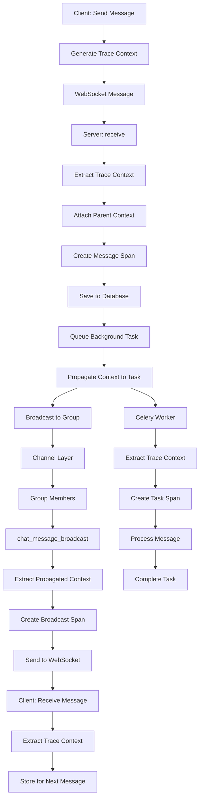

# How to Add OpenTelemetry Context Propagation to Django Channels WebSockets

Author: [nawazdhandala](https://www.github.com/nawazdhandala)

Tags: OpenTelemetry, Django Channels, WebSockets, Context Propagation, Python

Description: Master OpenTelemetry context propagation in Django Channels to trace WebSocket connections, track real-time message flows, and maintain distributed tracing across async operations.

Django Channels extends Django to handle WebSockets, background tasks, and other async protocols. Tracing these real-time, bidirectional connections requires special handling to maintain context across async operations and long-lived connections. OpenTelemetry's context propagation ensures that spans maintain parent-child relationships across WebSocket messages and async task boundaries.

## Understanding Context Propagation Challenges

WebSocket connections present unique tracing challenges:

- Long-lived connections span multiple operations over time
- Messages flow bidirectionally between client and server
- Async consumers run in different execution contexts
- Multiple concurrent connections share worker processes
- Background tasks may process messages asynchronously
- Connection state persists across many message exchanges

Without proper context propagation, traces become disconnected fragments instead of coherent request flows. OpenTelemetry's context API solves this by maintaining trace context across these boundaries.

## Setting Up Django Channels with OpenTelemetry

First, install the required packages:

```bash
pip install channels channels-redis
pip install opentelemetry-api opentelemetry-sdk opentelemetry-exporter-otlp
pip install opentelemetry-instrumentation-asgi
```

Configure Channels in your Django settings:

```python
# settings.py

INSTALLED_APPS = [
    'channels',
    # ... other apps
]

ASGI_APPLICATION = 'myproject.asgi.application'

CHANNEL_LAYERS = {
    'default': {
        'BACKEND': 'channels_redis.core.RedisChannelLayer',
        'CONFIG': {
            "hosts": [('127.0.0.1', 6379)],
        },
    },
}
```

Initialize OpenTelemetry in your ASGI application:

```python
# myproject/asgi.py

import os
from django.core.asgi import get_asgi_application
from channels.routing import ProtocolTypeRouter, URLRouter
from channels.auth import AuthMiddlewareStack

from opentelemetry import trace
from opentelemetry.sdk.trace import TracerProvider
from opentelemetry.sdk.trace.export import BatchSpanProcessor
from opentelemetry.exporter.otlp.proto.http.trace_exporter import OTLPSpanExporter
from opentelemetry.sdk.resources import Resource
from opentelemetry.instrumentation.asgi import OpenTelemetryMiddleware

os.environ.setdefault('DJANGO_SETTINGS_MODULE', 'myproject.settings')

# Initialize OpenTelemetry
resource = Resource.create({
    "service.name": "django-channels-app",
    "service.version": "1.0.0",
})

provider = TracerProvider(resource=resource)
processor = BatchSpanProcessor(
    OTLPSpanExporter(
        endpoint="https://oneuptime.com/otlp/v1/traces",
        headers={"x-oneuptime-service-token": "your-token"}
    )
)
provider.add_span_processor(processor)
trace.set_tracer_provider(provider)

# Get Django ASGI application
django_asgi_app = get_asgi_application()

# Import routing after Django setup
from myapp.routing import websocket_urlpatterns

# Create Channels application with OpenTelemetry middleware
application = ProtocolTypeRouter({
    "http": OpenTelemetryMiddleware(django_asgi_app),
    "websocket": OpenTelemetryMiddleware(
        AuthMiddlewareStack(
            URLRouter(websocket_urlpatterns)
        )
    ),
})
```

## Creating a Traced WebSocket Consumer

Build a base consumer class that automatically traces WebSocket operations:

```python
# myapp/consumers/base.py

from channels.generic.websocket import AsyncWebsocketConsumer
from opentelemetry import trace, context
from opentelemetry.trace import SpanKind, Status, StatusCode
from opentelemetry.trace.propagation.tracecontext import TraceContextTextMapPropagator
import json
import time

class TracedAsyncWebsocketConsumer(AsyncWebsocketConsumer):
    """WebSocket consumer with OpenTelemetry tracing."""

    tracer = trace.get_tracer(__name__)
    propagator = TraceContextTextMapPropagator()

    async def connect(self):
        """Trace WebSocket connection establishment."""
        with self.tracer.start_as_current_span(
            "websocket.connect",
            kind=SpanKind.SERVER
        ) as span:
            # Add connection attributes
            span.set_attribute("websocket.url", self.scope.get("path", ""))
            span.set_attribute("websocket.consumer", self.__class__.__name__)

            # Extract user information if available
            user = self.scope.get("user")
            if user and user.is_authenticated:
                span.set_attribute("user.id", str(user.id))
                span.set_attribute("user.username", user.username)

            # Add client information
            client = self.scope.get("client")
            if client:
                span.set_attribute("client.host", client[0])
                span.set_attribute("client.port", client[1])

            try:
                await self.accept()
                span.set_attribute("websocket.accepted", True)
                span.set_status(Status(StatusCode.OK))

                # Store trace context for this connection
                self.connection_context = context.get_current()

            except Exception as exc:
                span.record_exception(exc)
                span.set_attribute("websocket.accepted", False)
                span.set_status(Status(StatusCode.ERROR, str(exc)))
                raise

    async def disconnect(self, close_code):
        """Trace WebSocket disconnection."""
        # Restore connection context
        if hasattr(self, 'connection_context'):
            ctx = context.attach(self.connection_context)
        else:
            ctx = None

        try:
            with self.tracer.start_as_current_span(
                "websocket.disconnect",
                kind=SpanKind.SERVER
            ) as span:
                span.set_attribute("websocket.close_code", close_code)
                span.set_attribute("websocket.consumer", self.__class__.__name__)

                await self.handle_disconnect(close_code)

                span.set_status(Status(StatusCode.OK))
        finally:
            if ctx is not None:
                context.detach(ctx)

    async def receive(self, text_data=None, bytes_data=None):
        """Trace incoming WebSocket messages."""
        # Restore connection context
        if hasattr(self, 'connection_context'):
            ctx = context.attach(self.connection_context)
        else:
            ctx = None

        try:
            with self.tracer.start_as_current_span(
                "websocket.receive",
                kind=SpanKind.SERVER
            ) as span:
                span.set_attribute("websocket.consumer", self.__class__.__name__)

                # Determine message type
                if text_data:
                    span.set_attribute("websocket.message.type", "text")
                    span.set_attribute("websocket.message.size", len(text_data))

                    # Try to parse JSON and extract trace context
                    try:
                        message_data = json.loads(text_data)

                        # Extract message type/action
                        message_type = message_data.get("type", "unknown")
                        span.set_attribute("websocket.message.action", message_type)

                        # Extract propagated trace context from message
                        if "trace_context" in message_data:
                            carrier = message_data["trace_context"]
                            parent_context = self.propagator.extract(carrier=carrier)

                            # Attach parent context
                            token = context.attach(parent_context)
                            span.set_attribute("trace.propagated", True)

                        # Handle the message
                        start = time.time()
                        await self.handle_message(message_data)
                        duration = (time.time() - start) * 1000

                        span.set_attribute("websocket.handle_duration_ms", duration)

                    except json.JSONDecodeError:
                        span.set_attribute("websocket.message.format", "invalid_json")
                        span.add_event("Invalid JSON received")

                elif bytes_data:
                    span.set_attribute("websocket.message.type", "binary")
                    span.set_attribute("websocket.message.size", len(bytes_data))

                    await self.handle_binary_message(bytes_data)

                span.set_status(Status(StatusCode.OK))

        except Exception as exc:
            span.record_exception(exc)
            span.set_status(Status(StatusCode.ERROR, str(exc)))
            raise
        finally:
            if ctx is not None:
                context.detach(ctx)

    async def send_json_with_trace(self, data):
        """Send JSON message with trace context propagation."""
        # Get current trace context
        carrier = {}
        self.propagator.inject(carrier=carrier)

        # Add trace context to message
        data["trace_context"] = carrier

        # Create span for sending
        with self.tracer.start_as_current_span(
            "websocket.send",
            kind=SpanKind.CLIENT
        ) as span:
            span.set_attribute("websocket.message.type", data.get("type", "unknown"))
            span.set_attribute("trace.propagated", True)

            message_json = json.dumps(data)
            span.set_attribute("websocket.message.size", len(message_json))

            await self.send(text_data=message_json)

    async def handle_message(self, data):
        """Override this method to handle messages."""
        raise NotImplementedError("Subclasses must implement handle_message")

    async def handle_binary_message(self, data):
        """Override this method to handle binary messages."""
        pass

    async def handle_disconnect(self, close_code):
        """Override this method to handle disconnection cleanup."""
        pass
```

## Implementing a Chat Consumer with Tracing

Here's a practical example of a chat consumer that maintains trace context:

```python
# myapp/consumers/chat.py

from myapp.consumers.base import TracedAsyncWebsocketConsumer
from opentelemetry import trace
from channels.db import database_sync_to_async
import json

class ChatConsumer(TracedAsyncWebsocketConsumer):
    """Chat consumer with comprehensive tracing."""

    async def connect(self):
        """Join chat room on connection."""
        self.room_name = self.scope['url_route']['kwargs']['room_name']
        self.room_group_name = f'chat_{self.room_name}'

        span = trace.get_current_span()
        span.set_attribute("chat.room", self.room_name)

        # Join room group
        with self.tracer.start_as_current_span("chat.join_group") as join_span:
            await self.channel_layer.group_add(
                self.room_group_name,
                self.channel_name
            )
            join_span.set_attribute("chat.group", self.room_group_name)
            join_span.set_attribute("chat.channel", self.channel_name)

        await super().connect()

    async def handle_disconnect(self, close_code):
        """Leave chat room on disconnect."""
        with self.tracer.start_as_current_span("chat.leave_group") as span:
            await self.channel_layer.group_discard(
                self.room_group_name,
                self.channel_name
            )
            span.set_attribute("chat.group", self.room_group_name)

    async def handle_message(self, data):
        """Handle incoming chat messages."""
        message_type = data.get("type")

        if message_type == "chat_message":
            await self.handle_chat_message(data)
        elif message_type == "typing":
            await self.handle_typing_indicator(data)
        else:
            span = trace.get_current_span()
            span.add_event(f"Unknown message type: {message_type}")

    async def handle_chat_message(self, data):
        """Process and broadcast chat message."""
        with self.tracer.start_as_current_span("chat.process_message") as span:
            message = data.get("message", "")
            span.set_attribute("chat.message.length", len(message))

            # Save message to database
            with self.tracer.start_as_current_span("chat.save_message"):
                db_message = await self.save_message(
                    self.scope["user"],
                    self.room_name,
                    message
                )
                span.set_attribute("chat.message.id", str(db_message.id))

            # Broadcast to room group
            with self.tracer.start_as_current_span("chat.broadcast_message") as broadcast_span:
                broadcast_span.set_attribute("chat.group", self.room_group_name)

                await self.channel_layer.group_send(
                    self.room_group_name,
                    {
                        "type": "chat.message.broadcast",
                        "message": message,
                        "user": self.scope["user"].username,
                        "message_id": str(db_message.id),
                        # Propagate trace context
                        "trace_context": self.get_trace_context(),
                    }
                )

    async def chat_message_broadcast(self, event):
        """Receive message from room group and send to WebSocket."""
        # Extract trace context from event
        if "trace_context" in event:
            parent_context = self.propagator.extract(carrier=event["trace_context"])
            ctx = context.attach(parent_context)
        else:
            ctx = None

        try:
            with self.tracer.start_as_current_span(
                "chat.send_broadcast",
                kind=SpanKind.CONSUMER
            ) as span:
                span.set_attribute("chat.message.id", event.get("message_id"))
                span.set_attribute("chat.user", event.get("user"))

                # Send message to WebSocket
                await self.send_json_with_trace({
                    "type": "chat_message",
                    "message": event["message"],
                    "user": event["user"],
                    "timestamp": time.time(),
                })
        finally:
            if ctx is not None:
                context.detach(ctx)

    async def handle_typing_indicator(self, data):
        """Handle typing indicator."""
        with self.tracer.start_as_current_span("chat.typing_indicator") as span:
            is_typing = data.get("is_typing", False)
            span.set_attribute("chat.typing", is_typing)

            # Broadcast typing status (no need to save to DB)
            await self.channel_layer.group_send(
                self.room_group_name,
                {
                    "type": "chat.typing.broadcast",
                    "user": self.scope["user"].username,
                    "is_typing": is_typing,
                    "trace_context": self.get_trace_context(),
                }
            )

    async def chat_typing_broadcast(self, event):
        """Broadcast typing indicator."""
        # Propagate context
        if "trace_context" in event:
            parent_context = self.propagator.extract(carrier=event["trace_context"])
            context.attach(parent_context)

        await self.send_json_with_trace({
            "type": "typing",
            "user": event["user"],
            "is_typing": event["is_typing"],
        })

    @database_sync_to_async
    def save_message(self, user, room, message):
        """Save message to database (traced by Django ORM instrumentation)."""
        from myapp.models import ChatMessage
        return ChatMessage.objects.create(
            user=user,
            room=room,
            message=message
        )

    def get_trace_context(self):
        """Extract current trace context for propagation."""
        carrier = {}
        self.propagator.inject(carrier=carrier)
        return carrier
```

## Client-Side Trace Context Propagation

On the client side, propagate trace context in WebSocket messages:

```javascript
// static/js/chat.js

class TracedWebSocketClient {
    constructor(url) {
        this.url = url;
        this.socket = null;
        this.traceContext = null;
    }

    connect() {
        this.socket = new WebSocket(this.url);

        this.socket.onopen = (event) => {
            console.log('WebSocket connected');

            // In a real implementation, you'd get trace context from your
            // browser-side OpenTelemetry instrumentation
            this.traceContext = {
                traceparent: this.generateTraceParent(),
                tracestate: ''
            };
        };

        this.socket.onmessage = (event) => {
            const data = JSON.parse(event.data);

            // Extract trace context from incoming message
            if (data.trace_context) {
                this.traceContext = data.trace_context;
            }

            this.handleMessage(data);
        };
    }

    sendMessage(message) {
        const payload = {
            type: 'chat_message',
            message: message,
            // Propagate trace context
            trace_context: this.traceContext
        };

        this.socket.send(JSON.stringify(payload));
    }

    sendTypingIndicator(isTyping) {
        const payload = {
            type: 'typing',
            is_typing: isTyping,
            trace_context: this.traceContext
        };

        this.socket.send(JSON.stringify(payload));
    }

    generateTraceParent() {
        // Generate W3C traceparent header format
        // In production, use OpenTelemetry JS SDK
        const version = '00';
        const traceId = this.generateRandomHex(32);
        const spanId = this.generateRandomHex(16);
        const flags = '01';

        return `${version}-${traceId}-${spanId}-${flags}`;
    }

    generateRandomHex(length) {
        return Array.from({length}, () =>
            Math.floor(Math.random() * 16).toString(16)
        ).join('');
    }

    handleMessage(data) {
        // Handle incoming messages
        console.log('Received:', data);
    }
}

// Usage
const chat = new TracedWebSocketClient('ws://localhost:8000/ws/chat/room1/');
chat.connect();
```

## Background Task Integration

Trace background tasks triggered by WebSocket messages:

```python
# myapp/tasks.py

from celery import shared_task
from opentelemetry import trace
from opentelemetry.trace.propagation.tracecontext import TraceContextTextMapPropagator
import time

@shared_task
def process_message_async(message_id, trace_context=None):
    """Process message asynchronously with trace context."""
    tracer = trace.get_tracer(__name__)
    propagator = TraceContextTextMapPropagator()

    # Extract parent trace context
    if trace_context:
        parent_context = propagator.extract(carrier=trace_context)
        ctx = context.attach(parent_context)
    else:
        ctx = None

    try:
        with tracer.start_as_current_span(
            "chat.process_message_background",
            kind=trace.SpanKind.CONSUMER
        ) as span:
            span.set_attribute("message.id", str(message_id))
            span.set_attribute("task.name", "process_message_async")

            # Simulate processing
            time.sleep(1)

            # Do actual work (sentiment analysis, moderation, etc.)
            with tracer.start_as_current_span("chat.analyze_sentiment"):
                sentiment = analyze_message_sentiment(message_id)
                span.set_attribute("message.sentiment", sentiment)

            span.set_attribute("task.completed", True)

    finally:
        if ctx is not None:
            context.detach(ctx)


# Trigger from consumer
async def handle_chat_message(self, data):
    """Process chat message and trigger background task."""
    with self.tracer.start_as_current_span("chat.process_message") as span:
        # Save message
        db_message = await self.save_message(...)

        # Trigger background processing with trace context
        trace_context = self.get_trace_context()

        with self.tracer.start_as_current_span("chat.queue_background_task"):
            process_message_async.delay(
                message_id=str(db_message.id),
                trace_context=trace_context
            )
```

For Celery integration with OpenTelemetry, see our guide on [instrumenting Celery with OpenTelemetry](https://oneuptime.com/blog/post/2025-01-06-celery-opentelemetry-oneuptime/view).

## WebSocket Request Flow Visualization

Here's how trace context flows through a WebSocket interaction:



## Monitoring WebSocket Connection Health

Track WebSocket connection metrics:

```python
# myapp/consumers/metrics.py

from opentelemetry import metrics
import time

class MetricsWebSocketConsumer(TracedAsyncWebsocketConsumer):
    """Consumer with connection metrics."""

    def __init__(self, *args, **kwargs):
        super().__init__(*args, **kwargs)

        meter = metrics.get_meter(__name__)

        self.connection_counter = meter.create_counter(
            name="websocket.connections",
            description="Number of WebSocket connections",
            unit="1"
        )

        self.message_counter = meter.create_counter(
            name="websocket.messages",
            description="Number of WebSocket messages",
            unit="1"
        )

        self.connection_duration = meter.create_histogram(
            name="websocket.connection.duration",
            description="WebSocket connection duration",
            unit="s"
        )

        self.message_size = meter.create_histogram(
            name="websocket.message.size",
            description="WebSocket message size",
            unit="bytes"
        )

        self.connect_time = None

    async def connect(self):
        """Track connection establishment."""
        self.connect_time = time.time()

        attributes = {
            "consumer": self.__class__.__name__,
        }

        self.connection_counter.add(1, attributes)

        await super().connect()

    async def disconnect(self, close_code):
        """Track connection duration."""
        if self.connect_time:
            duration = time.time() - self.connect_time

            attributes = {
                "consumer": self.__class__.__name__,
                "close_code": close_code,
            }

            self.connection_duration.record(duration, attributes)

        await super().disconnect(close_code)

    async def receive(self, text_data=None, bytes_data=None):
        """Track message metrics."""
        attributes = {
            "consumer": self.__class__.__name__,
            "direction": "inbound",
        }

        if text_data:
            attributes["type"] = "text"
            self.message_size.record(len(text_data), attributes)
        elif bytes_data:
            attributes["type"] = "binary"
            self.message_size.record(len(bytes_data), attributes)

        self.message_counter.add(1, attributes)

        await super().receive(text_data, bytes_data)
```

## Testing WebSocket Tracing

Write tests to verify trace context propagation:

```python
# tests/test_websocket_tracing.py

from channels.testing import WebsocketCommunicator
from django.test import TestCase
from opentelemetry import trace
from opentelemetry.sdk.trace import TracerProvider
from opentelemetry.sdk.trace.export.in_memory_span_exporter import InMemorySpanExporter
from opentelemetry.sdk.trace.export import SimpleSpanProcessor
import json

class WebSocketTracingTestCase(TestCase):
    def setUp(self):
        # Set up in-memory span exporter
        self.exporter = InMemorySpanExporter()
        provider = TracerProvider()
        provider.add_span_processor(SimpleSpanProcessor(self.exporter))
        trace.set_tracer_provider(provider)

    async def test_websocket_trace_propagation(self):
        """Test that trace context propagates through WebSocket messages."""
        from myapp.consumers.chat import ChatConsumer

        communicator = WebsocketCommunicator(
            ChatConsumer.as_asgi(),
            "/ws/chat/test/"
        )

        # Connect
        connected, _ = await communicator.connect()
        self.assertTrue(connected)

        # Send message with trace context
        await communicator.send_json_to({
            "type": "chat_message",
            "message": "Hello, world!",
            "trace_context": {
                "traceparent": "00-0af7651916cd43dd8448eb211c80319c-b7ad6b7169203331-01"
            }
        })

        # Receive response
        response = await communicator.receive_json_from()

        # Verify trace context is present
        self.assertIn("trace_context", response)
        self.assertIn("traceparent", response["trace_context"])

        # Disconnect
        await communicator.disconnect()

        # Verify spans were created
        spans = self.exporter.get_finished_spans()
        self.assertGreater(len(spans), 0)

        # Verify span relationships
        span_names = [span.name for span in spans]
        self.assertIn("websocket.connect", span_names)
        self.assertIn("websocket.receive", span_names)
```

## Next Steps

With WebSocket tracing in place:

- Monitor real-time connection patterns and message flows
- Track message latency from send to broadcast
- Identify performance bottlenecks in async operations
- Debug distributed traces across WebSocket boundaries

For comprehensive Python observability, check out our guides on [structured logging with OpenTelemetry](https://oneuptime.com/blog/post/2025-01-06-python-structured-logging-opentelemetry/view) and [instrumenting Python applications](https://oneuptime.com/blog/post/2025-01-06-instrument-python-opentelemetry/view).

OpenTelemetry context propagation in Django Channels enables end-to-end tracing of real-time applications. By maintaining trace context across WebSocket connections, async operations, and background tasks, you gain complete visibility into how messages flow through your system.
