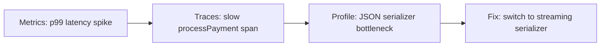
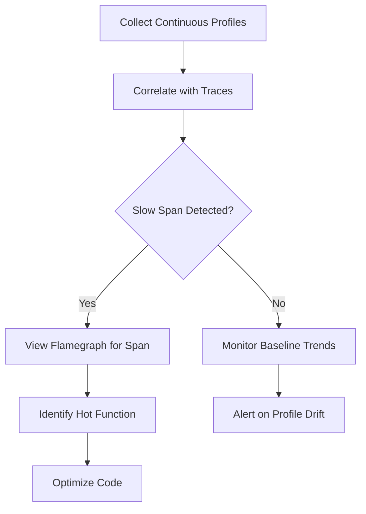

# How to Implement OpenTelemetry Profiling (Continuous Profiling Signal)

Author: [nawazdhandala](https://www.github.com/nawazdhandala)

Tags: OpenTelemetry, Profiling, Continuous Profiling, Observability, Performance, pprof

Description: Learn how to implement continuous profiling with OpenTelemetry to capture CPU, memory, and allocation profiles alongside your traces and metrics for deep performance insights.

---

> Continuous profiling is the newest signal in the OpenTelemetry ecosystem. While traces tell you where time is spent across services and metrics tell you what is happening at the aggregate level, profiles tell you exactly why your code is slow at the function level.

Traditional profiling has always been an ad-hoc activity. You notice something is slow, attach a profiler, reproduce the problem, and analyze the results. Continuous profiling flips this model on its head. Instead of profiling reactively, you collect lightweight profiles all the time and correlate them with the traces and metrics you already have.

OpenTelemetry's profiling signal brings this capability into the same unified framework you use for traces, metrics, and logs. This guide walks you through setting it up from scratch.

---

## Why Continuous Profiling Matters

Consider a scenario where your latency metrics show a p99 spike on your checkout service. Your traces confirm that the `processPayment` span is taking 3 seconds instead of the usual 200 milliseconds. But neither traces nor metrics tell you which function inside `processPayment` is responsible.

This is where profiling fills the gap. A CPU profile captured during that slow span reveals that 80% of the time was spent in a JSON serialization function that was allocating massive temporary buffers.



Without profiling, you would be guessing. With it, you get a direct path from symptom to root cause.

---

## Understanding the OpenTelemetry Profiling Data Model

OpenTelemetry profiling builds on the pprof format that many developers already know from Go and other languages. The key concepts are:

- **Profile**: A collection of stack trace samples taken over a period of time
- **Sample**: A single snapshot of the call stack at a point in time, with associated values like CPU time or memory allocation
- **Location**: A specific point in the code, identified by function name, file, and line number
- **Link**: A reference connecting a profile to a specific trace span

The profiling signal supports multiple profile types including CPU profiles, heap allocation profiles, mutex contention profiles, and goroutine profiles (in Go).

---

## Setting Up the OpenTelemetry Profiling SDK

Let's start with a Go application since Go has the most mature profiling support in OpenTelemetry. First, install the required packages:

```bash
# Install the OpenTelemetry profiling SDK and OTLP exporter
# These packages are still in alpha, so pin your versions carefully
go get go.opentelemetry.io/contrib/profiling@latest
go get go.opentelemetry.io/otel/exporters/otlp/otlpprofile/otlpprofilegrpc@latest
```

Now configure the profiling provider in your application's initialization code. This sets up a continuous CPU profiler that samples at 100Hz and exports profiles every 10 seconds:

```go
package main

import (
    "context"
    "log"
    "time"

    "go.opentelemetry.io/contrib/profiling"
    "go.opentelemetry.io/otel/exporters/otlp/otlpprofile/otlpprofilegrpc"
)

func initProfiling(ctx context.Context) (*profiling.Provider, error) {
    // Create an OTLP exporter that sends profiles to your backend
    // This uses the same endpoint as your traces and metrics
    exporter, err := otlpprofilegrpc.New(ctx,
        otlpprofilegrpc.WithEndpoint("otel-collector:4317"),
        otlpprofilegrpc.WithInsecure(),
    )
    if err != nil {
        return nil, err
    }

    // Configure the profiling provider with CPU and memory profiling enabled
    // SampleRate of 100 means 100 samples per second, which is a good balance
    // between overhead and granularity
    provider := profiling.NewProvider(
        profiling.WithExporter(exporter),
        profiling.WithCPUProfiling(true),
        profiling.WithMemoryProfiling(true),
        profiling.WithSampleRate(100),
        profiling.WithExportInterval(10 * time.Second),
    )

    return provider, nil
}
```

---

## Linking Profiles to Traces

The real power of continuous profiling comes from correlating profiles with distributed traces. When you can click on a slow span and immediately see the CPU profile for that exact time window, debugging becomes dramatically faster.

To enable this correlation, you need to ensure your profiling SDK knows about the current trace context. Here is how you link them together:

```go
func processOrder(ctx context.Context, order Order) error {
    // Start a new span for this operation
    // The profiling SDK automatically picks up the trace context
    ctx, span := tracer.Start(ctx, "processOrder")
    defer span.End()

    // Attach a profiling scope to this span
    // This tells the profiler to tag samples collected during this span
    // with the span's trace ID and span ID
    profCtx := profiling.WithSpanContext(ctx)

    // Your business logic runs normally
    // Any CPU or memory samples collected during this block
    // will be linked to the trace span above
    result, err := calculateTotals(profCtx, order)
    if err != nil {
        span.RecordError(err)
        return err
    }

    return chargePayment(profCtx, result)
}
```

When you view this in your observability backend, you will see the trace span annotated with profiling data. This means you can drill down from a slow span directly into the function-level breakdown.

---

## Configuring the OpenTelemetry Collector for Profiles

Your OpenTelemetry Collector needs to be configured to receive and export profiling data. Add the profiling pipeline to your collector configuration:

```yaml
# otel-collector-config.yaml
receivers:
  otlp:
    protocols:
      grpc:
        endpoint: 0.0.0.0:4317
      http:
        endpoint: 0.0.0.0:4318

processors:
  # Batch profiles to reduce export overhead
  # Max export batch size controls memory usage on the collector
  batch:
    timeout: 10s
    send_batch_size: 100

  # Add resource attributes to all profiles
  # This helps you filter profiles by environment or deployment
  resource:
    attributes:
      - key: deployment.environment
        value: production
        action: upsert

exporters:
  # Send profiles to your observability backend via OTLP
  otlp/profiles:
    endpoint: https://oneuptime.com/otlp
    headers:
      Authorization: "Bearer your-api-key"

service:
  pipelines:
    # Profile pipeline runs alongside your existing trace and metric pipelines
    profiles:
      receivers: [otlp]
      processors: [batch, resource]
      exporters: [otlp/profiles]
```

---

## Continuous Profiling in Python Applications

Python support for OpenTelemetry profiling uses the built-in `sys.setprofile` and sampling-based approaches. Here is how to set it up:

```python
from opentelemetry import trace
from opentelemetry.profiling import ContinuousProfiler, OTLPProfileExporter

# Create the profile exporter pointing to your collector
# The exporter batches profiles and sends them periodically
exporter = OTLPProfileExporter(
    endpoint="http://otel-collector:4317",
    insecure=True,
)

# Initialize the continuous profiler
# sample_rate=100 means we sample the call stack 100 times per second
# This adds roughly 1-2% CPU overhead, which is acceptable for production
profiler = ContinuousProfiler(
    exporter=exporter,
    sample_rate=100,
    profile_types=["cpu", "wall", "alloc"],
)

# Start profiling - this runs in a background thread
profiler.start()

# Your application code works normally
# The profiler samples the call stack in the background
# and correlates samples with active spans automatically
tracer = trace.get_tracer("my-service")

def handle_request(request):
    with tracer.start_as_current_span("handle_request") as span:
        # Profile data collected during this span
        # will be linked to it via trace context
        result = expensive_computation(request.data)
        return format_response(result)
```

---

## Managing Profiling Overhead in Production

Continuous profiling in production requires careful attention to overhead. The goal is to collect enough data to be useful without impacting your application's performance. Here are the key tuning parameters:

```go
// Production-safe profiling configuration
// These settings keep overhead under 2% CPU and 50MB memory
provider := profiling.NewProvider(
    profiling.WithExporter(exporter),
    profiling.WithCPUProfiling(true),
    profiling.WithMemoryProfiling(true),

    // Sample at 100Hz - the sweet spot for most applications
    // Lower values miss short-lived functions
    // Higher values increase CPU overhead linearly
    profiling.WithSampleRate(100),

    // Export every 30 seconds to reduce network overhead
    // Shorter intervals give faster feedback but more traffic
    profiling.WithExportInterval(30 * time.Second),

    // Limit the maximum profile size to prevent memory issues
    // This caps the number of unique stack traces per export
    profiling.WithMaxStackDepth(128),
    profiling.WithMaxSamplesPerExport(10000),
)
```

In practice, a sample rate of 100Hz adds roughly 1-2% CPU overhead in Go applications and 2-3% in Python. For most production workloads, this is well within acceptable bounds. If you are running extremely latency-sensitive services, consider dropping to 50Hz or even 19Hz (a prime number that avoids aliasing with periodic tasks).

---

## Analyzing Profile Data

Once profiles are flowing into your backend, you can analyze them in several ways. The most common visualization is a flamegraph, which shows the call stack hierarchy with function execution time represented by width.

Here is what to look for when analyzing continuous profiles:

1. **Wide bars at the top of the flamegraph** indicate functions that consume a lot of CPU time directly. These are your hotspots.

2. **Wide bars deep in the stack** suggest that a low-level function is being called too frequently. The fix is usually higher up in the call chain.

3. **Allocation profiles showing spikes** often reveal memory churn from temporary objects. Look for functions that allocate inside tight loops.

4. **Comparing profiles over time** lets you see if a recent deployment changed the CPU or memory profile of your service.



---

## Putting It All Together

Continuous profiling completes the observability picture. Metrics give you the what, traces give you the where, logs give you the context, and profiles give you the why. With OpenTelemetry unifying all four signals under a single framework, you can finally correlate across all of them seamlessly.

Start by enabling profiling in your most critical services first. Focus on CPU and allocation profiles initially, as these catch the majority of performance issues. Once you are comfortable with the overhead and workflow, expand to mutex and goroutine profiles for concurrency debugging.

The key insight is that continuous profiling is not about finding problems you already know about. It is about having the data ready when problems occur, so you can go from alert to root cause in minutes rather than hours.
