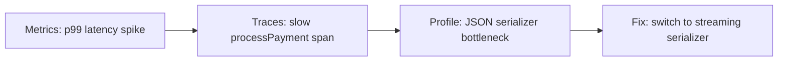
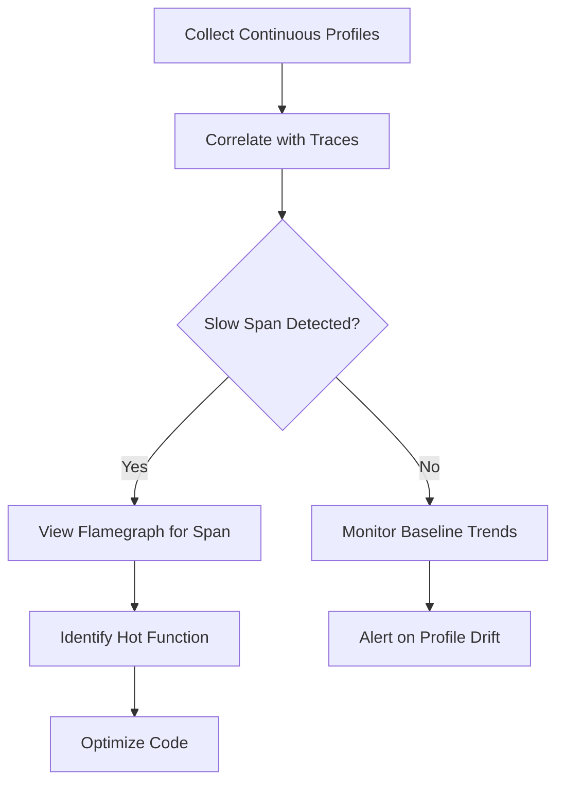

# How to Implement OpenTelemetry Profiling (Continuous Profiling Signal)

Author: [nawazdhandala](https://www.github.com/nawazdhandala)

Tags: OpenTelemetry, Profiling, Continuous Profiling, Observability, Performance, Pprof

Description: Learn how to implement continuous profiling with OpenTelemetry to capture CPU, memory, and allocation profiles alongside your traces and metrics for deep performance insights.

---

> Continuous profiling is the newest signal in the OpenTelemetry ecosystem. While traces tell you where time is spent across services and metrics tell you what is happening at the aggregate level, profiles tell you exactly why your code is slow at the function level.

Traditional profiling has always been an ad-hoc activity. You notice something is slow, attach a profiler, reproduce the problem, and analyze the results. Continuous profiling flips this model on its head. Instead of profiling reactively, you collect lightweight profiles all the time and correlate them with the traces and metrics you already have.

OpenTelemetry's profiling signal brings this capability into the same unified framework you use for traces, metrics, and logs. This guide walks you through setting it up from scratch.

---

## Why Continuous Profiling Matters

Consider a scenario where your latency metrics show a p99 spike on your checkout service. Your traces confirm that the `processPayment` span is taking 3 seconds instead of the usual 200 milliseconds. But neither traces nor metrics tell you which function inside `processPayment` is responsible.

This is where profiling fills the gap. A CPU profile captured during that slow span reveals that 80% of the time was spent in a JSON serialization function that was allocating massive temporary buffers.


```mermaid
graph LR
    A[Metrics: p99 latency spike] --> B[Traces: slow processPayment span]
    B --> C[Profile: JSON serializer bottleneck]
    C --> D[Fix: switch to streaming serializer]
```

Without profiling, you would be guessing. With it, you get a direct path from symptom to root cause.

---

## Understanding the OpenTelemetry Profiling Data Model

OpenTelemetry profiling builds on the pprof format that many developers already know from Go and other languages. The key concepts are:

- **Profile**: A collection of stack trace samples taken over a period of time
- **Sample**: A single snapshot of the call stack at a point in time, with associated values like CPU time or memory allocation
- **Location**: A specific point in the code, identified by function name, file, and line number
- **Trace correlation**: Sample attributes can carry a trace ID and span ID so profiles can be correlated with traces when the profiler and backend support it

The profiling signal supports multiple profile types including CPU profiles, heap allocation profiles, mutex contention profiles, and goroutine profiles (in Go).

---

## Setting Up Profile Collection for a Go Application

Let's start with a Go application since Go already exposes runtime profiles in the pprof format. As of the OpenTelemetry Profiles Alpha, there is not a stable Go profiling SDK package that you add with `go get`. The supported OpenTelemetry path is to collect pprof data with the OpenTelemetry Collector contrib `pprof` receiver or use the OpenTelemetry eBPF profiler on Linux.

First, expose the standard Go pprof endpoints in your application:

```go
package main

import (
    "log"
    "net/http"
    _ "net/http/pprof"
)

func main() {
    go func() {
        // Expose /debug/pprof/profile, /debug/pprof/heap, and related endpoints.
        log.Println(http.ListenAndServe("localhost:6060", nil))
    }()

    runApplication()
}
```

Now configure the Collector contrib `pprof` receiver to poll the CPU profile endpoint and export the result through an OpenTelemetry profiles pipeline:

```yaml
receivers:
  pprof:
    remote:
      endpoint: http://my-go-service:6060/debug/pprof/profile?seconds=10
      collection_interval: 30s

exporters:
  otlp/profiles:
    endpoint: profiles-backend.example.com:4317
    tls:
      insecure: true

service:
  pipelines:
    profiles:
      receivers: [pprof]
      exporters: [otlp/profiles]
```

Because profiles support is still Alpha in the Collector, run the Collector with the profiles feature gate enabled, for example `otelcol-contrib --feature-gates=+service.profilesSupport --config=otel-collector-config.yaml`.

---

## Linking Profiles to Traces

The real power of continuous profiling comes from correlating profiles with distributed traces. When you can click on a slow span and immediately see the CPU profile for that exact time window, debugging becomes dramatically faster.

The OpenTelemetry Profiles data model supports adding `trace_id` and `span_id` attributes to profile samples. Whether you get span-level correlation automatically depends on the profiler and language runtime. The pprof receiver example above captures process-level profiles from Go's pprof endpoints; it can still be correlated by service, instance, and time window, but it does not automatically tag every sample with the active span.

```go
func processOrder(ctx context.Context, order Order) error {
    // Start a new span for this operation
    ctx, span := tracer.Start(ctx, "processOrder")
    defer span.End()

    // Your business logic runs normally. Profiles collected for this process
    // can be compared with this span by service identity and timestamp.
    result, err := calculateTotals(ctx, order)
    if err != nil {
        span.RecordError(err)
        return err
    }

    return chargePayment(ctx, result)
}
```

When you view this in your observability backend, the exact workflow depends on backend support. Some systems let you drill from a slow span into profiles collected over the same time range and resource; span-level sample links require a profiler that records trace and span identifiers with samples.

---

## Configuring the OpenTelemetry Collector for Profiles

Your OpenTelemetry Collector needs to be configured to receive and export profiling data. Add the profiling pipeline to your collector configuration:

```yaml
# otel-collector-config.yaml
receivers:
  otlp:
    protocols:
      grpc:
        endpoint: 0.0.0.0:4317
      http:
        endpoint: 0.0.0.0:4318

processors:
  # Batch profiles to reduce export overhead
  # Max export batch size controls memory usage on the collector
  batch:
    timeout: 10s
    send_batch_size: 100

  # Add resource attributes to all profiles
  # This helps you filter profiles by environment or deployment
  resource:
    attributes:
      - key: deployment.environment
        value: production
        action: upsert

exporters:
  # Send profiles to your observability backend via OTLP
  otlphttp/profiles:
    endpoint: https://oneuptime.com/otlp
    headers:
      Authorization: "Bearer your-api-key"

service:
  pipelines:
    # Profile pipeline runs alongside your existing trace and metric pipelines
    profiles:
      receivers: [otlp]
      processors: [batch, resource]
      exporters: [otlphttp/profiles]
```

Profiles pipelines are currently Alpha in the Collector. Start the Collector with `--feature-gates=+service.profilesSupport` when using a build where profile pipelines are still gated.

---

## Continuous Profiling in Python Applications

The official OpenTelemetry Python API and SDK currently cover traces, metrics, and logs; there is not an official `opentelemetry.profiling` package with a `ContinuousProfiler` API. For Python services on Linux, the current OpenTelemetry-native option is the eBPF profiler, which profiles Python and other runtimes without modifying application code.

```yaml
receivers:
  profiling:

exporters:
  otlp/profiles:
    endpoint: profiles-backend.example.com:4317
    tls:
      insecure: true

service:
  pipelines:
    profiles:
      receivers: [profiling]
      exporters: [otlp/profiles]
```

The eBPF profiler is Linux-only and requires elevated privileges or Linux capabilities such as access to eBPF/perf events and `/proc`. Start the profiling Collector with the profiles feature gate enabled, for example `sudo ./otelcol-ebpf-profiler --feature-gates=+service.profilesSupport --config=otel-collector-config.yaml`.

---

## Managing Profiling Overhead in Production

Continuous profiling in production requires careful attention to overhead. The goal is to collect enough data to be useful without impacting your application's performance. Here are the key tuning parameters:

```yaml
receivers:
  pprof:
    remote:
      # Ask the Go runtime for a 10-second CPU profile.
      endpoint: http://my-go-service:6060/debug/pprof/profile?seconds=10

      # Poll every 30 seconds to balance freshness and overhead.
      collection_interval: 30s

processors:
  batch:
    timeout: 10s
    send_batch_size: 100
```

In practice, overhead depends heavily on the profiler, language runtime, workload, kernel, and sampling interval. The OpenTelemetry eBPF profiler project targets low overhead and documents 1% CPU and 250MB memory as upper limits in its testing, but you should measure this in your own environment. If you are running extremely latency-sensitive services, use longer collection intervals or shorter profile windows and validate the impact under production-like load.

---

## Analyzing Profile Data

Once profiles are flowing into your backend, you can analyze them in several ways. The most common visualization is a flamegraph, which shows the call stack hierarchy with function execution time represented by width.

Here is what to look for when analyzing continuous profiles:

1. **Wide bars at the top of the flamegraph** indicate functions that consume a lot of CPU time directly. These are your hotspots.

2. **Wide bars deep in the stack** suggest that a low-level function is being called too frequently. The fix is usually higher up in the call chain.

3. **Allocation profiles showing spikes** often reveal memory churn from temporary objects. Look for functions that allocate inside tight loops.

4. **Comparing profiles over time** lets you see if a recent deployment changed the CPU or memory profile of your service.


```mermaid
graph TD
    A[Collect Continuous Profiles] --> B[Correlate with Traces]
    B --> C{Slow Span Detected?}
    C -->|Yes| D[View Flamegraph for Span]
    D --> E[Identify Hot Function]
    E --> F[Optimize Code]
    C -->|No| G[Monitor Baseline Trends]
    G --> H[Alert on Profile Drift]
```

---

## Putting It All Together

Continuous profiling completes the observability picture. Metrics give you the what, traces give you the where, logs give you the context, and profiles give you the why. With OpenTelemetry unifying all four signals under a single framework, you can finally correlate across all of them seamlessly.

Start by enabling profiling in your most critical services first. Focus on CPU and allocation profiles initially, as these catch the majority of performance issues. Once you are comfortable with the overhead and workflow, expand to mutex and goroutine profiles for concurrency debugging.

The key insight is that continuous profiling is not about finding problems you already know about. It is about having the data ready when problems occur, so you can go from alert to root cause in minutes rather than hours.
