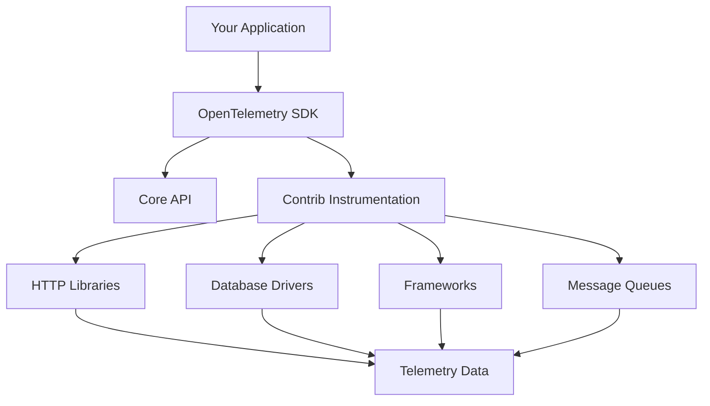

# How to Understand OpenTelemetry Contrib Packages and When to Use Them

Author: [nawazdhandala](https://www.github.com/nawazdhandala)

Tags: OpenTelemetry, Contrib, Packages, Instrumentation, Libraries

Description: A practical guide to understanding OpenTelemetry contrib packages, their purpose, and when to integrate them into your observability stack.

When you start working with OpenTelemetry, you'll quickly encounter two distinct repositories: the core specification and the contrib packages. The core provides the fundamental APIs and SDKs, while contrib packages offer pre-built instrumentation for popular libraries and frameworks. Understanding the distinction and knowing when to use contrib packages can save you weeks of custom instrumentation work.

## What Are OpenTelemetry Contrib Packages

Contrib packages are community-maintained instrumentation libraries that automatically capture telemetry data from third-party frameworks, databases, HTTP clients, and other common tools. Rather than manually instrumenting every database call or HTTP request, you can use a contrib package that hooks into the library and generates spans, metrics, and logs automatically.

The contrib repositories exist separately from the core because they evolve at different speeds. Core APIs follow a strict stability guarantee, while contrib packages need flexibility to adapt to breaking changes in the libraries they instrument. This separation allows the project to maintain a stable foundation while still supporting the fast-moving ecosystem of web frameworks, databases, and cloud services.



## Core vs Contrib: Understanding the Split

The core OpenTelemetry package provides the specification, API, and SDK. These components define how traces, metrics, and logs should be created, propagated, and exported. The core is intentionally minimal and focuses on providing stable interfaces.

Contrib packages build on top of this foundation. They provide automatic instrumentation for specific technologies. For example, if you're using Express.js in Node.js, the `@opentelemetry/instrumentation-express` package automatically creates spans for incoming HTTP requests and outgoing responses without requiring you to modify your route handlers.

The key difference comes down to maintenance and stability. Core packages are maintained by the OpenTelemetry organization with strict backward compatibility guarantees. Contrib packages are maintained by community members and may break when the underlying library changes. This trade-off gives you powerful automation while keeping the core stable.

## When to Use Contrib Packages

Use contrib packages when you're working with well-known libraries that have existing instrumentation. If you're using PostgreSQL with the `pg` driver in Node.js, the contrib package will automatically create spans for every query, including the SQL statement, connection details, and execution time.

Here's a practical example of instrumenting a Node.js application with Express and PostgreSQL using contrib packages:

```javascript
// Import the required OpenTelemetry packages
const { NodeSDK } = require('@opentelemetry/sdk-node');
const { getNodeAutoInstrumentations } = require('@opentelemetry/auto-instrumentations-node');
const { OTLPTraceExporter } = require('@opentelemetry/exporter-trace-otlp-http');

// Initialize the SDK with automatic instrumentations
const sdk = new NodeSDK({
  traceExporter: new OTLPTraceExporter({
    url: 'http://localhost:4318/v1/traces',
  }),
  instrumentations: [getNodeAutoInstrumentations()],
});

sdk.start();

// Your application code remains unchanged
const express = require('express');
const { Pool } = require('pg');

const app = express();
const pool = new Pool({
  host: 'localhost',
  database: 'myapp',
  user: 'postgres',
  password: 'password',
});

app.get('/users/:id', async (req, res) => {
  // This query is automatically instrumented
  const result = await pool.query('SELECT * FROM users WHERE id = $1', [req.params.id]);
  res.json(result.rows[0]);
});

app.listen(3000);
```

The beauty of this approach is that your application code doesn't change. The contrib packages monkey-patch the underlying libraries to inject instrumentation at runtime. Every HTTP request to your Express app generates a parent span, and the PostgreSQL query creates a child span with the SQL statement captured as an attribute.

## Navigating the Contrib Repository

Each language has its own contrib repository with different packages. The JavaScript contrib repository contains over 40 instrumentation packages covering frameworks like Express, Fastify, and Koa, databases like MongoDB and Redis, and clients like AWS SDK and gRPC.

To find the right package, start with the language-specific contrib repository on GitHub. For Node.js, that's `open-telemetry/opentelemetry-js-contrib`. The README lists all available instrumentation packages with links to their documentation.

Each instrumentation package has its own configuration options. Some packages are plug-and-play, while others require configuration to capture the right level of detail. For example, the HTTP instrumentation can be configured to ignore certain routes, sanitize headers, or capture request and response bodies.

```javascript
// Configure HTTP instrumentation with custom options
const { HttpInstrumentation } = require('@opentelemetry/instrumentation-http');

const httpInstrumentation = new HttpInstrumentation({
  // Ignore health check endpoints
  ignoreIncomingPaths: ['/health', '/ready'],

  // Sanitize sensitive headers
  headersToSpanAttributes: {
    requestHeaders: ['user-agent', 'accept'],
    responseHeaders: ['content-type'],
  },

  // Add custom attributes to spans
  requestHook: (span, request) => {
    span.setAttribute('http.request_id', request.headers['x-request-id']);
  },
});
```

## When to Write Custom Instrumentation

Contrib packages cover common libraries, but they can't cover everything. If you're using an internal framework, a proprietary database, or a niche library, you'll need to write custom instrumentation.

Custom instrumentation also makes sense when you want to capture business-level events that aren't tied to a specific library call. For example, tracking when a user completes an onboarding flow or when a payment is processed requires manual span creation.

Here's an example of custom instrumentation alongside contrib packages:

```javascript
const { trace } = require('@opentelemetry/api');

const tracer = trace.getTracer('payment-service');

async function processPayment(userId, amount) {
  // Create a custom span for the business operation
  const span = tracer.startSpan('process_payment');
  span.setAttribute('user.id', userId);
  span.setAttribute('payment.amount', amount);

  try {
    // These calls are automatically instrumented by contrib packages
    const user = await db.query('SELECT * FROM users WHERE id = $1', [userId]);
    const paymentResult = await stripeClient.charges.create({
      amount: amount * 100,
      currency: 'usd',
      customer: user.stripe_id,
    });

    span.setAttribute('payment.id', paymentResult.id);
    span.setStatus({ code: 1 }); // OK

    return paymentResult;
  } catch (error) {
    span.recordException(error);
    span.setStatus({ code: 2, message: error.message }); // ERROR
    throw error;
  } finally {
    span.end();
  }
}
```

This pattern combines automatic instrumentation for database and HTTP calls with manual spans for business logic. The result is a complete trace showing both technical and business-level operations.

## Version Compatibility and Maintenance

One challenge with contrib packages is keeping them compatible with the libraries they instrument. When Express releases a breaking change, the instrumentation package needs to be updated. This can create version conflicts where your application depends on Express 5.x, but the instrumentation package only supports 4.x.

Check the compatibility matrix in the package README before upgrading either your dependencies or the instrumentation packages. Most maintainers document which versions of the underlying library are supported.

If you encounter a compatibility issue, you have three options. First, pin your dependencies to known working versions until the instrumentation is updated. Second, contribute a fix to the contrib repository. Third, temporarily disable that specific instrumentation and rely on manual instrumentation or other contrib packages that provide overlapping coverage.

## Performance Considerations

Contrib packages add overhead to your application. Each instrumented operation creates spans, which consume memory and CPU. For high-throughput systems, this overhead can become measurable.

Most contrib packages are optimized to minimize overhead, but you should still measure the impact. Use sampling to reduce the volume of traces in production. A 1% or 5% sampling rate captures enough data to identify problems without overwhelming your tracing backend or degrading application performance.

```javascript
// Configure sampling to reduce overhead
const { TraceIdRatioBasedSampler } = require('@opentelemetry/sdk-trace-base');

const sdk = new NodeSDK({
  traceExporter: new OTLPTraceExporter({
    url: 'http://localhost:4318/v1/traces',
  }),
  instrumentations: [getNodeAutoInstrumentations()],
  // Sample 5% of traces
  sampler: new TraceIdRatioBasedSampler(0.05),
});
```

You can also disable specific instrumentations that create too much noise. If you're making thousands of Redis calls per second, the Redis instrumentation might create more spans than you need. Disable it and create manual spans only for cache operations that matter.

## Contrib Packages in Production

Running contrib packages in production requires careful testing. Start in development and staging environments to understand what data they capture and how much overhead they add. Monitor your application metrics before and after enabling instrumentation to catch performance regressions.

Enable instrumentation gradually. Start with HTTP and database instrumentation, which typically provides the most value. Add framework-specific and client library instrumentation once you've validated the initial setup.

Most production deployments use environment variables to configure instrumentation. This allows you to adjust sampling rates, enable or disable specific instrumentations, and change exporter endpoints without code changes.

```javascript
// Use environment variables for production configuration
const sdk = new NodeSDK({
  traceExporter: new OTLPTraceExporter({
    url: process.env.OTEL_EXPORTER_OTLP_ENDPOINT || 'http://localhost:4318/v1/traces',
  }),
  instrumentations: [getNodeAutoInstrumentations()],
  sampler: new TraceIdRatioBasedSampler(
    parseFloat(process.env.OTEL_TRACES_SAMPLER_ARG) || 1.0
  ),
});
```

## The Future of Contrib Packages

The contrib ecosystem continues to grow. New instrumentation packages are added regularly as the community identifies popular libraries. The project is also working on auto-instrumentation agents that can inject instrumentation without code changes, similar to Java agents.

As OpenTelemetry matures, expect better standardization across contrib packages. Efforts are underway to create consistent configuration patterns and improve version compatibility testing. The goal is to make contrib packages feel like a cohesive ecosystem rather than a collection of independent projects.

Understanding contrib packages and when to use them is fundamental to effective OpenTelemetry adoption. They provide powerful automation that can instrument your entire stack in minutes, but they require careful configuration and monitoring to use effectively in production. Start with the automatic instrumentations, measure their impact, and gradually expand your coverage as you understand what telemetry data provides the most value for your systems.

For more background on OpenTelemetry fundamentals, see our guide on [what is OpenTelemetry Collector and why use one](https://oneuptime.com/blog/post/2025-09-18-what-is-opentelemetry-collector-and-why-use-one/view).
