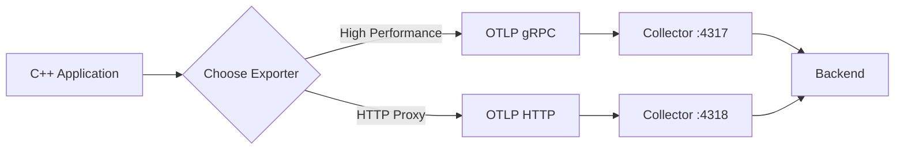

# How to Configure OpenTelemetry C++ with OTLP gRPC and HTTP Exporters

Author: [nawazdhandala](https://www.github.com/nawazdhandala)

Tags: OpenTelemetry, C++, OTLP, gRPC, HTTP, Exporters

Description: Learn how to configure and use OTLP gRPC and HTTP exporters in OpenTelemetry C++ applications to send telemetry data to backends like Jaeger, Tempo, and OneUptime.

The OpenTelemetry Protocol (OTLP) defines a standard way to transmit telemetry data between applications and observability backends. The C++ SDK supports both gRPC and HTTP transport mechanisms, each with different performance characteristics and deployment considerations.

## Understanding OTLP Exporters

OTLP exporters send traces, metrics, and logs from your application to a collector or backend. The gRPC exporter offers better performance and streaming capabilities, while the HTTP exporter provides broader compatibility and simpler firewall traversal.

Both exporters serialize data using Protobuf, ensuring efficient transmission. The choice between them often depends on your infrastructure and whether your backend supports both protocols.

## Setting Up OTLP gRPC Exporter

The gRPC exporter provides the best performance for high-volume telemetry data. Start by including the necessary headers:

```cpp
#include "opentelemetry/exporters/otlp/otlp_grpc_exporter_factory.h"
#include "opentelemetry/exporters/otlp/otlp_grpc_exporter_options.h"
#include "opentelemetry/sdk/trace/simple_processor_factory.h"
#include "opentelemetry/sdk/trace/tracer_provider_factory.h"
#include "opentelemetry/trace/provider.h"

namespace trace_api = opentelemetry::trace;
namespace trace_sdk = opentelemetry::sdk::trace;
namespace otlp = opentelemetry::exporter::otlp;
```

Create and configure the gRPC exporter:

```cpp
// Configure OTLP gRPC exporter options
otlp::OtlpGrpcExporterOptions grpc_options;

// Set the endpoint (default is localhost:4317)
grpc_options.endpoint = "otel-collector:4317";

// Disable TLS for local development
grpc_options.use_ssl_credentials = false;

// Set timeout for export operations (in milliseconds)
grpc_options.timeout = std::chrono::milliseconds(10000);

// Create the exporter
auto grpc_exporter = otlp::OtlpGrpcExporterFactory::Create(grpc_options);
```

## Configuring Secure gRPC Connections

For production environments, enable TLS encryption:

```cpp
// Configure gRPC exporter with TLS
otlp::OtlpGrpcExporterOptions secure_options;
secure_options.endpoint = "otel-collector.production.com:4317";
secure_options.use_ssl_credentials = true;

// Optionally provide custom SSL credentials
grpc::SslCredentialsOptions ssl_opts;
ssl_opts.pem_root_certs = ReadFile("/path/to/ca-cert.pem");
ssl_opts.pem_private_key = ReadFile("/path/to/client-key.pem");
ssl_opts.pem_cert_chain = ReadFile("/path/to/client-cert.pem");

secure_options.ssl_credentials = grpc::SslCredentials(ssl_opts);

auto secure_exporter = otlp::OtlpGrpcExporterFactory::Create(secure_options);
```

## Setting Up OTLP HTTP Exporter

The HTTP exporter works well when gRPC is not available or when you need to traverse HTTP proxies:

```cpp
#include "opentelemetry/exporters/otlp/otlp_http_exporter_factory.h"
#include "opentelemetry/exporters/otlp/otlp_http_exporter_options.h"

// Configure OTLP HTTP exporter options
otlp::OtlpHttpExporterOptions http_options;

// Set the endpoint (default is http://localhost:4318/v1/traces)
http_options.url = "http://otel-collector:4318/v1/traces";

// Set content type (json or binary protobuf)
http_options.content_type = otlp::HttpRequestContentType::kBinary;

// Configure timeout
http_options.timeout = std::chrono::milliseconds(10000);

// Set custom headers (for authentication, etc.)
http_options.http_headers = {
    {"Authorization", "Bearer your-api-token"},
    {"X-Custom-Header", "custom-value"}
};

// Create the exporter
auto http_exporter = otlp::OtlpHttpExporterFactory::Create(http_options);
```

## Initializing the Tracer Provider

Once you have an exporter, create a tracer provider:

```cpp
// Create a simple span processor with the exporter
auto processor = trace_sdk::SimpleSpanProcessorFactory::Create(
    std::move(grpc_exporter)
);

// Create tracer provider
auto provider = trace_sdk::TracerProviderFactory::Create(
    std::move(processor)
);

// Set as global tracer provider
trace_api::Provider::SetTracerProvider(provider);
```

## Using Batch Span Processor

For better performance, use a batch processor instead of a simple processor:

```cpp
#include "opentelemetry/sdk/trace/batch_span_processor_factory.h"
#include "opentelemetry/sdk/trace/batch_span_processor_options.h"

// Configure batch processor options
trace_sdk::BatchSpanProcessorOptions batch_options;
batch_options.max_queue_size = 2048;
batch_options.schedule_delay_millis = std::chrono::milliseconds(5000);
batch_options.max_export_batch_size = 512;

// Create batch processor with gRPC exporter
auto batch_processor = trace_sdk::BatchSpanProcessorFactory::Create(
    std::move(grpc_exporter),
    batch_options
);

auto provider = trace_sdk::TracerProviderFactory::Create(
    std::move(batch_processor)
);

trace_api::Provider::SetTracerProvider(provider);
```

The batch processor accumulates spans in memory and exports them in batches, reducing network overhead.

## Complete Configuration Example

Here's a full example that initializes OpenTelemetry with a gRPC exporter:

```cpp
#include <memory>
#include "opentelemetry/exporters/otlp/otlp_grpc_exporter_factory.h"
#include "opentelemetry/sdk/trace/batch_span_processor_factory.h"
#include "opentelemetry/sdk/trace/tracer_provider_factory.h"
#include "opentelemetry/sdk/resource/resource.h"
#include "opentelemetry/sdk/resource/semantic_conventions.h"
#include "opentelemetry/trace/provider.h"

namespace trace_api = opentelemetry::trace;
namespace trace_sdk = opentelemetry::sdk::trace;
namespace resource = opentelemetry::sdk::resource;
namespace otlp = opentelemetry::exporter::otlp;

void InitTracer() {
    // Create resource attributes
    auto resource_attributes = resource::ResourceAttributes{
        {resource::SemanticConventions::kServiceName, "my-cpp-service"},
        {resource::SemanticConventions::kServiceVersion, "1.0.0"},
        {resource::SemanticConventions::kDeploymentEnvironment, "production"}
    };
    auto resource = resource::Resource::Create(resource_attributes);

    // Configure OTLP gRPC exporter
    otlp::OtlpGrpcExporterOptions options;
    options.endpoint = "localhost:4317";
    options.use_ssl_credentials = false;
    auto exporter = otlp::OtlpGrpcExporterFactory::Create(options);

    // Configure batch processor
    trace_sdk::BatchSpanProcessorOptions batch_options;
    batch_options.max_queue_size = 2048;
    batch_options.schedule_delay_millis = std::chrono::milliseconds(5000);
    auto processor = trace_sdk::BatchSpanProcessorFactory::Create(
        std::move(exporter),
        batch_options
    );

    // Create and set tracer provider
    auto provider = trace_sdk::TracerProviderFactory::Create(
        std::move(processor),
        resource
    );
    trace_api::Provider::SetTracerProvider(provider);
}

int main() {
    InitTracer();

    // Your application code here
    auto tracer = trace_api::Provider::GetTracerProvider()->GetTracer(
        "my-instrumentation", "1.0.0"
    );

    auto span = tracer->StartSpan("main-operation");
    // Do work
    span->End();

    return 0;
}
```

## Switching Between Exporters

You can easily switch between gRPC and HTTP exporters based on configuration:

```cpp
#include <string>

std::unique_ptr<trace_sdk::SpanExporter> CreateExporter(
    const std::string& protocol,
    const std::string& endpoint
) {
    if (protocol == "grpc") {
        otlp::OtlpGrpcExporterOptions options;
        options.endpoint = endpoint;
        options.use_ssl_credentials = false;
        return otlp::OtlpGrpcExporterFactory::Create(options);
    } else if (protocol == "http") {
        otlp::OtlpHttpExporterOptions options;
        options.url = endpoint;
        options.content_type = otlp::HttpRequestContentType::kBinary;
        return otlp::OtlpHttpExporterFactory::Create(options);
    }
    throw std::runtime_error("Unknown protocol: " + protocol);
}

void InitTracer(const std::string& protocol, const std::string& endpoint) {
    auto exporter = CreateExporter(protocol, endpoint);
    auto processor = trace_sdk::BatchSpanProcessorFactory::Create(
        std::move(exporter)
    );
    auto provider = trace_sdk::TracerProviderFactory::Create(
        std::move(processor)
    );
    trace_api::Provider::SetTracerProvider(provider);
}
```

## Environment Variable Configuration

Read configuration from environment variables for easier deployment:

```cpp
#include <cstdlib>

std::string GetEnv(const char* name, const std::string& default_value) {
    const char* value = std::getenv(name);
    return value ? std::string(value) : default_value;
}

void InitTracerFromEnv() {
    std::string endpoint = GetEnv(
        "OTEL_EXPORTER_OTLP_ENDPOINT",
        "localhost:4317"
    );
    std::string protocol = GetEnv(
        "OTEL_EXPORTER_OTLP_PROTOCOL",
        "grpc"
    );

    auto exporter = CreateExporter(protocol, endpoint);
    auto processor = trace_sdk::BatchSpanProcessorFactory::Create(
        std::move(exporter)
    );
    auto provider = trace_sdk::TracerProviderFactory::Create(
        std::move(processor)
    );
    trace_api::Provider::SetTracerProvider(provider);
}
```

## Exporter Comparison



## Debugging Exporter Issues

Enable SDK logging to troubleshoot connection problems:

```cpp
#include "opentelemetry/sdk/common/global_log_handler.h"
#include <iostream>

class ConsoleLogHandler : public opentelemetry::sdk::common::internal_log::LogHandler {
public:
    void Handle(
        opentelemetry::sdk::common::internal_log::LogLevel level,
        const char* file,
        int line,
        const char* msg,
        const opentelemetry::sdk::common::AttributeMap& attributes
    ) noexcept override {
        std::cout << "[OTEL] " << file << ":" << line << " " << msg << std::endl;
    }
};

void EnableLogging() {
    opentelemetry::sdk::common::internal_log::GlobalLogHandler::SetLogLevel(
        opentelemetry::sdk::common::internal_log::LogLevel::Debug
    );
    opentelemetry::sdk::common::internal_log::GlobalLogHandler::SetLogHandler(
        std::make_shared<ConsoleLogHandler>()
    );
}
```

## CMake Configuration

Link the appropriate exporter libraries in your CMakeLists.txt:

```cmake
# For gRPC exporter
target_link_libraries(myapp
    PRIVATE
    opentelemetry-cpp::otlp_grpc_exporter
    opentelemetry-cpp::trace
)

# For HTTP exporter
target_link_libraries(myapp
    PRIVATE
    opentelemetry-cpp::otlp_http_exporter
    opentelemetry-cpp::trace
)

# For both exporters
target_link_libraries(myapp
    PRIVATE
    opentelemetry-cpp::otlp_grpc_exporter
    opentelemetry-cpp::otlp_http_exporter
    opentelemetry-cpp::trace
)
```

## Performance Considerations

The gRPC exporter typically offers better performance due to HTTP/2 multiplexing and binary encoding. However, the HTTP exporter can be more convenient in containerized environments where gRPC might face challenges with load balancers.

Batch processing is essential for production workloads. Set appropriate batch sizes based on your span generation rate to balance latency and throughput.

Configuring OTLP exporters correctly ensures your telemetry data reaches your observability backend reliably. Both gRPC and HTTP transports work well, so choose based on your infrastructure constraints and performance requirements.
