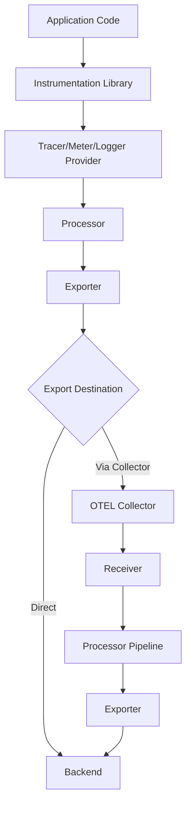
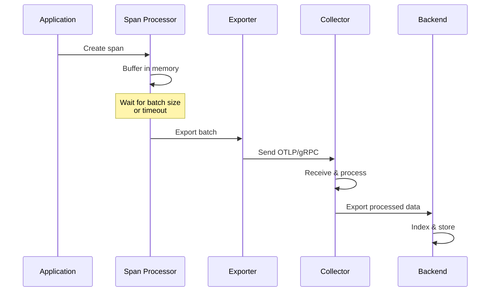

# How to Understand OpenTelemetry Data Flow from Application to Backend

Author: [nawazdhandala](https://www.github.com/nawazdhandala)

Tags: OpenTelemetry, Data Flow, Architecture, Pipeline, Exporter

Description: A comprehensive guide explaining how telemetry data travels from your application through OpenTelemetry components to your observability backend.

Understanding how data flows through OpenTelemetry is essential for debugging issues, optimizing performance, and making informed architectural decisions. This guide breaks down the entire journey of telemetry data from the moment it's generated in your application to when it arrives at your observability backend.

## The Complete Data Flow Pipeline

OpenTelemetry's architecture involves multiple stages that process, enrich, and route your telemetry data. Here's how it all fits together:



## Stage 1: Data Generation in Application

Everything starts in your application code where telemetry signals are created. Whether you're using manual instrumentation or auto-instrumentation, the process begins here.

```python
# Your application generates telemetry through the OpenTelemetry API
from opentelemetry import trace

tracer = trace.get_tracer(__name__)

def process_order(order_id):
    # Creating a span generates telemetry data at the source
    with tracer.start_as_current_span("process_order") as span:
        span.set_attribute("order.id", order_id)
        span.set_attribute("order.status", "processing")

        # Business logic here
        validate_order(order_id)
        charge_payment(order_id)

        span.add_event("order_processed")
```

When you create spans, record metrics, or emit logs, you're generating raw telemetry data. This data contains all the information you've added: attributes, events, timestamps, and contextual information like trace IDs and span IDs.

## Stage 2: Provider Layer

The provider layer is the first processing stage. Tracer providers, meter providers, and logger providers manage the lifecycle of telemetry data and apply initial processing.

```python
# Configuring the provider determines how data flows through the system
from opentelemetry.sdk.trace import TracerProvider
from opentelemetry.sdk.trace.export import BatchSpanProcessor
from opentelemetry.exporter.otlp.proto.grpc.trace_exporter import OTLPSpanExporter

# The provider orchestrates the entire flow
provider = TracerProvider(
    resource=Resource.create({
        "service.name": "order-service",
        "service.version": "1.2.0",
        "deployment.environment": "production"
    })
)

# Resource attributes get attached to every telemetry item
trace.set_tracer_provider(provider)
```

The provider layer attaches resource information to your telemetry. Resource attributes identify the source of the data - which service, which instance, which environment. This information travels with your data through every subsequent stage.

## Stage 3: Processor Layer

Processors sit between data generation and export. They transform, sample, filter, and batch your telemetry before it leaves the application.

```python
# BatchSpanProcessor collects spans and sends them in batches
batch_processor = BatchSpanProcessor(
    OTLPSpanExporter(endpoint="http://otel-collector:4317"),
    max_queue_size=2048,
    max_export_batch_size=512,
    schedule_delay_millis=5000
)

provider.add_span_processor(batch_processor)
```

The batch processor accumulates spans in memory until either the batch size limit is reached or the scheduled delay expires. This batching reduces network overhead significantly compared to sending each span individually.

Different processor types serve different purposes:

**SimpleSpanProcessor** sends each span immediately. Use this for debugging or when you need real-time data export, but be aware of the performance impact.

**BatchSpanProcessor** is the production standard. It balances latency with efficiency by batching multiple spans together.

**Sampling processors** make decisions about which traces to keep. They reduce data volume while maintaining statistical accuracy.

## Stage 4: Exporter Layer

Exporters handle the actual transmission of data from your application. They serialize telemetry data into the appropriate format and send it to the configured destination.

```go
// Exporters translate internal telemetry data into wire formats
import (
    "go.opentelemetry.io/otel/exporters/otlp/otlptrace/otlptracegrpc"
    "go.opentelemetry.io/otel/exporters/jaeger"
    "go.opentelemetry.io/otel/exporters/prometheus"
)

// OTLP exporter sends data using OpenTelemetry's native protocol
otlpExporter, err := otlptracegrpc.New(
    context.Background(),
    otlptracegrpc.WithEndpoint("otel-collector:4317"),
    otlptracegrpc.WithInsecure(),
)

// Or export directly to a specific backend
jaegerExporter, err := jaeger.New(
    jaeger.WithCollectorEndpoint(
        jaeger.WithEndpoint("http://jaeger:14268/api/traces"),
    ),
)
```

You have two primary export patterns:

**Direct export to backend**: Your application sends data straight to your observability platform. This is simpler to set up but couples your application to your backend choice.

**Export to OpenTelemetry Collector**: Your application sends data to a collector, which then routes it to backends. This provides flexibility and additional processing capabilities.

## Stage 5: OpenTelemetry Collector (Optional)

The collector is a vendor-agnostic agent that receives, processes, and exports telemetry data. Using a collector adds a processing layer between your application and backend.

```yaml
# The collector configuration defines the complete data flow
receivers:
  otlp:
    protocols:
      grpc:
        endpoint: 0.0.0.0:4317
      http:
        endpoint: 0.0.0.0:4318

# Processors transform data in transit
processors:
  batch:
    timeout: 10s
    send_batch_size: 1024

  # Add additional attributes to all telemetry
  attributes:
    actions:
      - key: environment
        value: production
        action: insert

  # Sample to reduce data volume
  probabilistic_sampler:
    sampling_percentage: 10

# Exporters send data to backends
exporters:
  otlp:
    endpoint: "https://observability-backend.com:4317"
    headers:
      api-key: "${API_KEY}"

  # Fan out to multiple backends
  jaeger:
    endpoint: "jaeger:14250"

# Pipelines tie everything together
service:
  pipelines:
    traces:
      receivers: [otlp]
      processors: [batch, attributes, probabilistic_sampler]
      exporters: [otlp, jaeger]
```

The collector receives data through its receivers, applies processing through its processor pipeline, and routes data through its exporters. This architecture allows you to:

- Centralize telemetry collection from multiple services
- Apply consistent processing rules across all data
- Route data to multiple backends simultaneously
- Buffer data during backend outages
- Reduce the load on individual applications

## Stage 6: Backend Reception and Storage

Finally, data arrives at your observability backend. The backend receives the exported data, indexes it, and stores it for querying and visualization.



## Data Flow Performance Characteristics

Understanding the performance implications of each stage helps you tune your system:

**In-application buffering**: The batch processor holds data in memory. Larger buffers reduce network calls but increase memory usage and potential data loss during crashes.

**Network transmission**: Data travels over the network at least once (app to collector or backend) and potentially twice (app to collector to backend). Network latency and bandwidth affect end-to-end latency.

**Collector processing**: Each processor in the collector pipeline adds latency. Complex processors like tail sampling require buffering entire traces before making decisions.

**Backend ingestion**: Your backend's ingestion capacity determines the maximum throughput. If you exceed this capacity, the collector will buffer data or drop it.

## Handling Failures in the Pipeline

The data flow pipeline includes multiple failure points. OpenTelemetry includes built-in resilience:

```python
# Configure retry behavior for transient failures
from opentelemetry.sdk.trace.export import BatchSpanProcessor

processor = BatchSpanProcessor(
    exporter,
    max_queue_size=2048,  # Queue size before dropping data
    max_export_batch_size=512,
    schedule_delay_millis=5000,
    export_timeout_millis=30000  # Timeout for export operations
)
```

When the exporter fails to send data:

1. The processor retries with exponential backoff
2. If retries fail, data accumulates in the buffer
3. If the buffer fills, new spans are dropped
4. The SDK logs warnings about dropped spans

The collector provides more sophisticated retry and buffering capabilities:

```yaml
exporters:
  otlp:
    endpoint: "https://backend.com:4317"
    retry_on_failure:
      enabled: true
      initial_interval: 5s
      max_interval: 30s
      max_elapsed_time: 300s
    sending_queue:
      enabled: true
      num_consumers: 10
      queue_size: 5000
```

## Monitoring the Data Flow

You should monitor the health of your data pipeline itself. OpenTelemetry components expose metrics about their operation:

- Spans received, processed, and dropped
- Exporter success and failure rates
- Queue sizes and processing latency
- Network errors and retry attempts

The collector exposes these metrics through its own telemetry:

```yaml
service:
  telemetry:
    metrics:
      level: detailed
      address: 0.0.0.0:8888
```

## Choosing Your Architecture

You need to decide whether to export directly from applications or use a collector:

**Direct export** works well when:
- You have few applications to instrument
- You're okay coupling applications to your backend
- You don't need centralized processing
- You want to minimize infrastructure complexity

**Collector-based export** shines when:
- You have many microservices
- You want backend flexibility
- You need centralized sampling or filtering
- You require data to flow to multiple backends
- You want to buffer data during outages

## Optimizing Data Flow

Several techniques can optimize your data pipeline:

**Adjust batch sizes**: Larger batches reduce network overhead but increase memory usage and latency. Start with defaults and tune based on your throughput.

**Use appropriate sampling**: Sample aggressively in high-throughput services but preserve important traces with head or tail sampling.

**Deploy collectors strategically**: Run collectors as sidecars, per-node agents, or centralized gateways depending on your infrastructure.

**Configure resource limits**: Set memory limits on collectors and span processors to prevent resource exhaustion.

The data flow from application to backend involves multiple stages, each with its own purpose and performance characteristics. Understanding this flow helps you debug issues, optimize performance, and design robust observability systems. The flexibility of OpenTelemetry's architecture allows you to adapt the pipeline to your specific needs while maintaining vendor neutrality.
