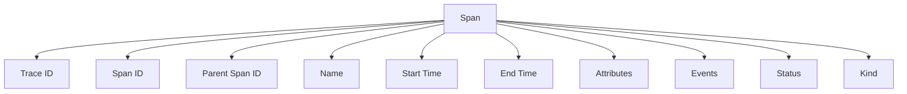
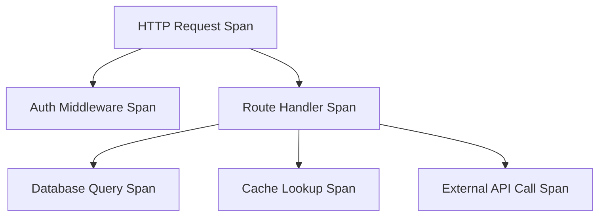

# How to Understand the OpenTelemetry Data Model for Beginners

Author: [nawazdhandala](https://www.github.com/nawazdhandala)

Tags: OpenTelemetry, Data Model, Beginners, Spans, Resources, Attributes

Description: A beginner-friendly breakdown of OpenTelemetry's core data model including spans, traces, resources, attributes, and how they fit together to create observability data.

The OpenTelemetry data model defines how telemetry is structured and transmitted. Understanding this model helps you instrument code correctly, debug export issues, and make sense of what you see in observability backends.

This guide breaks down the core concepts with examples. You'll learn what traces, spans, resources, and attributes are, how they relate, and why they're designed this way.

## The Foundation: Everything Has Context

OpenTelemetry's data model starts with a simple idea: telemetry needs context. A log line that says "Payment failed" is useless without knowing which service, which request, and which user.

The data model provides structured context through three layers:

1. **Resource**: What produced this telemetry (service, host, container)
2. **Scope**: Which library or component within the service
3. **Signal data**: The actual telemetry (span, metric, log)

This structure applies to all three signal types (traces, metrics, logs).

## Resources: The Identity Layer

A Resource describes the entity producing telemetry. Think of it as the ID card for your service.

### Common Resource Attributes

```javascript
const { Resource } = require('@opentelemetry/resources');
const { SemanticResourceAttributes } = require('@opentelemetry/semantic-conventions');

const resource = new Resource({
  [SemanticResourceAttributes.SERVICE_NAME]: 'payment-service',
  [SemanticResourceAttributes.SERVICE_VERSION]: '2.3.1',
  [SemanticResourceAttributes.SERVICE_NAMESPACE]: 'production',
  [SemanticResourceAttributes.SERVICE_INSTANCE_ID]: 'pod-abc123',
  [SemanticResourceAttributes.DEPLOYMENT_ENVIRONMENT]: 'production',
  [SemanticResourceAttributes.HOST_NAME]: 'worker-node-5',
  [SemanticResourceAttributes.CLOUD_PROVIDER]: 'aws',
  [SemanticResourceAttributes.CLOUD_REGION]: 'us-east-1',
  [SemanticResourceAttributes.CONTAINER_NAME]: 'payment-api',
});
```

Every span, metric, and log inherits these attributes. You don't repeat them on each piece of telemetry.

### Why Resources Matter

Resources let you filter and group telemetry:
- Show me all traces from `payment-service`
- Compare error rates between `production` and `staging`
- See latency by `cloud_region`

Without resources, you'd need to add these attributes to every span and log, wasting bandwidth and storage.

## Traces and Spans: The Request Story

A **trace** represents one request's journey through your system. A trace contains multiple **spans**.

A **span** is a unit of work with a start time, end time, and context about what happened.

### The Anatomy of a Span



Let's break down each component:

**Trace ID**: 16-byte identifier shared by all spans in a trace. This links spans together.

**Span ID**: 8-byte identifier unique to this span.

**Parent Span ID**: The Span ID of this span's parent. Null for root spans.

**Name**: Human-readable description of the operation (e.g., "GET /users/:id", "db.query", "payment.authorize").

**Start Time**: Nanosecond precision timestamp when the operation began.

**End Time**: Nanosecond precision timestamp when the operation completed.

**Attributes**: Key-value pairs describing the operation.

**Events**: Timestamped annotations marking significant moments.

**Status**: Success or error indicator with optional message.

**Kind**: The span's role (server, client, internal, producer, consumer).

### Creating a Span with Full Context

```javascript
const { trace, SpanStatusCode } = require('@opentelemetry/api');

const tracer = trace.getTracer('payment-service', '1.0.0');

async function processPayment(orderId, amount) {
  const span = tracer.startSpan('payment.process', {
    kind: trace.SpanKind.INTERNAL,
    attributes: {
      // Operation details
      'payment.order_id': orderId,
      'payment.amount': amount,
      'payment.currency': 'USD',

      // Business context
      'customer.tier': 'enterprise',
      'payment.method': 'credit_card',
    }
  });

  try {
    // Mark validation checkpoint
    span.addEvent('validation_started');
    await validatePaymentInfo();
    span.addEvent('validation_completed');

    // Mark authorization attempt
    span.addEvent('authorization_attempt', {
      'gateway': 'stripe',
      'attempt': 1
    });

    const result = await chargeCard(amount);

    // Record result details
    span.setAttribute('payment.transaction_id', result.transactionId);
    span.setAttribute('payment.gateway_latency_ms', result.latency);

    span.setStatus({ code: SpanStatusCode.OK });
    return result;

  } catch (error) {
    // Record error details
    span.addEvent('payment_failed', {
      'error.type': error.name,
      'error.message': error.message,
    });

    span.recordException(error);
    span.setStatus({
      code: SpanStatusCode.ERROR,
      message: error.message,
    });

    throw error;
  } finally {
    span.end();
  }
}
```

### Span Hierarchy: Parents and Children

Spans form a tree structure. When one operation calls another, the second span becomes a child of the first.



This hierarchy is established through Parent Span ID. Child spans record their parent's Span ID.

Here's how parent-child relationships form automatically with context propagation:

```javascript
const { context, trace } = require('@opentelemetry/api');

async function handleRequest(req, res) {
  // This span is automatically created by auto-instrumentation
  // It becomes the parent for any spans we create

  const user = await getUser(req.userId);
  const orders = await getOrders(user.id);

  res.json({ user, orders });
}

async function getUser(userId) {
  // This span will be a child of the HTTP request span
  const span = trace.getTracer('app').startSpan('user.get');
  span.setAttribute('user.id', userId);

  // Execute in the span's context
  return await context.with(trace.setSpan(context.active(), span), async () => {
    try {
      const user = await database.users.findById(userId);
      span.end();
      return user;
    } catch (error) {
      span.recordException(error);
      span.end();
      throw error;
    }
  });
}
```

The context API manages the parent-child relationship. When you start a span within an active context, it automatically becomes a child.

## Attributes: The Descriptive Layer

Attributes are key-value pairs that describe telemetry. They answer: what was the HTTP method, which database table, what customer tier, which region?

### Attribute Guidelines

**Use semantic conventions**: OpenTelemetry defines standard attribute names. Use them for consistency.

```javascript
// Good: standard attribute names
span.setAttribute('http.method', 'POST');
span.setAttribute('http.route', '/api/users');
span.setAttribute('http.status_code', 201);

// Bad: custom names that should use conventions
span.setAttribute('method', 'POST');
span.setAttribute('endpoint', '/api/users');
span.setAttribute('responseCode', 201);
```

**Keep cardinality bounded**: Avoid attributes with unlimited unique values.

```javascript
// Good: bounded values
span.setAttribute('payment.method', 'credit_card'); // limited options
span.setAttribute('customer.tier', 'enterprise'); // limited options
span.setAttribute('region', 'us-east-1'); // limited options

// Bad: unbounded values
span.setAttribute('user.id', 'usr_abc123xyz'); // millions of unique values
span.setAttribute('request.id', 'req_xyz789'); // unique per request
span.setAttribute('timestamp', Date.now()); // always unique
```

**Use appropriate types**: Attributes can be strings, numbers, booleans, or arrays.

```javascript
span.setAttributes({
  'http.method': 'GET',                    // string
  'http.status_code': 200,                 // number
  'cache.hit': true,                       // boolean
  'db.query_parameters': ['123', 'active'], // array
});
```

### Resource vs Span Attributes

**Resource attributes**: Describe the service itself. Same for all spans.
- `service.name`
- `service.version`
- `deployment.environment`

**Span attributes**: Describe this specific operation. Different per span.
- `http.method`
- `db.statement`
- `payment.amount`

Don't put service-level attributes on every span. That's what resources are for.

## Events: The Timeline Markers

Events mark significant moments during a span's lifetime. They have a name, timestamp, and optional attributes.

```javascript
const span = tracer.startSpan('order.process');

// Mark order validation
span.addEvent('order_validated', {
  'validation.duration_ms': 45,
  'validation.rule_count': 12,
});

// Mark inventory check
span.addEvent('inventory_checked', {
  'inventory.available': true,
  'inventory.location': 'warehouse-2',
});

// Mark payment authorization
span.addEvent('payment_authorized', {
  'payment.gateway': 'stripe',
  'payment.transaction_id': 'txn_abc123',
});

span.end();
```

Events are especially useful for retry logic, multi-stage processes, and recording decision points.

### Events vs Child Spans

Use **events** for lightweight markers that don't need duration tracking.

Use **child spans** for operations you want to measure and that might have their own children.

```javascript
// Event: quick checkpoint
span.addEvent('cache_miss');

// Child span: measured operation
const dbSpan = tracer.startSpan('db.query');
const result = await database.query(sql);
dbSpan.end();
```

## Status: Success or Failure

Every span has a status indicating whether the operation succeeded or failed.

```javascript
const { SpanStatusCode } = require('@opentelemetry/api');

// Success
span.setStatus({ code: SpanStatusCode.OK });

// Error
span.setStatus({
  code: SpanStatusCode.ERROR,
  message: 'Payment gateway timeout',
});

// Unset (default, means not determined)
// Don't set status explicitly for unset
```

Status is critical for filtering traces. Most observability tools let you query for "traces with errors" using this field.

### Recording Exceptions

When an exception occurs, use `recordException` to capture details:

```javascript
try {
  await riskyOperation();
} catch (error) {
  span.recordException(error);
  span.setStatus({
    code: SpanStatusCode.ERROR,
    message: error.message,
  });
  throw error;
}
```

`recordException` adds a span event with the exception type, message, and stack trace.

## Span Kind: The Role Indicator

Span kind indicates the span's role in the distributed trace. This helps tools visualize service dependencies correctly.

```javascript
const { SpanKind } = require('@opentelemetry/api');
```

**SERVER**: Span represents handling an incoming request.

```javascript
// Auto-instrumentation sets this for HTTP/gRPC servers
const span = tracer.startSpan('GET /users', {
  kind: SpanKind.SERVER,
});
```

**CLIENT**: Span represents making an outgoing request.

```javascript
const span = tracer.startSpan('http.request', {
  kind: SpanKind.CLIENT,
  attributes: {
    'http.url': 'https://api.partner.com/data',
    'http.method': 'GET',
  }
});
await fetch('https://api.partner.com/data');
span.end();
```

**INTERNAL**: Span represents internal application logic.

```javascript
const span = tracer.startSpan('payment.authorize', {
  kind: SpanKind.INTERNAL,
});
```

**PRODUCER**: Span represents sending a message to a queue.

```javascript
const span = tracer.startSpan('message.send', {
  kind: SpanKind.PRODUCER,
  attributes: {
    'messaging.system': 'rabbitmq',
    'messaging.destination': 'orders.queue',
  }
});
await queue.publish(message);
span.end();
```

**CONSUMER**: Span represents receiving a message from a queue.

```javascript
const span = tracer.startSpan('message.process', {
  kind: SpanKind.CONSUMER,
  attributes: {
    'messaging.system': 'rabbitmq',
    'messaging.source': 'orders.queue',
  }
});
processMessage(message);
span.end();
```

Span kind helps visualizations show request flow: client span in Service A connects to server span in Service B.

## Trace Context: The Linking Mechanism

When a request crosses service boundaries, trace context propagates via HTTP headers (or message metadata for queues).

### Context Propagation in Action

Service A makes a request:

```javascript
// Service A - automatically injects trace context
const response = await fetch('http://service-b/api/data', {
  headers: {
    'X-Custom-Header': 'value',
  }
});
```

OpenTelemetry automatically adds headers:
```
traceparent: 00-4bf92f3577b34da6a3ce929d0e0e4736-00f067aa0ba902b7-01
tracestate: vendor1=value1,vendor2=value2
```

Service B receives the request:

```javascript
// Service B - automatically extracts trace context
app.get('/api/data', (req, res) => {
  // This span is automatically linked to the parent trace
  const data = await getData();
  res.json(data);
});
```

The `traceparent` header contains:
- Version (`00`)
- Trace ID (`4bf92f3577b34da6a3ce929d0e0e4736`)
- Parent Span ID (`00f067aa0ba902b7`)
- Trace flags (`01`, indicating sampled)

Service B creates a span with the same Trace ID but a new Span ID, and sets Parent Span ID to the value from the header.

The result: one trace spanning both services.

## Sampling: Controlling Data Volume

Not all requests need tracing. Sampling decides which traces to keep.

### Sampling Decisions

**Head sampling**: Decision made when the trace starts (at the root span).

```javascript
const { ParentBasedSampler, TraceIdRatioBasedSampler } = require('@opentelemetry/sdk-trace-base');

const sdk = new NodeSDK({
  sampler: new ParentBasedSampler({
    root: new TraceIdRatioBasedSampler(0.1), // Sample 10% of traces
  }),
});
```

**Tail sampling**: Decision made after the trace completes, allowing you to keep interesting traces (errors, slow requests).

Tail sampling happens in the Collector:

```yaml
processors:
  tail_sampling:
    decision_wait: 10s
    policies:
      - name: errors
        type: status_code
        status_code: { status_codes: [ERROR] }
      - name: slow
        type: latency
        latency: { threshold_ms: 1000 }
      - name: normal
        type: probabilistic
        probabilistic: { sampling_percentage: 5 }
```

Keep all error traces, all slow traces, and 5% of normal traces.

### Sampling Propagation

The sampling decision propagates via trace context. If the root span is sampled, all child spans are sampled. If not sampled, child spans are not recorded.

This is indicated by the trace flags field in the `traceparent` header.

## Semantic Conventions: The Standard Vocabulary

OpenTelemetry defines semantic conventions: standard names for common attributes, span names, and metric names.

### HTTP Semantic Conventions

```javascript
// Span name
'HTTP GET'

// Required attributes
'http.method': 'GET'
'http.status_code': 200

// Recommended attributes
'http.url': 'https://api.example.com/users/123'
'http.target': '/users/123'
'http.host': 'api.example.com'
'http.scheme': 'https'
'http.user_agent': 'curl/7.64.1'
```

### Database Semantic Conventions

```javascript
// Span name
'SELECT users'

// Required attributes
'db.system': 'postgresql'
'db.statement': 'SELECT * FROM users WHERE id = $1'

// Recommended attributes
'db.name': 'app_db'
'db.user': 'app_readonly'
'db.connection_string': 'postgresql://localhost:5432'
'net.peer.name': 'db.example.com'
'net.peer.port': 5432
```

Using semantic conventions ensures your telemetry is compatible with dashboards, queries, and visualizations built by others.

## Putting It All Together: A Complete Example

Here's a trace through a payment flow with proper data model usage:

```javascript
const { trace, SpanStatusCode, SpanKind } = require('@opentelemetry/api');

const tracer = trace.getTracer('payment-service', '2.0.0');

async function createOrder(userId, items) {
  const span = tracer.startSpan('order.create', {
    kind: SpanKind.INTERNAL,
    attributes: {
      'user.id': userId,
      'order.item_count': items.length,
      'order.type': 'purchase',
    }
  });

  try {
    // Validate inventory
    span.addEvent('inventory_check_started');
    const inventory = await checkInventory(items);
    span.addEvent('inventory_check_completed', {
      'inventory.available': inventory.available,
    });

    if (!inventory.available) {
      span.setStatus({
        code: SpanStatusCode.ERROR,
        message: 'Insufficient inventory',
      });
      throw new Error('Insufficient inventory');
    }

    // Process payment
    const payment = await processPayment(userId, inventory.total);
    span.setAttribute('payment.transaction_id', payment.id);

    // Create order record
    const order = await saveOrder(userId, items, payment);
    span.setAttribute('order.id', order.id);

    span.setStatus({ code: SpanStatusCode.OK });
    return order;

  } catch (error) {
    span.recordException(error);
    span.setStatus({
      code: SpanStatusCode.ERROR,
      message: error.message,
    });
    throw error;
  } finally {
    span.end();
  }
}

async function checkInventory(items) {
  const span = tracer.startSpan('inventory.check', {
    kind: SpanKind.CLIENT,
    attributes: {
      'inventory.item_count': items.length,
    }
  });

  try {
    const response = await fetch('http://inventory-service/check', {
      method: 'POST',
      body: JSON.stringify(items),
    });

    span.setAttribute('http.status_code', response.status);
    const result = await response.json();
    span.end();
    return result;
  } catch (error) {
    span.recordException(error);
    span.end();
    throw error;
  }
}

async function processPayment(userId, amount) {
  const span = tracer.startSpan('payment.process', {
    kind: SpanKind.INTERNAL,
    attributes: {
      'payment.amount': amount,
      'payment.currency': 'USD',
    }
  });

  try {
    span.addEvent('payment_validation_started');
    await validatePaymentMethod(userId);

    span.addEvent('payment_authorization_started');
    const auth = await authorizePayment(userId, amount);

    span.addEvent('payment_capture_started');
    const result = await capturePayment(auth.id);

    span.setAttribute('payment.transaction_id', result.id);
    span.setAttribute('payment.gateway_response_time_ms', result.latency);

    span.setStatus({ code: SpanStatusCode.OK });
    return result;
  } catch (error) {
    span.addEvent('payment_failed', {
      'error.type': error.type,
      'error.code': error.code,
    });
    span.recordException(error);
    span.setStatus({
      code: SpanStatusCode.ERROR,
      message: error.message,
    });
    throw error;
  } finally {
    span.end();
  }
}
```

This example demonstrates:
- Proper span hierarchy (parent-child relationships)
- Appropriate span kinds (INTERNAL, CLIENT)
- Meaningful attributes with bounded cardinality
- Events marking significant moments
- Exception recording and status setting
- Semantic convention usage

## Data Model Serialization: OTLP

OpenTelemetry Protocol (OTLP) is the standard wire format for transmitting telemetry. It's defined using Protocol Buffers (protobuf).

When your SDK exports telemetry, it serializes the data model to OTLP format (usually JSON or protobuf binary).

A simplified OTLP trace looks like:

```json
{
  "resourceSpans": [{
    "resource": {
      "attributes": [
        { "key": "service.name", "value": { "stringValue": "payment-service" }},
        { "key": "service.version", "value": { "stringValue": "2.0.0" }}
      ]
    },
    "scopeSpans": [{
      "scope": {
        "name": "payment-tracer",
        "version": "1.0.0"
      },
      "spans": [{
        "traceId": "4bf92f3577b34da6a3ce929d0e0e4736",
        "spanId": "00f067aa0ba902b7",
        "name": "payment.process",
        "kind": 1,
        "startTimeUnixNano": "1612345678000000000",
        "endTimeUnixNano": "1612345678250000000",
        "attributes": [
          { "key": "payment.amount", "value": { "intValue": "9999" }},
          { "key": "payment.currency", "value": { "stringValue": "USD" }}
        ],
        "status": { "code": 1 }
      }]
    }]
  }]
}
```

Notice the three-level structure: Resource → Scope → Spans.

## Key Takeaways

The OpenTelemetry data model is hierarchical:
- **Resources** identify what produced the telemetry
- **Scopes** identify which library or component
- **Spans** represent individual operations

Spans contain:
- IDs linking them into traces
- Timestamps for duration measurement
- Attributes for description
- Events for timeline markers
- Status for success/failure indication
- Kind for role identification

Use semantic conventions for consistent attribute naming.

Keep attribute cardinality bounded to avoid storage and query issues.

Context propagation links spans across services into distributed traces.

Understanding the data model helps you instrument effectively and debug telemetry pipelines when things go wrong.

## Related Reading

- [How to Name Spans in OpenTelemetry](https://oneuptime.com/blog/post/2024-11-04-how-to-name-spans-in-opentelemetry/view)
- [How to Structure Logs Properly in OpenTelemetry](https://oneuptime.com/blog/post/2025-08-28-how-to-structure-logs-properly-in-opentelemetry/view)
- [Three Pillars of Observability: Logs, Metrics, Traces](https://oneuptime.com/blog/post/2025-08-20-three-pillars-of-observability-logs-metrics-traces/view)
