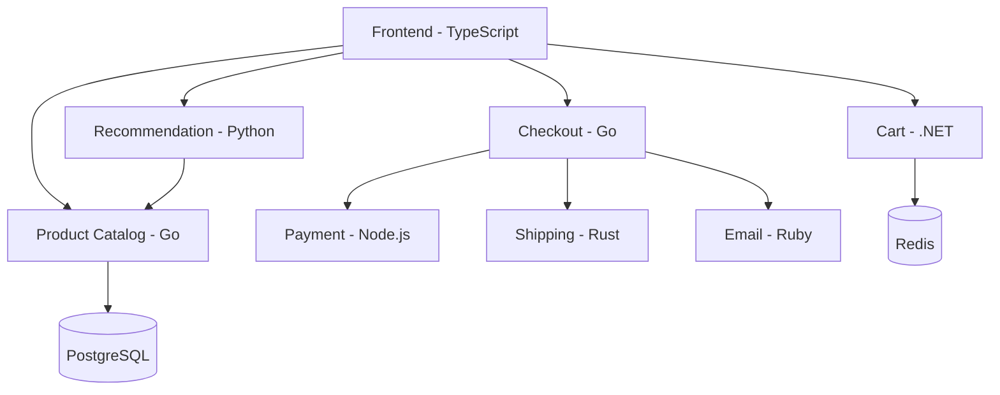

# How to Use the OpenTelemetry Demo App for Integration Testing

Author: [nawazdhandala](https://www.github.com/nawazdhandala)

Tags: OpenTelemetry, Demo App, Integration Testing, Microservices, Tracing, Testing

Description: Learn how to use the OpenTelemetry Demo application as a realistic testing environment for validating instrumentation and observability pipelines.

---

The OpenTelemetry Demo is an open-source microservices application designed to showcase OpenTelemetry in action. It includes over a dozen services written in different languages, a full Collector pipeline, and backend integrations. While it was built for demonstration purposes, it is also one of the best tools available for integration testing your OpenTelemetry setup. You can use it to validate custom instrumentation, test Collector configurations, verify context propagation across service boundaries, and stress-test your observability pipeline.

## What Is the OpenTelemetry Demo?

The demo application simulates an online astronomy shop with services for product catalog, checkout, payment, shipping, recommendations, and more. Each service is instrumented with OpenTelemetry using the idiomatic SDK for its language. The services communicate over gRPC and HTTP, producing distributed traces that span multiple services and languages.



This architecture gives you a realistic microservices environment with cross-language context propagation, async messaging, and database interactions.

## Getting the Demo Running

Clone the repository and start the demo with Docker Compose:

```bash
# Clone the OpenTelemetry Demo repository
git clone https://github.com/open-telemetry/opentelemetry-demo.git
cd opentelemetry-demo

# Start all services with Docker Compose
docker compose up -d

# Verify everything is running
docker compose ps
```

After a few minutes, you will have the following endpoints available:

```text
Frontend:           http://localhost:8080
Grafana:            http://localhost:8080/grafana
Jaeger:             http://localhost:8080/jaeger
Load Generator:     http://localhost:8080/loadgen
Feature Flags:      http://localhost:8080/feature
```

The demo includes a built-in load generator that creates continuous traffic, so traces start appearing immediately in the backends.

## Testing Custom Collector Configurations

One of the most practical uses of the demo is testing Collector configurations before deploying them. The demo uses a Collector that you can swap out with your own configuration.

First, locate the Collector config used by the demo:

```bash
# The default collector config is in the src directory
ls src/otelcollector/
```

Create a modified configuration to test. For example, if you want to test a tail-sampling configuration:

```yaml
# custom-collector-config.yaml
# Custom collector config to test with the demo app

receivers:
  otlp:
    protocols:
      grpc:
        endpoint: 0.0.0.0:4317
      http:
        endpoint: 0.0.0.0:4318

processors:
  batch:
    timeout: 5s

  # Test tail sampling with realistic traffic
  tail_sampling:
    decision_wait: 10s
    num_traces: 5000
    policies:
      # Keep all error traces
      - name: errors
        type: status_code
        status_code:
          status_codes: [ERROR]
      # Keep slow traces (over 1 second)
      - name: slow-traces
        type: latency
        latency:
          threshold_ms: 1000
      # Sample 20% of normal traces
      - name: normal-traffic
        type: probabilistic
        probabilistic:
          sampling_percentage: 20

exporters:
  otlp/jaeger:
    endpoint: jaeger:4317
    tls:
      insecure: true
  debug:
    verbosity: basic

service:
  pipelines:
    traces:
      receivers: [otlp]
      processors: [tail_sampling, batch]
      exporters: [otlp/jaeger, debug]
```

Mount your custom config into the demo's Collector container by modifying the Docker Compose override:

```yaml
# docker-compose.override.yaml
# Override the Collector configuration for testing

services:
  otel-col:
    volumes:
      - ./custom-collector-config.yaml:/etc/otelcol-contrib/config.yaml
```

Restart just the Collector to pick up the new configuration:

```bash
# Restart only the Collector with the new config
docker compose restart otel-col

# Watch the Collector logs for errors
docker compose logs -f otel-col
```

The load generator continues sending traffic through the demo services, giving your custom Collector configuration realistic data to process.

## Testing Context Propagation Across Languages

The demo's multi-language architecture makes it ideal for verifying that context propagation works across service boundaries. Open Jaeger and look for traces that span multiple services:

```bash
# Open Jaeger UI and search for checkout traces
# These traces cross Go, Node.js, Rust, and Ruby services
# URL: http://localhost:8080/jaeger
```

To programmatically verify context propagation, query the Jaeger API:

```python
# verify_context_propagation.py
# Verify that traces correctly span multiple services

import requests
import time


def get_multi_service_traces():
    """Fetch traces from Jaeger that involve multiple services."""
    # Query Jaeger for checkout service traces
    response = requests.get(
        "http://localhost:8080/jaeger/api/traces",
        params={
            "service": "checkoutservice",
            "limit": 10,
        },
    )
    return response.json().get("data", [])


def verify_trace_completeness(trace_data):
    """Check that a trace includes spans from expected services."""
    services_seen = set()

    for span in trace_data["spans"]:
        process_id = span["processID"]
        service_name = trace_data["processes"][process_id]["serviceName"]
        services_seen.add(service_name)

    # A complete checkout trace should include these services
    expected_services = {
        "checkoutservice",
        "paymentservice",
        "shippingservice",
        "emailservice",
    }

    missing = expected_services - services_seen
    if missing:
        print(f"WARNING: Missing services in trace: {missing}")
        return False

    print(f"Trace includes all expected services: {services_seen}")
    return True


# Wait for some traces to accumulate
time.sleep(30)

traces = get_multi_service_traces()
print(f"Found {len(traces)} checkout traces")

# Verify each trace includes all expected services
complete_count = sum(1 for t in traces if verify_trace_completeness(t))
print(f"{complete_count}/{len(traces)} traces are complete")
```

If context propagation is broken, you will see traces that stop at a service boundary instead of continuing through the full request chain.

## Testing Feature Flags and Error Scenarios

The demo includes a feature flag service that lets you inject failures and test error handling. This is extremely useful for testing how your observability pipeline handles error traces:

```bash
# Access the feature flag UI
# URL: http://localhost:8080/feature

# Available feature flags include:
# - productCatalogFailure: Makes product catalog return errors
# - recommendationCache: Enables caching in the recommendation service
# - adServiceManualGc: Triggers manual garbage collection
# - adServiceHighCpu: Simulates high CPU usage
```

You can also toggle feature flags programmatically:

```bash
# Enable the product catalog failure flag via the API
# This causes random failures in the catalog service
curl -X PUT http://localhost:8080/feature/productCatalogFailure \
  -H "Content-Type: application/json" \
  -d '{"enabled": true}'
```

After enabling a failure flag, check Jaeger for error traces. This validates that your error detection, sampling rules, and alerting would catch real failures.

## Integration Testing Your Instrumentation

If you are developing custom instrumentation, you can add your instrumented service to the demo to test it alongside real microservices:

```yaml
# docker-compose.override.yaml
# Add your custom service to the demo for integration testing

services:
  my-custom-service:
    build:
      context: ../my-service
      dockerfile: Dockerfile
    environment:
      # Point your service at the demo's Collector
      - OTEL_EXPORTER_OTLP_ENDPOINT=http://otel-col:4317
      - OTEL_SERVICE_NAME=my-custom-service
      - OTEL_RESOURCE_ATTRIBUTES=service.version=1.0.0
    depends_on:
      - otel-col
    ports:
      - "8090:8090"
```

Wire your service into the demo's traffic flow by modifying the load generator or calling your service from one of the existing services. This gives you a true integration test where your instrumentation runs alongside production-quality OpenTelemetry implementations.

## Load Testing Your Pipeline

The demo's built-in load generator uses Locust. You can adjust the load to stress-test your Collector configuration:

```python
# custom-locustfile.py
# Custom load test that exercises specific endpoints

from locust import HttpUser, task, between


class DemoAppUser(HttpUser):
    # Wait between 1 and 5 seconds between tasks
    wait_time = between(1, 5)
    host = "http://localhost:8080"

    @task(5)
    def browse_products(self):
        """Simulate browsing the product catalog."""
        self.client.get("/api/products")

    @task(3)
    def view_product(self):
        """View a specific product detail page."""
        self.client.get("/api/products/OLJCESPC7Z")

    @task(1)
    def checkout(self):
        """Complete a checkout flow, generating a complex trace."""
        # Add item to cart
        self.client.post("/api/cart", json={
            "userId": "test-user",
            "item": {
                "productId": "OLJCESPC7Z",
                "quantity": 1,
            },
        })
        # Perform checkout
        self.client.post("/api/checkout", json={
            "userId": "test-user",
            "email": "test@example.com",
            "address": {
                "streetAddress": "123 Test St",
                "city": "TestCity",
                "state": "TS",
                "country": "US",
                "zipCode": "12345",
            },
            "creditCard": {
                "creditCardNumber": "4111111111111111",
                "creditCardCvv": 123,
                "creditCardExpirationYear": 2030,
                "creditCardExpirationMonth": 12,
            },
        })
```

Run this load test against the demo to generate high-volume, realistic traffic:

```bash
# Run Locust with the custom load test
locust -f custom-locustfile.py --headless -u 50 -r 10 --run-time 5m
```

While the load test runs, monitor the Collector's metrics to verify it handles the volume without dropping data:

```bash
# Check Collector metrics for dropped spans
curl -s http://localhost:8888/metrics | grep otelcol_processor_dropped
```

## Validating End-to-End Observability

The ultimate integration test verifies that your complete observability pipeline works from application through Collector to backend:

```python
# e2e_observability_test.py
# End-to-end test that verifies the full telemetry pipeline

import requests
import time


def test_traces_reach_jaeger():
    """Verify traces from the demo appear in Jaeger."""
    response = requests.get(
        "http://localhost:8080/jaeger/api/services"
    )
    services = response.json().get("data", [])

    expected = ["frontend", "checkoutservice", "paymentservice"]
    for svc in expected:
        assert svc in services, f"Service {svc} not found in Jaeger"
    print("All expected services found in Jaeger")


def test_traces_have_correct_structure():
    """Verify traces have proper parent-child relationships."""
    response = requests.get(
        "http://localhost:8080/jaeger/api/traces",
        params={"service": "frontend", "limit": 5},
    )
    traces = response.json().get("data", [])
    assert len(traces) > 0, "No traces found"

    for trace_data in traces:
        spans = trace_data["spans"]
        # At least one span should have no parent (root span)
        root_spans = [s for s in spans if len(s.get("references", [])) == 0]
        assert len(root_spans) >= 1, "No root span found in trace"
    print("All traces have proper structure")


# Run the validation
test_traces_reach_jaeger()
test_traces_have_correct_structure()
print("End-to-end observability validation passed!")
```

## Wrapping Up

The OpenTelemetry Demo application provides a realistic, multi-language microservices environment that is perfect for integration testing. Whether you are validating Collector configurations, testing context propagation across service boundaries, stress-testing your pipeline under load, or developing custom instrumentation, the demo gives you a production-like environment without the production risks. Combined with its built-in load generator and feature flags, it is one of the most practical tools in the OpenTelemetry ecosystem for testing observability before it matters most.
