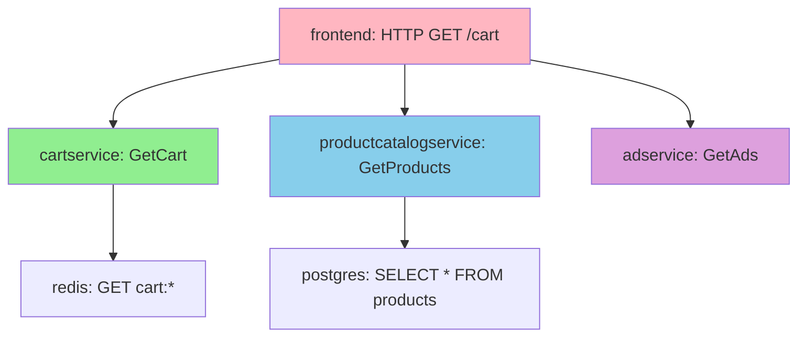

# How to Use the OpenTelemetry Demo Application for Learning

Author: [nawazdhandala](https://www.github.com/nawazdhandala)

Tags: OpenTelemetry, Demo, Learning, Tutorial, Microservices, Docker

Description: A comprehensive guide to using the OpenTelemetry Demo Application as a hands-on learning environment for understanding observability concepts and implementation patterns.

The OpenTelemetry Demo Application is the best way to learn OpenTelemetry without building a complex system from scratch. It's a fully functional e-commerce application with intentional bugs, performance issues, and realistic complexity.

I've used the demo to train teams on OpenTelemetry, and it consistently delivers insights that reading documentation can't provide. You see real traces, experience actual debugging workflows, and understand how everything fits together.

## What the Demo Application Provides

The demo simulates a microservices architecture for an online store called "Astronomy Shop". It includes 11 services written in different languages: Go, Python, Node.js, Java, .NET, PHP, and Ruby.

Each service demonstrates OpenTelemetry instrumentation for that language. You see auto-instrumentation and manual instrumentation side by side. The polyglot nature shows how OpenTelemetry creates unified observability across language boundaries.

The application includes realistic interactions:

- Frontend service serving the web UI
- Product catalog service with database queries
- Shopping cart service with Redis caching
- Checkout service orchestrating order processing
- Payment service simulating external API calls
- Shipping service with queue-based processing
- Email service for notifications
- Ad service for product recommendations
- Feature flag service for A/B testing
- Load generator creating realistic traffic

The demo deploys with the OpenTelemetry Collector, Jaeger for traces, Prometheus for metrics, and Grafana for visualization. Everything runs in Docker Compose or Kubernetes, giving you a complete observability stack in minutes.

## Setting Up the Demo

Prerequisites are minimal: Docker, Docker Compose, and 4GB of available RAM. The demo handles everything else.

Clone the repository and start the demo:

```bash
# Clone the OpenTelemetry demo repository
git clone https://github.com/open-telemetry/opentelemetry-demo.git
cd opentelemetry-demo

# Start the demo with Docker Compose
docker compose up -d

# Wait for all services to be healthy (takes 2-3 minutes)
docker compose ps
```

Once running, access the components:

- Web Store: http://localhost:8080
- Jaeger UI: http://localhost:16686
- Grafana: http://localhost:3000
- Prometheus: http://localhost:9090
- Feature Flags UI: http://localhost:8081

The load generator automatically creates traffic, so you'll immediately see traces and metrics flowing.

For Kubernetes deployment:

```bash
# Install using Helm
helm repo add open-telemetry https://open-telemetry.github.io/opentelemetry-helm-charts
helm repo update

# Create namespace and install
kubectl create namespace otel-demo
helm install my-otel-demo open-telemetry/opentelemetry-demo \
  --namespace otel-demo
```

Kubernetes deployment includes ingress configuration and persistence for metrics and traces.

## Exploring Your First Trace

Navigate to the web store and add a product to your cart. Then open Jaeger and search for traces from the `frontend` service.

Pick a trace and examine its structure. You'll see spans from multiple services:



Each span shows:

- Service name and operation
- Start time and duration
- Attributes describing the operation
- Events marking specific moments
- Status (OK or Error)

Click on individual spans to see their attributes. The HTTP spans include `http.method`, `http.status_code`, and `http.url`. Database spans show `db.system`, `db.statement`, and `db.operation`.

These attributes follow semantic conventions, making traces consistent across services and languages.

## Understanding Service Dependencies

The Jaeger system architecture view shows how services connect. This visual representation helps you understand the microservices topology without reading code.

Notice the dependencies:

- Frontend depends on nearly all other services
- Checkout service orchestrates multiple downstream calls
- Services use different data stores (Redis, PostgreSQL)
- Some services have optional dependencies (ad service, recommendation service)

Follow a checkout flow trace. Watch how the checkout service calls:

1. Cart service to get items
2. Product catalog to verify pricing
3. Currency service for exchange rates
4. Shipping service to calculate costs
5. Payment service to charge the card
6. Email service to send confirmation

Any of these calls could fail or be slow, and the trace shows you exactly where problems occur.

## Investigating Built-in Issues

The demo includes intentional problems. Finding and fixing these issues teaches practical debugging with OpenTelemetry.

**Memory Leak in Ad Service**: The ad service gradually consumes more memory. Check metrics in Grafana to see memory usage climbing. Correlate with traces to understand what the service does when memory spikes.

**Slow Database Queries**: Some product catalog queries are inefficiently indexed. Search for slow traces (use Jaeger's duration filter). Examine the spans to see which queries take longest. The `db.statement` attribute shows the actual SQL.

**Intermittent Payment Failures**: The payment service randomly fails. Find error traces and look at the span status. The error details explain why payment failed. Check if there's a pattern to failures.

**Cache Misses**: The cart service uses Redis for caching. Find traces with cache misses versus cache hits. Compare their duration. This demonstrates how caching affects performance.

Here's how to find these issues:

```bash
# In Jaeger, search for slow traces
# Service: productcatalogservice
# Min Duration: 100ms
# Look for GetProduct operations

# Search for errors
# Service: paymentservice
# Tags: error=true
# Examine the error messages in span attributes

# Compare cache hit vs miss
# Service: cartservice
# Look for redis spans
# Compare durations of GET operations that hit vs miss
```

## Experimenting with Feature Flags

The demo includes a feature flag service that lets you enable/disable features dynamically. This shows how feature flags integrate with observability.

Access the feature flags UI and toggle features:

- **Product Catalog Cache**: Enable/disable caching in the product catalog
- **Cart Service Failure**: Simulate cart service failures
- **Recommendation Service**: Enable/disable product recommendations

Toggle a feature and watch traces change. Enable cart failures and see how error traces differ from successful ones. Disable caching and observe performance impact in trace durations.

Feature flags demonstrate a critical observability pattern: correlating behavior changes with telemetry. You can mark deployments or configuration changes in traces to understand their impact.

## Analyzing Different Instrumentation Patterns

Each service uses different OpenTelemetry approaches. Compare them to understand tradeoffs.

**Go (Checkout Service)**: Uses manual instrumentation with the Go SDK. Spans are explicitly created and managed. This provides maximum control but requires more code.

```go
// Example from checkout service
func (cs *checkoutService) PlaceOrder(ctx context.Context, req *pb.PlaceOrderRequest) (*pb.PlaceOrderResponse, error) {
    span := trace.SpanFromContext(ctx)
    span.SetAttributes(
        attribute.String("user.id", req.UserId),
        attribute.String("user.currency", req.UserCurrency),
    )

    // Create child span for cart operations
    cartCtx, cartSpan := cs.tracer.Start(ctx, "get-cart")
    cart, err := cs.getCart(cartCtx, req.UserId)
    cartSpan.End()

    // More operations...
}
```

**Node.js (Frontend)**: Uses auto-instrumentation that captures Express.js routes, HTTP calls, and more automatically. Minimal code changes required.

**Python (Recommendation Service)**: Combines auto-instrumentation with custom spans for business logic. This hybrid approach balances convenience and custom telemetry.

**Java (Ad Service)**: Uses the Java agent for zero-code auto-instrumentation. The entire service is instrumented without modifying application code.

Compare the instrumentation code in each service's repository. Notice how different languages balance auto-instrumentation capabilities with manual span creation.

## Working with Metrics

Open Grafana and explore the pre-built dashboards. The demo includes dashboards for:

- HTTP request rates and latencies
- Error rates by service
- Database query performance
- Cache hit rates
- Resource usage (CPU, memory)

Metrics complement traces. Traces show individual request details, metrics show aggregate patterns. Use metrics to spot trends, then use traces to investigate specific examples.

Create a custom dashboard:

```bash
# Access Grafana at http://localhost:3000
# Default credentials: admin/admin

# Create a new dashboard
# Add a panel with PromQL query:
rate(http_server_duration_count[5m])

# This shows HTTP request rate across all services
# Add labels to filter by service or endpoint
```

Correlate metrics with traces. If you see an error rate spike in Grafana, note the timestamp and search Jaeger for errors during that time.

## Modifying Services to Learn

The demo is open source. Modify services to experiment with instrumentation.

Add custom spans:

```python
# In recommendation service (Python)
from opentelemetry import trace

tracer = trace.get_tracer(__name__)

def get_recommendations(product_ids):
    with tracer.start_as_current_span("custom_recommendation_logic") as span:
        span.set_attribute("input.product_count", len(product_ids))

        recommendations = complex_algorithm(product_ids)

        span.set_attribute("output.recommendation_count", len(recommendations))
        span.add_event("recommendations_computed")

        return recommendations
```

Rebuild the service and restart the demo. Your custom spans appear in traces.

Add custom metrics:

```javascript
// In frontend service (Node.js)
const { metrics } = require('@opentelemetry/api');

const meter = metrics.getMeter('frontend');
const addToCartCounter = meter.createCounter('cart.items.added', {
  description: 'Number of items added to cart'
});

app.post('/cart', (req, res) => {
  // Existing cart logic

  addToCartCounter.add(1, {
    'product.id': req.body.productId
  });

  res.send(result);
});
```

Your custom metrics appear in Prometheus and Grafana.

## Simulating Failure Scenarios

Break things intentionally to learn how OpenTelemetry helps debug production issues.

Stop a service:

```bash
# Stop the payment service
docker compose stop paymentservice

# Try to checkout in the web store
# Examine traces to see how the failure manifests
```

The trace shows the checkout service attempting to call the payment service. You'll see connection errors or timeouts. The trace clearly indicates which service is missing.

Simulate network latency:

```bash
# Add latency to cart service
# This requires modifying docker-compose.yml to add a sidecar proxy
# Or use the feature flag service to enable artificial delays
```

Slow traces reveal exactly which operations are delayed. You can see if timeouts are configured appropriately and how delays cascade through the system.

Cause a service to crash:

```bash
# The feature flags can trigger crashes in some services
# Enable "Cart Service Failure" flag
# Watch for error traces and check if services recover
```

Error traces show exception details, including stack traces in some languages. This demonstrates how OpenTelemetry captures error context.

## Exploring the Collector Configuration

The demo's Collector configuration is production-like but simplified. Study it to understand Collector patterns.

```bash
# View the Collector configuration
cat src/otelcollector/otelcol-config.yml
```

The configuration shows:

- Multiple receivers (OTLP gRPC and HTTP)
- Processors for batching and memory limiting
- Multiple exporters (Jaeger, Prometheus, logging)
- Service pipelines connecting receivers to exporters

Modify the configuration to experiment:

```yaml
# Add a sampling processor to reduce trace volume
processors:
  probabilistic_sampler:
    sampling_percentage: 50.0  # Sample 50% of traces

service:
  pipelines:
    traces:
      receivers: [otlp]
      processors: [probabilistic_sampler, batch]
      exporters: [jaeger, logging]
```

Restart the Collector and observe reduced trace volume in Jaeger. This teaches how sampling affects observability coverage.

## Learning from Multiple Languages

The polyglot nature of the demo is one of its greatest strengths. Compare how different languages implement the same functionality.

Examine how each language:

- Initializes the OpenTelemetry SDK
- Configures exporters and resource attributes
- Handles context propagation
- Implements auto-instrumentation
- Creates custom spans

For example, compare HTTP client instrumentation:

```python
# Python (auto-instrumented)
import requests
response = requests.get("http://other-service/api")
# Automatically creates a span
```

```javascript
// Node.js (auto-instrumented)
const http = require('http');
http.get('http://other-service/api', (res) => {
  // Automatically creates a span
});
```

```go
// Go (manual instrumentation)
import "go.opentelemetry.io/contrib/instrumentation/net/http/otelhttp"

client := &http.Client{
    Transport: otelhttp.NewTransport(http.DefaultTransport),
}
resp, err := client.Get("http://other-service/api")
// Transport wrapper creates spans
```

Each language has different ergonomics but produces compatible OTLP output. This reinforces that OpenTelemetry is truly language-agnostic.

## Building Your Own Scenarios

Once familiar with the demo, create custom scenarios that match your learning goals.

**Scenario 1: Debug a Performance Regression**: Modify a service to add artificial slowness. Use traces to identify the slow component. Practice formulating Jaeger queries that find the issue quickly.

**Scenario 2: Track a Feature Rollout**: Add a new feature flag and create custom spans that activate when the flag is enabled. Practice correlating feature usage with trace data.

**Scenario 3: Investigate Resource Leaks**: Introduce a memory or connection leak. Use metrics to spot the trend, then traces to identify which operations consume resources without releasing them.

**Scenario 4: Test Sampling Strategies**: Implement different sampling configurations in the Collector. Compare head-based sampling, tail-based sampling, and probabilistic sampling. Understand tradeoffs between cost and coverage.

## Transitioning from Demo to Production

The demo teaches patterns you'll use in production systems:

- Service-to-service tracing across multiple languages
- Collector-based telemetry pipelines
- Integration with backends (Jaeger, Prometheus, Grafana)
- Feature flag correlation with telemetry
- Error handling and debugging workflows

When implementing OpenTelemetry in your own services, reference the demo's code. The instrumentation patterns are production-quality, just simplified.

The demo's Collector configuration is a template for production. Add authentication, adjust sampling, configure multiple exporters, but the structure remains similar.

## Staying Updated

The demo continuously evolves. New services, features, and instrumentation patterns are added regularly. Update your local copy to learn about new capabilities:

```bash
# Update the demo repository
cd opentelemetry-demo
git pull origin main

# Rebuild and restart
docker compose down
docker compose up -d --build
```

Check the demo's release notes to see what changed. New services demonstrate emerging OpenTelemetry features before they're widely documented.

The OpenTelemetry Demo Application compresses months of learning into hours. You experiment safely, break things intentionally, and build intuition about how observability works in distributed systems. It's the best investment you can make in your OpenTelemetry education.