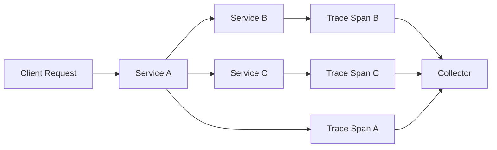

# How to Enable Built-In OpenTelemetry in Deno with the OTEL_DENO Environment Variable

Author: [nawazdhandala](https://www.github.com/nawazdhandala)

Tags: OpenTelemetry, Deno, Environment Variable, Built-In, Zero-Code, JavaScript

Description: Enable automatic OpenTelemetry instrumentation in Deno applications using the built-in OTEL_DENO environment variable for zero-code distributed tracing and observability.

Deno has built-in OpenTelemetry support, making it one of the first JavaScript runtimes to ship with observability as a first-class feature. No need to install packages, configure SDKs, or manually instrument your code. Just set an environment variable, and Deno automatically traces HTTP requests, runtime operations, and more. This is observability done right.

## Why Built-In OpenTelemetry Matters

Traditional Node.js OpenTelemetry setup requires installing multiple packages, configuring exporters, registering instrumentations, and writing initialization code. It works, but it's complex and error-prone. Developers often skip observability entirely because the setup overhead isn't worth it for small projects.

Deno changes this by building OpenTelemetry into the runtime itself. When you enable tracing, Deno automatically instruments:

- HTTP and HTTPS requests (both client and server)
- WebSocket connections
- Fetch API calls
- Dynamic imports
- Worker threads
- File system operations
- Timer operations

This automatic instrumentation means you get distributed tracing without writing a single line of observability code.

## Basic Usage

Enable OpenTelemetry in Deno by setting the `OTEL_DENO` environment variable to `1`:

```bash
# Run your Deno application with tracing enabled
OTEL_DENO=1 deno run --allow-net --allow-env server.ts
```

That's it. Deno will now generate traces for all supported operations and export them to the configured backend.

## Configuring the Exporter

By default, Deno exports traces to `http://localhost:4318/v1/traces` using the OTLP HTTP protocol. This is the standard OpenTelemetry endpoint that most collectors and backends support.

Configure the exporter endpoint using standard OpenTelemetry environment variables:

```bash
# Export to a custom collector
OTEL_DENO=1 \
OTEL_EXPORTER_OTLP_ENDPOINT=https://your-collector.example.com \
deno run --allow-net --allow-env server.ts

# Use OTLP gRPC instead of HTTP
OTEL_DENO=1 \
OTEL_EXPORTER_OTLP_PROTOCOL=grpc \
OTEL_EXPORTER_OTLP_ENDPOINT=https://your-collector.example.com:4317 \
deno run --allow-net --allow-env server.ts

# Configure traces-specific endpoint
OTEL_DENO=1 \
OTEL_EXPORTER_OTLP_TRACES_ENDPOINT=https://traces.example.com/v1/traces \
deno run --allow-net --allow-env server.ts
```

## Setting Service Name and Attributes

Identify your service using the `OTEL_SERVICE_NAME` variable and add custom attributes with `OTEL_RESOURCE_ATTRIBUTES`:

```bash
# Set service name and custom attributes
OTEL_DENO=1 \
OTEL_SERVICE_NAME=my-deno-api \
OTEL_RESOURCE_ATTRIBUTES=deployment.environment=production,service.version=1.2.3 \
deno run --allow-net --allow-env server.ts
```

Resource attributes follow the format `key1=value1,key2=value2`. These attributes are included in every span exported by your application.

## Simple HTTP Server Example

Here's a basic HTTP server with automatic tracing:

```typescript
// server.ts
import { serve } from "https://deno.land/std@0.208.0/http/server.ts";

// No OpenTelemetry imports needed - it's built-in!

async function handler(req: Request): Promise<Response> {
  const url = new URL(req.url);

  // All of this code is automatically traced when OTEL_DENO=1
  switch (url.pathname) {
    case "/":
      return new Response("Hello, World!");

    case "/users":
      const users = await fetchUsers();
      return new Response(JSON.stringify(users), {
        headers: { "Content-Type": "application/json" },
      });

    case "/slow":
      // Simulate slow operation
      await new Promise(resolve => setTimeout(resolve, 2000));
      return new Response("Completed slow operation");

    default:
      return new Response("Not Found", { status: 404 });
  }
}

async function fetchUsers() {
  // External API call is automatically traced
  const response = await fetch("https://jsonplaceholder.typicode.com/users");
  return response.json();
}

console.log("Server running on http://localhost:8000");
serve(handler, { port: 8000 });
```

Run it with tracing enabled:

```bash
OTEL_DENO=1 \
OTEL_SERVICE_NAME=user-api \
deno run --allow-net --allow-env server.ts
```

Every incoming request, every fetch call, and every timer operation generates spans automatically. You'll see traces in your OpenTelemetry backend without writing any instrumentation code.

## API Gateway Example

Build an API gateway that proxies requests to multiple backends:

```typescript
// gateway.ts
import { serve } from "https://deno.land/std@0.208.0/http/server.ts";

const SERVICES = {
  users: "https://users-api.example.com",
  products: "https://products-api.example.com",
  orders: "https://orders-api.example.com",
};

async function handler(req: Request): Promise<Response> {
  const url = new URL(req.url);
  const pathParts = url.pathname.split("/").filter(Boolean);

  if (pathParts.length === 0) {
    return new Response("API Gateway", { status: 200 });
  }

  const service = pathParts[0];
  const serviceUrl = SERVICES[service as keyof typeof SERVICES];

  if (!serviceUrl) {
    return new Response(
      JSON.stringify({ error: "Service not found" }),
      { status: 404, headers: { "Content-Type": "application/json" } }
    );
  }

  // Build target URL
  const targetPath = pathParts.slice(1).join("/");
  const targetUrl = `${serviceUrl}/${targetPath}${url.search}`;

  try {
    // Proxy request to backend service
    // Deno automatically propagates trace context in headers
    const response = await fetch(targetUrl, {
      method: req.method,
      headers: req.headers,
      body: req.method !== "GET" && req.method !== "HEAD" ? req.body : undefined,
    });

    // Return backend response
    return new Response(response.body, {
      status: response.status,
      headers: response.headers,
    });
  } catch (error) {
    console.error("Proxy error:", error);
    return new Response(
      JSON.stringify({ error: "Service unavailable" }),
      { status: 503, headers: { "Content-Type": "application/json" } }
    );
  }
}

console.log("Gateway running on http://localhost:8080");
serve(handler, { port: 8080 });
```

Run the gateway:

```bash
OTEL_DENO=1 \
OTEL_SERVICE_NAME=api-gateway \
OTEL_RESOURCE_ATTRIBUTES=deployment.environment=production \
deno run --allow-net --allow-env gateway.ts
```

Deno automatically creates a distributed trace that spans the gateway and all backend services. Request flows through the gateway to backend services are tracked end-to-end.

## Background Job Worker

Build a worker that processes jobs from a queue:

```typescript
// worker.ts

interface Job {
  id: string;
  type: string;
  data: unknown;
}

async function fetchJob(): Promise<Job | null> {
  try {
    const response = await fetch("https://queue.example.com/jobs/next");
    if (response.status === 204) {
      return null; // No jobs available
    }
    return response.json();
  } catch (error) {
    console.error("Failed to fetch job:", error);
    return null;
  }
}

async function processJob(job: Job): Promise<void> {
  console.log(`Processing job ${job.id} of type ${job.type}`);

  switch (job.type) {
    case "send_email":
      await sendEmail(job.data);
      break;
    case "generate_report":
      await generateReport(job.data);
      break;
    case "process_payment":
      await processPayment(job.data);
      break;
    default:
      console.warn(`Unknown job type: ${job.type}`);
  }

  // Mark job as complete
  await fetch(`https://queue.example.com/jobs/${job.id}/complete`, {
    method: "POST",
  });
}

async function sendEmail(data: unknown): Promise<void> {
  await fetch("https://email-service.example.com/send", {
    method: "POST",
    headers: { "Content-Type": "application/json" },
    body: JSON.stringify(data),
  });
}

async function generateReport(data: unknown): Promise<void> {
  // Simulate report generation
  await new Promise(resolve => setTimeout(resolve, 5000));

  await fetch("https://storage.example.com/reports", {
    method: "POST",
    headers: { "Content-Type": "application/json" },
    body: JSON.stringify({ report: data }),
  });
}

async function processPayment(data: unknown): Promise<void> {
  await fetch("https://payment-gateway.example.com/charge", {
    method: "POST",
    headers: { "Content-Type": "application/json" },
    body: JSON.stringify(data),
  });
}

async function worker() {
  console.log("Worker started");

  while (true) {
    const job = await fetchJob();

    if (job) {
      try {
        await processJob(job);
        console.log(`Job ${job.id} completed successfully`);
      } catch (error) {
        console.error(`Job ${job.id} failed:`, error);
      }
    } else {
      // No jobs available, wait before polling again
      await new Promise(resolve => setTimeout(resolve, 5000));
    }
  }
}

worker();
```

Run the worker with tracing:

```bash
OTEL_DENO=1 \
OTEL_SERVICE_NAME=job-worker \
OTEL_RESOURCE_ATTRIBUTES=worker.id=worker-1,deployment.environment=production \
deno run --allow-net --allow-env worker.ts
```

Every job is automatically traced from fetch to completion, including all API calls made during processing.

## Microservices Communication

Build two services that communicate with each other:

```typescript
// service-a.ts
import { serve } from "https://deno.land/std@0.208.0/http/server.ts";

async function handler(req: Request): Promise<Response> {
  const url = new URL(req.url);

  if (url.pathname === "/process") {
    // Call service B
    const responseB = await fetch("http://localhost:8001/transform", {
      method: "POST",
      headers: { "Content-Type": "application/json" },
      body: JSON.stringify({ value: 42 }),
    });

    const dataB = await responseB.json();

    // Call service C
    const responseC = await fetch("http://localhost:8002/enrich", {
      method: "POST",
      headers: { "Content-Type": "application/json" },
      body: JSON.stringify(dataB),
    });

    const dataC = await responseC.json();

    return new Response(JSON.stringify({
      original: 42,
      transformed: dataB,
      enriched: dataC,
    }), {
      headers: { "Content-Type": "application/json" },
    });
  }

  return new Response("Service A", { status: 200 });
}

console.log("Service A running on http://localhost:8000");
serve(handler, { port: 8000 });
```

```typescript
// service-b.ts
import { serve } from "https://deno.land/std@0.208.0/http/server.ts";

async function handler(req: Request): Promise<Response> {
  const url = new URL(req.url);

  if (url.pathname === "/transform") {
    const body = await req.json();
    const transformed = body.value * 2;

    // Simulate some processing time
    await new Promise(resolve => setTimeout(resolve, 100));

    return new Response(JSON.stringify({
      value: transformed,
      transformed: true,
    }), {
      headers: { "Content-Type": "application/json" },
    });
  }

  return new Response("Service B", { status: 200 });
}

console.log("Service B running on http://localhost:8001");
serve(handler, { port: 8001 });
```

```typescript
// service-c.ts
import { serve } from "https://deno.land/std@0.208.0/http/server.ts";

async function handler(req: Request): Promise<Response> {
  const url = new URL(req.url);

  if (url.pathname === "/enrich") {
    const body = await req.json();

    // Add metadata
    const enriched = {
      ...body,
      timestamp: new Date().toISOString(),
      service: "service-c",
      processed: true,
    };

    await new Promise(resolve => setTimeout(resolve, 50));

    return new Response(JSON.stringify(enriched), {
      headers: { "Content-Type": "application/json" },
    });
  }

  return new Response("Service C", { status: 200 });
}

console.log("Service C running on http://localhost:8002");
serve(handler, { port: 8002 });
```

Run all three services with tracing enabled:

```bash
# Terminal 1
OTEL_DENO=1 OTEL_SERVICE_NAME=service-a \
deno run --allow-net --allow-env service-a.ts

# Terminal 2
OTEL_DENO=1 OTEL_SERVICE_NAME=service-b \
deno run --allow-net --allow-env service-b.ts

# Terminal 3
OTEL_DENO=1 OTEL_SERVICE_NAME=service-c \
deno run --allow-net --allow-env service-c.ts
```

Make a request to service A:

```bash
curl http://localhost:8000/process
```

Deno automatically creates a distributed trace that spans all three services. You'll see a single trace with spans from service A, B, and C, showing the complete request flow.

## Trace Flow Visualization

Here's how traces flow through a microservices architecture:



## Environment Variables Reference

Deno supports standard OpenTelemetry environment variables:

**Basic Configuration:**
- `OTEL_DENO`: Set to `1` to enable tracing
- `OTEL_SERVICE_NAME`: Service name for resource identification
- `OTEL_RESOURCE_ATTRIBUTES`: Additional resource attributes as `key=value` pairs

**Exporter Configuration:**
- `OTEL_EXPORTER_OTLP_ENDPOINT`: Base URL for OTLP exporter
- `OTEL_EXPORTER_OTLP_TRACES_ENDPOINT`: Traces-specific endpoint
- `OTEL_EXPORTER_OTLP_PROTOCOL`: Protocol to use (`http/protobuf` or `grpc`)
- `OTEL_EXPORTER_OTLP_HEADERS`: Headers to include in export requests
- `OTEL_EXPORTER_OTLP_TIMEOUT`: Export timeout in milliseconds

**Sampling Configuration:**
- `OTEL_TRACES_SAMPLER`: Sampling strategy (`always_on`, `always_off`, `traceidratio`, `parentbased_always_on`, etc.)
- `OTEL_TRACES_SAMPLER_ARG`: Argument for the sampler (e.g., sampling probability)

## Using with Docker

Create a Dockerfile for your Deno application with tracing:

```dockerfile
FROM denoland/deno:1.39.0

WORKDIR /app

# Copy application files
COPY . .

# Cache dependencies
RUN deno cache server.ts

# Set OpenTelemetry environment variables
ENV OTEL_DENO=1
ENV OTEL_SERVICE_NAME=my-deno-service
ENV OTEL_EXPORTER_OTLP_ENDPOINT=http://otel-collector:4318

# Run with required permissions
CMD ["run", "--allow-net", "--allow-env", "server.ts"]
```

Docker Compose configuration:

```yaml
version: '3.8'

services:
  app:
    build: .
    ports:
      - "8000:8000"
    environment:
      OTEL_DENO: "1"
      OTEL_SERVICE_NAME: "my-deno-service"
      OTEL_EXPORTER_OTLP_ENDPOINT: "http://otel-collector:4318"
      OTEL_RESOURCE_ATTRIBUTES: "deployment.environment=production,service.version=1.0.0"
    depends_on:
      - otel-collector

  otel-collector:
    image: otel/opentelemetry-collector:latest
    command: ["--config=/etc/otel-collector-config.yaml"]
    volumes:
      - ./otel-collector-config.yaml:/etc/otel-collector-config.yaml
    ports:
      - "4318:4318"
      - "55679:55679"
```

## Performance Considerations

Built-in OpenTelemetry tracing adds minimal overhead to your Deno application. The runtime handles instrumentation efficiently, with typical overhead under 5% even with tracing enabled.

However, keep these tips in mind:

**Use Sampling in Production**: Not every request needs to be traced. Configure sampling to reduce data volume:

```bash
OTEL_DENO=1 \
OTEL_TRACES_SAMPLER=traceidratio \
OTEL_TRACES_SAMPLER_ARG=0.1 \
deno run --allow-net --allow-env server.ts
```

This samples 10% of traces, reducing overhead while maintaining visibility.

**Batch Export**: The OTLP exporter batches spans before sending them. Configure batch size and timeout if needed through your collector configuration.

**Monitor Export Latency**: Slow exports can cause spans to queue up. Ensure your collector can handle the export rate from your services.

## Limitations and Workarounds

Deno's built-in tracing is powerful but has some limitations:

**No Custom Spans**: You cannot create custom spans or add custom attributes to automatic spans. For custom instrumentation, use the OpenTelemetry SDK manually.

**Limited Configuration**: Some advanced OpenTelemetry features require manual SDK configuration. The built-in tracing focuses on automatic instrumentation.

**HTTP/HTTPS Only**: Currently, automatic instrumentation works best for HTTP operations. Other protocols may need manual instrumentation.

For applications that need custom spans or advanced features, combine built-in tracing with the OpenTelemetry SDK:

```typescript
import { trace } from "npm:@opentelemetry/api";

// Built-in tracing still works for HTTP
// Add custom spans for specific operations
const tracer = trace.getTracer("my-custom-tracer");

async function customOperation() {
  const span = tracer.startSpan("custom.operation");
  try {
    // Your code here
    span.end();
  } catch (error) {
    span.recordException(error);
    span.end();
    throw error;
  }
}
```

## Debugging Traces

Enable debug logging to see what Deno is tracing:

```bash
OTEL_DENO=1 \
OTEL_LOG_LEVEL=debug \
deno run --allow-net --allow-env server.ts
```

This outputs detailed information about span creation and export, helping you understand what's being traced and diagnose export issues.

## When to Use Built-In Tracing

Use Deno's built-in OpenTelemetry for:

- Quick prototypes that need observability
- Services that primarily use HTTP/HTTPS
- Microservices where automatic distributed tracing is sufficient
- Applications where zero-code observability is a priority
- Learning and experimenting with OpenTelemetry

Consider manual SDK configuration when:

- You need custom spans with business-specific attributes
- Your application uses protocols beyond HTTP/HTTPS
- You require advanced sampling strategies
- You need to instrument specific library calls
- You want fine-grained control over span lifecycle

Deno's built-in OpenTelemetry support is a game-changer for observability. Set one environment variable and get automatic distributed tracing across your entire application. No packages to install, no code to write, no configuration files to maintain. This is how observability should work.
