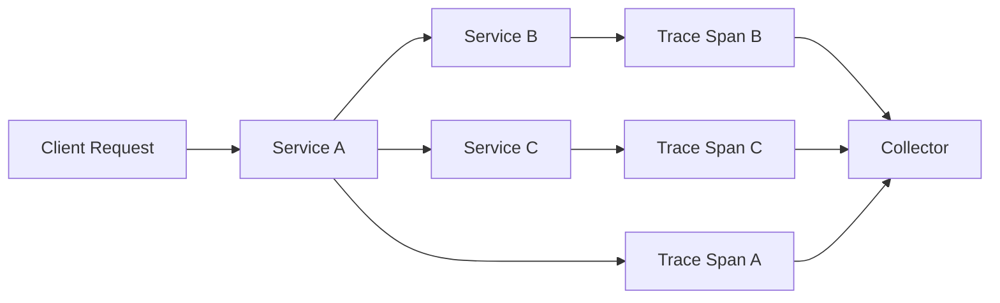

# How to Enable Built-In OpenTelemetry in Deno

Author: [nawazdhandala](https://www.github.com/nawazdhandala)

Tags: OpenTelemetry, Deno, Environment Variable, Built-In, Zero-Code, JavaScript

Description: Enable automatic OpenTelemetry instrumentation in Deno applications using the built-in OTEL_DENO environment variable for zero-code distributed tracing and observability.

Deno has built-in OpenTelemetry support, making it one of the first JavaScript runtimes to ship with observability as a first-class feature. No need to install packages, configure SDKs, or manually instrument your code for supported runtime telemetry. Just set an environment variable, and Deno automatically traces HTTP requests, exports runtime metrics, and captures logs. This is observability done right.

## Why Built-In OpenTelemetry Matters

Traditional Node.js OpenTelemetry setup requires installing multiple packages, configuring exporters, registering instrumentations, and writing initialization code. It works, but it's complex and error-prone. Developers often skip observability entirely because the setup overhead isn't worth it for small projects.

Deno changes this by building OpenTelemetry into the runtime itself. When you enable tracing, Deno automatically instruments:

- Incoming HTTP requests served with `Deno.serve`
- Outgoing HTTP requests made with `fetch`
- `Deno.cron()` job invocations in Deno 2.7 and later
- Runtime and `Deno.serve` metrics
- Console and runtime logs

This automatic instrumentation means you get distributed tracing without writing a single line of observability code.

## Basic Usage

Enable OpenTelemetry in Deno by setting the `OTEL_DENO` environment variable to `true`:

```bash
# Run your Deno application with tracing enabled

OTEL_DENO=true deno run --allow-net --allow-env server.ts
```

That's it. Deno will now generate traces for all supported operations and export them to the configured backend.

## Configuring the Exporter

By default, Deno exports traces to `http://localhost:4318/v1/traces` using the OTLP HTTP protocol. This is the standard OpenTelemetry endpoint that most collectors and backends support.

Configure the exporter endpoint using standard OpenTelemetry environment variables:

```bash
# Export to a custom collector
OTEL_DENO=true \
OTEL_EXPORTER_OTLP_ENDPOINT=https://your-collector.example.com \
deno run --allow-net --allow-env server.ts

# Use OTLP gRPC instead of HTTP (Deno 2.8+)
OTEL_DENO=true \
OTEL_EXPORTER_OTLP_PROTOCOL=grpc \
OTEL_EXPORTER_OTLP_ENDPOINT=https://your-collector.example.com:4317 \
deno run --allow-net --allow-env server.ts

# Configure traces-specific endpoint
OTEL_DENO=true \
OTEL_EXPORTER_OTLP_TRACES_ENDPOINT=https://traces.example.com/v1/traces \
deno run --allow-net --allow-env server.ts
```

## Setting Service Name and Attributes

Identify your service using the `OTEL_SERVICE_NAME` variable and add custom attributes with `OTEL_RESOURCE_ATTRIBUTES`:

```bash
# Set service name and custom attributes
OTEL_DENO=true \
OTEL_SERVICE_NAME=my-deno-api \
OTEL_RESOURCE_ATTRIBUTES=deployment.environment=production,service.version=1.2.3 \
deno run --allow-net --allow-env server.ts
```

Resource attributes follow the format `key1=value1,key2=value2`. These attributes are included in telemetry exported by your application.

## Simple HTTP Server Example

Here's a basic HTTP server with automatic tracing:

```typescript
// server.ts
// No OpenTelemetry imports needed - it's built-in!

async function handler(req: Request): Promise<Response> {
  const url = new URL(req.url);

  // Incoming requests and outgoing fetch calls are automatically traced when OTEL_DENO=true
  switch (url.pathname) {
    case "/":
      return new Response("Hello, World!");

    case "/users":
      const users = await fetchUsers();
      return new Response(JSON.stringify(users), {
        headers: { "Content-Type": "application/json" },
      });

    case "/slow":
      // Simulate slow operation
      await new Promise(resolve => setTimeout(resolve, 2000));
      return new Response("Completed slow operation");

    default:
      return new Response("Not Found", { status: 404 });
  }
}

async function fetchUsers() {
  // External API call is automatically traced
  const response = await fetch("https://jsonplaceholder.typicode.com/users");
  return response.json();
}

console.log("Server running on http://localhost:8000");
Deno.serve({ port: 8000 }, handler);
```

Run it with tracing enabled:

```bash
OTEL_DENO=true \
OTEL_SERVICE_NAME=user-api \
deno run --allow-net --allow-env server.ts
```

Every incoming request and every fetch call generates spans automatically. You'll see traces in your OpenTelemetry backend without writing instrumentation code for those operations.

## API Gateway Example

Build an API gateway that proxies requests to multiple backends:

```typescript
// gateway.ts
const SERVICES = {
  users: "https://users-api.example.com",
  products: "https://products-api.example.com",
  orders: "https://orders-api.example.com",
};

async function handler(req: Request): Promise<Response> {
  const url = new URL(req.url);
  const pathParts = url.pathname.split("/").filter(Boolean);

  if (pathParts.length === 0) {
    return new Response("API Gateway", { status: 200 });
  }

  const service = pathParts[0];
  const serviceUrl = SERVICES[service as keyof typeof SERVICES];

  if (!serviceUrl) {
    return new Response(
      JSON.stringify({ error: "Service not found" }),
      { status: 404, headers: { "Content-Type": "application/json" } }
    );
  }

  // Build target URL
  const targetPath = pathParts.slice(1).join("/");
  const targetUrl = `${serviceUrl}/${targetPath}${url.search}`;

  try {
    // Proxy request to backend service
    // Deno automatically propagates trace context in headers
    const response = await fetch(targetUrl, {
      method: req.method,
      headers: req.headers,
      body: req.method !== "GET" && req.method !== "HEAD" ? req.body : undefined,
    });

    // Return backend response
    return new Response(response.body, {
      status: response.status,
      headers: response.headers,
    });
  } catch (error) {
    console.error("Proxy error:", error);
    return new Response(
      JSON.stringify({ error: "Service unavailable" }),
      { status: 503, headers: { "Content-Type": "application/json" } }
    );
  }
}

console.log("Gateway running on http://localhost:8080");
Deno.serve({ port: 8080 }, handler);
```

Run the gateway:

```bash
OTEL_DENO=true \
OTEL_SERVICE_NAME=api-gateway \
OTEL_RESOURCE_ATTRIBUTES=deployment.environment=production \
deno run --allow-net --allow-env gateway.ts
```

Deno automatically propagates trace context through the gateway's fetch calls. If the backend services are also instrumented and honor W3C trace context, request flows through the gateway to backend services are tracked end-to-end.

## Background Job Worker

Build a worker that processes jobs from a queue:

```typescript
// worker.ts

interface Job {
  id: string;
  type: string;
  data: unknown;
}

async function fetchJob(): Promise<Job | null> {
  try {
    const response = await fetch("https://queue.example.com/jobs/next");
    if (response.status === 204) {
      return null; // No jobs available
    }
    return response.json();
  } catch (error) {
    console.error("Failed to fetch job:", error);
    return null;
  }
}

async function processJob(job: Job): Promise<void> {
  console.log(`Processing job ${job.id} of type ${job.type}`);

  switch (job.type) {
    case "send_email":
      await sendEmail(job.data);
      break;
    case "generate_report":
      await generateReport(job.data);
      break;
    case "process_payment":
      await processPayment(job.data);
      break;
    default:
      console.warn(`Unknown job type: ${job.type}`);
  }

  // Mark job as complete
  await fetch(`https://queue.example.com/jobs/${job.id}/complete`, {
    method: "POST",
  });
}

async function sendEmail(data: unknown): Promise<void> {
  await fetch("https://email-service.example.com/send", {
    method: "POST",
    headers: { "Content-Type": "application/json" },
    body: JSON.stringify(data),
  });
}

async function generateReport(data: unknown): Promise<void> {
  // Simulate report generation
  await new Promise(resolve => setTimeout(resolve, 5000));

  await fetch("https://storage.example.com/reports", {
    method: "POST",
    headers: { "Content-Type": "application/json" },
    body: JSON.stringify({ report: data }),
  });
}

async function processPayment(data: unknown): Promise<void> {
  await fetch("https://payment-gateway.example.com/charge", {
    method: "POST",
    headers: { "Content-Type": "application/json" },
    body: JSON.stringify(data),
  });
}

async function worker() {
  console.log("Worker started");

  while (true) {
    const job = await fetchJob();

    if (job) {
      try {
        await processJob(job);
        console.log(`Job ${job.id} completed successfully`);
      } catch (error) {
        console.error(`Job ${job.id} failed:`, error);
      }
    } else {
      // No jobs available, wait before polling again
      await new Promise(resolve => setTimeout(resolve, 5000));
    }
  }
}

worker();
```

Run the worker with tracing:

```bash
OTEL_DENO=true \
OTEL_SERVICE_NAME=job-worker \
OTEL_RESOURCE_ATTRIBUTES=worker.id=worker-1,deployment.environment=production \
deno run --allow-net --allow-env worker.ts
```

Every HTTP call made while fetching and processing jobs is automatically traced. Add custom spans with `npm:@opentelemetry/api` if you need a single span around the whole job lifecycle.

## Microservices Communication

Build three services that communicate with each other:

```typescript
// service-a.ts
async function handler(req: Request): Promise<Response> {
  const url = new URL(req.url);

  if (url.pathname === "/process") {
    // Call service B
    const responseB = await fetch("http://localhost:8001/transform", {
      method: "POST",
      headers: { "Content-Type": "application/json" },
      body: JSON.stringify({ value: 42 }),
    });

    const dataB = await responseB.json();

    // Call service C
    const responseC = await fetch("http://localhost:8002/enrich", {
      method: "POST",
      headers: { "Content-Type": "application/json" },
      body: JSON.stringify(dataB),
    });

    const dataC = await responseC.json();

    return new Response(JSON.stringify({
      original: 42,
      transformed: dataB,
      enriched: dataC,
    }), {
      headers: { "Content-Type": "application/json" },
    });
  }

  return new Response("Service A", { status: 200 });
}

console.log("Service A running on http://localhost:8000");
Deno.serve({ port: 8000 }, handler);
```

```typescript
// service-b.ts
async function handler(req: Request): Promise<Response> {
  const url = new URL(req.url);

  if (url.pathname === "/transform") {
    const body = await req.json();
    const transformed = body.value * 2;

    // Simulate some processing time
    await new Promise(resolve => setTimeout(resolve, 100));

    return new Response(JSON.stringify({
      value: transformed,
      transformed: true,
    }), {
      headers: { "Content-Type": "application/json" },
    });
  }

  return new Response("Service B", { status: 200 });
}

console.log("Service B running on http://localhost:8001");
Deno.serve({ port: 8001 }, handler);
```

```typescript
// service-c.ts
async function handler(req: Request): Promise<Response> {
  const url = new URL(req.url);

  if (url.pathname === "/enrich") {
    const body = await req.json();

    // Add metadata
    const enriched = {
      ...body,
      timestamp: new Date().toISOString(),
      service: "service-c",
      processed: true,
    };

    await new Promise(resolve => setTimeout(resolve, 50));

    return new Response(JSON.stringify(enriched), {
      headers: { "Content-Type": "application/json" },
    });
  }

  return new Response("Service C", { status: 200 });
}

console.log("Service C running on http://localhost:8002");
Deno.serve({ port: 8002 }, handler);
```

Run all three services with tracing enabled:

```bash
# Terminal 1
OTEL_DENO=true OTEL_SERVICE_NAME=service-a \
deno run --allow-net --allow-env service-a.ts

# Terminal 2
OTEL_DENO=true OTEL_SERVICE_NAME=service-b \
deno run --allow-net --allow-env service-b.ts

# Terminal 3
OTEL_DENO=true OTEL_SERVICE_NAME=service-c \
deno run --allow-net --allow-env service-c.ts
```

Make a request to service A:

```bash
curl http://localhost:8000/process
```

Deno automatically creates a distributed trace that spans all three services. You'll see a single trace with spans from service A, B, and C, showing the complete request flow.

## Trace Flow Visualization

Here's how traces flow through a microservices architecture:


```mermaid
graph LR
    A[Client Request] --> B[Service A]
    B --> C[Service B]
    B --> D[Service C]
    C --> E[Trace Span B]
    D --> F[Trace Span C]
    E --> G[Collector]
    F --> G
    B --> H[Trace Span A]
    H --> G
```

## Environment Variables Reference

Deno supports standard OpenTelemetry environment variables:

**Basic Configuration:**
- `OTEL_DENO`: Set to `true` to enable OpenTelemetry
- `OTEL_SERVICE_NAME`: Service name for resource identification
- `OTEL_RESOURCE_ATTRIBUTES`: Additional resource attributes as `key=value` pairs

**Exporter Configuration:**
- `OTEL_EXPORTER_OTLP_ENDPOINT`: Base URL for OTLP exporter
- `OTEL_EXPORTER_OTLP_TRACES_ENDPOINT`: Traces-specific endpoint
- `OTEL_EXPORTER_OTLP_PROTOCOL`: Protocol to use (`http/protobuf`, `http/json`, `grpc`, or `console`)
- `OTEL_EXPORTER_OTLP_HEADERS`: Headers to include in export requests
- `OTEL_EXPORTER_OTLP_TIMEOUT`: Export timeout in milliseconds

## Using with Docker

Create a Dockerfile for your Deno application with tracing:

```dockerfile
FROM denoland/deno:2.8.0

WORKDIR /app

# Copy application files
COPY . .

# Cache dependencies
RUN deno cache server.ts

# Set OpenTelemetry environment variables
ENV OTEL_DENO=true
ENV OTEL_SERVICE_NAME=my-deno-service
ENV OTEL_EXPORTER_OTLP_ENDPOINT=http://otel-collector:4318

# Run with required permissions
CMD ["run", "--allow-net", "--allow-env", "server.ts"]
```

Docker Compose configuration:

```yaml
version: '3.8'

services:
  app:
    build: .
    ports:
      - "8000:8000"
    environment:
      OTEL_DENO: "true"
      OTEL_SERVICE_NAME: "my-deno-service"
      OTEL_EXPORTER_OTLP_ENDPOINT: "http://otel-collector:4318"
      OTEL_RESOURCE_ATTRIBUTES: "deployment.environment=production,service.version=1.0.0"
    depends_on:
      - otel-collector

  otel-collector:
    image: otel/opentelemetry-collector:latest
    command: ["--config=/etc/otel-collector-config.yaml"]
    volumes:
      - ./otel-collector-config.yaml:/etc/otel-collector-config.yaml
    ports:
      - "4318:4318"
```

## Performance Considerations

Built-in OpenTelemetry tracing is handled by the Deno runtime, but the exact overhead depends on request volume, exporter latency, and backend capacity.

However, keep these tips in mind:

**Plan for Current Sampling Behavior**: Deno's current built-in integration always samples traces, so high-volume services should make sure their collector and backend can handle the generated data.

**Batch Export**: The OTLP exporter batches spans before sending them. Configure batch size and timeout if needed through your collector configuration.

**Monitor Export Latency**: Slow exports can cause spans to queue up. Ensure your collector can handle the export rate from your services.

## Limitations and Workarounds

Deno's built-in tracing is powerful but has some limitations:

**Custom Spans Use the OpenTelemetry API**: You can create custom spans and add attributes with `npm:@opentelemetry/api`. Deno registers the OpenTelemetry providers automatically, so you do not need to configure a separate SDK just to create user-defined spans.

**Limited Configuration**: Some advanced OpenTelemetry features require manual SDK configuration. The built-in tracing focuses on automatic instrumentation.

**HTTP/HTTPS Only**: Currently, automatic instrumentation works best for HTTP operations. Other protocols may need manual instrumentation.

For applications that need custom spans, combine built-in tracing with the OpenTelemetry API:

```typescript
import { SpanStatusCode, trace } from "npm:@opentelemetry/api@1";

// Built-in tracing still works for HTTP
// Add custom spans for specific operations
const tracer = trace.getTracer("my-custom-tracer");

async function customOperation() {
  return await tracer.startActiveSpan("custom.operation", async (span) => {
    try {
      // Your code here
    } catch (error) {
      span.recordException(error as Error);
      span.setStatus({
        code: SpanStatusCode.ERROR,
        message: error instanceof Error ? error.message : String(error),
      });
      throw error;
    } finally {
      span.end();
    }
  });
}
```

## Debugging Traces

Use Deno's console exporter to see spans, logs, and metrics without running an OTLP collector:

```bash
OTEL_DENO=true \
OTEL_EXPORTER_OTLP_PROTOCOL=console \
deno run --allow-net --allow-env server.ts
```

This prints telemetry to stderr in a human-readable format, helping you understand what's being traced and diagnose export issues.

## When to Use Built-In Tracing

Use Deno's built-in OpenTelemetry for:

- Quick prototypes that need observability
- Services that primarily use HTTP/HTTPS
- Microservices where automatic distributed tracing is sufficient
- Applications where zero-code observability is a priority
- Learning and experimenting with OpenTelemetry

Consider manual SDK configuration when:

- Your application uses protocols beyond HTTP/HTTPS
- You require sampling strategies that the built-in integration does not currently expose
- You need to instrument specific library calls
- You want fine-grained control over span lifecycle

Deno's built-in OpenTelemetry support is a game-changer for observability. Set one environment variable and get automatic distributed tracing for supported HTTP operations. No packages to install for automatic runtime telemetry, no initialization code to write, no configuration files to maintain. This is how observability should work.
